#  

# The Art of Doing   Science and    Engineering  

# The Art of Doing Science and Engineering  

Learning to Learn  

# Richard W.Hamming  

U.S. Naval Postgraduate School Monterey, California  

“To purchase your own copy of this or any of Taylor & Francis or Routledge’s collection of thousands of eBooks please go to www.eBookstore.tandf.co.uk.”  

Copyright  $\copyright$   1997 OPA (Overseas Publishers Association) Amsterdam B.V.Published in The Netherlands under license by Gordon and Breach Science Publishers.  

No part of this book may be reproduced or utilized in any form or by any means, electronic or mechanical, including photocopying and recording, or by any information storage or retrieval system, without permission in writing from the publisher. Printed in India. Amsteldijk 166 1st Floor 1079 LH Amsterdam The Netherlands British Library Cataloguing in Publication Data Hamming, R.W. (Richard Wesley), 1915– The art of doing science and engineering: learning to learn 1. Science 2. Engineering I. Title 500 ISBN 0-203-45071-X Master e-book ISBN ISBN 0-203-45913-X (Adobe eReader Format) ISBN 90-5699-501-4 (Print Edition)  

# CONTENTS  

Preface   vi Introduction   viii  

1   Orientation   1 2   Foundations of the Digital (Discrete) Revolution   9 3   History of Computer—Hardware   17 4   History of Computer—Software   24 5   History of Computer Applications   33 6   Limits of Computer Applications—AI—I   40 7   Limits of Computer Applications—AI—II   47 8   Limits of Computer Applications—AI—III   55 9    $n$  -Dimensional Space   57 10   Coding Theory—I   67 11   Coding Theory—II   74 12   Error Correcting Codes   81 13   Information Theory   89 14   Digital Filters—I   97 15   Digital Filters—II   107 16   Digital Filters—III   115 17   Digital Filters—IV   123 18   Simulation—I   128 19   Simulation—II   135 20   Simulation—III   141 21   Fiber Optics   151 22   Computer Aided Instruction—CAI   157 23   Mathematics   163 24   Quantum Mechanics  

25   Creativity  

26   Experts  

171  

176  

181 27   Unreliable Data   187  

28   Systems Engineering   195 29   You Get What You Measure  

30   You and Your Research  

202  

209 216  

# PREFACE  

After many years of pressure and encouragement from friends, I decided to write up the graduate course in engineering I teach at the U.S.Naval Postgraduate School in Monterey, California. At first I concentrated on all the details I thought should be tightened up, rather than leave the material as a series of somewhat disconnected lectures. In class the lectures often followed the interests of the students, and many of the later lectures were suggested topics in which they expressed an interest Also, the lectures changed from year to year as various areas developed. Since engineering depends so heavily these days on the corresponding sciences, I often use the terms interchangeably.  

After more thought I decided that since I was trying to teach “style” of thinking in science and engineering, and “style” is an art, I should therefore copy the methods of teaching used for the other arts— once the fundamentals have been learned. How to be a great painter cannot be taught in words; one learns by trying many different approaches that seem to surround the subject. Art teachers usually let the advanced student paint, and then make suggestions on how they would have done it, or what might also be tried, more or less as the points arise in the student’s head—which is where the learning is supposed to occur! In this series of lectures I try to communicate to students what cannot be said in words—the essence of style in science and engineering. I have adopted a loose organization with some repetition since this often occurs in the lectures. There are, therefore, digressions and stories—with some told in two different places—all in the somewhat rambling, informal style typical of lectures.  

I have used the “story” approach, often emphasizing the initial part of the discovery, because I firmly believe in Pasteur’s remark, “Luck favors the prepared mind.” In this way I can illustrate how the individual’s preparation before encountering the problem can often lead to recognition, formulation, and solution. Great results in science and engineering are “bunched” in the same person too often for success to be a matter of random luck.  

Teachers should prepare the student for the student’s future, not for the   teacher’s past.  Most teachers rarely discuss the important topic of the future of their field, and when this is pointed out they usually reply: “No one can know the future.” It seems to me the difficulty of knowing the future does not absolve the teacher from seriously trying to help the student to be ready for it when it comes. It is obvious the experience of an individual is not necessarily that of a class of individuals; therefore, any one person’s projection into the future is apt to be somewhat personal and will not be universally accepted. This does not justify reverting to impersonal surveys and losing the impact of the personal story.  

Since my classes are almost all carefully selected navy, marine, army, air force, and coast guard students with very few civilians, and, interestingly enough, about   $15\%$   very highly selected foreign military, the students face a highly technical future—hence the importance of preparing them for  their  future and not just our  past.  

The year 2020 seems a convenient date to center the preparation for their future—a sort of 20/20 foresight, as it were. As graduate students working toward a master’s degree, they have the basics well in hand. That leaves me the task of adding “style” to their education, which in practice is usually the difference between an average person and a great one. The school has allowed me great latitude in trying to teach a completely non-technical course; this course “complements” the more technical ones. As a result, my opening words, occasionally repeated, are: “There is really no technical content in the course, though I will, of course, refer to a great deal of it, and hopefully it will generally be a good review of the fundamentals of what you have learned. Do not think it is the  content  of the course—it is only illustrative material.  Style of thinking  is the center of the course.”  

The subtitle of this book,  Learning to Learn,  is the main solution I offer to help students cope with the rapid changes they will have to endure in their fields. The course centers around how to look at and think about knowledge, and it supplies some historical perspectives that might be useful.  

This course is mainly personal experiences I have had and digested, at least to some extent. Naturally one tends to remember one’s successes and forget lesser events, but I recount a number of my spectacular failures as clear examples of what to avoid. I have found that the  personal  story is far, far more effective than the  impersonal  one; hence there is necessarily an aura of “bragging” in the book that is unavoidable.  

Let me repeat what I earlier indicated. Apparently an “art”— which almost by definition cannot be put into words—is probably best communicated by approaching it from many sides and doing so repeatedly, hoping thereby students will finally master enough of the art, or if you wish, style, to significantly increase their future contributions to society. A totally different description of the course is: it covers all kinds of things that could not find their proper place in the standard curriculum.  

The casual reader should not be put off by the mathematics; it is only “window dressing” used to illustrate and connect up with earlier learned material. Usually the underlying ideas can be grasped from the words alone.  

It is customary to thank various people and institutions for help in producing a book. Thanks obviously go to AT&T Bell Laboratories, Murray Hill, New Jersey, and to the U.S.Naval Postgraduate School, especially the Department of Electrical and Computer Engineering, for making this book possible.  

# INTRODUCTION  

This book is concerned more with the future and less with the past of science and engineering. Of course future predictions are uncertain and usually based on the past; but the past is also much more uncertain—or even falsely reported—than is usually recognized. Thus we are forced to  imagine  what the future will probably be. This course has been called"Hamming on Hamming" since it draws heavily on my own past experiences, observations, and wide reading.  

There is a great deal of mathematics in the early part because almost surely the future of science and engineering will be more mathematical than the past, and also I need to establish the nature of the foundations of our beliefs and their uncertainties. Only then can I show the weaknesses of our current beliefs and indicate future directions to be considered.  

If you find the mathematics difficult, skip those early parts. Later sections will be understandable provided you are willing to forgo the deep insights mathematics gives into the weaknesses of our current beliefs. General results are always stated in words, so the content will still be there but in a slightly diluted form.  

The purpose of this course is to prepare you for your technical future. There is really no technical content in the course, though I will, of course, refer to a great deal of it, and hopefully it will generally be a good review of the fundamentals you have learned. Do not think the technical content is the course—it is only illustrative material. Style of thinking is the center of the course. I am concerned with educating and not training you.  

I will examine, criticize, and display styles of thinking. To illustrate the points of style I will often use technical knowledge most of you know, but, again, it will be, I hope, in the form of a useful review which concentrates on the fundamentals. You should regard this as a course which complements the many technical courses you have learned. Many of the things I will talk about are things which I believe you ought to know but which simply do not fit into courses in the standard curriculum. The course exists because the department of Electrical and Computer Engineering of the Naval Postgraduate School recognizes the need for both a general education and the specialized technical training your future demands.  

The course is concerned with “style”, and almost by definition style cannot be taught in the normal manner by using words. I can only approach the topic through particular examples, which I hope are well within your grasp, though the examples come mainly from my 30 years in the mathematics department of the Research Division of Bell Telephone Laboratories (before it was broken up). It also comes from years of study of the work of others.  

The belief anything can be “talked about” in words was certainly held by the early Greek philosophers, Socrates (469–399), Plato (427–347), and Aristotle (384–322). This attitude ignored the current  mystery cults  of the time who asserted you had to “experience” some things which could not be communicated in words. Examples might be the gods, truth, justice, the arts, beauty, and love. Your scientific training has emphasized the role of words, along with a strong belief in  reductionism,  hence to emphasize the possible limitations of language I shall take up the topic in several places in the book. I have already said “style” is such a topic.  

I have found to be effective in this course, I must use mainly first hand knowledge, which implies I break a standard taboo and talk about myself in the first person, instead of the traditional impersonal way of science. You must forgive me in this matter, as there seems to be no other approach which will be as effective. If I do not use direct experience then the material will probably sound to you like merely pious words and have little impact on your minds, and it is your minds I must change if I am to be effective.  

This talking about first person experiences will give a flavor of “bragging”, though I include a number of my serious errors to partially balance things. Vicarious learning from the experiences of others saves making errors yourself, but I regard the study of successes as being basically more important than the study of failures. As I will several times say, there are so many ways of being wrong and so few of being right, studying successes is more efficient, and furthermore when your turn comes you will know how to succeed rather than how to fail!  

I am, as it were, only a coach. I cannot run the mile for you; at best I can discuss styles and criticize yours. You know you must run the mile if the athletics course is to be of benefit to you—hence  you  must think carefully about what you hear or read in this book if it is to be effective in changing you—which must obviously be the purpose of any course. Again, you will get out of this course only as much as you put in, and if you put in little effort beyond sitting in the class or reading the book, then it is simply a waste of your time.  You  must also mull things over, compare what I say with your own experiences, talk with others, and make some of the points part of your way of doing things.  

Since the subject matter is “style”, I will use the comparison with teaching painting. Having learned the fundamentals of painting, you then study under a master you accept as being a great painter; but you know you must forge your own style out of the elements of various earlier painters plus your native abilities. You must also adapt your style to fit the future, since merely copying the past will not be enough if you aspire to future greatness—a matter I assume, and will talk about often in the book. I will show you my style as best I can, but, again, you must take those elements of it which seem to fit you, and you must finally create your own style. Either you will be a leader, or a follower, and my goal is for you to be a leader. You cannot adopt every trait I discuss in what I have observed in myself and others; you must select and adapt, and make them your own if the course is to be effective.  

Even more difficult than what to select is that what is a successful style in one age may not be appropriate to the next age! My predecessors at Bell Telephone Laboratories used one style; four of us who came in all at about the same time, and had about the same chronological age, found our own styles and as a result we rather completely transformed the overall style of the Mathematics Department, as well as many parts of the whole Laboratories. We privately called ourselves “The four young Turks”, and many years later I found top management had called us the same!  

I return to the topic of education. You all recognize there is a significant difference between  education and  training .  

Education is what, when, and why to do things, Training is how to do it.  

Either one without the other is not of much use. You need to know both what to do and how to do it. I have already compared mental and physical training and said to a great extent in both you get out of it what you put into it—all the coach can do is suggest styles and criticize a bit now and then. Because of the usual size of these classes, or because you are reading the book, there can be little direct criticism of your thinking by me, and you simply have to do it internally and between yourselves in conversations, and apply the things I say to your own experiences. You might think education should precede training, but the kind of educating I am trying to do must be based on your past experiences and technical knowledge. Hence this inversion of what might seem to be reasonable. In a real sense I am engaged in “meta-education”, the topic of the course is education itself and hence our discussions must rise above it—“meta-education”, just as metaphysics was supposed to be above physics in Aristotle’s time (actually “follow”, “transcend” is the translation of

 “meta”).  

This book is aimed at your future, and we must examine what is likely to be the state of technology

 (Science and Engineering) at the time of your greatest contributions. It is well known that since about Isaac Newton’s time (1642–1727) knowledge of the type we are concerned with has about doubled every 17 years. First, this may be measured by the books published (a classic observation is libraries must double their holdings every 17 years if they are to maintain their relative position). Second, when I went to Bell Telephone Laboratories in 1946 they were trying to decrease the size of the staff from WW-II size down to about 5500. Yet during the 30 years I was there I observed a fairly steady doubling of the number of employees every 17 years, regardless of the administration having hiring freezes now and then, and such things. Third, the growth of the number of scientists generally has similarly been exponential, and it is said currently almost  $90\%$   of the scientists who ever lived are now alive! It is hard to believe in your future there will be a dramatic decrease in these expected rates of growth, hence you face, even more than I did, the constant need to learn new things.  

Here I make a digression to illustrate what is often called “back of the envelop calculations”. I have frequently observed great scientists and engineers do this much more often than “the run of the mill” people, hence it requires illustration. I will take the above two statements, knowledge doubles every 17 years, and  $90\%$   of the scientists who ever lived are now alive, and ask to what extent they are compatible. The model of the growth of knowledge and the growth of scientists assumed are both exponential, with the growth of knowledge being proportional to the number of scientists alive. We begin by assuming the number scientists at any time   $t$   is  

$$
\pmb{y}(t)\,{=}\,a\,{\tt e x p}\{b t\}
$$  

and the amount of knowledge produced annually has a constant   $k$   of proportionality to the number of scientists alive. Assuming we begin at minus infinity in time (the error is small and you can adjust it to Newton’s time if you wish), we have the formula  

$$
\begin{array}{r l}&{\frac{1}{2}\!=\!\frac{\int_{-\infty}^{t-17}\!\!k a\mathrm{e}^{b t}\mathrm{d}t}{\int_{-\infty}^{t}k a\mathrm{e}^{b t}\mathrm{d}t}}\\ &{\qquad=\!\frac{(k a/b)\mathrm{e}^{b(t-17)}}{(k a/b)\mathrm{e}^{b t}}\!=\!\mathrm{e}^{-17b}\!=\!\frac{1}{2}}\end{array}
$$  

hence we know   $b$  . Now to the other statement. If we allow the lifetime of a scientist to be 55 years (it seems likely that the statement meant living and not practicing, but excluding childhood) then we have  

$$
\begin{array}{r l}{\frac{\int_{t-55}^{t}a\mathrm{e}^{b t}\mathrm{d}t}{\int_{-\infty}^{t}a\mathrm{e}^{b t}\mathrm{d}t}\!=\!\frac{\mathrm{e}^{b t}-\mathrm{e}^{\{b t-b(55)\}}}{\mathrm{e}^{b t}}\!=\!1-\mathrm{e}^{-55b}}&{}\\ {=\!1-(\frac{1}{2})^{55/17}=1-0.106\ldots=0.894\ldots}\end{array}
$$  

which is very close to  $90\%$  .  

Typically the first back of the envelop calculations use, as we did, definite numbers where one has a feel for things, and then we repeat the calculations with parameters so you can adjust things to fit the data better and understand the general case. Let the doubling period be  $D$  ,  and the lifetime of a scientist be  $L$  . The first equation now becomes  

$$
\begin{array}{r}{\frac12=\mathbf e^{b D},}\end{array}
$$  

and the second becomes:  

$$
\begin{array}{r}{\frac{9}{10}\!=\!1-\mathrm{e}^{b L}\!=\!1-(\frac{1}{2})^{L/D},}\end{array}
$$  

$$
\begin{array}{r}{(\frac{1}{2})^{L/D}\!=\!\frac{1}{10},}\end{array}
$$  

$$
{\cfrac{L}{D}}={\cfrac{\log10}{\log2}}={\cfrac{1}{0.30103}}=3.3219\ldots
$$  

With  $D{=}17$   years we have   $17{\times}3.3219{=}56.47$  …years for the lifetime of a scientist, which is close to the 55 we assumed. We can play with ratio of   $L\!\!\!/D$   until we find a slightly closer fit to the data (which was approximate, though I believe more in the 17 years for doubling than I do in the  $90\%$  ). Back of the envelop computing indicates the two remarks are reasonably compatible. Notice the relationship applies for all time so long as the assumed simple relationships hold.  

The reason back of the envelop calculations are widely used by great scientists is clearly revealed—you get a good feeling for the truth or falsity of what was claimed, as well as realize which factors you were inclined not to think about, such as exactly what was meant by the lifetime of a scientist. Having done the calculation you are much more likely to retain the results in your mind. Furthermore, such calculations keep the ability to model situations fresh and ready for more important applications as they arise. Thus I recommend when you hear quantitative remarks such as the above you turn to a quick modeling to see if you believe what is being said, especially when given in the public media like the press and TV. Very often you find what is being said is nonsense, either no definite statement is made which you can model, or if you can set up the model then the results of the model do not agree with what was said. I found it very valuable at the physics table I used to eat with; I sometimes cleared up misconceptions at the time they were being formed, thus advancing matters significantly.  

Added to the problem of the growth of new knowledge is the obsolescence of old knowledge. It is claimed by many the half-life of the technical knowledge you just learned in school is about 15 years—in 15 years half of it will be obsolete (either we have gone in other directions or have replaced it with new material). For example, having taught myself a bit about vacuum tubes (because at Bell Telephone Laboratories they were at that time obviously important) I soon found myself helping, in the form of computing, the development of transistors—which obsoleted my just learned knowledge!  

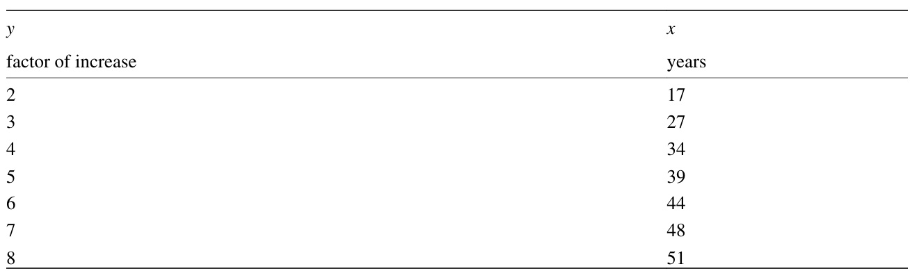  

This doubling is not just in theorems of mathematics and technical results, but in musical recordings of Beethoven’s Ninth, of where to go skiing, of TV programs to watch or not to watch. If you were at times awed by the mass of knowledge you faced when you went to college, or even now, think of your children’s troubles when they are there! The technical knowledge involved in your life will quadruple in 34 years, and many of you will then be near the high point of your career. Pick your estimated years to retirement and then look in the left-hand column for the probable factor of increase over the present current knowledge when you finally quit!  

What is my answer to this dilemma? One answer is you must concentrate on fundamentals, at least what you think  at the time are fundamentals, and also develop the ability to learn new fields of knowledge when they arise so you will not be left behind, as so many good engineers are in the long run. In the position I found myself in at the Laboratories, where I was the only one locally who seemed (at least to me) to have a firm grasp on computing, I was forced to learn numerical analysis, computers, pretty much all of the physical sciences at least enough to cope with the many different computing problems which arose and whose solution could benefit the Labs, as well as a lot of the social and some the biological sciences. Thus I am a veteran of learning enough to get along without at the same time devoting all my effort to learning new topics and thereby not contributing my share to the total effort of the organization. The early days of learning had to be done while I was developing and running a computing center. You will face similar problems in your career as it progresses, and, at times, face problems which seem to overwhelm you.  

How are you to recognize “fundamentals”? One test is they have lasted a long time. Another test is from the fundamentals all the rest of the field can be derived by using the standard methods in the field.  

I need to discuss science vs. engineering. Put glibly:  

In science if you know what you are doing you should not be doing it. In engineering if you do not know what you are doing you should not be doing it.  

Of course, you seldom, if ever, see either pure state. All of engineering involves some creativity to cover the parts not known, and almost all of science includes some practical engineering to translate the abstractions into practice. Much of present science rests on engineering tools, and as time goes on, engineering seems to involve more and more of the science part. Many of the large scientific projects involve very serious engineering problems—the two fields are growing together! Among other reasons for this situation is almost surely we are going forward at an accelerated pace, and now there is not time to allow us the leisure which comes from separating the two fields. Furthermore, both the science and the engineering you will need for your future will more and more often be created after you left school. Sorry! But you will simply have to actively master  on your own  the many new emerging fields as they arise, without having the luxury of being passively taught.  

It should be noted that engineering is not just applied science, which is a distinct third field (though it is not often recognized as such) which lies between science and engineering.  

I read somewhere there are 76 different methods of predicting the future—but very number suggests there is no reliable method which is widely accepted. The most trivial method is to predict tomorrow will be exactly the same as today—which at times is a good bet. The next level of sophistication is to use the current rates of change and to suppose they will stay the same—linear prediction in the variable used. Which variable you use can, of course, strongly affect the prediction made! Both methods are not much good for long-term predictions, however.  

History is often used as a long-term guide; some people believe history repeats itself and others believe exactly the opposite! It is obvious:  

The past was once the future and the future will become the past.  

In any case I will often use history as a background for the extrapolations I make. I believe the best predictions are based on understanding the fundamental forces involved, and this is what I depend on mainly. Often it is not physical limitations which control but rather it is human made laws, habits, and organizational rules, regulations, personal egos, and inertia, which dominate the evolution to the future. You have not been trained along these lines as much as I believe you should have been, and hence I must be careful to include them whenever the topics arise.  

There is a saying,“Short term predictions are always optimistic and long term predictions are always pessimistic”. The reason, so it is claimed, the second part is true is for most people the geometric growth due to the compounding of knowledge is hard to grasp. For example for money a mere   $6\%$   annual growth doubles the money in about 12 years! In 48 years the growth is a factor of 16. An example of the truth of this claim that most long-term predictions are low is the growth of the computer field in speed, in density of components, in drop in price, etc. as well as the spread of computers into the many corners of life. But the field of Artificial Intelligence (AI) provides a very good counter example. Almost all the leaders in the field made long-term predictions which have almost never come true, and are not likely to do so within your lifetime, though many will in the fullness of time.  

I shall use history as a guide many times in spite of Henry Ford, Sr. saying, “History is Bunk”. Probably Ford’s points were:  

1. History is seldom reported at all accurately, and I have found no two reports of what happened at Los Alamos during WW-II seems to agree. 2. Due to the pace of progress the future is rather disconnected from the past; the presence of the modern computer is an example of the great differences which have arisen.  

Reading some historians you get the impression the past was determined by big trends, but you also have the feeling the future has great possibilities. You can handle this apparent contradiction in at least four ways:  

#  

2. You can admit it. 3. You can decide the past was a lot less determined than historians usually indicate and individual choices can make large differences at times. Alexander the Great, Napoleon, and Hitler had great effects on the physical side of life, while Pythagoras, Plato, Aristotle, Newton, Maxwell, and Einstein are examples on the mental side. 4. You can decide the future is less open ended than you would like to believe, and there is really less choice than there appears to be.  

It is probable the future will be more limited by the slow evolution of the human animal and the corresponding human laws, social institution, and organizations than it will be by the rapid evolution of technology.  

In spite of the difficulty of predicting the future and that:  Unforeseen technological inventions can completely upset the most careful predictions,  

you must try to foresee the future you will face. To illustrate the importance of this point of trying to foresee the future I often use a standard story.  

It is well known the drunken sailor who staggers to the left or right with  $n$   independent random steps will, on the average, end up about   $\sqrt{n}$   steps from the origin. But if there is a pretty girl in one direction, then his steps will tend to go in that direction and he will go a distance proportional to  $n$  . In a lifetime of many, many independent choices, small and large, a career with a vision will get you a distance proportional to  $n$  ,  while no vision will get you only the distance   $\sqrt{n}.$   In a sense, the main difference between those who go far and those who do not is some people have a vision and the others do not and therefore can only react to the current events as they happen.  

One of the main tasks of this course is to start you on the path of creating in some detail  your vision of your future . If I fail in this I fail in the whole course. You will probably object that if you try to get a vision now it is likely to be wrong—and my reply is from observation I have seen the accuracy of the vision matters less than you might suppose, getting anywhere is better than drifting, there are potentially many paths to greatness for you, and just which path you go on,  so long as it takes you to greatness,  is none of my business. You must, as in the case of forging your personal style, find your vision of your future career, and then follow it as best you can.  

# No vision, not much of a future.  

To what extent history does or does not repeat itself is a moot question. But it is one of the few guides you have, hence history will often play a large role in my discussions—I am trying to provide you with some perspective as a possible guide to create your vision of your future. The other main tool I have used is an active imagination in trying to see what will happen. For many years I devoted about   $10\%$   of my time (Friday afternoons) to trying to understand what would happen in the future of computing, both as a scientific tool and as shaper of the social world of work and play. In forming your plan for your future you need to distinguish three different questions:  

What is possible? What is likely to happen? What is desirable to have happen?  

In a sense the first is Science—what is possible. The second in Engineering—what are the human factors which chose the one future that does happen from the ensemble of all possible futures. The third, is ethics, morals, or what ever other word you wish to apply to value judgments. It is important to examine all three questions, and in so far as the second differs from the third, you will probably have an idea of how to alter things to make the more desirable future occur, rather than let the inevitable happen and suffer the consequences. Again, you can see why having a vision is what tends to separate the leaders from the followers.  

The standard process of organizing knowledge by departments, and subdepartments, and further breaking it up into separate courses, tends to conceal the homogeneity of knowledge, and at the same time to omit much which falls between the courses. The optimization of the individual courses in turn means a lot of important things in Engineering practice are skipped since they do not appear to be essential to any one course. One of the functions of this book is to mention and illustrate many of these missed topics which are important in the practice of Science and Engineering. Another goal of the course is to show the essential unity of all knowledge rather than the fragments which appear as the individual topics are taught. In your future anything and everything you know might be useful, but if you believe the problem is in one area you are not apt to use information that is relevant but which occurred in another course.  

The course will center around computers. It is not merely because I spent much of my career in Computer Science and Engineering, rather it seems to me computers will dominate your technical lives. I will repeat a number of times in the book the following facts: Computers when compared to Humans have the advantages:  

Economics Speed  

—far cheaper, and getting more so

 —far, far faster  

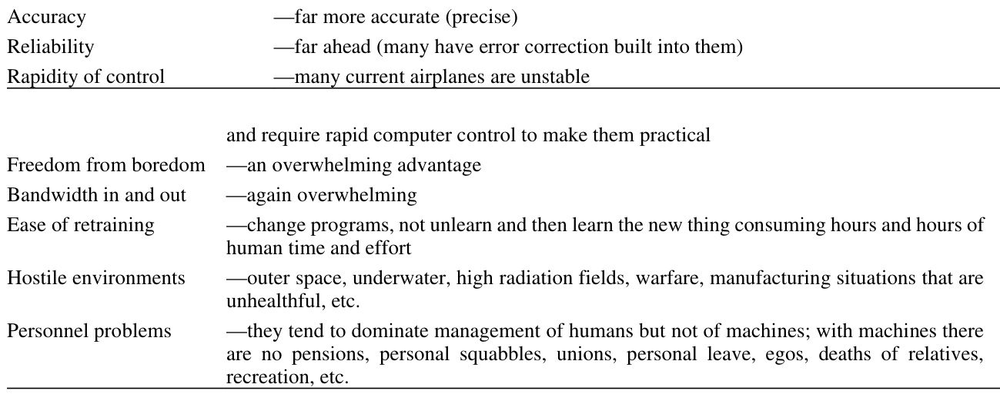  

I need not list the advantages of humans over computers—almost every one of you has already objected to this list and has in your mind started to cite the advantages on the other side.  

Lastly, in a sense, this is a religious course—I am preaching the message that, with apparently only one life to live on this earth, you ought to try to make significant contributions to humanity rather than just get along through life comfortably—that the life of trying to achieve excellence in some area is in itself a worthy goal for your life. It has often been observed the true gain is in the struggle and not in the achievement—a life without a struggle on your part to make yourself excellent is hardly a life worth living. This, it must be observed, is an opinion and not a fact, but it is based on observing many people’s lives and speculating on their total happiness rather than the moment to moment pleasures they enjoyed. Again, this opinion of their happiness must be my own interpretation as no one can know another’s life. Many reports by people who have written about the “good life” agree with the above opinion. Notice I leave it to you to pick your goals of excellence, but claim only a life without such a goal is not really living but it is merely existing—in my opinion. In ancient Greece Socrates (469–399) said:  

# 2 Foundations   of the Digital   (Discrete)  

We are approaching the end of the revolution of going from signaling with continuous signals to signaling with discrete pulses, and we are now probably moving from using pulses to using solitons as the basis for our discrete signaling. Many signals occur in Nature in a continuous form (if you disregard the apparent discrete structure of things built out of molecules and electrons). Telephone voice transmission, musical sounds, heights and weights of people, distance covered, velocities, densities, etc. are examples of continuous signals. At present we usually convert the continuous signal almost immediately to a sampled discrete signal; the sampling being usually at equally spaced intervals in time and the amount of the signal being quantized to a comparatively few levels. Quantization is a topic we will ignore in these chapters, though it is important in some situations, especially in large scale computations with numbers.  

Why has this revolution happened?  

1. In continuous signaling (transmission) you often have to amplify the signal to compensate for natural losses along the way. Any error made at one stage, before or during amplification, is naturally amplified by the next stage. For example, the telephone company in sending a voice across the continent might have a total amplification factor of  $10^{120}$  . At first   $10^{120}$   seems to be very large so we do a quick back of the envelop modeling to see if it is reasonable. Consider the system in more detail. Suppose each amplifier has a gain of 100, and they are spaced every 50 miles. The actual path of the signal may well be over 3000 miles, hence some 60 amplifiers, hence the above factor does seem reasonable now we have seen how it can arise. It should be evident such amplifiers had to be built with exquisite accuracy if the system was to be suitable for human use.  

Compare this to discrete signaling. At each stage we do not amplify the signal, but rather we use the incoming pulse to gate, or not, a standard source of pulses; we actually use  repeaters, not   amplifiers . Noise introduced at one spot, if not too much to make the pulse detection wrong at the next repeater, is automatically removed. Thus with remarkable fidelity we can transmit a voice signal if we use digital signaling, and furthermore the equipment need not be built extremely accurately. We can use, if necessary, error detecting and error correcting codes to further defeat the noise. We will examine these codes later, Chapters 10 –12. Along with this we have developed the area of digital filters which are often much more versatile, compact, and cheaper than are analog filters,  Chapters 14 –17. We should note here  transmission through   space  (typically signaling) is the same as  transmission through time  (storage).  

Digital computers can take advantage of these features and carry out very deep and accurate computations which are beyond the reach of analog computation. Analog computers have probably passed their peak of importance, but should not be dismissed lightly. They have some features which, so long as great accuracy or deep computations are not required, make them ideal in some situations.  

2. The invention and development of transistors and the integrated circuits, ICs, has greatly helped the digital revolution. Before ICs the problem of soldered joints dominated the building of a large computer, and ICs did away with most of this problem, though soldered joints are still troublesome. Furthermore, the high density of components in an IC means lower cost and higher speeds of computing (the parts must be close to each other since otherwise the time of transmission of signals will significantly slow down the speed of computation). The steady decrease of both the voltage and current levels has contributed to the partial solving of heat dissipation.  

It was estimated in 1992 that interconnection costs were approximately:  

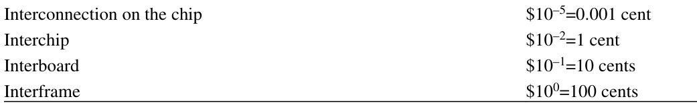  

3. Society is steadily moving from a material goods society to an information service society. At the time of the American Revolution, say 1780 or so, over   $90\%$   of the people were essentially farmers—now farmers are a very small percent of workers. Similarly, before WW-II most workers were in factories—now less than half are there. In 1993, there were more people in Government (excluding the military), than there were in manufacturing! What will the situation be in 2020? As a guess I would say less than   $25\%$   of the people in the civilian work force will be handling things, the rest will be handling information in some form or other. In making a movie or a TV program you are making not so much a thing, though of course it does have a material form, as you are organizing information. Information is, of course, stored in a material form, say a book (the essence of a book is information), but information is not a material good to be consumed like food, a house, clothes, an automobile, or an airplane ride for transportation.  

The information revolution arises from the above three items plus their synergistic interaction, though the following items also contribute.  

4. The computers make it possible for robots to do many things, including much of the present manufacturing. Evidently computers will play a dominant role in robot operation, though one must be careful not to claim the standard von Neumann type of computer will be the sole control mechanism, rather probably the current neural net computers, fuzzy set logic, and variations will do much of the control. Setting aside the child’s view of a robot as a machine resembling a human, but rather thinking of it as a device for handling and controlling things in the material world, robots used in manufacturing do the following:  

A. Produce a better product under tighter control limits. B. Produce usually a cheaper product. C. Produce a different product.  

This last point needs careful emphasis.  

When we first passed from hand accounting to machine accounting we found it necessary, for economical reasons if no other, to somewhat alter the accounting system. Similarly, when we passed from strict hand fabrication to machine fabrication we passed from mainly screws and bolts to rivets and welding.  

It has rarely proved practical to produce exactly the same product by machines as we produced by hand.  

Indeed, one of the major items in the conversion from hand to machine production is the imaginative redesign of an  equivalent   product . Thus in thinking of mechanizing a large organization, it won’t work if you try to keep things in detail exactly the same, rather there must be a larger give-and-take if there is to be a significant success. You must get the essentials of the job in mind and then design the mechanization to do that job rather than trying to mechanize the current version—if you want a significant success in the long run.  

I need to stress this point; mechanization requires you produce an equivalent product, not identically the same one. Furthermore, in any design it is now essential to consider field maintenance since in the long run it often dominates all other costs. The more complex the designed system the more field maintenance must be central to the final design. Only when field maintenance is part of the original design can it be safely controlled; it is not wise to try to graft it on later. This applies to both mechanical things and to human organizations.  

5. The effects of computers on Science have been very large, and will probably continue as time goes on. My first experience in large scale computing was in the design of the original atomic bomb at Los Alamos. There was no possibility of a small scale experiment either you have a critical mass or you do not—and hence computing seemed at that time to be the only practical approach. We simulated, on primitive IBM accounting machines, various proposed designs, and they gradually came down to a design to test in the desert at Alamagordo, NM.  

From that one experience, on thinking it over carefully and what it meant, I realized computers would allow the simulation of many different kinds of experiments. I put that vision into practice at Bell Telephone Laboratories for many years. Somewhere in the mid-tolate 1950s in an address to the President and V.Ps of Bell Telephone Laboratories I said, “At present we are doing 1 out of 10 experiments on the computers and 9 in the labs, but before I leave it will be 9 out of 10 on the machines”. They did not believe me then, as they were sure real observations were the key to experiments and I was just a wild theoretician from the mathematics department, but you all realize by now we do somewhere between  $90\ \%$   to   $99~\%$   of our experiments on the machines and the rest in the labs. And this trend will go on! It is so much cheaper to do simulations than real experiments, so much more flexible in testing, and we can even do things which cannot be done in any lab, that it is inevitable the trend will continue for some time. Again, the product was changed!  

But you were all taught about the evils of the Middle Age scholasticism—people deciding what would happen by reading in the books of Aristotle (384–322) rather than looking at Nature. This was Galileo’s (1564–1642) great point which started the modern scientific revolution—look at Nature not in books! But what was I saying above? We are now looking more and more in books and less and less at Nature! There is clearly a risk we will go too far occasionally—and I expect this will happen frequently in the future. We must not forget, in all the enthusiasm for computer simulations, occasionally we must look at Nature as She is.  

6. Computers have also greatly affected Engineering. Not only can we design and build far more complex things than we could by hand, we can explore many more alternate designs. We also now use computers to control situations such as on the modern high speed airplane where we build unstable designs and then use high speed detection and computers to stabilize them since the unaided pilot simply cannot fly them directly. Similarly, we can now do unstable experiments in the laboratories using a fast computer to control the instability. The result will be that the experiment will measure something very accurately right on the edge of stability.  

As noted above, Engineering is coming closer to Science, and hence the role of simulation in unexplored situations is rapidly increasing in Engineering as well as Science. It is also true  computers   are now often an essential component of a good design .  

In the past Engineering has been dominated to a great extent by “what can we do”, but now “what do we want to do” looms greater since we now have the power to design almost anything we want. More than ever before, Engineering is a matter of choice and balance rather than just doing what can be done. And more and more it is the human factors which will determine good design—a topic which needs your serious attention at all times.  

7. The effects on society are also large. The most obvious illustration is computers have given top management the power to  micromanage  their organization, and top management has shown little or no ability to resist using this power. You can regularly read in the papers some big corporation is decentralizing, but when you follow it for several years you see they merely intended to do so, but did not.  

Among other evils of micromanagement is lower management does not get the chance to make responsible decisions and learn from their mistakes, but rather because the older people finally retire then lower management finds itself as top management —without having had many real experiences in management!  

Furthermore, central planning has been repeatedly shown to give poor results (consider the Russian experiment for example or our own bureaucracy). The persons on the spot usually have better knowledge than can those at the top and hence can often (not always) make better decisions if things are not micromanaged. The people at the bottom do not have the larger, global view, but at the top they do not have the local view of all the details, many of which can often be very important, so  either extreme gets poor results .  

Next, an idea which arises in the field, based on the direct experience of the people doing the job, cannot get going in a centrally controlled system since the managers did not think of it themselves. The  not invented here  (NIH) syndrome is one of the major curses of our society, and computers with their ability to encourage micromanagement are a significant factor.  

There is slowly coming, but apparently definitely, a counter trend to micromanagement. Loose connections between small, somewhat independent organizations, are gradually arising. Thus in the brokerage business one company has set itself up to sell its services to other small subscribers, for example, computer and legal services. This leaves the brokerage decisions of their customers to the local management people who are close to the front line of activity. Similarly, in the pharmaceutical area some loosely related companies carry out their work and intertrade among themselves as they see fit. I believe you can expect to see much more of this loose association between small organizations as a defense against micromanagement from the top which occurs so often in big organizations. There has always been some independence of subdivisions in organizations, but the power to micromanage from the top has apparently destroyed the conventional lines and autonomy of decision making—and I doubt the ability of most top managements to resist for long the power to micromanage. I also doubt many large companies will be able to give up micromanagement; most will probably be replaced in the long run by smaller organizations without the cost (overhead) and errors of top management. Thus computers are affecting the very structure of how Society does its business, and for the moment apparently for the worse in this area.  

8. Computers have already invaded the entertainment field. An informal survey indicates the average American spends far more time watching TV than in eating-again an information field is taking precedence over the vital material field of eating! Many commercials and some programs are now either partially or completely computer produced.  

How far machines will go in changing society is a matter of speculation—which opens doors to topics that would cause trouble if discussed openly! Hence I must leave it to your imaginations as to what, using computers on chips, can be done in such areas as sex, marriage, sports, games, “travel in the comforts of home via virtual realities”, and other human activities.  

Computers began mainly in the number crunching field but passed rapidly on to information retrieval (say airline reservation systems), word processing which is spreading everywhere, symbol manipulation as is done by many programs such as those which can do analytic integration in the calculus far better and cheaper than can the students, and in logical and decision areas where many companies use such programs to control their operations from moment to moment. The future computer invasion of traditional fields remains to be seen and will be discussed later under the heading of artificial intelligence (AI),  Chapters 6 –8.  

9. In the military it is easy to observe (in the Gulf War for example), the central role of information, and the failure to use the information about one’s own situation killed many of our own people! Clearly that war was one of information above all else, and it is probably one indicator of the future. I need not tell you such things since you are all aware, or should be, of this trend. It is up to you to try to foresee the situation in the year 2020 when you are at the peak of your careers. I believe computers will be almost everywhere since I once saw a sign which read, “The battle field is no place for the human being”. Similarly for situations requiring constant decision making. The many advantages of machines over humans were listed near the end of the last chapter and it is hard to get around these advantages, though they are certainly not everything. Clearly the role of humans will be quite different from what it has traditionally been, but many of you will insist on old theories you were taught long ago as if they would be automatically true in the long future. It will be the same in business, much of what is now taught is based on the past, and has ignored the computer revolution and our responses to some of the evils the revolution has brought; the gains are generally clear to management, the evils are less so.  

How much the trends, predicted in part 6 above, toward and away from micromanagement will apply widely and is again a topic best left to you—but you will be a fool if you do not give it your deep and constant attention. I suggest you must rethink  everything  you ever learned on the subject, question every successful doctrine from the past, and finally decide for yourself its future applicability. The Buddha told his disciples, “Believe nothing, no matter where you read it, or who said it, no matter if I have said it, unless it agrees with your own reason and your own common sense”. I say the same to you— you must assume the responsibility for   what you believe .  

I now pass on to a topic that is often neglected, the rate of evolution of some special field which I will treat an another example of “back of the envelop computation”. The growth of most, but by no means all, fields follow an “S” shaped curve. Things begin slowly, then rise rapidly, and later flatten off as they hit some natural limits.  

The simplest model of growth assumes the rate of growth is proportional to the current size, something like compound interest, unrestrained bacterial and human population growth, as well as many other examples. The corresponding differential equation is  

$$
\frac{\mathrm{d}y}{\mathrm{d}t}\!=\!k y
$$  

whose solution is, of course,  

$$
y(t)=A\mathrm{e}^{k t}.
$$  

But this growth is unlimited and all things must have limits, even knowledge itself since it must be recorded in some form and we are (currently) told the universe is finite! Hence we must include a limiting factor in the differential equation. Let  $L$   be the upper limit. Then the next simplest growth equation seems to be  

$$
\frac{\mathrm{d}y}{\mathrm{d}t}\!=\!k y(L\!-\!y).
$$  

At this point we, of course, reduce it to a standard form that eliminates the constants. Set  $\scriptstyle{y=L z}$  ,  and   $\scriptstyle{x=t/k L^{2}}$  then we have  

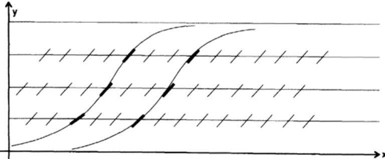  

Figure 2.I  

$$
\frac{\mathrm{d}z}{\mathrm{d}x}\!=\!z(1\!-\!z)
$$  

as the  reduced form  for the growth problem, where the saturation level is now 1. Separation of variables plus partial fractions yields:  

$$
\begin{array}{c}{{\displaystyle{\ln z-\ln(1-z)=x+C},}}\\ {{\displaystyle{\frac{z}{1-z}=A\mathbf{e}^{x}},}}\\ {{\displaystyle{z=\frac{1}{[1+(1/A)\mathbf{e}^{-x}]}}\,.}}\end{array}
$$  

$A$   is, of course, determined by the initial conditions, where you put   $t\,(\mathrm{or}\,\,x){=}0$  . You see immediately the “S” shape of the curve; at  $t\!=\!\!-\!\infty$  ,  $_{\mathrm{z=0}}$  ; at   $t{=}0$  ,  $\scriptstyle\mathrm{Z=}A/(A+1)$  ; and at  $t\!=\!\!+\infty$  ,  $\scriptstyle{\mathrm{Z}}=1$  .  

A more flexible model for the growth is (in the reduced variables)  

$$
\frac{{\sf d}z}{{\sf d}x}\!=\!z^{a}(1-z)^{b},\;\;\;(a,\,b\!>\!0).
$$  

This is again a variables separable equation, and also yields to numerical integration if you wish. We can analytically find the steepest slope by differentiating the right hand side and equating to 0. We get  

$$
a(1-z)-b z=0.
$$  

Hence at the place  

we have the maximum slope  

$$
z=\!\frac{a}{(a+b)}\,,
$$  

$$
{\frac{a^{a}b^{b}}{(a+b)^{a+b}}}\,.
$$  

A direction field sketch  Figure 2.I  will often indicate the nature of the solution and is particularly easy to do as the slope depends  

only on   $y$   and not on   $x$  —the isoclines are horizontal lines so the solution can be slid along the   $x\cdot$  -axis without changing the “shape” of the solution. For a given   $a$   and   $b$   there is really only one shape,  and the  

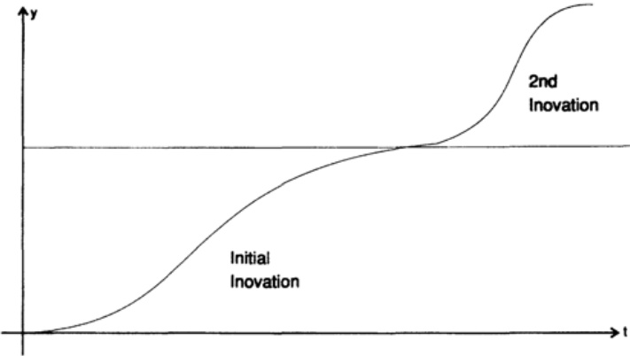  

initial conditions determine where you look, not what you look at. When the differential equation has coefficients which do not depend on the independent variable then you have this kind of effect.  

In the special case of  $\scriptstyle a=b$   we have maximum slope  $\mathrm{=}1/2^{2\mathrm{a}}$  . The curve will in this case be odd symmetric about the point where  $\scriptstyle{z=1/2}$  . In the further special case of   $\scriptstyle{a=b=I/2}$   we get the solution  

$$
z=\sin^{2}(x/2+C),~~({}-C\leq x/2\leq\pi-C).
$$  

Here we see the solution curve has a finite range. For larger exponents   $a$   and   $b$   we have clearly an infinite range.  

As an application of the above consider the rate of increase in computer operations per second has been fairly constant for many years—thus we are clearly on the almost straight line part of the “S” curve. (More on this in the next chapter.) In this case we can more or less know the saturation point for the von Neumann, single processor, type of computer since we believe: (1) the world is made out of molecules, and (2) using the evidence from the two relativity theories, special and general, gives a maximum speed of useful signaling, then there are definite limits to what can be done with a single processor. The trend to highly parallel processors is the indication we are feeling the upper saturation limit of the “S” curve for single processor computers. There is also the nasty problem of heat dissipation to be considered. We will discuss this matter in more detail in the next chapter.  

Again we see how a simple model, while not very exact in detail, suggests the nature of the situation. Whether parallel processing fits into this picture, or is an independent curve is not clear at this moment. Often a new innovation will set the growth of a field onto a new “S” curve which takes off from around the saturation level of the old one,  Figure 2.II . You may want to explore models which do not have a hard upper saturation limit but rather finally grow logarithmically; they are sometimes more appropriate.  

It is evident Electrical Engineering in the future is going to be, to a large extent, a matter of: (1) selecting chips off the shelf or from a catalog, (2) putting the chips together in a suitable manner to get what you want, and (3) writing the corresponding programs. Awareness of the chips, and circuit boards which are currently available will be an essential part of Engineering, much as the  Vacuum Tube Catalog  was in the old days.  

As a last observation in this area let me talk about special purpose IC chips. It is immensely ego gratifying to have special purpose chips for your special job, but there are very high costs associated with them. First, of course, is the design cost. Then there is the “trouble shooting” of the chip. Instead, if you will find a general purpose chip, which may possibly cost a bit more, then you gain the following advantages:  

1. Other users of the chip will help find the errors, or other weaknesses, if there are any. 2. Other users will help write the manuals needed to use it. 3. Other users, including the manufacturer, will suggest upgrades of the chip, hence you can expect a steady stream of improved chips with little or no effort on your part. 4. Inventory will not be a serious problem. 5. Since, as I have been repeatedly said, technical progress is going on at an increasing rate, it follows technological obsolescence will be much more rapid in the future than it is now. You will hardly get a system installed and working before there are significant improvements which you can adapt by mere program changes  If  you have used general purpose chips and good programming methods rather than your special purpose chip which will almost certainly tie you down to your first design.  

Hence beware of special purpose chips!  

though many times they are essential.  

# 3 History of   Computers—   Harware  

The history of computing probably began with primitive man using pebbles to compute the sum of two amounts. Marshack (of Harvard) found what had been believed to be mere scratches on old bones from cave man days were in fact carefully scribed lines apparently connected with the moon’s phases. The famous Stonehenge on the Salisbury plain in England had three building stages, 1900–1700, 1700–1500, and 1500–  $1400\ \mathrm{B.C.}$  ., and were apparently closely connected with astronomical observations, indicating considerable astronomical sophistication. Work in archeoastronomy has revealed many primitive peoples had considerable knowledge about astronomical events. China, India, and Mexico were prominent in this matter, and we still have their structures which we call observatories, though we have too little understanding of how they were used. Our western plains have many traces of astronomical observatories which were used by the Indians.  

The  sand pan  and the  abacus  are instruments more closely connected with computing, and the arrival of the Arabic numerals from India meant a great step forward in the area of pure computing. Great resistance to the adoption of the Arabic numerals (not in their original Arabic form) was encountered from officialdom, even to the extent of making them illegal, but in time (the 1400s) the practicalities and economic advantages triumphed over the more clumsy Roman (and earlier Greek) use of letters of the alphabet as symbols for the numbers.  

The invention of logarithms by Napier (1550–1617) was the next great step. From it came the slide rule, which has the numbers on the parts as lengths proportional to the logs of the numbers, hence adding two lengths means multiplying the two numbers. This analog device, the slide rule, was another significant step forward, but in the area of analog not digital computers. I once used a very elaborate slide rule in the form of a (6–8”) diameter cylinder and about two feet long, with many, many suitable scales on both the outer and inner cylinders, and equipped with a magnifying glass to make the reading of the scales more accurate.  

Slide rules in the 1930s and 1940s were standard equipment of the engineer, usually carried in a leather case fastened to the belt as a badge of one’s group on the campus. The standard engineer’s slide rule was a “10 inch loglog decitrig slide rule” meaning the scales were   $10^{\circ}$   long, included loglog scales, square and cubing scales, as well as numerous trigonometric scales in decimal parts of the degree. They are no longer manufactured!  

Continuing along the analog path, the next important step was the differential analyzer, which at first had mechanical integrators of the analog form. The earliest successful ones were made around 1930 by Vannevar Bush of MIT. The later RDA #2, while still analog and basically mechanical, had a great deal of electronic interconnections. I used it for some time (1947–1948) in computing Nike guided missile trajectories in the earliest design stages.  

During WW-II the electronic analog computers came into the military field use. They used condensers as integrators in place of the earlier mechanical wheels and balls (hence they could only integrate with respect to time). They meant a large, practical step forward, and I used one such machine at Bell Telephone Laboratories for many years. It was constructed from parts of some old M9 gun directors. Indeed, we used parts of some later condemned M9s to build a second computer to be used either independently or with the first one to expand its capacity to do larger problems.  

Returning to digital computing Napier also designed “Napier’s bones” which were typically ivory rods with numbers which enabled one to multiply numbers easily; these are digital and not to be confused with the analog slide rule.  

From the Napier bones probably came the more modern desk calculators. Schickert wrote (Dec. 20, 1623) to Kepler (of astronomical fame) that a fire in his lab burned up the machine he was building for Kepler. An examination of his records and sketches indicates it would do the four basic operations of arithmetic

 — provided you have some charity as to just what multiplication and division are in such a machine. Pascal

 (1623–1662) who was born that same year is often credited with the invention of the desk computer, but his would only add and subtract—only those operations were needed to aid his tax assessing father. Leibnitz (of calculus fame) also tinkered with computers and included multiplication and division, though his machines were not reliable.  

Babbage (1791–1871) is the next great name in the digital field, and he is often considered to be the father of modern computing. His first design was the  difference engine,  based on the simple idea that a polynomial can be evaluated at successive, equally spaced, values by using only a sequence of additions and subtractions, and since locally most functions can be represented by a suitable polynomial this could provide “machine made tables” (Babbage insisted the printing be done by the machine to prevent any human errors creeping in). The English Government gave him financial support, but he never completed one. A Norwegian father and son (Scheutz) did make several which worked and Babbage congratulated them on their success. One of their machines was sold to the Albany observatory, New York, and was used to make some astronomical tables.  

As has happened so often in the field of computing, Babbage had not finished with the difference engine before he conceived of the much more powerful  analytical engine,  which is not far from the current von Neumann design of a computer. He never got it to work; a group in England constructed (1992) a machine from his working drawings and successfully operated it as he had designed it to work!  

The next major practical stage was the Comptometer which was merely an adding device, but by repeated additions, along with shifting, this is equivalent to multiplication, and was very widely used for many, many years.  

From this came a sequence of more modern desk calculators, the Millionaire, then the Marchant, the Friden, and the Monroe. At first they were hand controlled and hand powered, but gradually some of the control was built in, mainly by mechanical levers. Beginning around 1937 they gradually acquired electric motors to do much of the power part of the computing. Before 1944 at least one had the operation of square root incorporated into the machine (still mechanical levers intricately organized). Such hand machines were the basis of computing groups of people running them to provide computing power. For example, when I came to the Bell Telephone Laboratories in 1946 there were four such groups in the Labs, typically about six to ten girls in a group; a small group in the Mathematics department, a larger one in network department, one in switching, and one in quality control.  

Punched card computing began because one far seeing person saw the Federal census, that by law must be done every 10 years, was taking so much time the next one (1890) would not be done before the following one started  unless  they turned to machine methods. Hollerith, took on the job and constructed the first punched card machines, and with succeeding censuses he built more powerful machines to keep up with both the increased population and the increased number of questions asked on the census. In 1928 IBM began to use cards with rectangular holes so electric brushes could easily detect the presence or absence of a hole on a card at a given place. Powers, who also left the census group, kept the card form with round holes which were designed to be detected by mechanical rods as “fingers”.  

Around 1935 the IBM built the 601 mechanical punch which did multiplications, and could include two additions to the product at the same time. It became one of the mainstays of computingthere were about 1500 of them on rental and they averaged perhaps a multiplication per 2 or 3 seconds. These, along with some special triple product and division machines, were used at Los Alamos to compute the designs for the first atomic bombs.  

In the mechanical, meaning relay, area George Stibitz built (1939) the complex number computer and exhibited it at Dartmouth (1940) when the main frame was in New York, thus an early remote terminal machine, and since it normally had three input stations in different locations in the Labs it was, if you are kind, a “time shared machine”.  

Konrad Zuse in Germany, and Howard Aitken at Harvard, like Stibitz, each produced a series of relay computers of increasing complexity. Stibitz’s Model 5 had two computers in the same machine and could share a job when necessary, a multiprocessor machine if you wish. Of the three men probably Zuse was the greatest, considering both the difficulties he had to contend with and his later contributions to the software side of computing.  

It is usually claimed the electronic computer age began with the ENIAC built for the U.S. Army and delivered in 1946. It had about 18,000 vacuum tubes, was physically huge, and as originally designed it was wired much like the IBM plug boards, but its interconnections to describe any particular problem ran around the entire machine room! So long as it was used, as it was originally intended, to compute ballistic trajectories, this defect was not serious. Ultimately, like the later IBM CPC, it was cleverly rearranged by the users to act as if it were programmed from instructions (numbers on the ballistic tables) rather than from wiring the interconnections.  

Mauchly and Eckert, who built the ENIAC, found, just as Babbage had, before the completion of their first machine they already envisioned a larger, internally programmed, machine, the EDVAC. Von Neumann, as a consultant to the project, wrote up the report, and as a consequence internal programming is often credited to him, though so far as I know he never either claimed or denied that attribution. In the summer of 1946, Mauchly and Eckert gave a course,  open to all,  on how to design and build electronic computers, and as a result many of the attendees went off to build their own; Wilkes, of Cambridge, England, being the first to get one running usefully, the EDSAC.  

At first each machine was a one-of-a-kind, though many were copied from (but often completed before) the Institute for Advanced Studies machine under von Neumann’s direction, because the engineering of that machine was apparently held up. As a result, many of the so-called copies, like the Maniac-I (1952) (which was named to get rid of the idiotic naming of machines), and built under the direction of N.C. Metropolis, was finished before the Institute machine. It, and the Maniac-II (1955), were built at Los Alamos, while the Maniac- III (1959) was built at the University of Chicago. The Federal government, especially through the military, supported most of the early machines, and great credit is due to them for helping start the Computer Revolution.  

The first commercial production of electronic computers was under Mauchly and Eckert again, and since the company they formed was merged with another, their machines were finally called UNIVACS. Especially noted was the one for the Census Bureau. IBM came in a bit late with 18 (20 if you count secret cryptographic users) IBM 701s. I well recall a group of us, after a session on the   $\mathbf{IBM\3701}$   at a meeting where they talked about the proposed 18 machines, all believed this would saturate the market for many years! Our error was simply we thought only of the kinds of things we were currently doing, and did not think in the directions of entirely new applications of machines. The best experts at the time were flatly wrong! And not by a small amount either! Nor for the last time!  

Let me turn to some comparisons:  

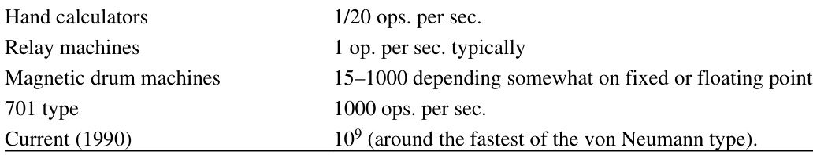  

The changes in speed, and corresponding storage capacities, that I have had to live through should give you some idea as to what you will have to endure in your careers. Even for von Neumann type machines there is probably another factor of speed of around 100 before reaching the saturation speed.  

Since such numbers are actually beyond most human experience I need to introduce a human dimension to the speeds you will hear about. First notation (the parentheses contain the standard symbol)  

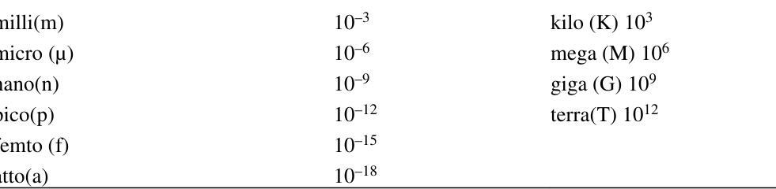  

Now to the human dimensions. In one day there are   $60{\times}\:60{\times}24{=}86{,}400$   seconds. In one year there are close to   $3.15{\times}10^{7}$   seconds, and in 100 years, probably greater than your lifetime, there are about   $3.15{\times}10^{9}$  seconds. Thus in 3 seconds a machine doing   $10^{9}$   floating point operations per second (flops) will do more operations than there are seconds in your whole lifetime, and almost certainly get them all correct!  

For another approach to human dimensions, the velocity of light in a vacuum is about   $3{\times}10^{10}~\mathrm{cm/sec}.$  , (along a wire it is about 7/10 as fast). Thus in a nanosecond light goes   $30~\mathrm{cm}$  , about one foot. At a picosecond the distance is, of course, about 1/100 of an inch. These represent the distances a signal can go (at best) in an IC. Thus at some of the pulse rates we now use the parts must be very close to each other- close in human dimensions—or else much of the potential speed will be lost in going between parts. Also we can no longer used lumped circuit analysis.  

How about  natural  dimensions of length instead of human dimensions? Well, atoms come in various sizes running generally around 1 to 3 angstroms (an angstrom is   $10^{-8}\,\mathrm{cm}.$  .) and in a crystal are spaced around 10 angstroms apart, typically, though there are exceptions. In 1 femtosecond light can go across about 300 atoms. Therefore the parts in a very fast computer must be small and very close together!  

If you think of a transistor using impurities, and the impurities run around 1 in a million typically, then you would probably not believe a transistor with 1 impure atom, but maybe, if you lower the temperature to reduce background noise, 1000 impurities is within your imagination—thus making the solid state device of at least around 1000 atoms on a side. With interconnections at times running at least 10 device distances you see why you feel getting below 100,000 atoms distance between some interconnected devices is really pushing things (3 picoseconds).  

Then there is heat dissipation. While there has been talk of thermodynamic ally reversible computers, so far it has only been talk and published papers, and heat still matters. The more parts per unit area, and the faster the rate of state change, the more the heat generated in a small area which must be gotten rid of before things melt. To partially compensate we have been going to lower, and lower voltages, and are now going to  $2^{{\frac{1}{2}}{\mathrm{or}}}\,3$   volts operating the IC. The possibility the base of the chip have a diamond layer is currently being examined since diamond is a very good heat conductor, much better than copper. There is now a reasonable possibility for a similar, possibly less expensive than diamond, crystal structure with very good heat conduction properties.  

To speed up computers we have gone to 2, to 4, and even more, arithmetic units-in the same computer, and have also devised  pipelines  and  cache memories . These are all small steps towards highly parallel computers.  

Thus you see the handwriting on the wall for the single processor machine—we are approaching saturation. Hence the fascination with highly parallel machines. Unfortunately there is as yet no single general structure for them, but rather many, many competing designs, all generally requiring different strategies to exploit their potential speeds and having different advantages and disadvantages. It is not likely a single design will emerge for a standard parallel computer architecture, hence there will be trouble and dissipation in efforts to pursue the various promising directions.  

From a chart drawn up long ago by Los Alamos (LANL) using the data of the fastest current computer on the market at a given time they found the equation for the number of operations per second was  

$$
n(t)=\exp\{22(1-\mathrm{e}^{-t/20})\},
$$  

and it fitted the data fairly well. Here time begins at 1943. In 1987 the extrapolated value predicted (by about 20 years!) was about  $3{\times}10^{8}$   and was on target. The limiting asymptote is  $3.576{\times}10^{9}$   for the von Neumann type computer with a single processor.  

Here, in the history of the growth of computers, you see a realization of the   $^{**}\!S^{**}$   type growth curve; the very slow start, the rapid rise, the long stretch of almost linear growth in the rate, and then the facing of the inevitable saturation.  

Again, to reduce things to human size. When I first got digital computing really going inside Bell Telephone Laboratories I began by renting computers outside for so many hours the head of the Mathematics department figured out for himself it would be cheaper to get me one inside—a deliberate plot on my part to avoid arguing with him as I thought it useless and would only produce  more resistance  on his part to digital computers. Once a boss says “no!” it is very hard to get a different decision, so don’t let them say “No!” to a proposal. I found in my early years I was doubling the number of computations per year about every 15 months. Some years later I was reduced to doubling the amount about every 18 months. The department head kept telling me I could not go on at that rate forever, and my polite reply was always, “You are right, of course, but you just watch me double the amount of computing every 18–20 months!” Because the machines available kept up the corresponding rate enabled me, and my successors, for many years to double the amount of computing done. We lived on the almost straight line part of the “S” curve all those years.  

However, let me observe in all honesty to the Department Head, it was remarks by him which made me realize it was not the number of operations done that mattered, it was, as it were, the number of micro- Nobel prizes I computed that mattered. Thus the motto of a book I published in 1961:  

The purpose of computing is insight, not numbers.  

A good friend of mine revised it to:  

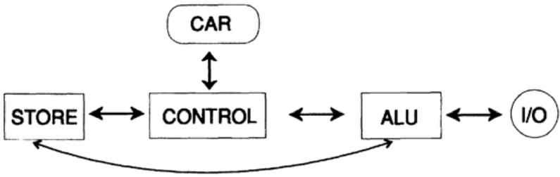  

The purpose of computing numbers is not yet in sight.  

It is necessary now to turn to some of the details of how for many years computers were constructed. The smallest parts we will examine are two state devices for storing bits of information, and for gates which either let a signal go through or block it. Both are binary devices, and in the current state of knowledge they provide the easiest, fastest methods of computing we know.  

From such parts we construct combinations which enable us to store longer arrays of bits; these arrays are often called number registers. The logical control is just a combination of storage units including gates. We build an adder out of such devices, as well as every larger unit of a computer.  

Going to the still larger units we have the machine consisting of: (1) a storage device, (2) a central control, (3) an ALU unit, meaning Arithmetic and Logic Unit. There is in the central control a single register which we will call the  Current Address Register  (CAR). It holds the address of where the next instruction is to be found,  Figure 3.I .  

The cycle of the computer is:  

1. Get the address of the next instruction from the CAR. 2. Go to that address in storage and get that instruction. 3. Decode and obey that instruction. 4. Add 1 to the CAR address, and start in again.  

We see the machine does not know where it has been, nor where it is going to go; it has at best only a myopic view of simply repeating the same cycle endlessly. Below this level the individual gates and two way storage devices do not know any meaning—they  

simply react to what they are supposed to do. They too have no global knowledge of what is going on, nor any meaning to attach to any bit, whether storage or gating.  

There are some instructions which, depending on some state of the machine, put the address of their instruction into the CAR, (and 1 is not added in such cases), and then the machine, in starting its cycle, simply finds an address which is not the immediate successor in storage of the previous instruction, but the location inserted into the CAR.  

I am reviewing this so you will be clear the machine processes bits of information according other bits, and as far as the machine is concerned there is no  meaning  to anything which happens— it is   we who attach meaning to the bits . The machine is a “machine” in the classical sense; it does what it does and nothing else (unless it malfunctions). There are, of course, real time interrupts, and other ways new bits get into the machine, but to the machine they are only bits.  

But before we leave the topic, recall in ancient Greece Democritus (460?–362?) observed; “All is atoms and void”. He thus expressed the view of many physicists today, the world, including you and me, is made of molecules, and we exist in a radiant energy field. There is nothing more! Are we machines? Many of you do not wish to settle for this, but feel there is more to you than just a lot of molecules banging against one another mindlessly, which we see is one view of a computer. We will examine this point in  Chapters 6 –8 under the title of Artificial Intelligence (AI).  

There is value in the machine view of a computer, that it is just a collection of storage devices and gates processing bits, and nothing more. This view is useful, at times, when debugging (finding errors) in a program; indeed is what you must assume when you try to debug. You assume the machine obeys the instructions one at a time, and does nothing more—it has no “free will” or any of the other attributes such as the self-awareness and self-consciousness we often associate with humans.  

How different are we in practice from the machines? We would all like to think we are different from machines, but are we essentially? It is a touchy point for most people, and the emotional and religious aspects tend to dominate most arguments. We will return to this point in the  Chapters 6 –8 on AI when we have more background to discuss it reasonably.  

# 4 History of   Computers—   Software  

As I indicated in the last chapter, in the early days of computing the control part was all done by hand. The slow desk computers were at first controlled by hand, for example multiplication was done by repeated additions, with column shifting after each digit of the multiplier. Division was similarly done by repeated subtractions. In time electric motors were applied both for power and later for more automatic control over multiplication and division. The punch card machines were controlled by plug board wiring to tell the machine where to find the information, what to do with it, and where to put the answers on the cards (or on the printed sheet of a tabulator), but some of the control might also come from the cards themselves, typically  $X$   and   $Y$   punches (other digits could, at times, control what happened). A plug board was specially wired for each job to be done, and in an accounting office the wired boards were usually saved and used again each week, or month, as they were needed in the cycle of accounting.  

When we came to the relay machines, after Stibitz’s first Complex Number Computer, they were mainly controlled by punched paper tapes. Paper tapes are a curse when doing one-shot problems —they are messy, and gluing them to make corrections, as well as loops, is troublesome (because, among other things, the glue tends to get into the reading fingers of the machine!). With very little internal storage in the early days the programs could not be economically stored in the machines (though I am inclined to believe the designers considered it).  

The ENIAC was at first (1945–1946) controlled by wiring as if it were a gigantic plugboard, but in time Nick Metropolis and Dick Clippenger converted it to a machine that was programmed from the ballistic tables, which were huge racks of dials into which decimal digits of the program could be set via the knobs of the decimal switches.  

Internal programming became a reality when storage was reasonably available, and, while it is commonly attributed to von Neumann, he was only a consultant to Mauchly and Eckert and their team. According to Harry Huskey internal programming was frequently discussed by them  before  von Neumann began the consulting. The first, at all widely available discussion (after Lady Lovelace wrote and published a few programs for the proposed Babbage analytical engine), was the von Neumann Army reports which were widely circulated, but never published in any referred place.  

The early codes were  one address  mainly, meaning each instruction contained an instruction part and the address where the number was to be found or sent to. We also had  two address  codes, typically for rotating drum machines, so the next instruction would be immediately available once the previous one was completed— the same applied to mercury delay lines, and other storage devices which were serially available. Such coding was called  minimum   latency coding,  and you can imagine the trouble the programmer had in computing where to put the next instruction and numbers (to avoid delays and conflicts as best possible), let alone in locating programming errors (bugs). In time a program named SOAP (symbolic optimizing assembly program) was available to do this optimizing using the IBM 650 machine itself. There were also three and four address codes, but I will ignore them here.  

An interesting story about SOAP is a copy of the program, call it program A, was both loaded into the machine as a program, and processed as data. The output of this was program B. Then B was loaded into the 650 and A was run as data to produce a new B program. The difference between the two running times to produce program B indicated how much the optimization of the SOAP program (by SOAP itself) produced. An early example of self-compiling as it were.  

In the beginning we programmed in  absolute binary,  meaning we wrote the actual address where things were in binary, and wrote the instruction part also in binary! There were two trends to escape this,  octal, where you simply group the binary digits in sets of three, and  hexadecimal  where you take four digits at a time, and had to use A, B, C, D, E, F for the representation of other numbers beyond 9 (and you had, of course, learn the multiplication and addition tables to 15).  

If, in fixing up an error, you wanted to insert some omitted instructions then you took the immediately preceding instruction and replaced it by a transfer to some empty space. There you put in the instruction you just wrote over, added the instructions you wanted to insert, and then followed by a transfer back to the main program. Thus the program soon became a sequence of jumps of the control to strange places. When, as almost always happens, there were errors in the corrections you then used the same trick again, using some other available space. As a result the control path of the program through storage soon took on the appearance of a can of spaghetti. Why not simply insert them in the run of instructions? Because then you would have to go over the entire program and change all the addresses which refered to any of the moved instructions! Anything but that!  

We very soon got the idea of  reusable software,  as it is now called. Indeed Babbage had the idea. We wrote mathematical libraries to reuse blocks of code. But an absolute address library meant each time the library routine was used it had to occupy the same locations in storage. When the complete library became too large we had to go to  relocatable programs.  The necessary programming tricks were in the von Neumann reports, which were never formally published.  

The first published book devoted to programming was by Wilkes, Wheeler, and Gill, and applied to the Cambridge, England EDSAC (1951). I, among others, learned a lot from it, as you will hear in a few minutes.  

Someone got the idea a short piece of program could be written which would read in the symbolic names of the operations (like ADD) and translate them  at input time  to the binary representations used inside the machine (say 01100101). This was soon followed by the idea of using symbolic addresses—a real heresy for the old time programmers. You do not now see much of the old heroic absolute programming (unless you fool with a hand held programmable computer and try to get it to do more than the designer and builder ever intended).  

I once spent a full year, with the help of a lady programmer from Bell Telephone Laboratories, on one big problem coding in absolute binary for the IBM 701, which used all the 32K registers then available. After that experience I vowed never again would I ask anyone to do such labor. Having heard about a symbolic system from Poughkeepsie, IBM, I ask her to send for it and to use it on the next problem, which she did. As I expected, she reported it was much easier. So we told everyone about the new method, meaning about 100 people, who were also eating at the IBM cafeteria near where the machine was. About half were IBM people and half were, like us, outsiders renting time. To my knowledge only one person—yes, only one—of all the 100 showed any interest!  

Finally, a  more complete, and more useful, Symbolic Assembly Program  (SAP) was devised—after more years than you are apt to believe during which most programmers continued their heroic absolute binary programming. At the time SAP first appeared I would guess about   $1\%$   of the older programmers were interested in it—using SAP was “sissy stuff”, and a real programmer would not stoop to wasting machine capacity to do the assembly. Yes! Programmers wanted no part of it, though when pressed they had to admit their old methods used more machine time in locating and fixing up errors than the SAP program ever used. One of the main complaints was when using a symbolic system you do not know where anything was in storage—though in the early days we supplied a mapping of symbolic to actual storage, and believe it or not they later lovingly pored over such sheets rather than realize they did not need to know that information if they stuck to operating within the system—no! When correcting errors they preferred to do it in absolute binary addresses.  

FORTRAN, meaning FORmula TRANslation, was proposed by Backus and friends, and again was opposed by almost all programmers. First, it was said it could not be done. Second. if it could be done, it would be too wasteful of machine time and capacity. Third, even if it did work, no respectable programmer would use it—it was only for sissies!  

The use of FORTRAN, like the earlier symbolic programming, was very slow to be taken up by the professionals. And this is typical of almost all professional groups. Doctors clearly do not follow the advice they give to others, and they also have a high proportion of drug addicts. Lawyers often do not leave decent wills when they die. Almost all professionals are slow to use their own expertise for their own work. The situation is nicely summarized by the old saying, “The shoe maker’s children go without shoes”. Consider how in the future, when you are a great expert, you will avoid this typical error!  

With FORTRAN available and running, I told my programmer to do the next problem in FORTRAN, get her errors out of it, let me test it to see it was doing the right problem, and then she could, if she wished, rewrite the inner loop in machine language to speed things up and save machine time. As a result we were able, with about the same amount of effort on our part, to produce almost 10 times as much as the others were doing. But to them programming in FORTRAN was not for real programmers!  

Physically the management of the IBM 701, at IBM Headquarters in NYC where we rented time, was terrible. It was a sheer waste of machine time (at that time  $\S300$   per hour was a lot) as well as human time. As a result I refused later to order a big machine until I had figured out how to have a monitor system— which someone else finally built for our first IBM 709, and later modified it for the IBM 7096.  

Again, monitors, often called “the system” these days, like all the earlier steps I have mentioned, should be obvious to anyone who is involved in using the machines from day to day; but most users seem too busy to think or observe how bad things are and how much the computer could do to make things significantly easier and cheaper. To see the obvious it often takes an outsider, or else someone like me who is thoughtful and wonders what he is doing and why it is all necessary. Even when told, the old timers will persist in the ways they learned, probably out of pride for their past and an unwillingness to admit there are better ways than those they were using for so long.  

One way of describing what happened in the history of software is that we were slowly going from absolute to  virtual machines . First, we got rid of the actual code instructions, then the actual addresses, then in FORTRAN the necessity of learning a lot of the insides of these complicated machines and how they worked. We were buffering the user from the machine itself. Fairly early at Bell Telephone Laboratories we built some devices to make the tape units virtual, machine independent. When, and only when, you have a totally virtual machine will you have the ability to transfer software from one machine to another without almost endless trouble and errors.  

FORTRAN was successful far beyond anyone’s expectations because of the  psychological  fact it was just what its name implied— FORmula TRANslation of the things one had always done in school; it did not require learning a new set of ways of thinking.  

Algol, around 1958–1960, was backed by many worldwide computer organizations, including the ACM. It was an attempt by the -theoreticians to greatly improve FORTRAN. But being logicians, they produced a logical, not a humane, psychological languageand of course, as you know, it failed in the long run. It was, among other things, stated in a Boolean logical form which is not comprehensible to mere mortals (and often not even to the logicians themselves!). Many other logically designed languages which were supposed to replace the pedestrian FORTRAN have come and gone, while FORTRAN (somewhat modified to be sure) remains a widely used language, indicating clearly the power of psychologically designed languages over logically designed languages.  

This was the beginning of a great hope for special languages, POLs they were called, meaning Problem Oriented Languages. There is some merit in this idea, but the great enthusiasm faded because too many problems involved more than one special field, and the languages were usually incompatible. Furthermore, in the long run, they were too costly in the learning phase for humans to master all of the various ones they might need.  

In about 1962 LISP language began. Various rumors floated around as to how actually it came about-the probable truth is something like this: John McCarthy suggested the elements of the language for theoretical purposes, the suggestion was taken up and significantly elaborated others, and when some student observed he could write a compiler for it  in LISP,  using the simple trick of  self-compiling,  all were astounded, including, apparently, McCarthy himself. But he urged the student to try, and magically almost overnight they moved from theory to a real operating LISP compiler!  

Let me digress, and discuss my experiences with the IBM 650. It was a two address drum machine, and operated in fixed decimal point. I knew from my past experiences in research floating point was necessary (von Neumann to the contrary) and I needed index registers which were not in the machine as delivered. IBM would some day supply the floating point subroutines, so they said, but that was not enough for me. I had reviewed for a Journal the EDSAC book on programming, and there in Appendix D was a peculiar program written to get a large program into a small storage. It was an  interpreter . But if it was in Appendix D did they see the importance? I doubt it! Furthermore, in the second edition it was still in Appendix D apparently unrecognized by them for what it was.  

This raises, as I wished to, the ugly point of when is something understood? Yes, they wrote one, and used it, but did they understand the generality of interpreters and compilers? I believe not. Similarly, when around that time a number of us realized computers were  actually symbol manipulators  and not just number crunchers, we went around giving talks, and I saw people nod their heads sagely when I said it, but I also realized most of them did not understand. Of course you can say Turing’s original paper (1937) clearly showed computers were symbol manipulating machines, but on carefully rereading the von Neumann reports you would not guess the authors did-though there is one combinatorial program and a sorting routine.  

History tends to be charitable in this matter. It gives credit for understanding what something means when we first to do it. But there is a wise saying, “Almost everyone who opens up a new field does not really understand it the way the followers do”. The evidence for this is, unfortunately, all too good. It has been said in physics no creator of any significant thing ever understood what he had done. I never found Einstein on the special relativity theory as clear as some later commentators. And at least one friend of mine has said, behind my back, “Hamming doesn’t seem to understand error correcting codes!” He is probably right; I do not understand what I invented as clearly as he does. The reason this happens so often is the creators have to fight through so many dark difficulties, and wade through so much misunderstanding and confusion, they cannot see the light as others can, now the door is open and the path made easy. Please remember, the inventor often has a very limited view of what he invented, and some others (you?) can see much more. But also remember this when you are the author of some brilliant new thing; in time the same will probably be true of you. It has been said Newton was the last of the ancients and not the first of the moderns, though he was very significant in making our modern world.  

Returning to the IBM 650 and me. I started out (1956 or so) with the following four rules for designing a language:  

1. Easy to learn. 2. Easy to use. 3. Easy to debug (find and correct errors). 4. Easy to use subroutines.  

The last is something which need not bother you as in those days we made a distinction between “open” and “closed” subroutines which is hard to explain now!  

You might claim I was doing  top-down programming,  but I immediately wrote out the details of the inner loop to check that it could be done efficiently  (bottom-up programming)  and only then did I resume my top- down, philosophical approach. Thus, while I believe in top-down programming as a good approach, I clearly recognize bottom-up programming is also needed at times.  

I made the two address, fixed point decimal machine look like a three address floating point machine— that was my goal—A op.  $\mathbf{B}{=}\mathbf{C}.$  . I used the ten decimal digits of the machine (it was a decimal machine so far as the user was concerned) in the form  

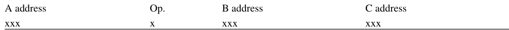  

How was it done? Easy! I wrote out in my mind the following loop,  Figure 4.I . First, we needed a Current Address Register, CAR, and so I assigned one of the 2000 computer registers of the IBM 650 to do this duty. Then we wrote a program to do the four steps of the last chapter. (1) Use the CAR to find where to go for the next instruction of the program you wrote (written in my language, of course). (2) Then take the instruction apart, and store the three addresses, A, B, and C, in suitable places in the 650 storage. (3) Then add a fixed constant to the operation (Op.) of the instruction and go to that address. There, for each instruction, would be a subroutine which described the corresponding operation. You might think I had, therefore only ten possible operations, but there are only four three-address operations, addition, subtraction, multiplication, and division, so I used the 0 instruction to mean “go to the B address and find further details of what is wanted”. Each subroutine when it was finished transferred the control to a given place in the loop. (4) We then added 1 to the contents of the CAR register, cleaned up some details, and started in again, as does the original machine in its own internal operation. Of course the transfer instructions, the 7 instructions as I recall, all put an address into the CAR and transferred to a place in the loop beyond the addition of 1 to the contents of the CAR register.  

An examination of the process shows whatever meaning you want to attach to the instructions must come from the subroutines which are written corresponding to the instruction numbers.  Those   subroutines define the meaning of the language . In this simple case each instruction had its own meaning independent of any other instruction, but it is clearly easy to make some instructions set switches, flags, or other bits so some later instructions on consulting them will be interpreted in one of several different ways. Thus you see how it is you can devise  any language you want,  provided you can uniquely define it in some definite manner. It goes on top of the machine’s language, making the machine into any other machine you want. Of course  

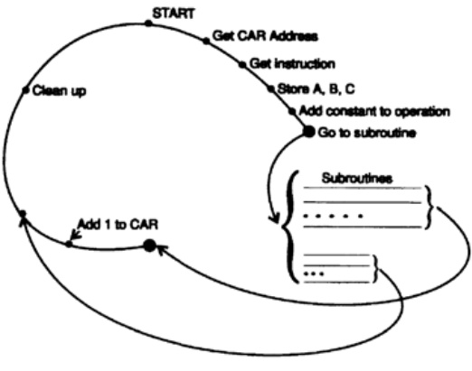  

this is exactly what Turing proved with his  Universal Turing Machine,  but as noted above, it was not clearly understood until we had done it a number of times.  

The software system I built was placed in the storage registers 1000 to 1999. Thus any program in the synthetic language, having only 3 decimal digits could only refer to addresses 000 to 999, and could not refer to, and alter, any register in the software and thus ruin it; designed in security protection of the software system from the user.  

I have gone through this in some detail since we commonly write a language above the machine language, and may write several more still higher languages, one on top of the other, until we get the kind of language we want to use in expressing our problems to the machine. If you use an  interpreter  at each stage, then, of course, it will be somewhat inefficient. The use of a  compiler  at the top will mean the highest language is translated into one of the lower languages once and for all, though you may still want an interpreter at some level. It also means, as in the EDSAC case, usually a great compression of programming effort and storage.  

I want to point out again the difference between writing a logical and a psychological language. Unfortunately, programmers, being logically oriented, and rarely humanly oriented, tend to write and extol logical languages. Perhaps the supreme example of this is APL. Logically APL is a great language and to this day it has its ardent devotees, but it is also not fit for normal humans to use. In this language there is a game of “one liners”; one line of code is given and you are asked what it means. Even experts in the language have been known to stumble badly on some of them.  

A change of a single letter in APL can completely alter the meaning, hence the language has almost no redundancy . But humans are unreliable and require redundancy; our spoken language tends to be around  $60\%$   redundant, while the written language is around   $40\%$  . You probably think the written and spoken languages are the same, but you are wrong. To see this difference, try writing dialog and then read how it sounds. Almost no one can write dialog so that it sounds right, and when it sounds right it is still not the spoken language.  

The human animal is not reliable, as I keep insisting, so low redundancy means lots of undetected errors, while high redundancy tends to catch the errors. The spoken language goes over an acoustic channel with all its noise and must caught on the fly as it is spoken; the written language is printed, and you can pause, back scan, and do other things to uncover the author’s meaning. Notice in English more often different words have the same sounds (“there” and “their” for example) than words have the same spelling but different sounds (“record” as a noun or a verb, and “tear” as in tear in the eye, vs. tear in a dress). Thus you should judge a language by how well it fits the human animal as it is—and remember I include how they are trained in school, or else you must be prepared to do a lot of training to handle the new type of language you are going to use. That a language is easy for the computer expert does not mean it is necessarily easy for the non-expert, and it is likely non-experts will do the bulk of the programming (coding if you wish) in the near future.  

What is wanted in the long run, of course, is the man with the problem does the actual writing of the code with no human interface, as we all too often have these days, between the person who knows the problem and the person who knows the programming language. This date is unfortunately too far off to do much good immediately, but I would think by the year 2020 it would be fairly universal practice for the expert in the field of application to do the actual program preparation rather than have experts in computers (and ignorant of the field of application) do the progam preparation.  

Unfortunately, at least in my opinion, the ADA language was designed by experts, and it shows all the non-humane features you can expect from them. It is, in my opinion, a typical Computer Science hacking job—do not try to understand what you are doing, just get it running. As a result of this poor psychological design, a private survey by me of knowledgeable people suggests that although a Government contract may specify the programming be in ADA, probably over  $90\%$   will be done in FORTRAN, debugged, tested, and then painfully, by hand, be converted to a poor ADA program, with a high probability of errors!  

The fundamentals of language are not understood to this day. Somewhere in the early 1950s I took the then local natural language expert (in the public eye) to visit the   $\mathrm{IBM\701}$   and then to lunch, and at dessert time I said, “Professor Pei, would you please discuss with us the engineering efficiencies of languages”. He simply could not grasp the question and kept telling us how this particular language put the plurals in the middle of words, how that language had one feature and not another, etc. What I wanted to know was how the job of communication can be efficiently accomplished when we have the power to design the language, and when only one end of the language is humans, with all their faults, and the other is a machine with high reliability to do what it is told to do, but nothing else. I wanted to know what redundancy I should have for such languages, the density of irregular and regular verbs, the ratio of synonyms to antonyms, why we have the number of them that we do, how to compress efficiently the communication channel and still leave usable human redundancy, etc. As I said, he could not hear the question concerning the engineering efficiency of languages, and I have not noticed many studies on it since. But until we genuinely understand such things—assuming, as seems reasonable, the current natural languages through long evolution are reasonably suited to the job they do for humans—we will not know how to design artificial languages for human-machine communication. Hence I expect a lot of trouble until we do understand human communication via natural languages. Of course, the problem of human-machine is significantly different from humanhuman communication, but in which ways and how much seems to be not known nor even sought for.  

Until we better understand languages of communication involving humans as they are (or can be easily trained) then it is unlikely many of our software problems will vanish.  

Some time ago there was the prominent “fifth generation” of computers the Japanese planned to use, along with AI, to get a better interface between the machine and the human problem solvers. Great claims were made for both the machines and the languages. The result, so far, is the machines came out as advertised, and they are back to the drawing boards on the use of AI to aid in programming. It came out as I predicted at that time (for Los Alamos), since I did not see the Japanese were trying to understand the basics of language in the above engineering sense. There are many things we can do to reduce “the software problem”, as it is called, but it will take some basic understanding of language as it is used to communicate  understanding between humans, and between humans and machines, before we will have a really decent solution to this costly problem. It simply will not go away.  

You read constantly about “engineering the production of software”, both for the efficiency of production and for the reliability of the product. But you do not expect novelists to “engineer the production of novels”. The question arises, “Is programming closer to novel writing than it is to classical engineering?” I suggest yes! Given the problem of getting a man into outer space both the Russians and the Americans did it pretty much the same way, all things considered, and allowing for some espionage. They were both limited by the same firm laws of physics. But give two novelists the problem of writing on “the greatness and misery of man”, and you will probably get two very different novels (without saying just how to measure this). Give the same complex problem to two modern programmers and you will, I claim, get two rather different programs. Hence my belief current programming practice is closer to novel writing than it is to engineering. The novelists are bound only by their imaginations, which is somewhat as the programmers are when they are writing software. Both activities have a large creative component, and while you would like to make programming resemble engineering, it will take a lot of time to get there—and maybe you really, in the long run, do not want to do it! Maybe it just sounds good You will have to think about it many times in the coming years; you might as well start now and discount propaganda you hear, as well as all the wishful thinking which goes on in the area! The software of the utility programs of computers has been done often enough, and is so limited in scope, so it might reasonably be expected to become “engineered”, but the general software preparation is not likely to be under “engineering control” for many, many years.  

There are many proposals on how to improve the productivity of the individual programmer as well as groups of programmers. I have already mentioned top-down and bottom-up; there are others such a head programmer, lead programmer, proving the program is correct in a mathematical sense, and the waterfall model of programming to name but a few. While each has some merit I have faith in only one which is almost never mentioned— think before you   write the program,  it might be called. Before you start, think carefully about the whole thing  including  what will be your acceptance test it is right, as well as how later field maintenance will be done. Getting it right the first time is much better than fixing it up later!  

One trouble with much of programming is simply that often there is not a well defined job to be done, rather the programming process itself will gradually discover what the problem is! The desire that you be given a well defined problem before you start programming often does not match reality, and hence a lot of the current proposals to “solve the programming problem” will fall to the ground if adopted rigorously.  

The use of higher level languages has meant a lot of progress. One estimate of the improvement in 30 years is:  

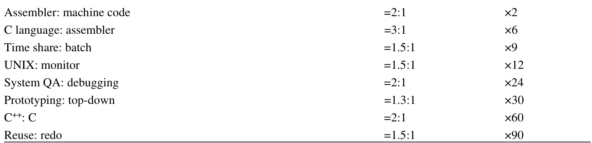  

so we apparently have made a factor of about 90 in the total productivity of programmers in 30 years (a mere  $16\%$   rate of improvement!). This is one person’s guess, and it is at least plausible. But compared with the speed up of machines it is like nothing at all! People wish humans could be similarly speeded up, but the fundamental bottleneck is the human animal as it  is,  and not as we wish it were.  

Many studies have shown programmers differ in productivity, from worst to best, by much more than a factor of 10. From this I long ago concluded the best policy is to pay your good programmers very well but regularly fire the poorer ones—if you can get away with it! One way is, of course, to hire them on contract rather than as regularly employed people, but that is increasingly against the law which seems to want to guarantee even the worst have some employment. In practice you may actually be better off to pay the worst to stay home and not get in the way of the more capable (and I am serious)!  

Digital computers are now being used extensively to simulate  neural nets  and similar devices are creeping into the computing field. A neural net, in case you are unfamiliar with them, can  learn  to get results when you give it a series of inputs and acceptable outputs, without ever saying how to produce the results. They can classify objects into classes which are reasonable, again without being told what classes are to be used or found. They learn with simple feedback which uses the information that the result computed from an input is not acceptable. In a way they represent a solution to “the programming problem”—once they are built they are really not programmed at all, but still they can solve a wide variety of problems satisfactorily. They are a coming field which I shall have to skip in this book, but they will probably play a large part in the future of computers. In a sense they are a “hard wired” computer (it may be merely a program) to solve a wide class of problems when a few parameters are chosen and a lot of data is supplied.  

Another view of neural nets is they represent a fairly general class of stable feedback systems. You pick the kind and amount of feedback you think is appropriate, and then the neural net’s feedback system converges to the desired solution. Again, it avoids a lot of detailed programming since, at least in a simulated neural net on a computer, by once writing out a very general piece of program you then have available a broad class of problems already programmed and the programmer hardly does more than give a calling sequence.  

What other very general pieces of programming can be similarly done is not now known— you  can think about it as one possible solution to the “programming problem”.  

In the Chapter on hardware I carefully discussed some of the limits—the size of molecules, the velocity of light, and the removal of heat. I should summarize correspondingly the less firm limits of software.  

I made the comparison of writing software with the act of literary writing; both seem to depend fundamentally on clear thinking. Can good programming be taught? If we look at the corresponding teaching of “creative writing” courses we find most students of such courses do not become great writers, and most great writers in the past did not take creative writing courses! Hence it is dubious that great programmers can be trained easily.  

Does experience help? Do bureaucrats after years of writing reports and instructions get better? I have no real data but I suspect with time they get worse! The habitual use of “governmentese” over the years probably seeps into their writing style and makes them worse. I suspect the same for programmers! Neither years of experience nor the number of languages used is any reason for thinking the programmer is getting better from these experiences. An examination of books on programming suggests most of the authors are not good programmers!  

The results I picture are not nice, but all you have to oppose it is wishful thinking—I have evidence of years and years of programming on my side!  

# 5 History of   Computer Application  

As you have probably noticed, I am using the technical material to hang together a number of anecdotes, hence I shall begin this time with a story of how this, and the two preceding chapters, came about. By the 1950s I had found I was frightened when giving public talks to large audiences, this in spite of having taught classes in college for many years. On thinking this over very seriously, I came to the conclusion I could not afford to be crippled that way and still become a great scientist; the duty of a scientist is not only to find new things, but to communicate them successfully in at least three forms:  

writing papers and books prepared public talks impromptu talks  

Lacking any one of these would be a serious drag on my career. How to learn to give public talks without being so afraid was my problem. The answer was obviously by practice, and while other things might help, practice was a necessary thing to do.  

Shortly after I had realized this it happened I was asked to give an evening talk to a group of computer people who were IBM customers learning some aspect of the use of IBM machines. As a user I had been through such a course myself and knew typically the training period was for a week during working hours. To supply entertainment in the evenings IBM usually arranged a social get-together the first evening, a theater party on some other evening, and a general talk about computers on still another evening—and it was obvious to me I was being asked to do the later.  

I immediately accepted the offer because here was a chance to practice giving talks as I had just told myself I must do. I soon decided I should give a talk which was so good I would be asked to give other talks and hence get more practice. At first I thought I would give a talk on a topic dear to my heart, but I soon realized if I wanted to be invited back I had best give a talk the audience wanted to hear, which is often a very, very different thing. What would they want to hear, especially as I did not know exactly the course they were taking and hence the abilities of people? I hit on the general interest topic,  The History of Computing to the Year  2000 —this at around 1960. Even I was interested in the topic, and wondered what I would say! Furthermore, and this is important, in preparing the talk I would be preparing myself for the future.  

In saying, “What do they want to hear?” I am not speaking as a politician but as a scientist who should tell the truth as they see it. A scientist should not give talks merely to entertain, since the object of the talk is usually scientific information transmission from the speaker to the audience. That does not imply the talk must be dull. There is a fine, but definite, line between scientific communication and entertainment, and the scientist should always stay on the right side of that line.  

My first talk concentrated on the hardware, and I dealt with the limitations of it including, as I mentioned in  Chapter 3 , the three relevant laws of Nature; the size of molecules, the speed of light, and the problem of heat dissipation. I included lovely colored VuGraphs with overlays of the quantum mechanical limitations, including the uncertainty principle effects. The talk was successful since the IBM person who had asked me to give the talk said afterwards how much the audience had liked it. I casually said I had enjoyed it too, and would be glad to come into NYC almost any evening they cared, provided they warned me well in advance, and I would give it again—and they accepted. It was the first of a series of talks which went on for many years, about two or three times a year; I got a lot of practice and learned not to be too scared. You should always feel some excitement when you give a talk since even the best actors and actresses usually have some stage fright. Your excitement tends to be communicated to the audience, and if you seem to be perfectly relaxed then the audience also relaxes and may fall asleep!  

The talk also kept me up to date, made me keep an eye out for trends in computing, and generally paid off to me in intellectual ways as well as getting me to be a more polished speaker. It was not all just luck—I made a lot of it by trying to understand, below the surface level, what was going on. I began, at any lecture I attended anywhere, to pay attention not only to what was said, but to the style in which it was said, and whether it was an effective or a noneffective talk. Those talks which were merely funny I tended to ignore, though I studied the style of joke telling closely. An after dinner speech requires, generally, three good jokes; one at the beginning, one in the middle, and a closing one so that they will at least remember one joke; all jokes of course told well. I had to find my own style of joke telling, and I practiced it by telling jokes to secretaries.  

After giving the talk a few times I realized, of course, it was not just the hardware, but also the software which would limit the evolution of computing as we approached the year 2000— Chapter 4  I just gave you. Finally, after a long time, I began to realize it was the economics, the applications, which probably would dominate the evolution of computers. Much, but by no means all, of what would happen had to be economically sound. Hence this chapter.  

Computing began with simple arithmetic, went through a great many astronomical applications, and came to number crunching. But it should be noted Raymond Lull (12357–1315), sometimes written Lully, a Spanish theologian and philosopher, built a logic machine! It was this that Swift satirized in his  Gulliver’s Travels  when Gulliver was on the island of Laputa, and I have the impression Laputa corresponds to Majorca where Lull flourished.  

In the early years of modern computing, say around 1940s and 1950s, “number crunching” dominated the scene since people who wanted hard, firm numbers were the only ones with enough money to afford the price (in those days) of computing. As computing costs came down the kinds of things we could do economically on computers broadened to include many other things than number crunching. We had realized all along these other activities were possible, it was just they were uneconomical at that time.  

Another aspect of my experiences in computing was also typical. At Los Alamos we computed the solutions of partial differential equations (atomic bomb behavior) on primitive equipment. At Bell Telephone Laboratories at first I solved partial differential equations on relay computers; indeed I even solved a partial differential-integral equation! Later, with much better machines available, I progressed to ordinary differential equations in the form of trajectories for missiles. Then still later I published several papers on how to do simple integration. Then I progressed to a paper on function evaluation, and finally one paper on how numbers combine! Yes, we did some of the hardest problems on the most primitive equipment —it was necessary to do this in order to prove machines could do things which could not be done otherwise. Then, and only then, could we turn to the economical solutions of problems which could be done only laboriously by hand! And to do this we needed to develop the basic theories of numerical analysis and practical computing suitable for machines rather than for hand calculations.  

This is typical of many situations. It is first necessary to prove beyond any doubt the new thing, device, method, or whatever it is, can cope with heroic tasks before it can get into the system to do the more routine, and in the long run, more useful tasks. Any innovation is always against such a barrier, so do not get discouraged when you find your new idea is stoutly, and perhaps foolishly, resisted. By realizing the magnitude of the actual task you can then decide if it is worth your efforts to continue, or if you should go do something else you can accomplish and not fritter away your efforts needlessly against the forces of inertia and stupidity.  

In the early evolution of computers I soon turned to the problem of doing many small problems on a big machine. I realized, in a very real sense, I was in  the mass production of a variable product —I should organize things so I could cope with most of the problems which would arise in the next year, while at the same time not knowing what, in detail, they would be. It was then I realized the computers have opened the door much more generally to the mass production of a variable product, regardless of what it is; numbers, words, word processing, making furniture, weaving, or what have you. They enable us to deal with variety without excessive standardization, and hence we can evolve more rapidly to a desired future! You see it at the moment applied to computers themselves! Computers, with some guidance from humans, design their own chips, and computers are assembled, more or less, automatically from standard parts; you say what things you want in your computer and the particular computer is then made. Some computer manufacturers are now using almost total machine assembly of the parts with almost no human intervention.  

It was the attitude I was in the mass production of a variable product, with all its advantages and disadvantages, which caused me to approach the   $\mathrm{{IBM~}}650$   as I told you about in the last chapter. By spending about 1 man year in total effort over a period of 6 months, I found at the end of the year I had more work done than if I had approached each problem one at a time! The creation of the software tool paid off within one year! In such a rapidly changing field as computer software if the payoff is not in the near future then it is doubtful it will ever pay off.  

I have ignored my experiences outside of science and engineering—for example I did one very large business problem for AT&T using a UNIVAC-I in NYC, and one of these days I will get to a lesson I learned then.  

Let me discuss the applications of computers in a more quantitative way. Naturally, since I was in the Research Division of Bell Telephone Laboratories, initially the problems were mainly scientific, but being in Bell Telephone Laboratories we soon got to engineering problems. First,  Figure 5.I , following only the growth of the purely scientific problems, you get a curve which rises exponentially (note the vertical log scale), but you soon see the upper part of the S-curve, the flattening off to more moderate growth rates. After all, given the kind of problem I was solving for them at that time, and the total number of scientists employed in Bell Telephone Laboratories, there had to be a limit to what they could propose and consume. As you know they began much more slowly to propose far larger problems so scientific computing is still a large component of the use of computers, but not the major one in most installations.  

The engineering computing soon came along, and it rose along much the same shape, but was larger and was added on top of the earlier scientific curve. Then, at least at Bell Telephone Laboratories, I found an even larger military work load, and finally as we shifted to symbol manipulations in the form of word processing, compiling time for the higher level languages, and other things, there was a similar increase. Thus while each kind of work load seemed to slowly approach saturation in its turn, the net effect of all of them was to maintain a rather constant growth rate.  

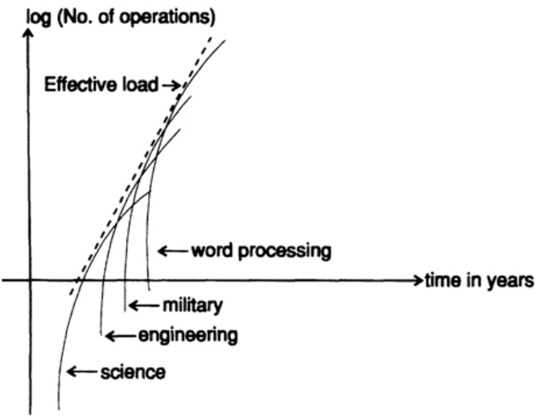  

What will come along to sustain this straight line logarithmic growth curve and prevent the inevitable flattening out of the Scurve of applications? The next big area is, I believe, pattern recognition. I doubt our ability to cope with the most general problem of pattern recognition, because for one thing it implies too much, but in areas like speech recognition, radar pattern recognition, picture analysis and redrawing, work load scheduling in factories and offices, analysis of data for statisticians, creation of virtual images, and such, we can consume a very large amount of computer power. Virtual reality computing will become a large consumer of computing power, and its obvious economic value assures us this will happen, both in the practical needs and in amusement areas. Beyond these is, I believe, Artificial Intelligence, which will finally get to the point where the delivery of what they have to offer will justify the price in computing effort, and will hence be another source of problem solving.  

We early began interactive computing. My introduction was via scientist named Jack Kane. He had, for that time, the wild idea of attaching a small Scientific Data Systems (SDS) 910 computer to the Brookhaven cyclotron where we used a lot of time. My V.P. asked me if Jack could do it, and when I examined the question (and Jack) closely I said I thought he could. I was then asked, “Would the manufacturing company making the machine stay in business?”, since the V.P. had no desire to get some unsupported machine. That cost me much more effort in other directions, and I finally made an appointment with the President of SDS to have a face to face talk in his office out in Los Angles. I came away believing, but more on that at a later date. So we did it, and I believed then, as I do now, that cheap, small SDS 910 machine at least doubled the effective productivity of the huge, expensive cyclotron! It was certainly one of the first computers which during a cyclotron run gathered, reduced, and displayed the gathered data on the face of a small oscilloscope (which Jack put together and made operate in a few days). This enabled us to abort many runs which were not quite right; say the specimen was not exactly in the middle of the beam, there was an effect near the edge of the spectrum and hence we had better redesign the experiment, something funny was going on, and we would need more detail here or there—all reasons to stop and modify rather than run to the end and then find the trouble.  

This one experience led us at Bell Telephone Laboratories to start putting small computers into laboratories, at first merely to gather, reduce, and display the data, but soon to drive the experiment. It is often easier to let the machine program the shape of the electrical driving voltages to the experiment, via a standard digital to analog converter, than it is to build special circuits to do it. This enormously increased the range of possible experiments, and introduced the practicality of having  interactive experiments . Again, we got the machine in under one pretext, but its presence in the long run changed both the problem and what the computer was actually used for. When you successfully use a computer you usually do an equivalent job, not the same old one. Again you see the presence of the computer, in the long run, changed the nature of many of the experiments we did.  

Boeing (in Seattle) later had a somewhat similar idea, namely they would keep the current status of a proposed plane design on a tape and everyone would use that tape, hence in the design of any particular plane all the parts of the vast company would be attuned to each other’s work. It did not work out as the bosses thought it would, and as they probably thought it did! I know, because I was doing a high level, two week snooping job for the Boeing top brass under the guise of doing a routine inspection of the computer center for a lower level group!  

The reason it did not work as planned is simple. If the current status of the design is on the tape (currently discs) and if you use the data during a study of, say, wing area, shape, and profile, then when you make a change in your parameters and you find an improvement it might have been due to a change someone else inserted into the common design and not to the change you made—which might have actually made things worse! Hence what happened in practice was each group, when making an optimization study, made a copy of the current tape, and used it without any updates from any other area. Only when they finally decided on their new design did they insert the changes—and of course they had to verify their new design meshed with the new designs of the others. You simply cannot use a constantly changing data base for an optimization study.  

This brings me to the topic of data bases. Computers were to be the savior in this area, and they are still occasionally invoked as if they would be. Certainly the airlines with their reservation systems is a good example of what can be done with computers—just think what a mess it would be when done by hand with all its many human errors, let alone the size of the troubles. The airlines now keep many data bases, including the weather. The weather and current airport delays are used to design the flight profile for each flight just before takeoff, and possibly change it during flight in view of later information.  

Company managers always seem to have the idea if only they knew the current state of the company in every detail then they could manage things better. So nothing will do but they must have a data base of all the company’s activities, always up to the moment. This has its difficulties as indicated above. But another thing; suppose you and I are both V.Ps of a company and for a Monday morning meeting we want exactly the same figures. You get yours from a program run on Friday afternoon, while I, being wiser and knowing over the weekend much information comes in from the outlying branches, wait until Sunday night and prepare mine. Clearly there could be significant differences in our two reports, even though we both used the same program to prepare them! That is simply intolerable in practice. Furthermore, most important reports and decisions should not be time sensitive to up to the minute data!  

How about a scientific data base? For example, whose measurement gets in? There is prestige in getting yours in, of course, so there will be hot, expensive, irritating conflicts of interest in that area. How will such conflicts be resolved? Only at high costs! Again, when you are making optimization studies you have the above problem; was it a change made in some physical constant you did not know happened which made the new model better than the old model? How will you keep the state of changes available to all the users? It is not sufficient to do it so the users must read all your publications every time they use the machine, and since they will not keep up to date errors will be made. Blaming the users will not undo the errors!  

I began mainly talking about general purpose computers, but I gradually took up discussing the use of a general purpose computer as a special purpose device to control things, such as the cyclotron and laboratory equipment. One of the main steps happened when someone in the business of making integrated circuits for people noted that if instead of making a special chip for each of several customers, he could make a four bit general purpose computer and then program it for each special job (INTEL 4004). He replaced a complex manufacturing job with a programming job, though of course the chip still had to be made, but now it would be a large run of the same four bit chips. Again this is the trend I noted earlier, going from hardware to software to gain the mass production of a variable product—always using the same general purpose computer. The four bit chip was soon expanded to 8 bit chips, then 16, etc. so now some chips have 64 bit computers on them!  

You tend not to realize the number of computers you interact with in the course of a day. Stop-and-go lights, elevators, washing machines, telephones which now have a lot of computers in them as opposed to my youth when there was always a cheerful operator at the end of every line waiting to be helpful and get the phone number your wanted, answering machines, automobiles controlled by computers under the hood are all examples of their expanding range of application—you have only to watch and note the universality of computers in your life. Of course they will further increase as time goes on—the same simple general purpose computer can do so many special purpose jobs it is seldom that a special purpose chip is wanted.  

You see many more special purpose chips around than there need be. One of the main reasons is there is a great ego satisfaction in having your own special chip and not one of the common herd. (I am repeating part of  Chapter 2 .) Before you make this mistake and use a special purpose chip in any equipment ask yourself a number of questions. Let me repeat the earlier arguments. Do you want to be alone with your special chip? How big a stock pile of them will you need in inventory? Do you really want to have a single, or a few, suppliers rather than being able to buy them on the open market? Will not the total cost be significantly higher in the long run?  

If you have a general purpose chip then all the users will tend to contribute, not only in finding flaws but having the manufacturer very willing to correct them; otherwise you will have to produce your own manuals, diagnostics, etc, and at the same time what others learn about their chips will seldom help you with your special one. Furthermore, with a general purpose chip then upgrades of the chip, which you can expect will sort of be taken care of mainly by others, will be available to you free of effort on your part. There will inevitably be a need for you to upgrade yours because you will soon want to do more than the original plan called for. In meeting this new need a general purpose chip with some excess capacity for the inevitable future expansion is much easier to handle.  

I need not give you a list of the applications of computers in your business. You should know better than I do your rapidly increasing use of computers, not only in the field but throughout your whole organization, from top to bottom, from far behind the actual manufacturing up to the actual production front. You should also be well aware of the steadily increasing rate of changes, upgrades, and the flexibility a general purpose symbol manipulating device gives to the whole organization to meet the constantly changing demands of the operating environment The range of possible applications has only begun, and many new applications need to be done—perhaps by you. I have no objections to   $10\%$   improvements of established things, but from you I also look for the great new things which make so much difference to your organization that history remembers them for at least a few years.  

As you go on in your careers you should examine the applications which succeed and those which fail; try to learn how to distinguish between them; try to understand the situations which produce successes and those which almost guarantee failure. Realize, as a general rule, it is not the same job you should do with a machine, but rather an equivalent one, and do it so then future, flexible, expansion can be easily added (if you do succeed). And always also remember to give serious thought to the field maintenance as it will actually be done in the field—which is generally not as you wish it would be done!  

The use of computers in society has not reached its end, and there is room for many new, important applications. They are easier to find than most people think! In the two previous chapters I ended with some remarks on the possible limitations of their topics, hardware and software. Hence I need to discuss some possible limitations of applications. This I will do in the next few chapters under the general title of Artificial Intelligence, AI.  

# 6 Artificial Intelligence—I  

Having examined the history of computer applications we are naturally attracted to an examination of their future limits, not in computing capacity but rather what  kinds  of things computers can and perhaps cannot do. Before we get too far I need to remind you computers manipulate  symbols,  not  information;  we are simply unable to say, let alone write a program for what we mean by the word “information”. We each believe we know what the word means, but hard thought on your part will convince you it is a fuzzy concept at best, you cannot give a definition which can be converted into a program.  

Although Babbage and Lady (Ada) Lovelace both considered slightly some of the limitations of computers, the exploration of the limits of computers really began in the late 1940s and early 1950s by, among others, Newell and Simon at RAND. For example they looked at puzzle solving, such as the classic cannibals and missionaries problem. Could machines solve them? And how would they do it? They examined the protocols people used as they solved such problems, and tried to write a program which would produce similar results. You should not expect exactly the same result as generally no two people reported exactly the same steps in the same order of their thought processes, rather the program was to produce a similar looking pattern of reasoning. Thus they tried to model the way people did such puzzles and examine how well the model produced results  resembling  human results, rather than just solve the problem.  

They also started the General Problem Solver (GPS) with the idea that given about 5 general rules for solving problems they could then give the details of the particular area of a problem and the computer program would solve the problem. It didn’t work too well, though very valuable by-products did come from their work such as  list processing . To continue with this problem solving approach they started, after their initial attack on general problem solving (which certainly promised to alleviate the programming problem to a fair extent) it was dropped, more or less, for a decade, and when revived the proposal was about 50 general rules would be needed. When that did not work, another decade and the proposal with 500 general rules, and another decade, now under the title of  rule based logic  and they are sometimes at 5000 rules, and I have even heard of 50,000 as the number of rules for some areas.  

There is now a whole area known as  Expert Systems . The idea is you talk with some experts in a field, extract their rules, put these rules into a program, and then you have an expert! Among other troubles with this idea is in many fields, especially in medicine, the world famous experts are in fact not much better than the beginners! It has been measured in many different studies! Another trouble is experts seem to use their subconscious and they can only report their conscious experience in making a diagnosis. It has been estimated it takes about 10 years of intensive work in a field to become an expert, and in this time many, many patterns are apparently laid down in the mind from which the expert then makes a subconscious initial choice of how to approach the problem as well as the subsequent steps to be used.  

In some areas rule based logic has had spectacular successes, and in some apparently similar areas there were plain failures, which indicates success depends on a large element of luck; they still do not have a firm basic understanding of when the method of rule based logic will or will not work, nor how well it will work.  

In  Chapter 1 , I already brought up the topic that perhaps everything we “know”  cannot  be put into words (instructions)— cannot in the sense of impossible and not in the sense we are stupid or ignorant. Some of the features of Expert Systems we have found certainly strengthen this opinion.  

After quite a few years the field of the limits of intellectual performance by machines acquired the dubious title of  Artificial   Intelligence  (AI), which does  not  have a single meaning. First, it is a variant on the question,  

# Can Machines Think?  

While this is a more restricted definition than is artificial intelligence, it has a sharper focus and is a good substitute in the popular mind. This question is important to you because if you believe computers cannot think then as a prospective leader you will be slow to use computers to advance the field by your efforts, but if you believe of course computers can think then you are very apt to fall into a first class failure! Thus you cannot afford to either believe or disbelieve—you must come to your own terms with the vexing problem, “To what extent can machines think?”  

Note, first, it really is mis-stated—the question seems to be more, “Can we write programs which will produced ‘thinking’ from a von Neumann type machine?” The reason for the hedge is there are arguments that modern neural nets, when not simulated on a digital computer, might be able to do what no digital computer can do. But then again they might not. It is a problem we will look into at a later stage when we have more technical facts available.  

While the problem of AI can be viewed as, “Which of all the things humans do can machines also do?” I would prefer to ask the question in another form, “Of all of life’s burdens, which are those machines can relieve, or significantly ease, for us?” Note while you tend to automatically think of the material side of life, pacemakers are machines connected directly to the human nervous system and help keep many people alive. People who say they do not want their life to depend on a machine seem quite conveniently to forget this. It seems to me in the long run it is on the intellectual side of life that machines can most contribute to the quality of life.  

Why is the topic of artificial intelligence important? Let me take a specific example of the need for AI. Without defining things more sharply (and without defining either  thinking  or  what a machine is  there can be no real proof one way or the other), I believe very likely in the future we will have vehicles exploring the surface of Mars. The distance between Earth and Mars at times may be so large the signaling time round trip could be 20 or more minutes. In the exploration process the vehicle must, therefore, have a fair degree of local control. When having passed between two rocks, turned a bit, and then found the ground under the front wheels was falling away, you will want prompt, “sensible” action on the part of the vehicle. Simple, obvious things like backing up will be inadequate to save it from destruction, and there is not time to get advice from Earth; hence some degree of “intelligence” should be programmed into the machine.  

This is not an isolated situation; it is increasingly typical as we use computer driven machines to do more and more things at higher and higher speeds. You cannot have a human backup— often because of the boredom factor which humans suffer from. They say piloting a plane is hours of boredom and seconds of sheer panic—not something humans were designed to cope with, though they manage to a reasonable degree. Speed of response is often essential. To repeat an example, our current fastest planes are basically unstable and have computers to stabilize them, millisecond by millisecond, which no human pilot could handle; the human can only supply the strategy in the large and leave the details in the small to the machine.  

I earlier remarked on the need to get at least some understanding of what we mean by “a machine” and by “thinking”. We were discussing these thing at Bell Telephone Laboratories in the late 1940s and some one said a machine could not have organic parts, upon which I said the definition excluded any wooden parts! The first definition was retracted, but to be nasty I suggested in time we might learn how to remove a large part of a frog’s nervous system and keep it alive. If we found how to use it for a storage mechanism, would it be a machine or not? If we used it as an a content addressable storage how would you feel about it being a “machine”?  

In the same discussion, on the thinking side, a Jesuit trained engineer gave the definition, “Thinking is what humans can do and machines cannot do”. Well, that solves the problem once and for all, apparently. But do you like the definition? Is it really fair? As we pointed out to him then, if we start with some obvious difference at present then with improved machines and better programming we may be able to reduce the difference, and it is not clear in the long run there would be any difference left.  

Clearly we need to define “thinking”. Most people want the definition of thinking to be such that they can think but stones, trees, and such things, cannot think. But people vary to the extent they will or will not include the higher levels of animals. People often make the mistake of saying, “Thinking is what Newton and Einstein did.” but by that definition most of us cannot think—and usually we do not like that conclusion! Turing, in coping with the question in a sense evaded it and made the claim that if at the end of one teletype line there was a human and at the end of another teletype line there was a suitably programmed machine, and if the average human could not tell the difference then that was a proof of “thinking” on the part of the machine (program).  

The Turing test is a popular approach, but it flies in the face of the standard scientific method which starts with the easier problems before facing the harder ones. Thus I soon raised the question with myself, “What is the smallest or close to the smallest program I would believe could think?” Clearly if the program were divided into two parts then neither piece could think. I tried thinking about it each night as I put my head on the pillow to sleep, and after a year of considering the problem and getting nowhere I decided it was the wrong question! Perhaps “thinking” is not a yes-no thing, but maybe it is a matter of degree.  

Let me digress and discuss some of the history of chemistry. It was long believed organic compounds could only be made by living things, there was a  vitalistic  aspect in living things but not in inanimate things such as stones and rocks. But around 1823 a chemist named Wohler synthesized urea, a standard by-product of humans. This was the beginning of making organic compounds in test tubes. Still, apparently even as late as 1850, the majority of chemists were holding to the  vitalistic  theory that only living things could make organic compounds. Well, you know from that attitude we have gone to the other extreme and now most chemists believe in principle  any  compound the body can make can also be made in the lab—but of course there is no proof of this, nor could there ever be. The situation is they have an increasing ability to make organic compounds, and see no reason they cannot make any compound which that can exist in Nature as well as many which do not. Chemists have passed from the  vitalistic  theory of chemistry to the opposite extreme of a  non-vitalistic  theory of chemistry.  

Religion unfortunately enters into discussions of the problem of machine thinking, and hence we have both vitalistic and non-vitalistic theories of “machines vs. humans”. For the Christian religions their Bible says, “God made Man in His image”. If we can in turn create machines in our image then we are in some sense the equal of God, and this is a bit embarrassing! Most religions, one way or the other, make man into more than a collection of molecules, indeed man is often distinguished from the rest of the animal world by such things as a soul, or some other property. As to the soul, in the Late Middle Ages some people, wanting to know when the soul departed from the dead body, put a dying man on a scale and watched for the sudden change in weight—but all they saw was a slow loss as the body decayed—apparently the soul, which they were sure the man had, did not have material weight.  

Even if you believe in evolution, still there can be a moment when God, or the gods, stepped in and gave man special properties which distinguish him from the rest of living things. This belief in an essential difference between man and the rest of the world is what makes many people believe machines can never, unless we ourselves become like the gods, be the same as a human in such details as thinking, for example. Such people are forced, like the above mentioned Jesuit trained engineer, to make the definition of thinking to be what machines cannot do. Usually it is not so honestly stated as he did, rather it is disguised somehow behind a facade of words, but the intention is the same!  

Physics regards you as a collection of molecules in a radiant energy field and there is, in strict physics, nothing else . Democritus (b. around   $460\;\mathrm{B.C.}$  ) said in ancient Greek times, “All is atoms and void”. This is the stance of the  hard AI  people; there is no essential difference between machines and humans, hence by suitably programming machines then machines can do anything humans can do. Their failures to produce thinking in significant detail is, they believe, merely the failure of programmers to understand what they are doing, and not an essential limitation.  

At the other extreme of the AI scale, some of us, when considering our own feelings, believe we have self-awareness  and  self consciousness —though we are not able to give satisfactory tests to prove these things exist. I can get a machine to print out, “I have a soul”, or “I am self-aware.”, or “I have self- consciousness.”, and you would not be impressed with such statements from a machine. But from humans you are inclined to give greater credence to such remarks, based on the belief that you, by introspection, feel you have such properties (things), and you have learned by long experience in life other humans are similar to you—though clearly racism still exists which asserts there are differences—me being always the better person!  

We are at a stalemate at this point in the discussion of AI; we can each assert as much as we please, but it proves nothing at all to most people. So let us turn to the record of AI successes and failures.  

AI people have always made extravagant claims which have not been borne out—not even closely in most cases. Newell and Simon in 1958 predicted in 10 years the next world champion in chess would be a computer program. Unfortunately similar, as yet unrealized, claims have been made by most of the AI leaders in the public eye. Still, startling results have been produced.  

I must again digress, this time to point out why game playing has such a prominent role in AI research. The rules of a game are clear beyond argument, and success or failure are also—in short, the problem is well defined in any reasonable sense. It is not that we particularly want machines to play games, but they provide a very good testing ground of our ideas on how to get started in AI.  

Chess, from the beginning, was regarded as a very good test since it was widely believed at that time chess requires thinking  beyond any doubt . Shannon proposed a way of writing chess playing programs (we call them chess playing machines but it is really mainly a matter of programming). Los Alamos, with a primitive MANIAC machine tried   $6{\times}6$   chess boards, dropping the two bishops on each side, and got moderate results. We will return to the history of chess playing programs later.  

Let us examine how one might write a program for the much simpler game of three dimensional tic-tac- toe. We set aside simple two dimensional tic-tac-toe since it has a known strategy for getting a draw, and there is no possibility of win against a prudent player. Games which have a known strategy of playing simply are not exhibiting thinking—so we believe at the moment.  

As you examine the  $4{\times}4{\times}4$   cube there are 64 squares, and 76 straight lines through them. Any one line is a  win  if you can get all four of the positions filled with your pieces. You next note the 8 corner locations, and the 8 center locations, all have more lines through them than the others; indeed there is an inversion of  

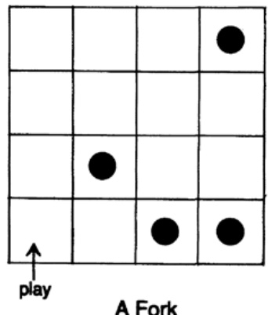  

the cube such that the center points go to the corners and the corners go to the center while preserving all straight lines—hence a duality which can be exploited if you wish.  

For a program to play   $4{\times}4{\times}4$   tic-tac-toe it is first necessary to pick legal moves. Then in the opening moves you tend to place your pieces on these “hot” spots, and you use a random strategy since otherwise, since if you play a standard game then the opponent can slowly explore it until a weakness is uncovered which can be systematically exploited. This use of randomness, when there are essentially indifferent moves, is a central part of all game playing programs.  

We next formulate some rules to be applied sequentially.  

1. If you have 3 men on a line and it is still “open” then play it and win. 2. If you have no immediate win, and if the opponent has 3 men on a line, then you must block it. 3. If you have a fork ( Figure 6.I ), take it since then on the next move you have a win, as the opponent cannot win in one move. 4. If the opponent has a fork you must block it.  

After this there are apparently no definite rules to follow in making your next move. Hence you begin to look for “forcing moves”, ones which will get you to some place where you have a winning combination. Thus 2 pieces on an “open” line means you can place a third and the opponent will be forced to block the line (but you must be careful that the blocking move does not produce three in a line for the opponent and force you to go on the defensive). In the process of making several forcing moves you may be able to create a fork, and then you have win! But these rules are vague.  Forcing moves which are on “hot” places and where the opponent’ s defense must be on a “cool” places seem to favor you, but does not guarantee a win. In starting a sequence of forcing moves, if you lose the initiative, then almost certainly the opponent can start a sequence of forcing moves on you and gain a win. Thus when to go on the attack is a touchy matter; too soon and you lose the initiative, too late and the opponent starts and wins. It is not possible, so far as I know to give an exact rule of when to do so.  

This is the standard structure of a program to play a game on a computer. Programs must first require you check the move is legal before any other step, but this is a minor detail. Then there is usually a set of more or less formal rules to be obeyed, followed by some much vaguer rules. Thus a game program has a lot of heuristics  in it (heuristic—to invent or discover), moves which are plausible and likely to lead you to a win, but are  not  guaranteed to do so.  

Early in the field of AI Art Samuel, then at IBM, wrote a checker playing program, checkers being thought to be easier than chess which had proved to be a real stumbling block. The formula he wrote for playing checkers had a large number of rather arbitrary parameters in the weighting functions for making decisions, such as for control of the center, passed pieces, kings, mobility, pinned pieces, etc. Samuel made a copy of the program and then slightly altered one (or more) of these parameters. Then he made one formula play, say, ten games against the other, and the formula which won the most games was clearly (actually only probably) the better program. The machine went on perturbing the same parameters until it came to a local optimum, where upon it shifted to other parameters. Thus it went around and around, repeatedly using the same parameters, gradually emerging with a significantly better checker playing program—certainly much better than was Samuel himself. The program even beat a Connecticut State checker champion!  

Is it not fair to say, “The program learned from experience”? Your immediate objection is there was a program telling the machine how to learn. But when you take a course in Euclidean geometry is not the teacher putting a similar learning program into you? Poorly, to be sure, but is that not, in a real sense, what a course in geometry is all about? You enter the course and cannot do problems; the teacher puts into you a program and at the end of the course you can solve such problems. Think it over carefully. If you deny the machine learns from experience because you claim the program was told (by the human programmer) how to do improve its performance, then is not the situation much the same with you, except you are born with a somewhat larger initial program compared to the machine when it leaves the manufacturer’s hands? Are you sure you are not merely “programmed” in life by what by chance events happen to you?  

We are beginning to find not only is intelligence not adequately defined so arguments can be settled scientifically, but a lot of other associated words like, computer, learning, information, ideas, decisions (hardly a mere branching of a program, though branch points are often called decision points to make the programmers feel more important), expert behavior—all are a bit fuzzy in our minds when we get down to the level of testing them via a program in a computer. Science has traditionally appealed to experimental evidence and not idle words, and so far science seem to have been more effective than philosophy in improving our way of life. The future can, of course, be different.  

In this chapter we have “set the stage” for a further discussion of AI. We have also claimed it is not a topic you can afford to ignore. Although there seems to be no hard, factual results, and perhaps there can never be since the very words are ill-defined and are open to modification and various interpretations, still you must come to grips with it. In particular, when a program is written which does meet some earlier specification for a reasonable test of computer learning, originality, creativity, or intelligence, then it is promptly seen by many people the test had a mechanical solution. This is true even if random numbers are involved, and given the same test twice the machine will get a solution which differs slightly from the earlier one, much as humans seldom play exactly the same game of chess twice in a row. What is a reasonable, practical test of machine learning? Or are you going to claim, as the earlier cited Jesuit trained engineer did, by definition learning, creativity, originality, and intelligence are what machines cannot do? Or are you going to try to hide this blatant statement and conceal it in some devious fashion which does not really alter the situation?  

In a sense you will never really grasp the whole problem of AI until you get inside and try your hand at finding what you mean and what machines can do. Before the checker playing program which learned was exposed in simple detail, you probably thought machines could not learn from experience—now you may feel what was done was not learning but clever cheating, though clearly the program modified its behavior depending on its experiences.  You   must struggle with your own beliefs if you are to make any progress in understanding the possibilities and limitations of computers in the   intellectual area.  To do this adequately you must formalize your beliefs and then criticize them severely, arguing one side against the other, until you have a fair idea of the strengths and weakness of both sides. Most students start out anti-AI; some are proAI; and if you are either one of these then you must try to undo your biases in this important matter. In the next chapter we will supply more surprising data on what machines have done, but you must make up your own mind on this important topic. False beliefs will mean you will not participate significantly in the inevitable and extensive computerization of your organization and society generally. In many senses the computer revolution has only begun!  

# 7 Artificial Intelligence—II  

In this book we are more concerned with the aid computers can give us in the intellectual areas than in the more mechanical areas, for example, manufacturing. In the mechanical area computers have enabled us to make better, preferable, and cheaper products, and in some areas they have been essential, such as space flights to the moon which could hardly be done without the aid of computers. AI can be viewed as complementary to robotics—it is mainly concerned with the intellectual side of the human rather than the physical side, though obviously both are closely connected in most projects.  

Let us start again and return to the elements of machines and humans. Both are built out of atoms and molecules. Both have organized basic parts; the machine has, among other things, two state devices both for storage and for gates, while humans are built of cells. Both have larger structures, arithmetic units, storage, control, and I/O for machines, and humans have bones, muscles, organs, blood vessels, nervous system, etc.  

But let us note some things carefully.  From large organizations   new effects can arise.  For example we believe there is no friction between molecules, but most large structures show this effect—it is an effect which arises from the  organization  of smaller parts which do not show the effect.  

We should also note often when we engineer some device to do the same as Nature does, we do it differently. For example, we have airplanes which, generally, use fixed wings (or rotors), while birds mainly flap their wings. But we also do a different thing-we fly much higher and certainly much faster than birds can. Nature never invented the wheel, though we use wheels in many, many ways. Our nervous system is comparatively slow and signals with a velocity of around a few hundred meters per second, while computers signal at around 186,000 miles per second.  

A third thing to note, before continuing with what AI has accomplished, is the human brain has many, many components in the form of nerves interconnected with each other. We want to have the definition of “thinking” to be something the human brain can do. With past failures to program a machine to think, the excuse is often given that the machine was not big enough, fast enough, etc. Some people conclude from this if we build a big enough machine then automatically it will be able to think! Remember, it seems to be more the problem of writing the program than it is building a machine, unless you believe, as with friction, enough small parts— will produce a new effect—thinking from non-thinking parts. Perhaps that is all thinking really is! Perhaps it is not a separate thing, it is just an artifact of largeness. One cannot flatly deny this as we have to admit we do not know what thinking really is.  

Returning again to the past accomplishments of AI. There was a geometry proving routine which proved theorems in classical school geometry much as you did when you took such a course. The famous theorem “If two sides of a triangle are equal then the base angles are also equal.” was given to the program, Figure 7.I . You would probably bisect the top angle, and go on to prove the two parts are congruent triangles, hence corresponding angles are equal. A few of you might bisect the third side, and draw the line to the opposite angle, again getting two congruent triangles. The proof the machine produced used no  

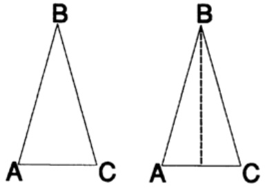  

constructions but compared triangle ABC with triangle CBA, and then proved the selfcongruence, hence equal angles.  

Anyone looking at that proof will admit it is elegant, correct, and surprising. Indeed, the people who wrote the geometry proving program did not know it, nor was it widely known, though it is a footnote in my copy of Euclid. One is inclined to say the program showed “originality”. The result was the program apparently showed “novelty” not put into the program by the designers; the program showed “creativity”; and all those sorts of good things.  

A bit of thinking will show the programmers gave the instructions in the program to first try to prove the given theorem, and then when stuck try drawing auxiliary lines. If that had been the way you were taught to do geometry then more of you would have found the above elegant proof. So, in a sense, it was programmed in. But, as I said before, what was the course in geometry you were taught except trying to load a program into you? Inefficiently, to be sure. That is the way with humans, but with machines it is clean, you just put the program in once and for all, and you do not need to endlessly repeat and repeat, and still have things forgotten!  

Did Samuel’s checker playing program show originality when it made surprising moves and defeated the State Checker Champion? If not, can you show you have originality? Just what is the test you will use to separate you from a computer program?  

One can claim the checker playing program “learned” and the geometry theorem proving program showed “creativity”, “originality”,   or what ever you care to call it. They are but a pair of examples of many similar programs which have been written. The difficulty in convincing you the programs have the claimed properties is simply once a program exists to do something you  immediately  regard what is done as involving nothing other than a rote routine, even when random numbers obtained from the real world are included in the program. Thus we have the paradox; the existence of the program automatically turns you against believing it is other than a rote process. With this attitude, of course, the machine can never demonstrate it is more than a “machine” in the classical sense, there is no way it can demonstrate, for example, it can “think”.  

The hard AI people claim man is only a machine and nothing else, and hence anything humans can do in the intellectual area can be copied by a machine. As noted above, most readers, when shown some result from a machine automatically believe it cannot be the human trait that was claimed. Two questions immediately arise. One, is this fair? Two, how sure are you, you are not just a collection of molecules in a radiant energy field and hence the whole world is merely molecule bouncing against molecule? If you believe in other (unnamed, mysterious) forces how do they affect the motion of the molecules, and if they cannot affect the motion then how can they affect the real world? Is physics complete in its description of the universe, or are there unknown (to them) forces? It is a hard choice to have to make. [Aside: At the moment (1994) it is believed that   $90\%$   to  $99\%$   of the Universe is the so-called  dark   matter  of which physics knows nothing except its gravitational attraction.]  

We now shift to some actual applications of computers in more cultural situations. Early in the Computer Revolution I watched Max Mathews and John R.Pierce at Bell Telephone Laboratories deal with music from computers. It will be clear later, if you do not know it now, once you decide how high a frequency you want to reproduce then the sampling rate is determined. Humans can hear up to about 18,000 cycles per second at best and then only when young; adults use a telephone at less than 8000 cycles per second and can generally recognize a voice almost at once. The quantizing of the sound track which represents the music (and no matter how many musical instruments there are there is a single sound track amplitude), does not introduce much further distortion. Hence, so the reasoning went, we can have the computer compute the height of a sound track at each time interval, put the number out as a voltage, pass it through a smoothing filter, and have the corresponding “music”. A pure tone is easy, just a sine curve. Combinations of frequencies determine the sound of a single instrument, with its “attack” (meaning how the frequencies grow in amplitude as the note starts, and the decay later on), and other features. With a number of different instruments programmed, you can then supply the notes and have the sound of the music written out on the tape for later playing. You do not have to compute the numbers in real time, the computer can go as slowly as needed, and not even at a constant rate, but when the numbers are put on the tape and played at a uniform rate then you get the “music”.  

But why supply the notes? Why not have the computer also “compose?” There are, after all, many “rules of composition”. And so they did, using the rules, and when there were choices they used random numbers to decide the next notes. At present we have both computer composed and computer played music; you hear a lot of it in commercials over radio and TV. It is cheaper, more controlled, and can make sounds which no musical instrument at present can make. Indeed, any sound which can appear on a sound track can be produced by a computer.  

Thus in a sense, computers are the ultimate in music. Except for the trivial details (of sampling rate and number of levels of quantization, which could be increased if you wanted to pay the price), the composers now have available any sound which can exist, at any rates, in any combinations, tempos, and intensities they please. Indeed, at present the “highest quality recording of music” is digital. There can be no future significant technical improvements. It is now clearly a matter of what sounds are worth producing, not what can be done. Many people now have digitally recorded music players and they are regarded as being far better than the older analog machines.  

The machine also provides the composer with more immediate feedback to hear what was composed. Before this, the composer had often to wait years and years until fame reached out and the music composed earlier was first heard in real life rather than only in the imagination. Hence the composer can now develop a style at a much more rapid pace. From reading an issue of a Journal devoted to computer music I get the impression a fairly elaborate computer setup is common equipment for today’s composers of music, there are many languages for them to use, and they are using a wide variety of approaches to creating music in a combined human-machine effort.  

The conductor of music now also has much more control. In the past the conductor when making a recording tried to get the best from the musicians, and often several takings were spliced to get the best recording they could, including “mixing” of the various microphone recordings. Now the conductor can get exactly what is wanted, down to the millisecond timing, fraction of a tone, and other qualities of the individual instruments being simulated. All the all too human musicians do not have to be perfect at the same time during a passage.  

Here you see again the effects of computers and how they are pushing us from the world of things into the world of ideas, and how they are supplementing and extending what humans can do.  

This is the type of AI that I am interested in—what can the human and machine do together, and not in the competition which can arise. Of course robots will displace many humans doing routine jobs. In a very real sense, machines can best do routine jobs thus freeing humans for more humane jobs. Unfortunately, many humans at present are not equipped to compete with machines— they are unable to do much more than routine jobs. There is a widespread belief (hope?) humans can compete, once they are given proper training. However, I have long publicly doubted you could take many coal miners and make them into useful programmers. I have my reservations on the fraction of the human population who can be made into programmers in the classical sense; if you call getting money from a bank dispensing “machine programming”, or the dialing of a telephone number (both which apply the human input to an elaborate program which is then executed much like an interpreter acts on your program input) then of course most people can be made into programmers. But if you mean the more classical activity of careful analysis of a situation and then the detailed specification as to what is to be done, then I say there are doubts as to what fraction of the population can  compete  with computers, even with nice interactive prompting menus.  

Computers have both displaced so many people from jobs, and also made so many new jobs it is hopeless to try to answer which is the larger number. But it is clear that on the average it is the lower level jobs which are disappearing and the higher level jobs which are appearing. Again, one would like to believe  most people can be trained in the future to the higher level jobs—but that is a hope without any real evidence.  

Besides games, geometry, and music we have algebra manipulating programs—they tend to be more “directed” programs than “self-standing” programs, that is they depend on humans for guidance at various stages of the manipulation. At first it is curious we could build a self-standing geometry program but apparently can not do the same easily for algebra.  Simplification  is one of the troubles. You may not have noticed when you took an algebra course and you were to told “to simplify an expression” you were probably not given an explicit rule for “simplification”—and if you were then the rule was obviously ridiculous. For example, at least one version of the “new math” said  

$$
{\frac{1}{\surd x}}+{\frac{1}{\surd y}}
$$  

is not simplified but  

$$
\frac{\sqrt{x y}[\sqrt{x+\sqrt{y}}]}{x y}
$$  

is simplified!  

We constantly use the word “simplify”, but its meaning depends on what you are going to do next, and there is no uniform definition. Thus, if in the calculus you are going to integrate next, you break things up into small pieces, but at other times you try to combine the parts into nice product or quotient expressions.  

A similar “guidance by human” interacting program has been developed for the synthesis of chemical compounds. It has been quite useful as it gives: (1) the possible routes to the synthesis, (2) the costs, (3) the times of the reactions along the way, and (4) the effective yields. Thus the programmer using it can explore many various ways of synthesizing a new compound, or re-explore old ones to find new methods now the costs of the materials and processes have changed from what they were some years ago.  

Much of the medical measurement of blood samples, etc. has gone to machine analysis rather than using unreliable humans looking through microscopes. It is faster, more reliable and more cost effective in most cases. We could go further in medicine and do medical diagnosis by machines, thus replacing doctors. Indeed, in this case it is apt to be the machine which is prompting the doctor during the diagnosis! There have long been on the market self-diagnosis kits for some diseases. That is nothing new. It is merely the going farther and prescribing the treatment that bothers people.  

We know doctors are human and hence unreliable, and often in the case of rare diseases the doctor may never have seen a case before, but a machine does not forget and can be loaded with all the relevant diseases. Hence from the symptoms the program can either diagnose or call for further tests to establish the probable disease. With probabilities programmed in (which can adjust rapidly for current epidemics), machines can probably do better in the long run than can the average, or even better than the average doctor — and it is the average doctors who must be the ones to treat most people! The very best doctors can personally treat (unaided by machines) only very few of the whole population.  

One major trouble is, among others, the legal problem. With human doctors so long as they show “due prudence” (in the legal language), then if they make a mistake the law forgives them—they are after all only human (to err is human). But with a machine error whom do you sue? The machine? The programmer? The experts who were used to get the rules? Those who formulated the rules in more detail? Those who organized them into some order? Or those who programmed these rules? With a machine you can prove by detailed analysis of the program, as you cannot prove with the human doctor, that there was a mistake, a wrong diagnosis. Hence my prediction is you will find a lot of  computer assisted diagnosis  made by doctors, but for a long time there will be a human doctor at the end between you and the machine. We will slowly get personal programs which will let you know a lot more about how to diagnose yourself but there will be legal troubles with such programs. For example, I doubt you will have the authority to prescribe the needed drugs without a human doctor to sign the order. You, perhaps, have already noted all the computer programs you buy explicitly absolve the sellers from any, and I mean  any  responsibility for the product they sell! Often the legal problems of new applications are the main difficulty, not the engineering!  

If you have gone to a modern hospital you have seen the invasion of computers—the field of medicine has been very aggressive in using computers to do a better, and better job. Better, in cost reduction, accuracy, and speed. Because medical costs have risen dramatically in recent years you might not think so, but it is the elaboration of the medical field which has brought the costly effects that dominate the gains in lower costs the computers provide. The computers do the billing, scheduling, and record keeping for the mechanics of the hospital, and even private doctors are turning to computers to assist them in their work. To some extent the Federal bureaucracy is forcing them to do so to cope with the red tape surrounding the field.  

In many hospitals computers monitor patients in the emergency ward, and sometimes in other places when necessary. The machines are free from boredom, rapid in response, and will alert a local nurse to do something promptly. Unaided by computers it is doubtful full time nurses could equal the combination of computer and nurse.  

In Mathematics, one of the earliest programs (1953) which did symbol manipulation was a formal differentiation program to find higher derivatives. It was written so they could find the first 20 terms of a power series of a complicated function. As you ought to know from the calculus, differentiation is a simple formal process with a comparatively few rules. At the time you took the course it must have seemed to be much more than that, but you were probably confusing the differentiation with the later necessary simplification and other manipulations of the derivatives. Another very early abstract symbol manipulation program was coordinate changing—needed for guided missiles, radars, etc. There is an extra degree of freedom in all radars so the target cannot fly over the end of an axis of rotation and force the radar to slew   $180^{\circ}$   to track it. Hence coordinate transformations can be a bit messier than you might think.  

Slagle, a blind scientist, wrote (in a thesis at MIT, 1961) a program which would do analytical integration much as you did in the calculus course. It could compete with the average undergraduate engineer at MIT, in both the range of integrals it could do and in the cost of doing them. Since then we have had much improvement, and there is supposed to be a program based on the famous Risch algorithm that is supposed to find any integral which can be done in closed form, but after years of waiting and waiting I have not seen it. There are, they tell me, integration programs which will get the closed form answer or else prove it cannot exist.  

In the form of robots the computers have invaded production lines of hard goods as well as drugs, etc. Computers are now assembled by robots which are driven by computers, and the integrated circuit chips the computers are built of are designed mainly by computers with some direction from humans. No human mind could go reliably through the layout of more than a million transistors on a chip; it would be a hopeless task. The design programs clearly have some degree of artificial intelligence. In restricted areas, where there can be no surprises, robots are fairly effective, but where unexpected things can happen then simple robots are often in serious trouble. A routine response to nonroutine situations can spell disaster.  

An obvious observation for the Navy, for example; if on a ship you are going to have mobile robots (and you need not have all of your robots mobile) then running on rails from the ceiling will mean things which fall to the deck will not necessarily give trouble when both the robot and the ship are in violent motion. That is another example of what I have been repeatedly saying, when you go to machines you do an equivalent job, not the same one. Things are bound to be on the deck where they are not supposed to be, having fallen there by accident, by carelessness, by battle damage, etc, and having to step over, or around, them is not as easy for a robot as for a human.  

Another obvious area for mobile robots is in  damage control . Robots can stand a much more hostile environment, such as a fire, than can humans, even when humans are clothed in asbestos suits. If in doing the job rapidly some of the robots are destroyed it is not the same as dead humans. The Navy now has remote controlled mine sweepers because when you lose a ship you do not lose a human crew. We regularly use robot control when doing deep sea diving, and we have unmanned bombers these days.  

Returning to chess as played by machines. The programs have been getting steadily more effective and it appears to be merely a matter of time until machines can beat the world chess champion. But in the past the path to better programs has been mainly through the detailed examination of possible moves projected forward many steps rather than by understanding how humans play chess. The computers are now examining millions of board positions per second, while humans typically examine maybe 50 to 100 at most before making a move—so they report when they are supposed to be cooperating with the psychologists. That, at least is what they think they think—what the human mind actually does when playing chess is another matter! We really do not know!  

In other games machines have been more successful. For example, I am told a backgammon playing program beat all the winners of a contest held recently in Italy. But some simple games, like the game of Go, simple in the rules only, remain hard to program a machine to play a first class game.  

To summarize, in many games and related activities machines have been programmed to play very well, in some few games only poorly. But often the way the machine plays may be said “to solve the problem by volume of computations”, rather than by insight— whatever “insight” means! We started to play games on computers to study the human thought processes and not to win the game; the goal has been perverted to win, and never mind the insight into the human mind and how it works.  

Let me repeat myself, artificial intelligence is not a subject you can afford to ignore; your attitude will put you in the front or the rear of the applications of machines in your field, but also may lead you into a really great fiasco!  

This is probably the place to introduce a nice distinction between  logical  and  psychological  novelty. Machines do not produce logical novelty when working properly, but they certainly produce psychological novelty—programmers are constantly being surprised by what the program they wrote actually does! But can you as a human produce logical novelty? A careful examination of people’s reports on their great discoveries often shows they were led by past experiences to finding the result they did. Circumstances led them to success; psychological but not logical novelty. Are you not prepared by past experiences to do what you do, to make the discoveries you do? Is logical novelty actually possible?  

Do not be fooled into thinking that psychological novelty is trivial. Once the postulates, definitions, and the logic are given, then all the rest of mathematics is merely psychologically novel—at that level there is in all of mathematics technically no logical novelty!  

There is a common belief, if we appeal to a random source of making decisions then we escape the vicious circle of molecule banging against molecule, but from whence comes this external random source except the material world of molecules?  

There is also the standard claim a truly random source contains all knowledge. This is based on a variant of the monkeys and the typewriters story. Ideally you have a group of monkeys sitting at typewriters and at random times they hit random keys. It is claimed in time one of them will type all the books in the British Museum in the order in which they are on the shelves! This is based on the argument that sooner or later a monkey will hit the right first key; indeed in infinite time this will happen infinitely often. Among these infinite number of times there will be some (an infinite number) in which the next key is hit correctly. And so it goes; in the fullness of infinite time the exact sequence of key strokes will occur.  

This is the basis for the claim, all of knowledge resides in a truly random source, and you can get it easily if  you can write a program to recognize “information”. For example, sooner or later the next theory of physics will occur in the random stream of noise, and if you can recognize it you will have filtered it out of the stream of random numbers! The logic of the situation is inescapable—the reality is hardly believable! The times to wait are simply too long, and in truth you cannot always recognize “'information” even when you see it.  

There is an old claim, “free will” is a myth,  in a given circumstance you being you as you are at the moment you can only do as you   do . The argument sounds cogent, though it flies in the face of your belief you have free will. To settle the question, What experiment would you do? There seems to be no satisfactory experiment which can be done. The truth is we constantly alternate between the two positions in our behavior. A teacher has to believe if only the right words were said then the student would have to understand. And you behave similarly when raising a child. Yet the feeling of having free will is deep in us and we are reluctant to give it up for ourselves—but we are often willing to deny it to others!  

As another example of the tacit belief in the lack of free will in others, consider when there is a high rate of crime in some neighborhood of a city many people believe the way to cure it is to change the environment—hence the people will have to change and the crime rate will go down!  

These are merely more examples to get you involved with the question of, “Can machines think?”  

Finally,  perhaps thinking should be measured not by what you do but   how you do it . When I watch a child learning how to multiply two, say three digit, numbers, then I have the feeling the child is thinking; when I do the same multiplication I feel I am more doing “conditioned responses”; when a computer does the same multiplication I do not feel the machine is thinking at all. In the words of the old song, “It ain’t what you do, it’s the way that you do it”. In the area of thinking maybe we have confused what is done with the way it is done, and this may be the source of much of our confusion in AI.  

The hard AI people will accept only what is done as a measure of success, and this has carried over into many other people’s minds without carefully examining the facts. This belief, “the results are the measure of thinking”, allows many people to believe they can “think” and machines cannot, since machines have not as yet produced the required results.  

The situation with respect to computers and thought is awkward. We would like to believe, and at the same time not believe, machines can “think”. We want to believe because machines could then help us so much in our mental world; we want to not believe to preserve our feeling of self-importance. The machines can defeat us in so many ways, speed, accuracy, reliability, cost, rapidity of control, freedom from boredom, bandwidth in and out, ease of forgetting old and learning new things, hostile environments, and personnel problems, that we would like to feel superior in some way to them—they are, after all, our own creations! For example, if machine programs could do a significantly better job than the current crop of doctors, where would that leave them? And by extension where would we be left?  

Two of the main sticky points are: (1) if a machine does it then it must be an algorithm and cannot be thinking, and (2) on the other hand how do we escape the molecule banging against molecule we apparently are—by what forces do our thinking, our self-awareness, and our self-consciousness affect the paths of the molecules?  

In two previous chapters I closed with estimates of the limits of both hardware and software, but in these two chapters on AI I can do very little. We simply do not know what we are talking about; the very words are not defined, nor do they seem definable in the near future. We have also had to use language to talk about language processing by computers, and the recursiveness of this makes things more difficult and less sure. Thus the limits of applications, which I have taken to be the general topic of AI, remain an open question, but one which is important for your future career. Thus AI requires your careful thought and should not be dismissed lightly just because many experts make obviously false claims.  

# 8 Artificial Intelligenc—III  

I suggest you pause and have two discussion with yourself on the topic,  

Can Machines Think?  

and review why it is important to come to your own evaluation of what machines can and cannot do in your future. Consider the following list of observations:  

1. Just because computers have not yet been programmed to think does not mean they cannot think; it may mean programmers are stupid! 2. Just because you want to believe that machines can think does not mean they can; it may only be wishful thinking! 3. Art Samuel’s checker program “learned” from experience so machines can  apparently  learn from experience. 4. The new proof in the isosceles triangle theorem showed “originality”—perhaps as much as you have ever done!  5. Try to imagine the shortest, or close to the shortest, program you believe could think. No subpiece could think by definition. 6. Remember “logical” and “psychological” novelty. 7. Whatever your opinion is, what evidence would you accept you are wrong? 8. Thinking may be a matter of degree and not a yes/no thing. 9. Consider thinking may be  the way  something is done rather than  what  is done which determines whether it occurs or not. AI has traditionally stuck to the “what is done” and seldom considered the “how it is done”.  

You could begin your discussion begins with my observation which ever position you adopt there is the other side, and I do not care what you believe so long as you have good reasons and can explain them clearly. That is my task, to make you think on this awkward topic, and not to give any answers.  

Year after year such discussions are generally quite hostile to machines, though it is getting less so every year. They often start with remarks such as, “I would not want to have my life depend on a machine.” to which the reply is, “You are opposed to using pacemakers to keep people alive?” Modern pilots cannot control their airplanes but must depend on machines to stabilize them. In the emergency ward of modern hospitals you are automatically connected to a computer which monitors your vital signs and under many circumstances will call a nurse long before any human could note and do anything. The plain fact is your life is often controlled by machines and sometimes they are essential to your life—you just do not like to be reminded of it.  

“I do not want machines to control my life.”—you do not want stop and go lights at intersections! See above for some other answers. Often humans can cooperate with a machine far better than with other humans!  

“Machines can never do things humans can do”. I observe in return machines can do things no human can do. And in any case, how sure are you for any clearly prespecified thing machines (programs) apparently cannot now do and in time still could not do it better than humans can? (Perhaps “clearly specified” means you can write a program!) And in any case how relevant are these supposed differences to your career?  

The people are generally sure they are more than a machine, but usually can give no real argument as to why there is a difference, unless they appeal to their religion, and with foreign students of very different faiths around they are reluctant to do so—though obviously most (though not all) religions share the belief man is different, in one way or another, from the rest of life on Earth.  

Another level of objections to the use of computers is in the area of experts. People are sure the machine can never compete, ignoring all the advantages the machines have (see end of  Chapter 1 ). These are: economics, speed, accuracy, reliability, rapidity of control, freedom from boredom, bandwidth in and out, ease of retraining, hostile environments, and personnel problems. They always seem to cling to their supposed superiority rather than try to find places where machines can improve matters! It is difficult to get people to look at machines as a good thing to use whenever they will work; they keep their feelings people are somehow superior in some area—and of course there are such areas, but at present they are seldom where you first think they are. It is the combination of man-machine which is important, and not the supposed conflict which arises from their all too human egos.  

A second useful discussion is on the topic:  

Future applications of computers to their area of expertise.  

All too often people report on past and present applications, which is good, but not on the topic whose purpose is to sensitize you to future possibilities you might exploit. It is hard to get people to aggressively think about how things in their own area might be done differently. I have some times wondered whether it might be better if I asked people to apply computers to other areas of application than their own narrow speciality; perhaps they would be less inhibited there!  

Since the purpose, as stated above, is to get the reader to think more carefully on the awkward topics of machines “thinking” and their vision of their personal future, you the reader should take your own opinions and try first to express them clearly, and then examine them with counter arguments, back and forth, until you are   fairly clear as to what you believe and why you believe it.  It is none of the author’s business in this matter what you believe, but it is the author’s business to get you to  think  and  articulate  your position clearly. For readers of the book I suggest instead of reading the next pages you stop and discuss with yourself, or possibly friends, these nasty problems; the surer you are of one side the more you should probably argue the other side!  

# 9 n -Dimensional space  

When I became a professor, after 30 years of active research at Bell Telephone Laboratories, mainly in the Mathematics Research Department, I recalled professors are supposed to think and digest past experiences. So I put my feet up on the desk and began to consider my past. In the early years I had been mainly in computing so naturally I was involved in many large projects which required computing. Thinking about how things worked out on several of the large engineering systems I was partially involved in, I began, now I had some distance from them, to see they had some common elements. Slowly I began to realize the design problems all took place in a space of   $n$  -dimensions, where   $n$   is the number of independent parameters. Yes, we build three dimensional objects, but their design is in a high dimensional space, 1 dimension for each design parameter.  

I also need high dimensional spaces so later proofs will become intuitively obvious to you without filling in the details rigorously Hence we will discuss  $n$  -dimensional space now.  

You think you live in three dimensions, but in many respects you live in a two dimensional space. For example, in the random walk of life, if you meet a person you then have a reasonable chance of meeting that person again. But in a world of three dimensions you do not! Consider the fish in the sea who potentially live in three dimensions. They go along the surface, or on the bottom, reducing things to two dimensions, or they go in schools, or they assemble at one place at the same time, such as a river mouth, a beach, the Sargasso sea, etc. They cannot expect to find a mate if they wander the open ocean in three dimensions. Again, if you want airplanes to hit each other, you assemble them near an airport, put them in two dimensional levels of flight, or send them in a group; truly random flight would have fewer accidents than we now have!  

$n$  -dimensional space is a mathematical construct which we must investigate if we are to understand what happens to us when we wander there during a design problem. In two dimensions we have Pythagoras’ theorem for a right triangle the square of the hypotenuse equals the sum of the squares of the other two sides. In three dimensions we ask for the length of the diagonal of a rectangular block,  Figure 9.I . To find it we first draw a diagonal on one face, apply Pythagoras’ theorem, and then take it as one side with the other side the third dimension, which is at right angles, and again from the Pythagorean theorem we get the square of the diagonal is the sum of the squares of the three perpendicular sides. It is obvious from this proof, and the necessary symmetry of the formula, as you go to higher and higher dimensions you will still have the square of the diagonal as the sum of the squares of the individual mutually perpendicular sides  

$$
D^{2}=\sum_{i\mathop{=}1}^{\bullet}x_{i}^{2},
$$  

where the  $x_{i}$   are the lengths of the sides of the rectangular block in  $n$  -dimensions.  

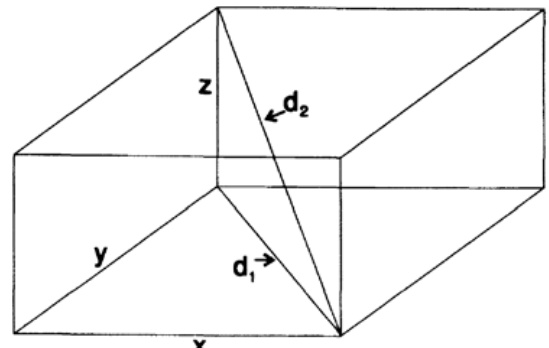  

# Figure 9.I  

Continuing with the geometric approach, planes in the space will be simply linear combinations of the  $x_{i},$  and a sphere about a point will be all points which are at the fixed distance (the radius) from the given point.  

We need the volume of the  $n$  -dimensional sphere to get an idea of the size of a piece of restricted space. But first we need the  

Stirling approximation for  $n$  ! ,  which I will derive so you will see most of the details and be convinced what is coming later is true, rather than on hearsay.  

A product like  $n.$  ! is hard to handle, so we take the log of   $n.$  ! which becomes  

$$
\ln n!=\sum_{k\mathop{=}1}^{n}\ln k,
$$  

where, of course, the In is the logarithm to the base e. Sums remind us that they are related to integrals, so we start with the integral  

$$
\int_{1}^{\cdot\cdot}\!\!\ln x\mathrm{d}x.
$$  

We apply integration by parts (since we recognize the In  $x$   arose from integrating an algebraic function and hence it will be removed in the next step). Pick   $U{=}\mathrm{In}\;x,\,\mathrm{d}V{=}\mathrm{d}x,$  ,  then  

$$
\begin{array}{l}{\displaystyle\int_{1}^{n}\ln x\,\mathrm{d}x=\left\{x\ln x-x\right\}\bigg|_{1}^{n}}\\ {\displaystyle\qquad\qquad=n\ln n-n+1.}\end{array}
$$  

On the other hand, if we apply the trapezoid rule to the integral of In  $x$   we will get,  Figure 9.II  

$$
\int_{1}^{n}\ln x\mathrm{{d}}x\sim{\frac{1}{2}}\ln1+\ln2+\ln3+\cdots+{\frac{1}{2}}\ln\,n.
$$  

Since In  $1{=}0$  , adding   $\scriptstyle{\big(}{\frac{1}{2}}{\big)}$   In  $n$   to both terms we get, finally,  

$$
\sum_{k\mathop{=}1}^{n}\ln\,k\!\sim n\ln n\!-\!n+1+\frac{1}{2}\ln\,n.
$$  

Undo the logs by taking the exponential of both sides  

$$
n!\sim C\,n^{n}\mathrm{e}^{-n}(n)^{1/2},
$$  

where   $C$   is some constant (not far from e) independent of   $n$  ,  since we are approximating an integral by the trapezoid rule and the error in the trapezoid approximation increases more and more slowly as   $n$   grows  

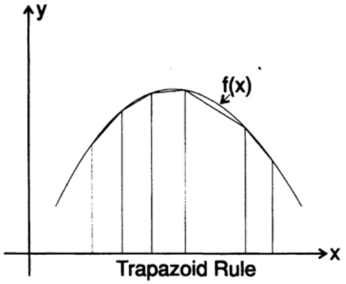  

# Figure 9. II  

larger and larger, and   $C$   is the limiting value. This is the first form of Stirling’s formula. We will not waste time to deriving the limiting, at infinity, value of the constant   $C$   which turns out to   ${\mathfrak{b e}}{\sqrt{(2\pi)}}=\!2.5066...$   $(\mathrm{e}{=}2.71828...)$  ). Thus we finally have the usual Stirling’s formula for the factorial  

$$
n!\sim n^{n}{\mathrm{e}}^{-n}{\sqrt{2\pi n}}.
$$  

The following table shows the quality of the Stirling approximation to  $n$  !  

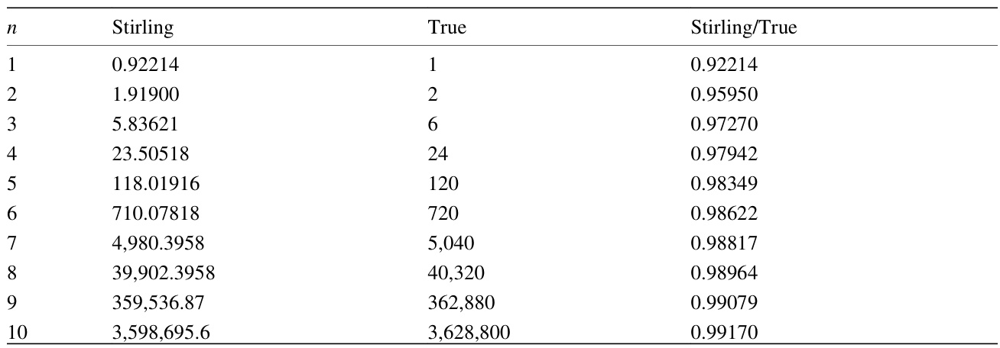  

Note as the numbers get larger and larger the ratio approaches 1 but the differences get greater and greater! If you consider the two functions  

$$
f(n)\!=\!n+{\sqrt{n}},
$$  

$$
g(n)=n,
$$  

then the limit of the ratio  $f\!\!\left(\mathfrak{n}\right)\!/g\!\left(\mathfrak{n}\right)$  , as  $n$   approaches infinity, is 1, but as in the table the difference  

$$
f(n)-g(n)={\sqrt{n}},
$$  

grows larger and larger as  $n$   increases. We need to extend the factorial function to all positive real numbers, hence we introduce the  gamma function  in the form of an integral  

$$
\Gamma(n)\;=\;\int_{0}^{\infty}x^{n-1}\mathrm{e}^{-x}\,\mathrm{d}x,
$$  

which converges for all  $n{>}0$  . For  $_{n>1}$   we again integrate by parts, this time using the  $\scriptstyle\mathrm{d}V=\mathrm{e}^{-x}\,\mathrm{d}x$   and the   $\scriptstyle U=x^{\mathfrak{n}-}$  1 .   At the two limits the integrated part is zero, and we have the reduction formula  

$$
\Gamma\left(n\right)=\left(n\!-\!1\right)\Gamma\left(n\!-\!1\right)
$$  

# with  $T(l){=}l$  

Thus the gamma function takes on the values   $(n{-}1)$  ! at the positive integers  $n$  ,  and it provides a natural way of extending the factorial to all positive numbers since the integral exist whenever  $n{>}0$  .  

We will need  

$$
\Gamma\left(\frac{1}{2}\right)=\int_{0}^{\infty}\!\!x^{-1/2}\mathbf{e}^{-x}\,\mathbf{d}x.
$$  

Set   $\scriptstyle{x=t^{2}}$  ,  hence  $\scriptstyle\mathrm{d}x=2t$    d t,  and we have (using symmetry in the last step)  

$$
\Gamma\left(\frac{1}{2}\right)=2\int_{0}^{\infty}\mathrm{e}^{-t^{2}}\mathrm{d}t=\int_{-\infty}^{\infty}\mathrm{e}^{-t^{2}}\mathrm{d}t.
$$  

We now use a standard trick to evaluate this integral. We take the product of two of the integrals, one with  $x$  and one with  $y$   as their variables.  

$$
\Gamma^{2}\!\left(\!\frac{1}{2}\!\right)=\!\int_{0}^{\infty}\!\int_{0}^{\infty}\!\!\mathrm{e}^{-(x^{^2}+y^{^2})}\mathrm{d}x\mathrm{d}y.
$$  

The  $\scriptstyle x^{2}+y^{2}$   suggests polar coordinates, so we convert  

$$
=\int_{0}^{2\pi}\!\int_{0}^{\infty}\!\mathbf{e}^{-r^{2}}r\,\mathbf{d}r\,\mathbf{d}\theta.
$$  

The angle integration is easy, the exponential is now also easy, and we get, finally,  

$$
\Gamma^{2}\!\left(\!\frac{1}{2}\!\right)\!=\!\pi.
$$  

Thus  

$$
\Gamma{\bigg(}{\frac{1}{2}}{\bigg)}={\sqrt{\pi}}=1.77245..
$$  

We now turn to the volume of an   $n$  -dimensional sphere (or hypersphere if you wish). Clearly the volume of a cube in  $n$   dimensions and of side  $x$   is  $x^{\mathfrak{n}}$  . A little reflection and you will believe the formula for the volume of an  $n$  -dimensional sphere must have the form  

$$
\mathrm{{\bfVolume}}\,{\bf=}\,C_{\bf n}r^{\bf n},
$$  

where   $C_{n}$   is a suitable constant. In the case  $_{n=2}$   the constant is   $\pi_{\l}$  ,  in the case  $n{=}1$  , it is 2 (when you think about it). In three dimensions we have  $C_{3}{=}4\pi/3$  .  

We start with same trick as we used for the gamma function of   $1/2$  , except this time we take the product of   $n$   of the integrals, each with a different   $x_{i}$  . Thinking of the volume of a sphere we see it is the sum of shells, and each element of the sum has a volume which is the corresponding shell area multiplied by the thickness, d r . For a sphere the value for the surface area can be obtained by differentiating the volume of the sphere with respect to the radius  $r_{;}$  ,  

$$
\mathsf{S u r f a c e}=\frac{\mathsf{d}V_{n}(r)}{\mathsf{d}r}=n C_{n}r^{n-1},
$$  

and hence the elements of volume are  

$$
\left\{\frac{\mathsf{d}V_{n}(r)}{\mathsf{d}r}\right\}\mathsf{d}r\,{=}\,n C_{n}r^{n\,-\,1}\mathsf{d}r.
$$  

We have, therefore, on setting   $r^{2}{=}t$  

$$
\begin{array}{l}{{\Gamma^{n}\bigg(\frac{1}{2}\bigg)=\pi^{n/2}=\displaystyle\int_{0}^{\infty}\mathrm{e}^{-r^{2}}\bigg\{\frac{\mathrm{d}V_{n}(r)}{\mathrm{d}r}\bigg\}\,\mathrm{d}r}}\\ {{\qquad\qquad\qquad\qquad\qquad\qquad=\displaystyle\frac{n C_{n}}{2}\bigg{]}\int_{0}^{\infty}\mathrm{e}^{-t}t^{(n/2-1)}\mathrm{d}t}}\\ {{\qquad\qquad\qquad\qquad\qquad=\displaystyle\frac{n C_{n}}{2}\Gamma\bigg(\frac{n}{2}\bigg)=C_{n}\Gamma\bigg(\frac{n}{2}+1\bigg)}}\end{array}
$$  

from which we get  

It is easy to see  

$$
C_{n}\!=\!\left(\!\frac{\pi^{n/2}}{\Gamma({\scriptstyle\frac{1}{2}}n+1)}\!\right)\!.
$$  

$$
C_{n}\!=\!\left(\!\frac{2\pi}{n}\!\right)\!C_{n-2},
$$  

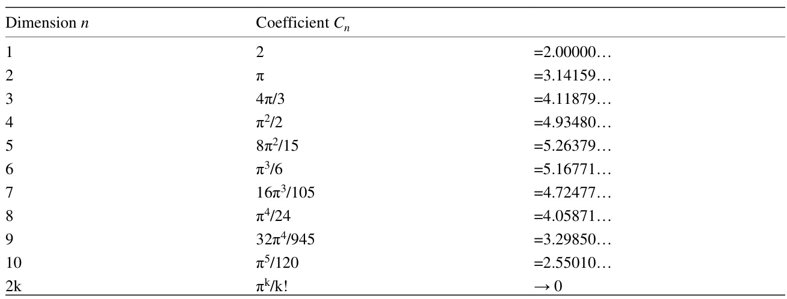  

Thus we see the coefficient  $C_{n}$   increases up to  $_{n=5}$   and then decreases towards 0. For spheres of unit radius this means the volume of the sphere approaches 0 as   $n$   increases. If the radius is   $r,$  ,  then we have for the volume, and using  $_{n=2k}$   for convenience (since the actual numbers vary smoothly as   $n$   increases and the odd dimensional spaces are messier to compute),  

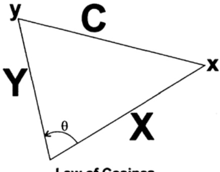  

Figure 9. III  

$$
C_{n}r^{n}\!=\!\frac{(\pi r^{2})^{k}}{k!}\!\to\!0\;\mathrm{as}\;k\!\to\!\infty\,.
$$  

No matter how large the radius,  $r,$  ,  increasing the number of dimensions,   $n$  ,  will ultimately produce a sphere of arbitrarily small volume.  

Next we look at the relative amount of the volume close to the surface of a  $n$  -dimensional sphere. Let the radius of the sphere be  $r,$  ,  and the inner radius of the shell be  $r(1{-}\varepsilon)$  , then the  relative   volume  of the shell is  

$$
\frac{C_{n}r^{n}-C_{n}r^{n}(1-\varepsilon)^{n}}{C_{n}r^{n}}\!=\!1-(1-\varepsilon)^{n}.
$$  

For large n, no matter how thin the shell is (relative to the radius), almost all the volume is in the shell and there is almost nothing inside. As we say,  the volume is almost all on the surface . Even in 3 dimensions the unit sphere has 7/8-ths of its volume within 1/2 of the surface. In  $n$  -dimensions there is   $1{-}1/2^{n}$   within 1/2 of the radius from the surface.  

This has importance in design; it means almost surely the optimal design will be on the surface and will not be inside as you might think from taking the calculus and doing optimizations in that course. The calculus methods are usually inappropriate for finding the optimum in high dimensional spaces. This is not strange at all; generally speaking the best design is pushing one or more of the parameters to their extreme— obviously you are on the surface of the feasible region of design!  

Next we turn to looking at the diagonal of an   $n$  -dimensional cube, say the vector from the origin to the point (1,1,…,1). The cosine of the angle between this line and any axis is given by definition as the ratio of the component along the axis, which is clearly 1, to the length of the line which is  $\cdot_{\textstyle n}$  . Hence  

$$
\cos\theta\!=\!1/\sqrt{n\!\to\!0\quad\tt a n d\quad}\theta\!\to\!\pi/2
$$  

Therefore, for large  $n$   the diagonal is  almost perpendicular  to every coordinate axis!  

If we use the points with coordinates   $(\pm1,\,\pm1,...,\,\pm1)$   then there are  $2^{n}$   such diagonal lines which are all almost perpendicular to the coordinate axes. For   $n{=}10$  , for example, this amounts to 1024 such almost perpendicular lines.  

I need the angle between two lines, and while you may remember it is the vector dot product, I propose to derive it again to bring more understanding about what is going on. [Aside; I have found it very valuable in important situations to review  all the basic   derivations involved  so I have a firm feeling for what is going on.] Take two points  $x$   and  $y$   with their corresponding coordinates  $x_{i}$  

and  $y_{i},$    Figure 9.III .  Then applying the law of cosines in the plane of the three points  $x,y,$  ,  and the origin we have  

$$
C^{2}=X^{2}+Y^{2}-2X Y\cos\theta,
$$  

where  $X$   and   $Y$  are the lengths of the lines to the points  $x$   and  $y$  . But the   $C$   comes from using the differences of the coordinates in each direction  

$$
C^{2}=\sum_{k\mathop{=}1}^{n}(x_{k}-y_{k})^{2}=X^{2}+Y^{2}-2\sum_{k\mathop{=}1}^{n}x_{k}y_{k}.
$$  

Comparing the two expressions we see  

$$
\cos\!\theta\!=\!\frac{\sum_{k\,=\,1}^{n}\!x_{k}y_{k}}{X Y}.
$$  

We now apply this formula to two lines drawn from the origin to random points of the form  

$$
(\pm1,\pm1,\dots,\pm1).
$$  

The dot product of these factors, taken at random, is again random   $\pm1$  ’s and these are to be added  $n$   times, while the length of each is again   $\surd n_{z}$  ,  hence (note the  $n$   in the denominator)  

$$
{\bf c o s}\theta\!=\!\frac{\sum_{k=1}^{n}(\pm1)}{n},
$$  

and by  the weak law of large numbers  this approaches 0 for increasing   $n$  , almost surely . But there are   $2^{n}$  different such random vectors, and given any one fixed vector then any other of these  $2^{n}$   random vectors is almost surely almost perpendicular  to it!  $n$  -dimensions is indeed vast!  

In linear algebra and other courses you learned to find the set of perpendicular axes and then represent everything in terms of these coordinates, but you see in  $n$  -dimensions there are, after you find the   $n$   mutually perpendicular coordinate directions,   $2^{n}$   other directions which are  almost perpendicular  to those you have found! The theory and practice of linear algebra are quite different!  

Lastly, to further convince you your intuitions about high dimensional spaces are not very good, I will produce another paradox which I will need in later chapters. We begin with a  $4{\times}4$   square and divide it into 4 unit squares in each of which we draw a unit circle,  Figure 9.IV . Next we draw a circle about the center of the square with radius just touching the four circles on their insides. Its radius must be, from the Figure 9.IV ,  

$$
r_{2}\,{=}\,\sqrt{2-1}\,{=}\,0.414...
$$  

Now in three dimensions you will have a   $4\mathbf{x}4\mathbf{x}4$   cube, and 8 spheres of unit radius. The inner sphere will touch each outer sphere along the line to their center will have a radius of  

$$
r_{3}\,{=}\,\sqrt{3\,{-}\,1}\,{=}\,\,0.732...
$$  

Think of why this must be larger than for two dimensions.  

Going to   $n$   dimensions, you have a   $4{\times}4{\times}...{\times}4$   cube, and   $2^{n}$   spheres, one in each of the corners, and with each touching its  $n$   adjacent neighbors. The inner sphere, touching on the inside all of the spheres, will have a radius of  

$$
r_{n}\!=\!\sqrt{n\!-\!1}.
$$  

Examine this carefully! Are you sure of it? If not, why not? Where will you object to the reasoning?  

Once satisfied it is correct we apply it to the case of   $n{=}10$   dimensions. You have for the radius of the inner sphere  

$$
r_{10}=\sqrt{10\!-\!1\!>\!2},
$$  

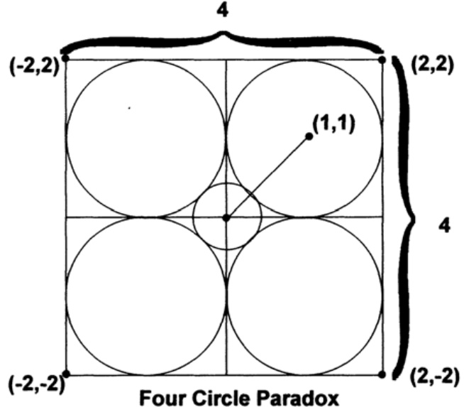  

and in 10 dimensions the inner sphere reaches outside the surrounding cube! Yes, the sphere is convex, yes it touches each of the 1024 packed spheres on the inside, yet it reaches outside the cube!  

So much for your raw intuition about n-dimensional space, but remember the n-dimensional space is where the design of complex objects generally takes place. You had better get an improved feeling for n- dimensional space by thinking about the things just presented, until you begin to see how they can be true, indeed why they must be true. Else you will be in trouble the next time you get into a complex design problem. Perhaps you should calculate the radii of the various dimensions, as well as go back to the angles between the diagonals and the axes, and see how it can happen.  

It is now necessary to note carefully, I have done all this in the classical Euclidean space using the Pythagorean distance where the sum of squares of the differences of the coordinates is the distance between the points squared. Mathematicians call this distance  $L_{2}$  .  

The space  $L_{1}$   uses not the sum of the squares, but rather the sum of the distances, much as you must do in traveling in a city with a rectangular grid of streets. It is the sum of the differences between the two locations that tells you how far you must go. In the computing field this is often called the “Hamming distance” for reasons which will appear in a later chapter. In this space a circle in two dimensions looks like a square standing on a point,  Figure 9.V . In three dimensions it is like a cube standing on a point, etc. Now you can better see how it is in the circle paradox above the inner sphere can get outside the cube.  

There is a third, commonly used, metric (they are all metric  $\mathrel{\mathop:}=$  distance functions), called   $L_{\infty},$   or Chebyshev distance.  Here we have the distance is the maximum coordinate difference, regardless of any other differences,  Figure 9.VI . In this space a circle is a square, a three dimensional sphere is a cube, and you see in this case the inner circle in the circle paradox has 0 radius in all dimensions.  

These are all examples of a  metric,  a measure of distance. The conventional conditions on a metric  $D(x,y)$  between two points  $x$   and  $y$   are:  

1.  $D(x,y){\geq}0$   (non-negative), 2.  $D(x,y){=}0$   if and only if  $x{=}y$   (identity),  

3.  $D(x,y){=}D(y,x)$   (symmetry), 4.  $D(x,y){+}D(y,z){\geq}D(x,z)$   (triangle inequality).  

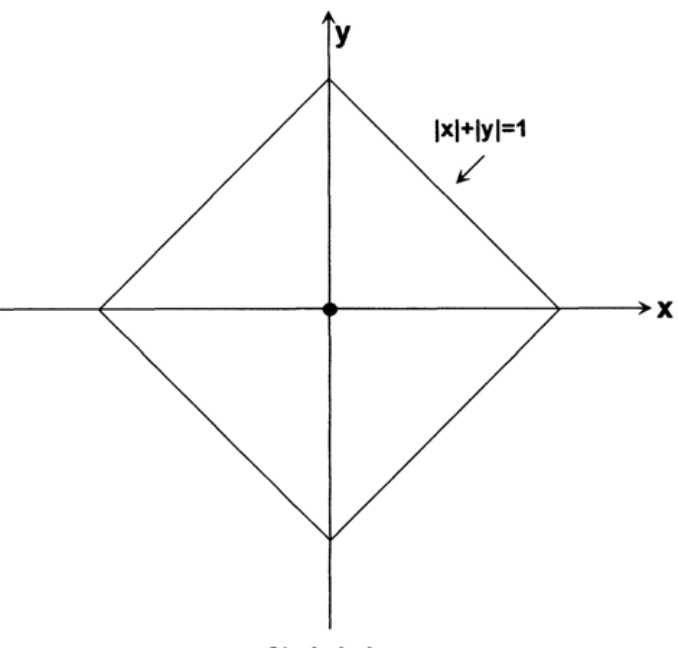  

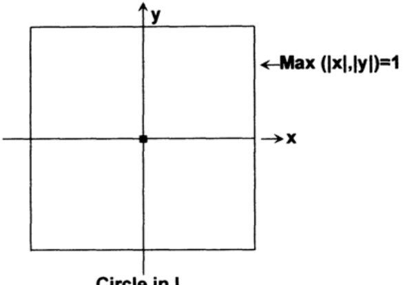  

# Figure 9.VI  

It is left to you to verify the three metrics,  $L_{\infty},L_{2}$   and  $L_{1}$   (Chebyshev, Pythagoras, and Hamming), all satisfy these conditions.  

The truth is, in complex design, for various coordinates we may use any of the three metrics, all mixed up together, so the design space is not as portrayed above, but is a mess of bits and pieces. The  $L_{2}$   metric is connected with least squares, obviously, and the other two,  $L_{\infty}$   and  $L_{1}$  ,  are more like comparisons. In making comparisons in real life, you generally use either the maximum difference,   $L_{\infty},$   in any one trait as sufficient to distinguish two things, or sometimes, as in strings of bits, it is the number of differences which matters, and the sum of the squares does not enter, hence the   $L_{1}$    distance is used. This is increasingly true, for example, in pattern identification in AI.  

Unfortunately, the above is all too true, and it is seldom pointed out to you. They never told me a thing about it! I will need many of the results in later chapters, but in general, after this exposure, you should be better prepared than you were for complex design and for carefully examining the space in which the design occurs, as I have tried to do here. Messy as it is, fundamentally it is where the design occurs and where you must search for an acceptable design.  

Since  $L_{1}$    and  $L_{\infty}$   are not familiar let me expand the remarks on the three metrics.  $L_{2}$   is the natural distance function to use in physical and geometric situations including the data reduction from physical measurements. Thus you find least squares,   $L_{2},$   throughout physics. But when the subject matter is intellectual judgments then the other two distance functions are generally preferable, and this is slowly coming into use, though we still find the Chi square test, which is obviously a measure for  $L_{2},$   used widely when some other suitable test should be used.  

# 10 Coding   Theory—I  

Having looked at computers and how they operate, we now turn to the problem of  the representation of information—how  do we represent the information we want to process. Recall any meaning a symbol may have depends on how it is processed; there is no inherent meaning to the bits the machine uses. In the synthetic language mentioned in  Chapter 4  on the history of software, the breaking up of the instructions was pretty much the same for every code instruction and this is true for most languages; the “meaning” of any instruction is defined by the corresponding subroutine.  

To simplify the problem of the representation of information we will, at present, examine only the problem of the transmission of information from here to there. This is exactly the same as transmission from now to then, storage. Transmission through time or through space are the same problem. The standard model of the system is given in  Figure 10.I  

Starting of the left hand side of  Figure 10.I  we have a source of information. We do not discuss what the source is. It may be a string of: alphabetical symbols, numbers, mathematical formulas, musical notes of a score, the symbols now used to represent dance movements—what ever the source is and what ever “meaning” is associated with the symbols is not part of the theory. We postulate only a source of information, and by doing only that, and no more, we have a powerful, general theory which can be widely applicable. It is the abstraction from details that gives the breadth of application.  

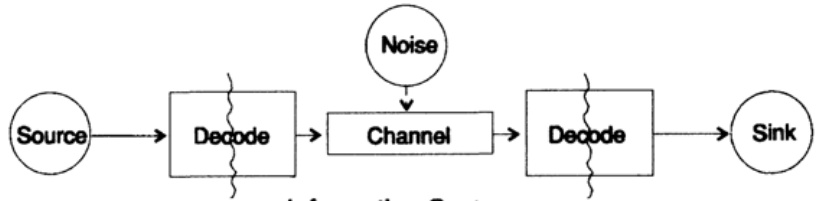  

# Figure 10.I  

When in the late 1940s C.E.Shannon created  Information Theory  there was a general belief he should call it  Communication Theory,  but he insisted on the word “information”, and it is exactly that word which has been the constant source of both interest and of disappointment in the theory. One wants to have a theory of “information” but it is simply a theory of strings of symbols. Again, all we suppose is there is such a source, and we are going to encode it for transmission.  

The encoder is broken into two parts, the first half is called the  source encoding  which as its name implies is adapted to the source, various sources having possibly different kinds encodings.  

The second half of the encoding process is called  channel encoding  and it is adapted to the channel over which the encoded symbols are to be sent. Thus the second half of the encoding process is tuned to the channel. In this fashion, with the common interface, we can have a wide variety of sources encoded first to the common interface, and then the message is further encoded to adapt it to the particular channel being used.  

Next, going to the right in  Figure 10.I , the channel is supposed to have “random noise added”. All the noise in the system is incorporated here. It is assumed the encoder can uniquely recognize the incoming symbols without any error, and it will be assumed the decoder similarly functions without error. These are idealizations, but for many practical purposes they are close to reality.  

Next, the decoding is done in two stages, channel to standard, and then standard to the source code. Finally it is sent on to the sink, to its destination. Again, we do not ask what the sink does with it.  

As stated before, the system resembles transmission, for example a telephone message from me to you, radio, or TV programs, and other things such as a number in a register of a computer being sent to another place. Recall, again, sending through space is the same as sending through time, namely  storage . If you have information and want it later, you encode it for storage and store it. Later when you want it it is decoded. Among encoding systems is the identity, no change in the representation.  

The fundamental difference between this kind of a theory and the usual theory in physics is the assumption  at the start  there is “noise”, errors will arise in any equipment. Even in quantum mechanics the noise appears at a later stage as an uncertainty principle, not as an initial assumption; and in any case the “noise” in Information Theory is not at all the same as the uncertainty in Q.M.  

We will, for convenience only, assume we are using the binary form for the representation in the system. Other forms can be similarly handled, but the generality is not worth the extra notation.  

We begin by assuming the coded symbols we use are of variable length, much as the classical Morse code of dots and dashes, where the common letters are short and the rare ones are long. This produces an efficiency in the code, but it should be noted Morse code is a ternary code, not binary, since there are spaces as well as dots and dashes. If all the code symbols are of the same length we will call it a  block code .  

The first obvious property we want is the ability to uniquely decode a message if there is no noise added —at least it seems to be a desirable property, though in some situations it could be ignored to a small extent. What is sent is a stream of symbols which looks to the receiver like a string of   $0^{\circ}\mathrm{s}$   and 1’s. We call two adjacent symbols a second extension, three a third extension, and in general if we send   $n$   symbols the receiver sees the n-th extension of the basic code symbols. Not knowing  $n$  ,  you the receiver, must break the stream up into units which can be translated, and you want, as we said above, to be able at the receiving end, meaning you again, to make this decomposition of the stream uniquely in order to recover the original message I, at the sending end, sent to you.  

I will use small alphabets of symbols to be encoded for illustrations; usually the alphabet is much larger. Typically natural language alphabets run from 16 to 36 letters, both upper and lower case, along with numbers and numerous punctuation symbols. For example, ASCII has  $128{=}2^{7}$   symbols in its alphabet.  

Let us examine one special code of four symbols,  $s_{1},\,s_{2},\,s_{3},\,s_{4}$  .  

$$
s_{1}=0;\;\;\;s_{2}=00;\;\;\;s_{3}=01;\;\;\;s_{4}=11.
$$  

If you receive  

#  

what will you do? Is it  

$$
\begin{array}{c c c}{s_{1}s_{1}s_{4}}&{\mathrm{or\;is\;it}}&{s_{2}s_{4}?}\end{array}
$$  

You cannot tell; the code is not uniquely decodable, and hence is unsatisfactory. On the other hand the code  

$$
s_{1}=0;\;\;\;s_{2}=10;\;\;\;s_{3}=110;\;\;\;s_{4}=111
$$  

is uniquely decodable. Let us take a random string and see what you would do to decode it. You would construct a  decoding tree  of the form shown in  Figure 10.II . The string  

can be broken up into the symbols  

by merely following the decoding tree using the rule:  

Each time you come to a branch point (node) you read the next symbol, and when you come to a leaf of the tree you emit the corresponding symbol and return to the start.  

The reason why this tree can exist is that no symbol is the prefix of any other, so you always know when you have come to the end of the current symbol.  

There are several things to note. First, the decoding is a straight forward process in which each digit is examined only once. Second, in practice you usually include a symbol which is an  exit  from the decoding process and is needed at the end of message. Failure to allow for an  escape symbol  is a common error in the design of codes. You may, of course, never expect to exit from a decoding mode, in which case the exit symbol is not needed.  

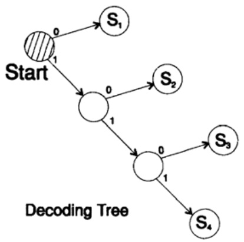  

# Figure 10.II  

The next topic is  instantaneous decodable codes . To see what this is, consider the above code with the digits reversed end for end.  

$$
s_{1}=0;\;\;\;s_{2}=01;\;\;\;s_{3}=011;\;\;\;s_{4}=111.
$$  

Now consider receiving 011111…111. The only way you can decode this is to start at the final end and group by three’s until you see how many 1’s are left to go with the first 0; only then you can decode the first symbol. Yes, it is uniquely decodable, but not instantaneously! You have to wait until you get to the end of the message before you can start the decoding process! It will turn out (McMillan’s Theorem) instantaneous decodability costs nothing in practice, hence we will stick to instantaneously uniquely decodable codes.  

We now turn to two examples of encoding the same symbols,  $s_{i}.$  :  

$$
s_{1}=0;\;\;\;s_{2}=10;\;\;\;s_{3}=110;\;\;\;s_{4}=1110;\;\;\;s_{5}=1111,
$$  

which will have the decoding tree shown in  Figure 10.III .  

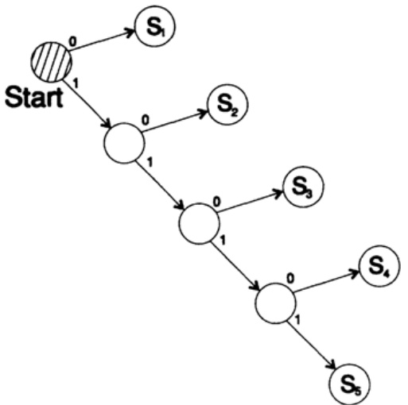  

# Figure 10.III  

The second encoding is the same source, but we have:  

$$
s_{1}=00;\;\;\;s_{2}=01;\;\;\;s_{3}=10;\;\;\;s_{4}=110;\;\;\;s_{5}=111,
$$  

with the tree shown in  Figure 10.IV .  

The most obvious measure of “goodness” of a code is its average length for some ensemble of messages. For this we need to compute the code length  $l_{i}$   of each symbol multiplied by its corresponding probability  $p_{i}$  of occurring, and then add these products over the whole code. Thus the formula for the average code length  $L$   is, for an alphabet of   symbols,  $q$  

$$
L=\sum_{i=1}^{q}p_{i}l_{i},
$$  

where the   $p_{i}$   are the probabilities of the symbols   $s_{i}$   and the   $l_{i}$   are the corresponding lengths of the encoded symbols. For an efficient code this number  $L$   should be as small as possible. If  $p_{1}{=}1/2$  ,  $p_{2}{=}~1/4$  ,  $p_{3}{=}1/8$  ,  $p_{4}{=}$  1/16, and  $p_{5}{=}1/16$  , then for code #1 we get  

$$
L\!=\!1\Big(\frac{\!1}{2}\Big)+2\Big(\frac{\!1}{4}\Big)+3\Big(\frac{\!1}{8}\Big)+4\Big(\frac{\!1}{16}+\frac{1}{16}\Big)\!=\!1\frac{7}{8},
$$  

and for code #2  

$$
L=2{\left({\frac{1}{2}}\right)}+2{\left({\frac{1}{4}}+{\frac{1}{8}}\right)}+3{\left({\frac{1}{16}}+{\frac{1}{16}}\right)}=2{\frac{1}{8}},
$$  

and hence the given probabilities will favor the first code.  

If most of the code words are of the same probability of occurring then the second encoding will have a smaller average code length than the first encoding. Let all the  $p_{i}{=}1/5$  . The code #1 has  

$$
L\!=\!\frac{1}{5}(1+2+3+4+4)\!=\!\frac{14}{5}\!=\!2\frac{4}{5},
$$  

while code  $\#2$   has  

$$
L\!=\!\frac{1}{5}(2+2+2+3+3)\!=\!\frac{12}{5}\!=\!2\frac{2}{5},
$$  

thus favoring the second code. Clearly the designing of a “good” code must depend on the frequencies of the symbols occurring.  

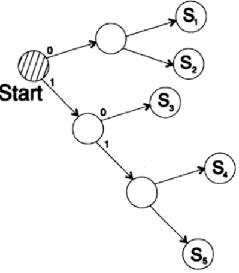  

Figure 10.IV  

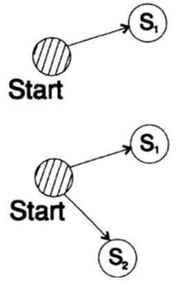  

# Figure 10.V  

We now turn to the  Kraft inequality  which gives a limit on the lengths  $l_{i}$   of the code symbols of a code. In the base 2, the Kraft inequality is  

$$
K=\sum_{i=1}^{q}{\frac{1}{2^{i_{\bar{i}}}}}\le1.
$$  

When examined closely this inequality says there cannot be too many short symbols or else the sum will be too large.  

To prove the Kraft inequality for any instantaneously uniquely decodable code we simply draw the decoding tree, which of course exists, and apply mathematical induction. If the tree has one or two leaves as shown in Figure 10.V  then there is no doubt the inequality is true. Next, if there are more than two leaves we decompose the trees of length  $m$   (for the induction step) into two trees, and by the induction suppose the inequality applies to each branch of length  $m{-}1$   or less. By induction the inequality applies to each branch, giving   $K^{,}$   and   $K^{\ast}$   for their sums. Now when we join the two trees each length increases by 1, hence each term in the sum gets another factor of 2 in the denominator, and we have  

$$
\frac{K^{\prime}}{2}\!+\!\frac{K^{\prime\prime}}{2}\le1\,,
$$  

and the theorem is proved.  

Next we consider the proof of McMillan’s Theorem, the Kraft inequality applies to non-instantaneous codes provided they are uniquely decodable. The proof depends on the fact for any number  $K>1$   some  $n$  -th power will exceed any linear function of  $n$  ,  when   $n$   is made large enough. We start with the Kraft inequality raised to the  $n$  -th power (which gives the  $n$  -th extension) and expand the sum  

$$
K^{n}\!=\!\left[\sum_{i=1}^{q}\frac{1}{2^{l_{i}}}\right]^{n}\!=\sum_{k=n}^{n l}\frac{\bar{N}_{k}}{2^{k}},
$$  

where   $N_{k}$   is the number of symbols of length   $k,$   and the sum starts from the minimum length of the   $n$  -th extension of the symbols, which is   $n$  ,  and ends with the maximum length  $n l,$  ,  where  $l$   is the maximum length of any single code symbol. But from the unique decodability it must be that  $N_{\mathrm{k}}\!\le\!2^{\mathrm{k}}$  . The sum becomes  

$$
K^{n}\leq\sum_{k=n}^{n l}{\frac{2^{k}}{2^{k}}}\,{=}\,n l\,{-}\,n+1.
$$  

If   $K$   were   $>1$   then we could find an   $n$   so large the inequality would be false, hence we see   $K\leq1$  , and McMillan’s Theorem is proved.  

Since we now see, as we said we would show, instantaneous decodability costs us nothing, we will stick to them and ignore merely uniquely decodable codes—their generality buys us nothing.  

Let us take a few examples to illustrate the Kraft inequality. Can there exist a uniquely decodable code with lengths 1, 3, 3, 3? Yes, since  

$$
\frac{1}{2}\!+\!\frac{1}{8}\!+\!\frac{1}{8}\!+\!\frac{1}{8}\!=\!\frac{7}{8}\!<\!1\,.
$$  

How about lengths 1, 2, 2, 3? We have  

$$
\frac{1}{2}\!+\!\frac{1}{4}\!+\!\frac{1}{4}\!+\!\frac{1}{8}\!=\!\frac{9}{8}\!>\!1\,,
$$  

hence no! There are too many short lengths.  

Comma codes  are codes where each symbol is a string of 1’s followed by a 0, except the last symbol which is all 1’s. As a special case we have:  

$$
s_{1}=0;\ \ s_{2}=10;\ \ s_{3}=110;\ \ s_{4}=1110;\ \ s_{5}=1111.
$$  

We have the Kraft sum  

$$
{\frac{1}{2}}\!+\!{\frac{1}{4}}\!+\!{\frac{1}{8}}\!+\!{\frac{1}{16}}\!+\!{\frac{1}{16}}\!=\!1,
$$  

and we have exactly met the condition. It is easy to see the general comma code meets the Kraft inequality with exact equality.  

If the Kraft sum is less than 1 then there is excess signaling capacity since another symbol could be included, or some existing one shortened and thus the average code length would be less.  

Note if the Kraft inequality is met that does not mean the code is uniquely decodable, only there exists a code with those symbol lengths which is uniquely decodable. If you assign binary numbers in numerical order, each having the right length   $l_{i}$   in bits, then you will find a uniquely decodable code. For example, given the lengths 2, 2, 3, 3, 4, 4, 4, 4 we have for Kraft’s inequality  

$$
2\left(\!\frac{1}{4}\!\right)\!+\!2\left(\!\frac{1}{8}\!\right)\!+\!4\left(\!\frac{1}{16}\!\right)\!=\!1,
$$  

hence an instantaneously decodable code can exist. We pick the symbols in increasing order of numerical size, with the binary point on imagined on the left, as follows, and watch carefully the corresponding lengths  $l_{i}$  :  

#  $s_{1}=00;\;\;\;s_{2}=01;\;\;\;s_{3}=100;\;\;\;s_{4}=101;$   $s_{5}=1100;\;\;\;s_{6}=1101;\;\;\;s_{7}=1110;\;\;\;s_{8}=1111.$  

I feel it necessary to point out how things are actually done by us when we communicate ideas. Thus I want, at this time, to get an idea from my head into yours. I emit some words from which you are supposed to get the idea. But if you later try to transmit this idea to a friend you will emit, almost certainly, different words. In a real sense, the “meaning” is not contained in the specific words I use since you will probably use different words to communicate the same idea. Apparently different words can convey the same “information”. But if you say you do not understand the message then usually a different set of words is used by the source in a second or even third presentation of the idea. Thus, again in some sense, the “meaning” is not contained in the actual words I use, but you supply a great deal of surrounding information when you make the translation from my words to your idea of what I said inside you head.  

We have learned to “tune” the words we use to fit the person on the receiving end; we, to some extent, select according to what we think is the channel noise, though clearly this does not match the model I am using above since there is significant noise in the decoding process, shall we say. This inability of the receiver to “hear what is said” by a person in a higher management position but to hear only what they expect to hear, is, of course, a serious problem in every large organization, and is something you should be keenly aware of as you rise towards the top of the organization. Thus the representation of information in the formal theory we have given is mirrored only partly in life as we live it, but it does show a fair degree of relevance outside the formal bounds of computer usage where it is highly applicable.  

# 11 Coding Theory—II  

Two things should be clear from the previous chapter. First, we want the average length   $L$   of the message sent to be as small as we can make it (to save the use of facilities). Second, it must be a statistical theory since we cannot know the messages which are to be sent, but we can know some of the statistics by using past messages plus the inference the future will probably be like the past. For the simplest theory, which is all we can discuss here, we will need the probabilities of the individual symbols occurring in a message. How to get these is not part of the theory, but can be obtained by inspection of past experience, or imaginative guessing about the future use of the proposed system you are designing.  

Thus we want an instantaneous uniquely decodable code for a given set of input symbols,   $s_{i}$   along with their probabilities,  $p_{i}$  . What lengths   $l_{i}$   should we assign (realizing we must obey the Kraft inequality), to attain the minimum average code length? Huffman solved this code design problem.  

Huffman first showed the following running inequalities must be true for a minimum length code. If the  $p_{i}$  are in descending order then the  $l_{i}$   must be in ascending order  

$$
\begin{array}{r l}&{p_{1}\geq\,p_{2}\geq\,\cdots\,\geq p_{q},}\\ &{l_{1}\leq\,l_{2}\leq\,\cdots\,\leq l_{q}.}\end{array}
$$  

For suppose the  $p_{i}$   are in this order but at least one pair of the  $l_{i}$   are not. Consider the effect of interchanging the symbols attached to the two which are not in order. Before the interchange the two terms contributed to the average code length  $L$   an amount  

$$
\scriptstyle{\mathbf{before}}\,=\,p_{j}l_{j}\,+\,p_{m}l_{m}
$$  

and after the interchange the terms would contribute  

$$
\begin{array}{r}{\mathsf{a f t e r}=p_{j}l_{m}+p_{m}l_{j}.}\end{array}
$$  

All the other terms in the sum  $L$   will be the same. The difference can be written as  

$\mathbf{\chi}=(p_{j}\!-\!p_{\pmb{m}})(l_{j}\!-\!l_{\pmb{m}})$  

One of these two terms was assumed to be negative, hence upon interchanging the two symbols we would observe a decrease in the average code length   $L$  . Thus for a minimum length code we must have the two running inequalities.  

Next Huffman observed an instantaneous decodable code has a decision tree, and every decision node should have two exits, or else it is wasted effort, hence there are two longest symbols which have the same length.  

To illustrate Huffman coding we use the classic example. Let  $p(s_{1}){=}0.4$  ,  $p(s_{2}){=}0.2$  ,  $p(s_{3}){=}0.2$  ,   $\mathsf{p}\!\left(s_{4}\right)\!\!=\!\!0.1$  , and   $p(s_{5}){=}0.1$  . We have it displayed in the attached  Figure 11.I . Huffman then argued on the basis of the above he could combine (merge) the two least frequent symbols (which must have the same length) into one  

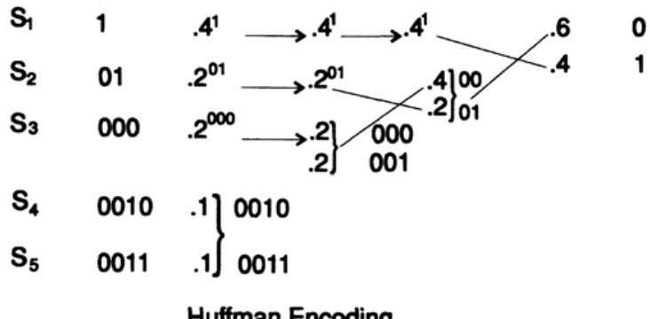  

Figure 11.I  

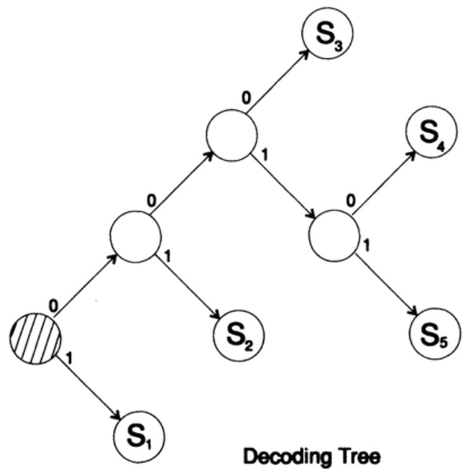  

# Figure 11.II  

symbol having the combined probability with common bits up to the last bit which is dropped, thus having one fewer code symbols. Repeating this again and again he would come down to a system with only two symbols, for which he knew how to assign a code representation, namely one symbol 0 and one symbol 1.  

Now in going backwards to undo the merging steps, we would need at each stage to split the symbol which arose from the combining of two symbols, keeping the same leading bits but adding to one symbol a 0, and to the other a 1. In this way he would arrive at a minimum  $L$   code, see again  Figure 11.I . For if there were another code with smaller length   $L^{\prime}$   then doing the forward steps, which changes the average code length by a fixed amount he would arrive finally at two symbols with an average code length less than 1— which is impossible. Hence the Huffman  encoding gives a code with minimum length. See  Figure 11.II  for the corresponding decoding tree.  

The code is not unique. In the first place at each step of the backing up process the assigning of the 0 and the 1 is an arbitrary matter to which symbol each goes. Second, if at any stage there are two symbols of the same probability then it is indifferent which is put above the other. This can result, sometimes, in very different appearing codes—but both codes will have the same average code length.  

If we put the combined terms as high as possible we get  Figure 11.III  with the corresponding decoding tree  Figure 11.IV . The average length of the two codes is the same, but the codes, and the decoding trees are different; the first is “long” and the second is “bushy”, and the second will have less variability than the first one.  

We now do a second example so you will be sure how Huffman encoding works since it is natural to want to use the shortest average code length you can when designing an encoding system. For example you may have a lot of data to put into a backup store, and encoding it into the appropriate Huffman code has been known at times to save more than half the expected storage space! Let  $p(s_{\mathrm{l}}){=}1/3$  ,  $p(s_{2}){=}1/5$  ,  $p(s_{3}){=}1/6$  ,  $p(s_{4})$   $\!=\!1/10,p(s_{5})\!=\!1/12$  ,  $p(s_{6}){=}1/20$  ,  $p(s_{7}){=}1/30$   and  $p(s_{8}){=}1/30$  . First we check that the total probability is 1. The common denominator of the fractions is 60. Hence we have the total probability  

$$
\textstyle{\binom{1}{60}}\,(20+12+10+6+5+3+2+2)={\binom{1}{60}}\,(60)=1.
$$  

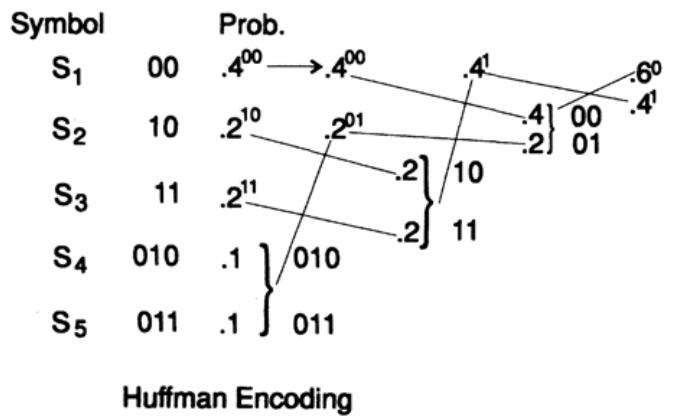  

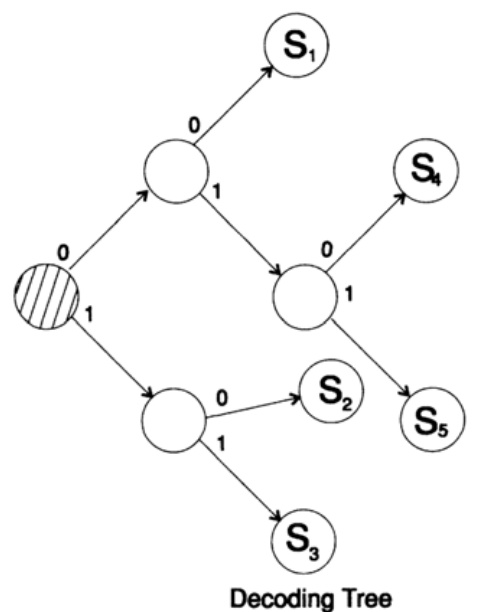  

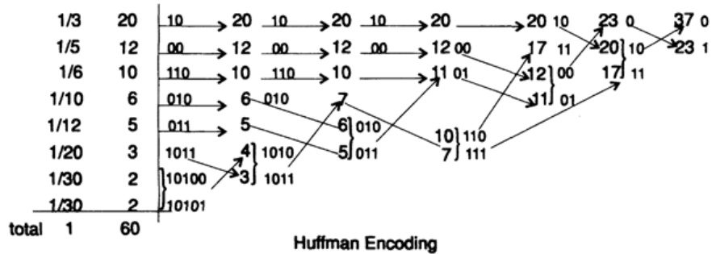  

This second example is illustrated in  Figure 11.V  where we have dropped the 60 in the denominators of the probabilities since only the relative sizes matter. What is the average code length per symbol? We compute  

For a block code of eight symbols each symbol would be of length 3 and the average would be 3, which is more than 2.58…  

Note how mechanical the process is for a machine to do. Each forward stage for a Huffman code is a repetition of the same process, combine the two lowest probabilities, place the new sum in its proper place in the array, and mark it. In the backward process, take the marked symbol and split it. These are simple programs to write for a computer hence a computer program can find the Huffman code once it is given the  $s_{i}$   and their probabilities  $p_{i.}$  .  Recall in practice you want to assign an escape symbol of very small probability so you can get out of the decoding process at the end of the message. Indeed, you can write a program which will sample the data to be stored and find estimates of the probabilities (small errors make only small changes in  $L$  ), find the Huffman code, do the encoding, and send first the decoding algorithm (tree) and then the encoded data, all without human interference or thought! At the decoding end you already have received the decoding tree. Thus once written as a library program, you can use it whenever you think it will be useful.  

Huffman codes have even been used in some computers on the instruction part of instructions, since instructions have very different probabilities of being used. We need, therefore, to look at the gain in average code length  $L$   we can expect from Huffman encoding over simple block encoding which uses symbols all of the same length.  

If all the probabilities are the same and there are exactly  $2^{k}$   symbols, then an examination of the Huffman process will show you will get a standard block code with each symbol of the same length. If you do not have exactly  $2^{k}$   symbols then some symbols will be shortened, but it is difficult to say whether many will be shortened by one bit, or some may be shortened by 2 or more bits. In any case, the value of   $L$   will be the same, and not much less than that for the corresponding block code.  

On the other hand, if each  $p_{i}$   is greater than (2/3) (sum of all the probabilities that follow except the last) then you will get a comma code, one which has one symbol of length 1 (0), one symbol of length 2, (10), etc, down to the last where at the end you will have two symbols of the same length,  $(q{-}1)$  , (1111…10) and (1111…11). For this the value of L can be much less than the corresponding block code.  

Rule: Huffman coding pays off when the probabilities of the symbols are very different, and does not pay off much when they are all rather equal.  

When two equal probabilities arise in the Huffman process they can be put in any order, and hence the codes may be very different, though the average code length in both cases will be the same  $L$  . It is natural to ask which order you should choose when two probabilities are equal. A sensible criterion is to minimize the variance of the code so that messages of the same length in the original symbols will have pretty much the same lengths in the encoded message you do not want a short original message to be encoded into a very long encoded message by chance. The simple rule is to put any new probability, when inserting it into the table as high as it can go. Indeed, if you put it above a symbol with a slightly higher probability you usually greatly reduce the variance and at the same time only slightly increase  $L$  ;  thus it is a good strategy to use.  

Having done all we are going to do about source encoding (though we have by no means exhausted the topic) we turn to channel encoding where the noise is modeled. The channel, by supposition, has noise, meaning some of the bits are changed in transmission (or storage). What can we do?  

Error detection of a single error is easy. To a block of   $(n{-}1)$   bits we attach an n-th bit which is set so that the total  $n$   bits has an even number of 1’s (an odd number if you prefer, but we will stick to an even number in the theory). It is called an  even (odd) parity check,  or more simply a  parity check .  

Thus if all the messages I send to you will have this property, then at the receiving end you can check to see if the condition is met. If the parity check is not met then you know at least one error has happened, indeed you know an odd number of errors has occurred. If the parity does check then either the message is correct, or else there are an even number of errors. Since it is prudent to use systems where the probability of an error in any position is low, then the probability of multiple errors must be much lower.  

For mathematical tractability we make the assumption the channel has  white noise,  meaning: (1) each position in the block of  $n$   bits has the same probability of an error as any other position, and (2) the errors in various positions are uncorrelated, meaning independent. Under these hypotheses the probabilities of errors are:  

$$
\begin{array}{r l}{\mathrm{no~error}\qquad}&{=(1-p)^{n},}\\ {\mathrm{one~error}\qquad}&{=\mathrm{C}(n,1)p(1-p)^{n-1}=[n]p(1-p)^{n-1},}\\ {\mathrm{two~errors}\qquad}&{=\mathrm{C}(n,2)p^{2}(1-p)^{n-2}=[n(n-1)/2]p^{2}(1-p)^{n-2},}\\ {\mathrm{three~errors}\quad}&{=\mathrm{C}(n,3)p^{3}(1-p)^{n-3}}\\ &{=[n(n-1)(n-2)/6]p^{3}(1-p)^{n-3},\,\mathrm{etc.}}\end{array}
$$  

From this if, as is usually true,   $p$   is small with respect to the block length   $n$   (meaning the product   $n p$   is small), then multiple errors are much less likely to happen than single errors. It is an engineering judgment of how long to make   $n$   for a given probability of error  $p$  . If   $n$   is small then you have a higher redundancy (the ratio of the number of bits sent to the minimum number of bits possible,  $n/(n{-}1))$   than with a larger   $n$  , but if   $n p$   is large then you have a low redundancy but a higher probability of an undetected error.  You  must make an engineering judgement on how you are going to balance these two effects.  

When you find a single error you can ask for a retransmission and expect to get it right the second time, and if not then on the third time, etc. However, if the message in storage is wrong, then you will call for retransmissions until another error occurs and you will probably have two errors which will pass undetected in this scheme of single error detection. Hence the use of repeated retransmission should depend on the expected nature of the error.  

Such codes have been widely used, even in the relay days. The telephone company in its central offices, and in many of the early relay computers, used a 2-out-of-5 code, meaning two and only two out of the five relays were to be “up”. This code was used to represent a decimal digit, since  $\scriptstyle\mathbf{C}(5,2)=10$  . If not exactly 2 relays were up then it was an error, and a repeat was used. There was also a 3-out-of-7 code in use, obviously an odd parity check code.  

I first met these 2-out-of-5 codes while using the Model 5 relay computer at Bell Tel Labs, and I was impressed not only did they help to get the right answer, but more important, in my opinion, they enabled the maintenance people to maintain the machine. Any error was caught by the machine almost in the act of its being committed, and hence pointed the maintenance people correctly rather than having them fool around with this and that part, misadjusting the good parts in their effort to find the failing part  

Going out of time sequence, but still in idea sequence, I was once asked by AT&T how to code things when humans were using an alphabet of 26 letter, ten decimal digits, plus a “space”. This is typical of inventory naming, parts naming, and many other naming of things, including the naming of buildings. I knew from telephone dialing error data, as well as long experience in hand computing, humans have a strong tendency to interchange adjacent digits, a 67 is apt to become a 76, as well as change isolated ones, (usually doubling the wrong digit, for example a 556 is likely to emerge as 566). Thus single error detecting is not enough. I got two very bright people into a conference room with me, and posed the question. Suggestion after suggestion I rejected as not good enough until one of them, Ed Gilbert, suggested a weighted code . In particular he suggested assigning the numbers (values)  $0,\,1,\,2,\,...,\,36$   to the symbols 0,1,

 …, 9, A, B, …, Z, space. Next he computed not the sum of the values but if the  $k$  -th symbol has the value

 (labeled for convenience)  $s_{k}$   then for a message of   $n$   symbols we compute  

$$
\sum_{k=1}^{n}=k s_{k}{\mathrm{\,modulo~}}37
$$  

“modulo” meaning divide this weighted sum by 37 and take only the remainder. To encode a message of   $n$  symbols leave the first symbol,  $k{=}1$  , blank and what ever the remainder is, which is less than 37, subtract it from 37 and use the corresponding symbol as a check symbol, which is to be put in the first position. Thus the total message, with the check symbol in the first position, will have a check sum of exactly 0. When you examine the interchange of any two different symbols, as well as the change of any single symbol, you see it will destroy the weighted parity check, modulo 37 (provided the two interchanged symbols are not exactly 37 symbols apart!). Without going into the details, it is essential the modulus be a prime number, which 37 is.  

To get such a weighted sum of the symbols (actually their values) you can avoid multiplication and use only addition and subtraction if you wish. Put the numbers in order in a column, and compute the running sum then compute the running sum of the running sum modulo 37, and then complement this with respect to 37, and you have the check symbol. As an illustration using w, x, y, z.  

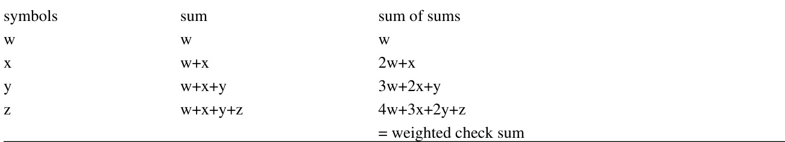  

At the receiving end you subtract the modulus repeatedly until you get either a 0 (correct symbol) or a negative number (wrong symbol).  

If you were to use this encoding, for example, for inventory parts names, then the first time a wrong part name came to a computer, say at transmission time, if not before (perhaps at order preparation time), the error will be caught; you will not have to wait until the order gets to supply headquarters to be later told that there is no such part or else they have sent the wrong part! Before it leaves your location it will be caught and hence is quite easily corrected at that time. Trivial? Yes! Effective against human errors (as contrasted with the earlier white noise), yes!  

Indeed, you see such a code on your books these days with their ISBN numbers. It is the same code except they use only 10 decimal digits, and 10, not being a prime number, they had to introduce an 11-th symbol, labeled  $X_{i}$  ,  which might at times arise in the parity check—indeed, about every 11-th book you have will have an   $X$   for the parity check number as the final symbol of its ISBN number. The dashes are merely for decorative effect and are not used in the code at all. Check it for yourself on your text books. Many other large organizations could use such codes to good effect, if they wanted to make the effort  

I have repeatedly indicated I believe the future will be increasingly concerned with information in the form of symbols, and less concerned with material things, hence the theory of encoding (representing) information in convenient codes is a non-trivial topic. The above material gave a simple error detecting code for machine-like situations, as well as a weighted code for human use. They are but two examples of what coding theory can contribute to an organization in places where machine and human errors can occur.  

When you think about the man-machine interface one of the things you would like is to have the human make comparatively few key strokes—Huffman encoding in a disguise! Evidently, given the probabilites of you making the various branches in the program menus, you can design a way of minimizing your total key strokes if you wish. Thus the same set of menus can be adjusted to the work habits of different people rather than presenting the same face to all. In a broader sense than this, “automatic programming” in the higher level languages is an attempt to achieve something like Huffman encoding so that for the problems you want to solve require comparatively few key strokes are needed, and the ones you do not want are the others.  

# 12 Error Correcting   Codes  

There are two subject matters in this chapter; the first is the ostensible topic, error correcting codes, and the other is how the process of discovery sometimes goes—you all know I am the official discoverer of the Hamming error correcting codes. Thus I am presumably in a position to describe how they were found. But you should beware of any reports of this kind. It is true at that time I was already very interested in the process of discovery, believing in many cases the method of discovery is more important than what is discovered. I knew enough not to think about the process when doing research, just as athletes do not think about style when the engage in sports, but they practice the style until it is more or less automatic. I had thus established the habit after something of great of small importance was discovered of going back and trying to trace the steps by which it apparently happened. But do not be deceived; at best I can give the conscious part, and a bit of the upper subconscious part, but we simply do not know how the unconscious works its magic.  

I was using the Model 5 relay computer in NYC in preparation for delivering it to Aberdeen Proving Grounds, along with the some required software programs (mainly mathematical routines). When an error was detected by the 2-out-of-5 block codes the machine would when unattended repeat the step, up to three times, before dropping it and picking up the next problem in the hope the defective equipment would not be involved in the new problem. Being at that time low man on the totem pole, as they say, I got free machine time only over the weekends—meaning from Friday at around   $5{:}00\;\mathrm{P.M}$  . to Monday morning around 8:00 A.M. which is a lot of time! Thus I would load up the input tape with a large number of problems and promise my friends, back at Murray Hill NJ where the Research Department was located, I would deliver them the answers on Tuesday. Well, one weekend, just after we left on a Friday night, the machine failed completely and I got essentially nothing on Monday. I had to apologize to my friends and promised them the answers on the next Tues. Alas! The same thing happened again! I was angry to say the least, and said, “If the machine can locate there is an error, why can it not locate  where  it is, and then fix it by simply changing the bit to the opposite state?” (The actual language used was perhaps a bit stronger!).  

Notice first this essential step happened only because there was a great deal of emotional stress on me at the moment, and this is characteristic of most great discoveries. Working calmly will let you elaborate and extend things, but the break throughs generally come only after great frustration and emotional involvement. The calm, cool, uninvolved researcher seldom makes really great, new steps.  

Back to the story. I knew from previous discussions that of course you could build three copies of a machine, include comparing circuits, and use the majority vote—hence error correcting machines could exist. But at what cost! Surely there were better methods. I also knew, as discussed in the last chapter, a great deal about parity checks; I had examined their fundamentals very carefully.  

Another aside. Pasteur says, “Luck favors the prepared mind”. You see I was prepared by the immediately previous work I had done. I had become more than acquainted with the 2-out-of-5 codes, I had  

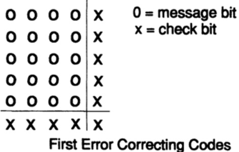  

understood them fundamentally, and had worked out and understood the general implications of a parity check.  

After some thought I recognized if I arranged the message bits of any message symbol in a rectangle, and put parity checks on each row and each column, then the two failing parity checks would give me the coordinates of the single error, and this would include the corner added parity bit (which could be set consistently if I used even parities),  Figure 12.I . The redundancy, the ratio of what you use to the minimum amount needed, is  

$$
\begin{array}{l r}{R=m n/(m-1)(n-1)}\\ {\quad}&{=1+1/(m-1)+1/(n-1)+1/(m-1)(n-1).}\end{array}
$$  

It is obvious to anyone who ever took the calculus the closer the rectangle is to a square the lower is the redundancy for the same amount of message. And of course big   $m\,{'}s$   and   $n's$   would be better than small ones, but then the risk of a double error might be too great; again an engineering judgment. Note if two errors occurred then you would have: (1) if they were not in the same column and not in the same row, then just two failing rows and two failing columns would occur and you could not know which diagonal pair caused them; and (2) if two were in the same row (or column) then you would have only the columns (or rows) but not the rows (columns).  

We now move to some weeks later. To get to NYC I would go a bit early to the Murray Hill, NJ location where I worked and get a ride on the company mail delivery car. Well, riding through north Jersey in the early morning is not a great sight, so I was, as I had the habit of doing, reviewing successes so I would have the style in hand automatically; in particular I was reviewing in my mind the rectangular codes. Suddenly, and I can give no reason for it, I realized if I took a triangle and put the parity checks along the diagonal, with each parity check checking both the row and column it was in, then I would have a more favorable redundancy,  Figure 12.II .  

My smugness vanished immediately! Did I have the best code this time? A few miles of thought on the matter (remember there were no distractions in the north Jersey scenery), I realized a cube of information bits, with parity checks across the entire planes and the parity check bit on the axes, for all three axes, would give me the three coordinates of the error at the cost of   $3n{-}2$   parity checks for the whole   $n^{3}$   encoded message. Better! But was it best? No! Being a mathematician I promptly realized a 4-dimensional cube (I did not have to arrange them that way, only interwire them that way) would be better. So an even higher dimensional cube would be still better. It was soon obvious (say five miles) a  $2{\times}2{\times}2{\times}...{\times}2$   cube, with   $_{n+1}$  parity checks, would be the best—apparently!  

But having burnt my fingers once, I was not about to settle for what looked good—I had made that mistake before! Could I prove it was best? How to make a proof? One obvious approach was to try a counting argument I had  $_{n+1}$   parity checks, whose result was a string of  $_{n+1}$   bits, a binary number of length  

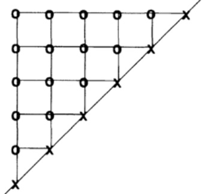  

# Figure 12.II  

$_{n+1}$   bits, and this could represent any of   $2^{n+1}$    things. But I needed only  $2^{n}{+}1$   things, the  $2^{n}$   points in the cube plus the one result the message was correct. I was off by almost a factor of 2. Alas! I arrived at the door of the company, had to sign in, and go to a conference so I had to let the idea rest  

When I got back to the idea after some days of distractions (after all I was supposed to be contributing to the team effort of the company), I finally decided a good approach would be to use the  syndrome  of the error as a binary number which named the place of  the error, with, of course, all 0’s being the correct answer (an easier test than for all 1’s on most computers). Notice familiarity with the binary system, which was not common then, (1947–1948), repeatedly played a prominent role in my thinking. It pays to know more than just what is needed at the moment!  

How do you design this particular case of an error correcting code? Easy! Write out the positions in the binary code:  

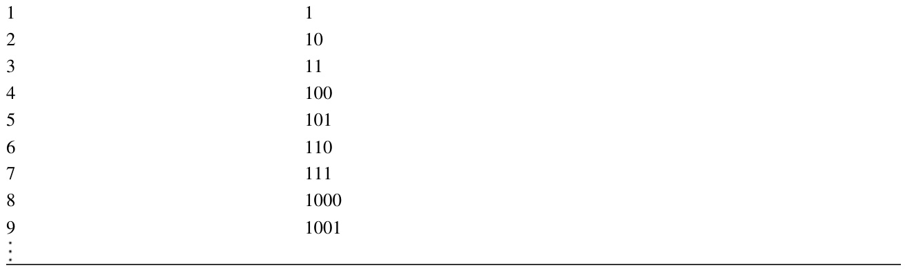  

It is now obvious the parity check on the right hand side of the syndrome must involve all positions which have a 1 in the right hand column; the second digit from the right must involve the numbers which have a 1 in the second column, etc. Therefore you have:  

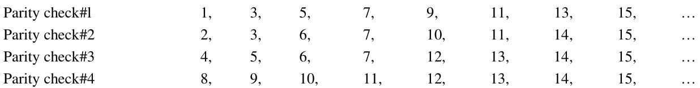  

Thus if any error occurs in some position, those parity checks, and only those, will fail and give 1’s in the syndrome,  and this will produce exactly the binary representation of the position of the error. It is that simple!  

To see the code in operation suppose we confine ourselves to 4 message and 3 check positions. These numbers satisfy the condition  

$$
2^{3}\geq7+1\,,
$$  

which is clearly a necessary condition, and the equality is sufficient. We pick as the positions for the checking bits (so the setting of the parity check will be easy), the check positions 1, 2, and 4. The message positions are therefore 3, 5, 6, 7. Let the message be  

#  

We (1) write the message on the top line, (2) encode on the next line, (3) insert an error at position 6 on the next line, and (4) on the next three lines compute the three parity checks.  

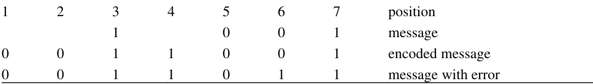  

You apply the parity checks to the received message.  

Binary number   $110\rightarrow6$  ; hence change the digit in position 6, and drop the check positions 1, 2 and 4, and you have the original message, 1001.  

If it seems magical, then think of the all 0 message, which will have all 0 checks, and then think of a single digit changing and you will see as the position of the error is moved around then the syndrome binary number will change correspondingly and will always exactly match the position of the error. Next, note the sum of any two correct messages is still a correct message (the parity checks are additive modulo 2 hence the proper messages form an additive group modulo 2). A correct message will give all zeros, and hence the sum of a correct message plus an error in one position will give the position of the error regardless of the message being sent. The parity checks concentrate on the error and ignore the message.  

Now it is immediately evident any interchange of any two or more of the columns, once agreed upon at each end of the channel, will have no essential effect; the code will be  equivalent . Similarly, the interchanging of 0 and 1 in any column (complementing that particular position) will not be an essentially different code. The particular (so called) Hamming code is merely a cute arrangement, and in practice you might want the check bits to all come at the end of the message rather than being scattered in the middle of it.  

How about a double error? If we want to catch (but not be able to correct) a double error we simply add a single new parity check over the whole message we are sending. Let us see what will then happen at your end.  

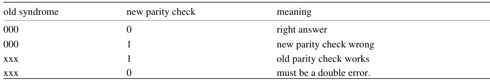  

A single error correcting plus double error detecting code is often a good balance. Of course, the redundancy in the short message of 4 bits, with now 4 bits of check, is bad, but the number of parity bits rises roughly like the log of the message length. Too long a message and you risk a double uncorrectable error (which in a single error correcting code you will “correct” into a third error), too short a message and the cost in redundancy is too high. Again an engineering judgment depending on the particular situation.  

From analytic geometry you learned the value of using the alternate algebraic and geometric views. A natural representation of a string of bits is to use an   $n$  -dimensional cube, each string being a vertex of the cube. Given this picture and finally noting any error in the message moves the message along one edge, two errors along two edges, etc., I slowly realized I was to operate in the space of   $L_{1}$  . The distance between symbols is the number of positions in which they differ. Thus we have a  metric  in the space and it satisfies the three standard conditions for a distance (see  Chapter 10  where it is identified as the standard   $L_{1}$  distance):  

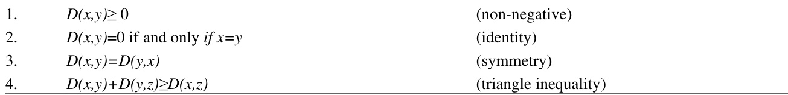  

Thus I had to take seriously what I had learned as an abstraction of the Pythagorean distance function.  

With a distance we can define a sphere as all points (vertices, as that is all there is in the space of vertices), at a fixed distance from the center. For example, in the 3-dimensional cube which can be easily sketched,  Figure 12.III , the points (0,0,1), (0,1,0), and (1,0,0) are all unit distance from (0,0,0), while the points (1,1,0), (1,0,1), and (0,1,1) are all two units away, and finally the point (1,1,1) is three units away from the origin.  

We now go to   $n$  -dimensions, and draw a sphere of unit radius about each point and  suppose  that the spheres do not overlap. It is obvious if the centers of these spheres are code points, and only these points, then at the receiving end any single error in a message will result in a non-code point and you can recognize where the error came from, it will be in the sphere about the point I sent to you, or equivalently in a sphere of radius 1 about the point you received. Hence we have an error correcting code. The minimum distance between code points is 3. If we use non-overlapping spheres of radius 2 then a double error can be corrected because the received point will be nearer to the original code point than any other point; double error correction, minimum distance of 5. The following table gives the equivalence of the minimum distance between code points and the correctability of errors:  

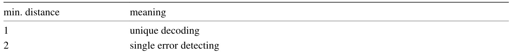  

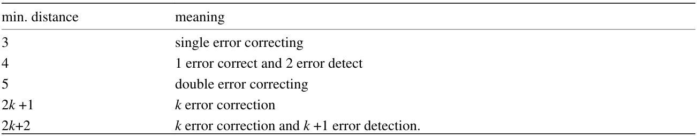  

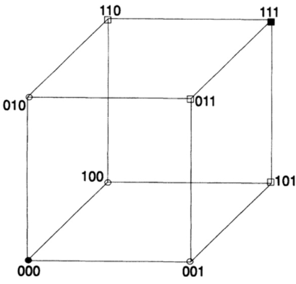  

# Figure 12.III  

Thus finding an error correcting code is the same as finding a set of code points in the n-dimensional space which has the required minimum distance between legal messages since the above conditions are both necessary and sufficient. It should also be clear some error correction can be exchanged for more detection; give up one error correction and you get two more in error detection.  

I earlier showed how to design codes to meet the conditions in the cases where the minimum distance is 1, 2, 3, or 4. Codes for higher minimum distances are not so easily found, and we will not go farther in that direction. It is easy to give an upper bound on how large the higher distance codes can be. It is obvious the number of points in a sphere of radius  $k$   is   $(\mathbf{C}\,(n,k)$   is a binomial coefficient)  

Hence if we divide the size of the volume of the whole space,  $2^{n}$  , by the volume of a sphere then the quotient is an upper bound on the number of non-overlapping spheres, code points, in the corresponding space. To get an extra error detection we simply, as before, add an overall parity check, thus increasing the minimum distance, which before was   $2k{+}1$   to   $2k{+}2$   (since any two points at the minimum distance will have the overall parity check set differently thus increasing the minimum distance by 1).  

Let us summarize where we are. We see by proper code design we can build a system from unreliable parts and get a much more reliable machine, and we see just how much we must pay in equipment, though we have not examined the cost in speed of computing if we build a computer with that level of error correcting into it. But I have previously stressed the other gain, namely field maintenance, and I want to mention it again and again. The more elaborate the equipment is, and we are obviously going in that direction, the more field maintenance is vital, and error correcting codes not only mean in the field the equipment will give (probably) the right answers, but it can be maintained successfully by low level experts.  

The use of error detecting and error correcting codes is rising steadily in our society. In sending messages from the space vehicles we sent to the outer planets, we often have a mere 20 watts or less of power (possibly as low as 5 watts), and had to use codes which corrected hundreds of errors in a single block of message—the correction being done here on earth, of course. When you are not prepared to overcome the noise, as in the above situation, or in cases of “deliberate jamming”, then such codes are the only known answer to the situation.  

In the late summer of 1961 I was driving across the country from my sabbatical at Stanford, Cal. to Bell Telephone Laboratories in NJ and I made an appointment to stop at Morris, Illinois where the telephone company was installing the first electronic central office which was not an experimental one. I knew it used Hamming codes extensively, and I was, of course, welcomed. They told me they had never had a field installation go in so easily as this one did. I said to myself, “Of course, that is what I have been preaching for the past 10 years”. When, during initial installation, any unit is set up and running properly (and you sort of know it is because of the self-checking and correcting properties), and you then turned your back on it to get the next part going, if the one you were neglecting developed a flaw, it told you so! The ease of initial installation, as well as later maintenance, was being verified right before their eyes! I cannot say too loudly, error correction not only gets the right answer when running, it can by proper design also contribute significantly to field installation and field maintenance; and the more elaborate the equipment the more essential these two things are.  

I now want to turn to the other part of the chapter. I have carefully told you a good deal of what I faced at each stage in discovering the error correcting codes, and what I did. I did it for two reasons. First, I wanted to be honest with you and show you how easy, if you will follow Pasteur’s rule, “Luck favors the prepared mind.”, to succeed by merely preparing yourself to succeed. Yes, there were elements of luck in the discovery; but there were many other people in much the same situation, and they did not do it! Why me? Luck, to be sure, but also I was preparing myself by trying to understand what was going on—more than the other people around who were merely reacting to things as they happened, and not thinking deeply as to what was behind the surface phenomena.  

I now challenge you. What I wrote in a few pages was done in the course of a total of about three to six months, mainly working at odd moments while carrying on my main duties to the company. (Patent rights delayed the publication for more than a year.) Does anyone dare to say they, in my position, could not have done it? Yes, you are just as capable as I was to have done it— if  you had been there  and  you had prepared yourself as well!  

Of course as you go through life you do not know what you are preparing yourself for—only you want to do significant things and not spend the whole of your life being a “janitor of science” or whatever your profession is. Of course luck plays a prominent role. But so far as I can see, life presents you with many, many opportunities for doing great things (define them as you will) and the prepared person usually hits one or more successes, and the unprepared person will miss almost every time.  

The above opinion is not based on this one experience, or merely on my own experiences, it is the result of studying the lives of many great scientists. I wanted to be a scientist hence I studied them, and I looked into discoveries which happened where I was and asked questions of those who did them. This opinion is also based on common sense. You establish in yourself the style of doing great things, and then when opportunity comes you almost automatically respond with greatness in your actions. You have trained yourself to think and act in the proper ways.  

There is one nasty thing to be mentioned, however, what it takes to be great in one age is not what is required in the next one. Thus you, in preparing yourself for future greatness (and the possibility of greatness is more common and easy to achieve than you think, since it is not common to recognize greatness when it happens under one’s nose) you have to think of the nature of the future you will live in. The past is a partial guide, and about the only one you have besides history is the constant use of your own imagination. Again, a random walk of random decisions will not get you anywhere near as far as those taken with your own vision of what your future should be.  

I have both told and shown you how to be great; now you have no excuse for not doing so!  

# 13 Information Theory  

Information Theory  was created by C.E.Shannon in the late 1940s. The management of Bell Telephone Labs wanted him to call it “'Communication Theory” as that is a far more accurate name, but for obvious publicity reasons “Information Theory” has a much greater impact—this Shannon chose and so it is known to this day. The title suggests the theory deals with information—and therefore it must be important since we are entering more and more deeply into the information age. Hence I shall go through a few main results, not with rigorous proofs of complete generality, but rather intuitive proofs of special cases, so you will understand what information theory is and what it can and cannot do for you.  

First, what is “information”? Shannon identified information with  surprise . He chose the negative of the log of the probability of an event as the amount of information you get when the event of probability  $p$   happens. For example, if I tell you it is smoggy in Los Angles then  $p$   is near 1 and that is not much information, but if I tell you it is raining in Monterey in June then that is surprising and represents more information. Because log  $1{=}0$   the certain event contains no information.  

In more detail, Shannon believed the measure of the amount of information should be a continuous function of the probability  $p$   of the event, and for independent events it should be additive—what you learn from each  independent  event when added together should be the amount you learn from the combined event. As an example, the outcome of the roll of a die and the toss of a coin are generally regarded as independent events. In mathematical symbols, if   $I(p)$   is the amount of information you have for event of probability  $p$  ,  then for event  $x$   of probability  $p_{1}$   and for the independent event   $y$   of probability  $p_{2},$  ,  you will get for the event of both  $x$   and  $y$  

$$
I(p_{1}p_{2})\,{=}\,I(p_{1})+I(p_{2})\quad(x\ \mathrm{and}\ y\ \mathrm{independent\events}).
$$  

This is the Cauchy  functional equation,  true for all  $p_{1}\mathrm{and}\;p_{2}$  .  

To solve this functional equation suppose  

then this gives  

$\scriptstyle I\!f p_{I}=p^{2}$   and  $p_{2}{=}p$  ,  then  

$$
\begin{array}{r}{p_{1}=p_{2}=p\,,}\end{array}
$$  

$$
I(p^{2})\!=\!2I(p)\,.
$$  

$$
I(p^{3})=3I(p)\,,
$$  

etc. Extending this process you can show, via the standard method used for exponents, for all rational numbers  m/n,  

$$
I(p^{m/n})\mathop{=}(m/n)I(p)\,.
$$  

From the assumed continuity of the information measure it follows the log is the only continuous solution to the Cauchy functional equation.  

In information theory it is customary to take the base of the log system as 2, so a binary choice is exactly 1 bit of information. Hence information is measured by the formula  

$$
I(p)=-\log_{2}p=\log_{2}(1/p)\,.
$$  

Let us pause and examine what has happened so far. First, we have not defined “information”, we merely gave a formula for measuring the amount. Second, the measure depends on  surprise,  and while it does match, to a reasonable degree, the situation with machines, say the telephone system, radio, television, computers, and such, it simply does  not  represent the normal human attitude towards information. Third, it is a relative measure, it depends on the state of your knowledge. If you are looking at a stream of “random numbers” from a random source then you think each number comes as a surprise, but if you know the formula for computing the “random numbers” then the next number contains no surprise at all, hence contains no information! Thus, while the definition Shannon made for information is appropriate in many respects for machines, it does not seem to fit the human use of the word. This is the reason it should have been called “Communication Theory”, and not “Information Theory”. It is too late to undo the definition (which produced so much of its initial popularity, and still makes people think it handles “information”) so we have to live with it, but you should clearly realize how much it distorts the common view of information and deals with something else, which Shannon took to be surprise.  

This is a point which needs to be examined whenever any definition is offered. How far does the proposed definition, for example Shannon’s definition of information, agree with the original concepts you had, and how far does it differ? Almost no definition is exactly congruent with your earlier intuitive concept, but in the long run it is the definition which determines the meaning of the concept—hence the formalization of something via sharp definitions always produces some distortion.  

Given an alphabet of   $q$   symbols with probabilities   $p_{i}$   then  the   average amount of information  (the expected value), in the system is  

$$
H(P)=\sum_{i\mathop{=}1}^{q}p_{i}I(p_{i})=\sum_{i\mathop{=}1}^{q}p_{i}\log\left(\frac{1}{p_{i}}\right).
$$  

This is called  the entropy  of the system with the probability distribution   $\left\{p_{i}\right\}$  . The name “entropy” is used because the same mathematical form arises in thermodynamics and in statistical mechanics, and hence the word “entropy” gives an aura of importance which is not justified in the long run. The same mathematical form does  not  imply the same interpretation of the symbols!  

The entropy of a probability distribution plays a central role in coding theory. One of the important results is  Gibbs’ inequality  for two different probability distributions,  $p_{i}$   and  $q_{i}$  .   We have to prove  

$$
\dot{\sum}p_{i}\log\left(\frac{q_{i}}{p_{i}}\right)\leq0\,.
$$  

The proof rests on the obvious picture,  Figure 13.I , that  

$$
\log x\leq x-1\quad(0\leq x<\infty)
$$  

and equality occurs only at  $_{x=1}$  . Apply the inequality to each term in the sum on the left hand side  

$$
{\scriptstyle\sum}p_{i}\left\{\frac{q_{i}}{p_{i}}\!-\!1\right\}\!=\!\sum\!q_{i}\!-\!\sum\!p_{i}\!=\!1\!-\!1\!=\!0\,.
$$  

If there are   $q$   symbols in the signaling system then picking the   $q_{i}{=}1/q$    we get from Gibbs´ inequality, by transposing the  $q$   terms,  

$$
\begin{array}{r}{H(P)\leq\log q\,.}\end{array}
$$  

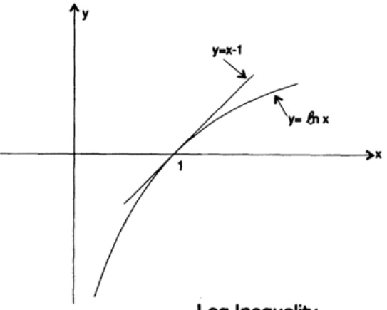  

This says in a probability distribution if all the   $q$   symbols are of equal probability, 1/ q , then the maximum entropy is exactly In  $q$  ,  otherwise the inequality holds.  

Given a uniquely decodable code, we have the Kraft inequality  

$$
K\!=\!\sum_{2^{l_{i}}}^{1}\!\le1\,.
$$  

Now if we now define the pseudo probabilities  

$$
Q_{i}\!=\!\frac{2^{-l_{i}}}{K},
$$  

where of course  $\sum{[Q_{i}]}{=}1$  , it follows from the Gibbs´ inequality,  

$$
\sum_{i\mathop{=}1}^{q}p_{i}\log\left(\frac{1}{K p_{i}2^{l_{i}}}\right)\le0\,,
$$  

after some algebra (remember that  $K{\le}1$   so we can drop the log term and perhaps strengthen the inequality further),  

$$
\begin{array}{r}{H(P)\leq\log K+\sum p_{i}l_{i}\leq L=\mathrm{average~code~length.}}\end{array}
$$  

Thus the entropy is a lower bound for any encoding, symbol to symbol, for the average code length  $L$  . This is the  noiseless coding   theorem of Shannon.  

We now turn to the main theorem on the bounds on signaling systems which use encoding of a bit stream of independent bits and go symbol to symbol  in the presence of noise,  meaning there is a probability a bit of information is correct,  $P{>}1/2$  , and the corresponding probability   $\scriptstyle Q=1-P$   it is altered when it is transmitted. For convenience assume the errors are independent and are the same for each bit sent, which is called “white noise”.  

We will encode a long stream of   $n$   bits into one encoded message, the   $n$  -th extension of a one bit code, where the  $n$   is to be determined as the theory progresses. We regard the message of  $n$   bits as a point in an  $n$  - dimensional space. Since we have an   $n$  -th extension, for simplicity we will assume each message has the same probability of occurring, and we will assume there are   $\mathbf{M}$   messages (M also to be determined later), hence the probability of each initial message is  

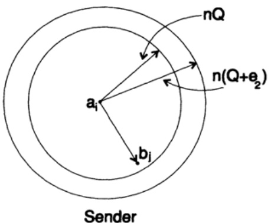  

We next examine the idea of the  channel capacity . Without going into details the channel capacity is defined as the maximum amount of information which can be sent through the channel reliably, maximized over all possible encodings, hence there is no argument that more information can be sent reliably than the channel capacity permits. It can be proved for the binary symmetric channel (which we are using) the capacity   $C,$  ,  per bit sent, is given by  

$$
C=1-H(P)=1-H(Q)\,,
$$  

where, as before,  $P$   is the probability of no error in any bit sent. For the  $n$   independent bits sent we will have the channel capacity  

$$
\begin{array}{r}{n C=n\left\{1-H(P)\right\}.}\end{array}
$$  

If we are to be near channel capacity then we must send almost that amount of information for each of the symbols  $a_{i},$   $\iota_{i},\,i{=}1,{\ldots},M,$  ,  and all of probability   $1/M$  , and we must have  

$$
I(a_{i})=n\left\{C-e_{1}\right\},
$$  

when we send any one of the  $M$   equally likely messages  $a_{i}$  . We have, therefore  

$$
M=2^{n(C-e_{i})}=2^{n C}/2^{n e_{1}}.
$$  

With   $n$   bits we expect to have   $n Q$   errors. In practice we will have, for a given message of   $n$   bits sent, approximately  $n Q$   errors in the received message. For large  $n$   the relative spread (spread  $=$  width,   of the distribution of the number of errors will be increasingly narrow as  $n$   increases.  

From the sender’s point of view I take the message  $a_{i}$   to be sent and draw a sphere about it of radius  

$$
r\!=\!(Q+e_{2})n\quad(e_{2}\!>\!0,\,Q+e_{2}\!<\!\frac{1}{2})
$$  

which is slightly larger by  $e_{2}$   than the expected number of errors,   $Q,$  ,   Figure 13.II . If   $n$   is large enough then there is an arbitrarily small probability of there occurring a received message point   $b_{j}$   which falls outside this sphere. Sketching the situation as seen by me, the sender, we have along any radii from the chosen signal,   $a_{i},$   to the received message,   $b_{j},$   with the probability of an error is (almost) a normal distribution, peaking up at   $n Q;$  ,  and with any given  $e_{2}$   there is an   $n$   so large the probability of the received point,   $b_{j},$   falling outside my sphere is as small as you please.  

Now looking at it from your end,  Figure 13.III , as the receiver, there is a sphere  $S(r)$   of the same radius  $r$  about the received point,   $b_{i},$   in the space, such that if the received message, bi,  is  inside my sphere then the original message  $a_{i}$   sent by me is inside your sphere.  

How can an error arise? An error can occur according to the following table:  

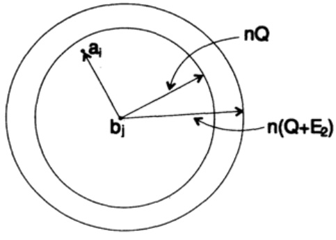  

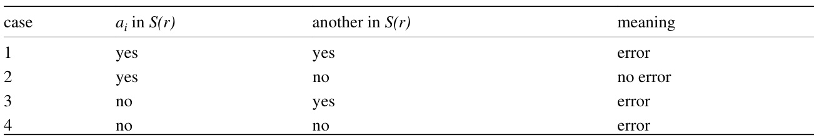  

Here we see that if there is at least one other original message point in the sphere about your received point then it is an error since you cannot decide which one it is. The sent message is correct only if the sent point is in the sphere and there is no other code point in it.  

We have, therefore, the mathematical equation for a probability  $P_{E}$   of an error, if the message sent is  $a_{i}$  

$$
\begin{array}{r l}&{P_{E}=P\{a_{i}\stackrel{1}{\mathrm{not}}\;\mathrm{in}\;S(r)\}^{\ast}+P\{a_{i}\stackrel{\smile}{\mathrm{is}}\;\mathrm{in}\;S(r)\}}\\ &{\qquad\times\;P\{\mathfrak{a t}\;\mathrm{least}\;\mathrm{one}\;\mathrm{more}\;a_{j}\;\mathrm{is}\;\mathrm{in}\;S(r)\}\,.}\end{array}
$$  

We can drop the first factor in the second term by setting it equal to 1, thus making an inequality  $P_{E}\leq P\{\pmb{a}_{i}$   $S(r)\}+P$   $a_{j}$   $S(r)\}$  

But using the obvious fact  

hence  

$$
P\{E_{1}\;{\mathrm{and}}/{\mathrm{or}}\;E_{2}\}=P\{E_{1}\}+P\{E_{2}\}-P\{E_{1}E_{2}\}\,,
$$  

$$
P\{E_{1}\;{\sf a n d}/{\sf o r}\;E_{2}\}\leq P\{E_{1}\}+P\{E_{2}\}\,,
$$  

applied repeatedly to the last term on the right  

$$
P_{E}\leq P\{a_{i}\,{\bar{\mathrm{not}}}\,\,\mathrm{in}\,\,S(r)\}+\sum_{a_{j}\neq a_{i}}P\{a_{j}\,\mathrm{in}\,\,S(r)\}\,.
$$  

By making  $n$   large enough the first term can be made as small as we please, say less than some number  $d$  . We have, therefore,  

$$
P_{E}\leq d+\sum P\{a_{j}\,\mathbf{in}\,\,S(r)\}\,.
$$  

We now examine how we can make the code book for the encoding of the   $M$   messages, each of   $n$   bits. Not knowing how to encode, error correcting codes not having been invented as yet, Shannon chose a random encoding. Toss a penny for each bit of the   $n$   bits of a message in the code book, and repeat for all   $M$  messages. There are  nM  tosses hence  

$$
2^{n M},
$$  

possible code books, all books being of the same probability   $1/2^{n\mathrm{M}}$  . Of course the random process of making the code book means there is a chance there will be duplicates, and there may be code points which are close to each other and hence will be a source of probable errors. What we have to prove is this does not occur with a probability above any positive small level of error you care to pick—provided   $n$   is made large enough.  

The decisive step is that Shannon  averaged over all possible code   books  to find the average error! We will use the symbol Av[.] to mean average over the set of all possible random code books. Averaging over the constant   $d$   of course gives the constant, and we have, since for the average each term is the same as any other term in the sum,  

$$
P_{E}\leq d+\textstyle\sum P\{a_{j}\,\mathrm{in}\,\,S(r)\}\,,
$$  

which can be increased   $\mathit{(M-1}$   goes to  $M_{\sun}$  ),  

$$
\mathbf{A}\mathbf{v}[P_{E}]\leq d+M\sum_{\mathrm{all~}a_{i}\mathrm{~not~in~}a_{i}}P\left\{a_{i}\mathrm{~in~}S(r)\right\}.
$$  

For any particular message, when we average over all code books, the encoding runs through all possible values, hence the average probability that a point is in the sphere is the ratio of the volume of the sphere to the total volume of the space. The volume of the sphere is  

$$
1+{\mathsf{C}}(n,1)+{\mathsf{C}}(n,2)+\cdots+{\mathsf{C}}(n,n s)\,,
$$  

where  $\scriptstyle{s=Q+e_{2}<1/2}$  , and  $n s$   is supposed to be an integer.  

The largest term in this sum is the last (on the right). We first estimate the size of it, via Stirling’s formula for the factorials. We then look at the rate of fall off to the next term before it, note this rate increases as we go to the left, and hence we can: (1)  dominate  the sum by a geometric progression with this initial rate, then (2) extend the geometric progression from  ns  terms to an infinite number, (3) sum the infinite geometric progression (all standard algebra of no great importance) and we finally get (4) the bound (for   $n$   large enough)  

$$
1+\mathsf{C}(n,\!1)+\mathsf{C}(n,\!2)+\cdots+\mathsf{C}(n,\!n s)\le2^{n H(s)}\quad(s<\!1/2).
$$  

Note how the entropy  $H(s)$   has appeared in a binomial identity.  

We have now to assemble the parts, note the Taylor series expansion of   $H(s){=}H(Q{+}e_{2})$   gives a bound when you take only the first derivative term and neglect all others, to get the final expression  

$$
\begin{array}{r}{\mathbf{A}\mathbf{v}[P_{E}]\leq d+2^{-n(e_{1}-e_{3})},}\end{array}
$$  

where  

$$
e_{3}=e_{2}\ln\,\{(1-Q)/Q\}\,\,\,\,\,\,(Q<\frac{1}{2})\,.
$$  

All we have to do now is pick an   $e_{2}$   so   $e_{3}\!<\!e_{1}$   and the last term will get as small as you please with sufficiently large   $n$  .  Hence the average error of  $P_{\mathrm{{E}}}$   can be made as small as you please while still being as close to channel capacity   $C$   as you please.  

If the average over all codes has a suitably small error, then at least one code must be suitable—hence there exists at least one suitable encoding system. This is Shannon’s important result, the “noisy coding theorem”, though let it be noted he proved it in much greater generality than the simple binary symmetric channel I used. The Mathematics is more difficult in the general case, but the ideas are not so much different, hence the very particular case used suffices to show you the true nature of the theorem.  

Let us critique the result. Again and again we said, “For sufficiently large   $n^{\ast}$  . How large is this  $n$  ?  Very, very large indeed if you want to be both close to channel capacity and reasonably sure you are right! So large, in fact, you would probably have to wait a very long time to accumulate a message of that many bits before encoding it, let alone the size of the random code books (which being random cannot be represented in a significantly shorter form than the complete listing of all  $M n$   bits, both  $n$   and M being very large).  

Error correcting codes escape this waiting for a very long message and then encoding it via a very large encoding book, along with the corresponding large decoding book, because they avoid code books and adopt regular (computable) methods. In the simple theory they tend to lose the ability to come very near to the channel capacity and still keep an arbitrarily low error rate but when a large number of errors are corrected by the code they can do well. Put into other words, if you provide a capacity for some level of error correction then for efficiency you must use this ability most of the time or else you are wasting capacity, and this implies a high number of errors corrected in each message sent.  

But the theorem is not useless! It does show, in so far as it is relevant, efficient encoding schemes must have very elaborate encodings of very long strings of bits of information. We see this accomplished in the satellites which passed the outer planets; they corrected more and more errors per block as they got farther and farther from both the Earth and the Sun (which for some satellites supplied the solar power of about 5 watts at most, others used atomic power sources of about the same power). They had to use high error correcting codes to be effective, given the low power of the source, their small dish size, the limited size of the receiving dishes on Earth as seen from their position in space, and the enormous distances the signal had to travel.  

We return to the   $n$  -dimensional space which we used in the proof. In the discussion of   $n$  -dimensional space we showed almost all the volume of a sphere lay near the outer surface—thus for the very slightly (relatively) enlarged sphere about the received signal it is almost certain the original sent signal lies in it. Thus the error correction of an arbitrarily large number of errors,  $n Q$  ,  with arbitrarily close to no errors after decoding is not surprising. What is more surprising is the  $M$   spheres can be packed with almost no overlap— again an overlap as small as you please. Insight as to why this is possible comes from a closer examination of the channel capacity than we have gone into, but you saw for the Hamming error correcting codes the spheres had  no  overlap. The many almost orthogonal directions in   $n$  -dimensional space indicates why we can pack the  $M$   sphere into the space with little overlap. By allowing a slight, arbitrarily small amount, of overlap which can lead to only a very few errors in your decoding you can get this dense packing. Hamming guaranteed a certain level; Shannon only a probably small error but as close to the channel capacity as you wish, which Hamming codes do not do.  

Information theory does not tell you much about how to design, but it does point the way towards efficient designs. It is a valuable tool for engineering communication system between machine-like things, but as noted before it is not really relevant to human communication of information. The extent to which biological inheritance, for example, is machine-like, and hence you can apply information theory to the genes, and to what extent it is not and hence the application is irrelevant, is simply not known at present. So we have to try, and the success will show the machine-like character, while the failure will point towards other aspects of information which are important.  

We now abstract what we have learned. We have seen all initial definitions, to a larger or smaller extent, should get the essence of our prior beliefs, but they always have some degree of distortion and hence non- applicability to things as we thought they were. It is traditional to accept, in the long run, the definition we use actually defines the thing defined; but of course it only tells us how to handle things, and in no way actually tells us any meaning. The postulational approach, so strongly favored in mathematical circles, leaves much to be desired in practice.  

We will now take up an example where a definition still bothers us, namely IQ. It is as circular as you could wish. A test is made up which is supposed to measure “intelligence”, it is revised to make it as consistent internally as we can, and then it is declared, when calibrated by a simple method, to measure “intelligence” which is now normally distributed (via the calibration curve). All definitions should be inspected, not only when first proposed, but much later when you see how they are going to enter into the conclusions drawn. To what extent were the definitions framed as they were to get the desired result? How often were the definitions framed under one condition and are now being applied under quite different conditions? All too often these are true! And it will probably be more and more true as we go farther and farther into the softer sciences, which is inevitable during your life time.  

Thus one purpose of this presentation of information theory, besides its usefulness, is to sensitize you to this danger, or if you prefer, how to use it to get what you want! It has long been recognized the initial definitions determine what you find, much more than most people care to believe. The initial definitions need your careful attention in any new situation, and they are worth reviewing in fields in which you have long worked so you can understand the extent the results are a tautology and not real results at all.  

There is the famous story by Eddington about some people who went fishing in the sea with a net. Upon examining the size of the fish they had caught they decided there was a minimum size to the fish in the sea! Their conclusion arose from the tool used and not from reality.  

# 14 Digital Filters—I  

Now that we have examined computers and how they represent information let us turn to how computers process information. We can, of course, only examine a very few of the things they do, and will concentrate on basics per usual.  

Much of what computers process are signals from various sources, and we have already discussed why they are often in the form of a stream of numbers from an equally spaced sampling system. Linear processing, which is the only one I have time for in this book, implies  digital filters . To illustrate “style” and how things actually happen in real life I propose to tell you first how I became involved in them, and then how I proceeded.  

First, I never went to the office of my Vice President, W.O. Baker; we only met in passing in the halls and we usually stopped to talk a few, very few, minutes. One time, around 1973–1974, when I met him in a hall I said to him when I came to Bell Telephone Laboratories in 1946 I had noticed the Laboratories were gradually passing from relay to electronic central offices, but a large number of people would not convert to oscilloscopes and the newer electronic technology and they were moved to a different location to get them out of the way. To him they represented a serious economic loss but to me they were a social loss since they were disgruntled to say the least because they were passed by (though it was their own fault). I went on to say I had seen the same thing happen when we went from the earlier analog computers (on which Bell Telephone Laboratories had many experts because they had developed much of the technology during WW- II) to the more modern digital computers—that we again left a large number of engineers behind, and again they were both an economic and a social loss. I then observed we both knew the telephone company was going to total digital transmission about as fast as they could, and this time we would leave behind a very much larger number of disgruntled engineers. Hence, I concluded, we should do something  now  about the situation, such as get adequate elementary books and other training devices to ease more of them into the future and leave fewer behind. He looked me square in the eye and said, Yes Hamming,  you  should.” and walked off! Furthermore, he went on encouraging me, via John Tukey with whom he often spoke, so I knew he was watching my efforts.  

What to do? In the first place I thought I knew very little about digital filters, and, furthermore, I was not really interested in them. But does one wisely ignore one’s V.P. plus the cogency of ones own observations? No! The implied social waste was too high for me to contemplate comfortably.  

So I turned to a friend, Jim Kaiser (J.F.Kaiser), who was one of the world’s experts in digital filters at that time, and suggested he should stop his current research and write a book on digital filters book writing to summarize his work was a natural stage in the development of a scientist. After some pressure he agreed to write the book, so I was saved, so I thought. But monitoring what he was doing revealed he was writing nothing. To rescue my plan I offered, if he would educate me over lunches in the restaurant (you get more time to think there than in the cafeteria), to help write the book jointly (mainly the first part), and we could call it Kaiser and Hamming. Agreed!  

As time went on I was getting a good education from him, and I got my first part of the book going but he was still writing nothing. So one day I said, “If you don’t write more we will end up calling it Hamming and Kaiser.”—and he agreed. Still later when I had about completed all the writing and he had still written nothing, I said I could thank him in the preface, but it should be called Hamming, and he agreed—and we are still good friends! That is how the book on  Digital Filters  I wrote came to be, and I saw it ultimately through three editions, always with good advice from Kaiser.  

The book also took me many places which were interesting since I gave a short, one week courses, on it for many years. The short courses began while I was still writing it because I needed feedback and had suggested to UCLA Extension Division I give it as a short course, to which they agreed. That led to years of giving it at UCLA, once in each of Paris, London, and Cambridge, England, as well as many other places in the USA and at least twice in Canada. Doing what needed to be done, though I did not want to do it, paid off handsomely in the long run.  

Now, to the more important part, how I went about learning the new subject of digital filters. Learning a new subject is something you will have to do many times in your career if you are to be a leader and not be left behind as a follower by newer developments. It soon became clear to me digital filter theory was dominated by Fourier series, about which theoretically I had learned in college, and actually I had had a lot of further education during the signal processing I had done for John Tukey, who was a professor from Princeton, a genius, and a one or two day a week employee of Bell Telephone Laboratories. For about ten years I was his computing arm much of the time.  

Being a mathematician I knew, as all of you do, any  complete   set of functions  will do about as good as any other set at representing arbitrary functions. Why, then, the exclusive use of the Fourier series? I asked various Electrical Engineers and got no satisfactory answers. One engineer said alternating currents were sinusoidal, hence we used sinusoids, to which I replied it made no sense to me. So much for the usual residual education of the typical Electrical Engineer after they have left school!  

So I had to think of basics, just as I told you I had done when using an error detecting computer. What is really going on? I suppose many of you know what we want is a  time invariant  representation of signals since there is usually no natural origin of time. Hence we are led to the trigonometric functions (the eigenfunctions of translation), in the form of both Fourier series and Fourier integrals, as the tool for representing things.  

Second,  linear systems,  which is what we want at this stage, also have the same eigenfunctions—the complex exponentials which are equivalent to the real trigonometric functions. Hence a simple rule: If you have either a time invariant system, or a linear system, then you should use the complex exponentials.  

On further digging into the matter I found yet a third reason for using them in the field of digital filters. There is a theorem, often called “Nyquist’s sampling theorem” (thought it was known long before and even published by Whittaker in a form you can hardly realize what it is saying even when you know Nyquist’s theorem), which says, if you have a band limited signal and sample at equal spaces at a rate of at least two in the highest frequency, then the original signal can be reconstructed from the samples. Hence the sampling process loses no information when we replace the continuous signal with the equally spaced samples, provided the samples cover the whole real line. The sampling rate is often known as “the Nyquist rate” after Harry Nyquist, also of servo stability fame as well as other things. If you sample a nonbandlimited function, then the higher frequencies are “aliased” into lower ones, a word devised by Tukey to describe the fact that a  single  high frequency will appear later as a  single  low frequency in the Nyquist band. The same is not true for any other set of functions, say powers of   $t.$  .  Under equal spaced sampling and reconstruction a single high power of  $t$   will go into a polynomial (many terms) of lower powers of  $t$  .  

Thus there are three good reasons for the Fourier functions: (1) time invariance, (2) linearity, and (3) the reconstruction of the original function from the equally spaced samples is simple and easy to understand.  

Therefore we are going to analyse the signals in terms of the Fourier functions, and I need not discuss with electrical engineers why we usually use the complex exponents as the frequencies instead of the real trigonometric functions. We have a linear operation and when we put a signal (a stream of numbers) into the filter then out comes another stream of numbers. It is natural, if not from your linear algebra course, then from other things such as a course in differential equations, to ask what functions go in and come out exactly the same  except  for scale? Well, as noted above, they are the complex exponentials; they are the eigenfunctions  of linear, time invariant, equally spaced sampled systems.  

Lo, and behold, the famous  transfer function  is exactly the  eigenvalues  of the corresponding eigenfunctions! Upon asking various Electrical Engineers what the transfer function was no one has ever told me that! Yes, when pointed out to them it is the same idea they have to agree, but the fact it is the same idea never seemed to have crossed their minds! The same, simple idea, in two or more different disguises in their minds, and they knew of no connection between them! Get down to the basics every time!  

We begin our discussion with, “What is a signal?” Nature supplies many signals which are continuous, and which we therefore sample at equal spacing and further digitize (quantize). Usually the signals are a function of time, but any experiment in a lab which uses equally spaced voltages, for example, and records the corresponding responses, is also a digital signal. A digital signal is, therefore, an equally spaced sequence measurements in the form of numbers, and we get out of the digital filter another equally spaced set of numbers. One can, and at times must, process nonequally spaced data, but I shall ignore them here.  

The quantization of the signal into one of several levels of output often has surprisingly small effect. You have all seen pictures quantized to two, four, eight, and more levels, and even the two level picture is usually recognizable. I will ignore quantization here as it is usually a small effect, though at times it is very important.  

The consequence of equally spaced sampling is  aliasing,  a frequency above the Nyquist frequency (which has two samples in the cycle) will be aliased into a lower frequency. This is a simple consequence of the trigonometric identity  

$$
{\mathsf{e x p}}\{2\pi i(k+a)n\}={\mathsf{e x p}}\{2\pi i a n\}\,,
$$  

where  $a$   is the positive remainder after removing the integer number of rotations,  $k$   (we always use rotations in discussing results, and use radians while applying the calculus, just as we use base 10 logs and base e logs), and  $n$   is the step number. If  $a\!>\!1/2$  , then we can write the above as  

$$
{\mathsf{e x p}}\{2\pi i a n\}={\mathsf{e x p}}\{-2\pi i(1-a)n\}\,.
$$  

The aliased band, therefore, is less than   $1/2$   a rotation, plus or minus. If we use the two real trigonometric functions, sin and cos, we have  a pair  of eigenfunctions for each frequency, and the band is from 0 to 1/2 a rotation, but when we use the complex exponential notation then we have  one  eigenfunction for each frequency, but now the band reaches from—1/2 to   $1/2$   rotations. This avoidance of the multiple eigenvalues is part of the reason the complex frequencies are so much easier to handle than are the real sine and cosine functions. The maximum sampling rate for which aliasing does not occur is two samples in the cycle, and is called  the Nyquist   rate . From the samples the original signal cannot be determined to within the aliased frequencies, only the basic frequencies that fall in the fundamental interval of unaliased frequencies   $-1/2$   to 1/2) can be determined uniquely. The signals from the various aliased frequencies go to a single frequency in the band and are algebraically added;  that is what we see once the sampling has been done . Hence addition or cancellation may occur during the aliasing, and we cannot know from the aliased signal what we originally had. At the maximum sampling rate one cannot tell the result from 1, hence the unaliased frequencies must be  within  the band.  

We shall stretch (compress) time so we can take the sampling rate to be one per unit time, because this makes things much easier and brings experiences from the milli and micro second range to those which may take days or even years between samples. It is always wise to adopt a standard notation and framework of thinking of diverse things—one field of application may suggest things to do in the other. I have found it of great value to do so whenever possible—remove the extraneous scale factors and get to the basic expressions. (But then I was originally trained as a mathematician.)  

Aliasing is the fundamental effect of sampling and has nothing to do with how the signals are processed. I have found it convenient to think once the samples have been taken then all the frequencies are in the Nyquist band, and hence we do not need to draw periodic extensions of anything since the other frequencies no longer exist in the signal—once the sampling has occurred the higher frequencies have been aliased into the lower band, and do not exist up there any more. A significant savings in thinking!  The   act of sampling produces the aliased signal we must use .  

I now turn to three stories which use only the ideas of sampling and aliasing. In the first story I was trying to compute the numerical solution to a system of 28 ordinary differential equations and I had to know the sampling rate to use (the step size of the solution is the sampling rate you are using), since if it were half as large as expected then the computing bill would be about twice as much. For the most popular and practical methods of numerical solution the mathematical theory bases the step size on the fifth derivative. Who could know the bound? No one! But viewed as sampling, then the aliasing begins at two samples for the highest frequency present,  provided  you have data from minus to plus infinity. Having only a short range of at most five points of data I intuitively figured I would need about twice the rate, or 4 samples per cycle. And finally, having only data on one side, perhaps another factor of 2; in all 8 samples per cycle.  

I next did two things: (1) developed the theory, and (2) ran numerical tests on the simple differential equation  

$$
y^{\prime\prime}+y=0,\ \ \ y(0)=1,\ \ \ y^{\prime}(0)=0\,.
$$  

They both showed at around 7 samples per cycle you are on the edge of accuracy (per step) and at 10 you are very safe. So I explained the situation to them and asked them for the highest frequencies in the expected solution. They saw the justice of my request, and after some days they said I had to worry about the frequencies up to 10 cycles per second and they would worry about those above. They were right, and the answers were satisfactory. The sampling theorem in action!  

The second story involves a remark, made to me casually in the halls of Bell Telephone Laboratories that a certain West Coast subcontractor was having trouble with the simulation of a Nike missile launch, and was using 1/1000 to 1/10,000 of second spacing. I laughed immediately, and said there must be some mistake, 70 to 100 samples would be enough for the model they were using. It turned out they had a binary number 7 position to the left, 128 times too large! Debugging a large program across the continent based on the sampling theorem!  

The third story is a group at Naval Postgraduate School was modulating a very high frequency signal down to where they could afford to sample, according to the sampling theorem as they understood it. But I realized if they cleverly sampled the high frequency then the sampling act itself would modulate (alias) it down. After some days of argument, they removed the rack of frequency lowering equipment, and the rest of the equipment ran better! Again, I needed only a firm understanding of the aliasing effects due to sampling. It is another example of why you need to know the fundamentals very well; the fancy parts then follow easily and you can do things that they never told you about.  

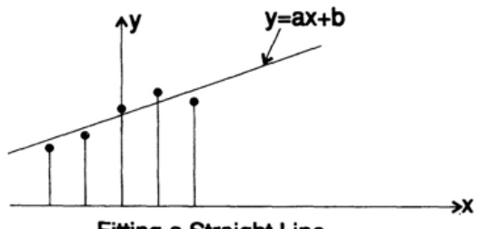  

# Figure 14.I  

The sampling is fundamental to the way we currently process data, when we use the digital computers. And now we understand what a signal is, and what sampling does to a signal, we can safely turn to more of the details of processing signals.  

We will first discuss nonrecursive filters, whose purpose is to pass some frequencies and stop others. The problem first arose in the telephone company when they had the idea if one voice message had all its frequencies moved up (modulated) to beyond the range of another then the two signals could be added and sent over the same wires, and at the other end filtered out and separated, and the higher one reduced (demodulated) back to its original frequencies. This shifting is simply multiplying by a sinusoidal function, and selecting one band (single sideband modulation) of the two frequencies which emerge according to the following trigonometric identity (this time we use real functions)  

$\begin{array}{r}{b t=(\frac{1}{2})[\cos(a+b)t+\cos(a-b)t]}\end{array}$  

There is nothing mysterious about the frequency shifting (modulation) of a signal, it is at most a variant of a trigonometric identity.  

The nonrecursive filters we will consider first are mainly of the smoothing type where the input is the values   $\scriptstyle u(t)=u(n)=u_{n}$   and the output is  $y_{n}$  

$$
y_{n}=\sum_{j=-k}^{k}c_{j}u_{n-j}
$$  

with   $C_{j}{=}C_{-j}$   (the coefficients are symmetric about the middle value   $C_{\mathcal{O}}$  ).  

I need to remind you about least squares as it plays a fundamental role in what we are going to do, hence I will design a smoothing filter to show you how filters can arise. Suppose we have a signal with “noise” added and want to smooth it, remove the noise. We will assume it  seems  reasonable to you fit a straight line to 5 consecutive points of the data in a least squares sense, and then take the middle value on the line as the “smoothed value of the function” at that point.  

For mathematical convenience we pick the 5 points at  $t{=}{2},{-}{1},{0},{1},{2}$   and fit the straight line,  Figure 14.I ,  

${\pmb u}(t)\,{=}\,{\pmb a}+{\pmb b}t$  

Least squares says we should minimize the sum of the squares of the differences between the data and the points on the line, that is, minimize  

$$
M=\sum_{{\bf k}=-2}^{2}\{u_{\bf k}-(a+b k)\}^{2}\,.
$$  

What are the parameters to use in the differentiation to find the minimum? They are the  $a$   and the   $b$  ,  not the  $t$   (now the discrete variable   $k$  ), and   $u$  .  The line depends on the parameters   $a$   and   $b$  ,  and this is often a stumbling block for the student; the parameters of the equation are the variables for minimization! Hence on differentiating with respect to   $a$   and  $b$  ,  and equating the derivatives to zero to get the minimum, we have  

$$
\begin{array}{r}{-\,2\!\sum\{u_{k}-a-b k\}=\!0\,,}\end{array}
$$  

$$
\begin{array}{r}{-\,2\sum[(u_{k}-a-b k)k]=0\,.}\end{array}
$$  

In this case we need only   $a$  ,  the value of the line at the midpoint, hence using (some of the sums are for later use),  

$$
\begin{array}{r l r}{\sum1\!=\!5;}&{{}}&{\sum k^{3}\!=\!0;}\\ {\sum k\!=\!0;}&{{}}&{\sum k^{4}\!=\!34.}\\ {\sum k^{2}\!=\!10;}&{{}}&{}\end{array}
$$  

from the top equation we have  

$$
{\sum}u_{k}\!=\!5a+0b\,,\qquad a\!=\!\frac{1}{5}\sum_{k\!=-2}^{2}u_{k}\,,
$$  

which is simply the average of the five adjacent values. When you think about how to carry out the computation for   $a$  ,  the smoothed value, think of the data in a vertical column,  Figure 14.II , with the coefficients each 1/5, as a running weighting of the data; then you can think of it as a  window  through which you look at the data, with the “shape” of the window being the coefficients of the filter, this case of smoothing being uniform in size.  

Had we used   $2k{+}1$   symmetrically placed points we would still have obtained a running average of the data points as the smoothed value which is supposed to eliminate the noise.  

Suppose instead of a straight line we had smoothed by fitting a quadratic,  Figure 14.III ,  

$$
{\pmb u}(t)\,{=}\,{\pmb a}+b t+c t^{2}\,.
$$  

Setting up the difference of the squares and differentiating this time with respect to  $a,\,b$   and  $c$   we get:  

$$
\begin{array}{r l r}&{}&{-\,2\sum\{u_{k}-a-b\dot{k}-c k^{2}\}=0\,,}\\ &{}&{-\,2\sum\{u_{k}-a-b k-c k^{2}\}k=0\,,}\\ &{}&{-\,2\sum\{u_{k}-a-b k-c k^{2}\}k^{2}=0\,.}\end{array}
$$  

Again we need only   $a.$  .  Rewriting the first and third equations (the middle one does not involve   $a^{\dagger}$  ), and inserting the known sums  

from above, we have  

$$
\begin{array}{c}{{5a+10c=\sum u_{k},}}\\ {{{}}}\\ {{10a+34c=\sum k^{2}u_{k}.}}\end{array}
$$  

To eliminate  $c$  ,  which we do not need, we multiply the top equation by 17 and the lower equation by–5, and add to get  

$$
\begin{array}{r}{\{85-50\}a=17\sum u_{k}-5\sum k^{2}u_{k},}\end{array}
$$  

$$
a=\scriptstyle{\frac{1}{35}}\,[\,-\,3u_{-\,2}\,+\,12u_{-\,1}\,+\,17u_{0}\,+\,12u_{1}\,-\,3u_{2}],
$$  

and this time our “smoothing window” does not have uniform coefficients, but has some with negative values. Do not let that worry you as we were speaking of a window in a metaphorical way and hence negative transmission is possible.  

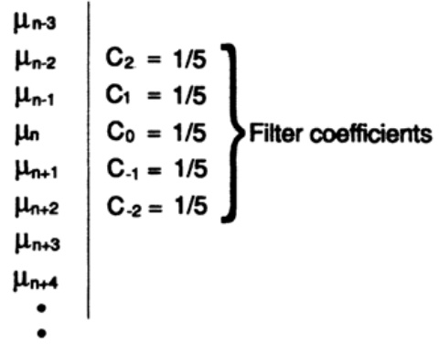  

Figure 14.II  

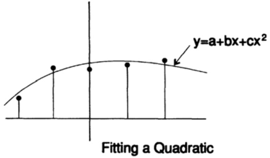  

# Figure 14.III  

If we now shift these two least squares derived smoothing formulas to their proper places about the point  $n$   we would have  

$$
\begin{array}{r l}&{u_{n}=\frac{1}{5}\,[u_{n\,-\,2}+u_{n\,-\,1}+u_{n}+u_{n\,+\,1}+u_{n\,+\,2}],}\\ &{}\\ &{u_{n}=\frac{1}{35}\,[-3u_{n\,-\,2}+12u_{n\,-\,1}+17u_{n}+12u_{n\,+\,1}-3u_{n\,+\,2}].}\end{array}
$$  

We now ask what will come out if we put in a pure eigenfunction. We know because the equations are linear they should give the eigenfunction back, but multiplied by the eigenvalue corresponding to the eigenfunction’s frequency, the transfer function value at that frequency. Taking the top of the two smoothing formulas we have  

$$
\begin{array}{r l}&{u_{n}=\frac{1}{5}\left[\exp\left\{i\omega(n-2)\right\}+\exp\left\{i\omega(n-1)\right\}+\cdots+\exp\{i\omega(n+2)\}\right]}\\ &{\quad=\frac{1}{5}\,\mathrm{e}^{i\omega n}[\mathrm{e}^{-2i\omega}+\mathrm{e}^{-i\omega}+1+\mathrm{e}^{i\omega}+\mathrm{e}^{2i\omega}]\,.}\end{array}
$$  

Hence the eigenvalue at the frequency ω (the transfer function) is, by elementary trigonometry,  

$$
\begin{array}{c l c r}{{H(\omega)=\frac{1}{5}\left[2\cos{2\omega}+2\cos{\omega}+1\right]}}\\ {{{}}}\\ {{=\displaystyle\frac{\sin{(5\omega/2)}}{5\sin{(\omega/2)}}.}}\end{array}
$$  

In the parabolic smoothing case we will get  

$$
\begin{array}{r}{H(\omega)=\frac{1}{35}\,[17+24\cos\omega-6\cos2\omega].}\end{array}
$$  

These are easily sketched along with the   $2k{+}1$   smoothing by straight line curves,  Figure 14.IV .  

Smoothing formulas  have central symmetry in their coefficients, while  differentiating formulas  have odd symmetry. From the obvious formula  

$$
f(x)={\textstyle\frac{1}{2}}\left[f(x)+f(-\,x)\right]+{\textstyle\frac{1}{2}}\left[f(x)-f(-\,x)\right],
$$  

we see any formula is the sum of an odd and an even function, hence any nonrecursive digital filter is the sum of a smoothing filter and a differentiating filter. When we have mastered these two special cases we have the general case in hand.  

For smoothing formulas we see the eigenvalue curve (the transfer function) is a Fourier expansion in cosines, while for the differentiation formula it will be an expansion in sines. Thus we are led, given a transfer function you want to achieve, to the problem of Fourier expansions of a given function.  

Now to a brief recapitulation of Fourier series. If we assume that the arbitrary function  $f(t)$   is represented  

$$
f(t)\!=\!\frac{a_{0}}{2}+\sum_{k=1}^{\infty}\left\{a_{k}\cos k t+b_{k}\sin k t\right\},
$$  

we use the orthogonality conditions (they can be found by elementary trigonometry and simple integrations):  

$$
\begin{array}{r l}&{\displaystyle\int_{-\pi}^{\pi}\cos k t\cos m t\,\mathrm{d}t=\left\{\begin{array}{l l}{0}&{\mathrm{for~}k\neq m,}\\ {\pi}&{\mathrm{for~}k=m\neq0,}\\ {2\pi}&{\mathrm{for~}k=m=0,}\end{array}\right.}\\ &{\displaystyle\int_{-\pi}^{\pi}\cos k t\sin m t\,\mathrm{d}t=0,\quad\mathrm{for~all~}m,}\\ &{\displaystyle\int_{-\pi}^{\pi}\sin k t\sin m t\,\mathrm{d}t=\left\{\begin{array}{l l}{0}&{\mathrm{for~}k\neq m,}\\ {\pi}&{\mathrm{for~}k=m\neq0,}\\ {0}&{\mathrm{for~}k=m=0,}\end{array}\right.}\end{array}
$$  

we get  

$$
\begin{array}{l}{{\displaystyle a_{k}=\frac{1}{\pi}\int\!f(t)\cos k t\,{\mathrm{d}}t\,,}}\\ {{\displaystyle b_{k}=\frac{1}{\pi}\int\!f(t)\sin k t\,{\mathrm{d}}t\,,}}\end{array}
$$  

and because we used an   $a_{0}/2$   for the first coefficient the same formula for   $a_{k}$   holds for the case  $k{=}0$  . In the complex notation it is, of course, much simpler.  

Next we need to prove the fit of  any  orthogonal set of functions gives the least squares fit. Let the set of orthogonal functions be  $\{f_{k}(t)\}$   with weight function   $w(t){\geq}0$  . Orthogonality means  

$$
\begin{array}{r l r}{\lefteqn{\int_{0}\!\!w(t)f_{k}(t)f_{m}(t)\,\mathrm{d}t=0,}}&{\mathrm{for~}k\neq m}\\ &{}&\\ &{}&{=\cfrac{1}{\lambda_{k}},\quad\mathrm{for~}k=m\,.}\end{array}
$$  

As above the formal expansion will give the coefficients  

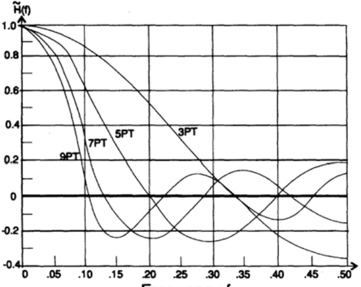  

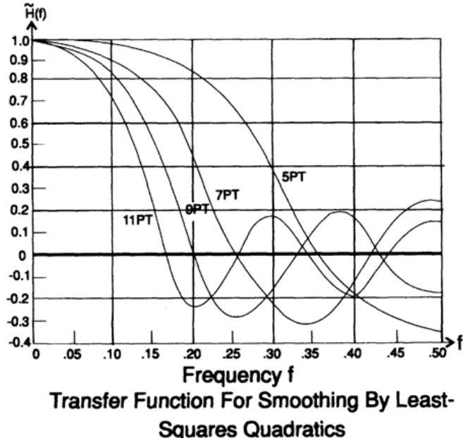  

Figure 14.IV  

$$
c_{k}=\lambda_{k}\int_{\tt R a n g e}w(t)f(t)f_{k}(t)\,\mathrm{d}t,
$$  

where the  

$$
\lambda_{k}\!=\!\frac{1}{\int\!w(t)f^{2}(t)\,\mathrm{d}t}
$$  

when the functions are real, and in the case of complex functions we multiply through by the complex conjugate function.  

Now consider the least squares fit of a complete set of orthogonal functions using the coefficients (capitals)  $C_{k}.$  .  We have  

$$
\int_{\mathbf{\Omega}}{w(t)\{f(t)-\sum C_{k}\,f_{k}(t)\}^{2}\,\mathrm{d}t}\geq0
$$  

to minimize. Differentiate with respect to   $C_{m}.$  .  You get  

$$
\begin{array}{r}{2\displaystyle\int_{\mathsf{\Omega}}w(t)\big\{f(t)-\sum C_{k}\,f_{k}(t)\big\}\,\big\{-f_{m}(t)\big\}\,\mathrm{d}t=0}\end{array}
$$  

and we see from a rearrangement the   $C_{\mathrm{k}}{=}c_{k}$  .  Hence all orthogonal function fits are least squares fits, regardless of the set of orthogonal functions used.  

If we keep track of the inequality we find we will have, in the general case, Bessel’s inequality  

$$
\int\!w(t)f^{2}(t)\,\mathrm{d}t-\sum\frac{1}{\lambda_{k}}C_{k}^{2}\!=\!\mathrm{least~squares~error}\,,
$$  

for the number of coefficients taken in the sum, and this provides a running test for when you have taken enough terms in a finite approximation. In practice this has proven to be a very useful guide to how many terms to take in a Fourier expansion.  

# 15 Digital Filters— II  

When digital filters first arose they were viewed merely as a variant of the classical analog filters; people did not see them as essentially new and different. This is exactly the same mistake which was made endlessly by people in the early days of computers. I was told repeatedly, until I was sick of hearing it, computers were nothing more than large, fast desk calculators. “Anything you can do by a machine you can do by hand.”, so they said. This simply ignores the speed, accuracy, reliability, and lower costs of the machines vs. humans. Typically a single order of magnitude change (a factor of 10) produces fundamentally new effects, and computers are many, many times faster than hand computations. Those who claimed there was no essential difference never made any significant contributions to the development of computers. Those who did make significant contributions viewed computers as something new to be studied on their own merits and not as merely more of the same old desk calculators, perhaps souped up a bit.  

This is a common, endlessly made, mistake; people always want to think that something new is just like the past—they like to be comfortable in their minds as well as their bodies—and hence they prevent themselves from making any significant contribution to the new field being created under their noses. Not everything which is said to be new really is new, and it is hard to decide in some cases when something is new, yet the all too common reaction of, “If s nothing new.” is stupid. When something is claimed to be new, do not be too hasty to think it is just the past slightly improved— it   may be a great opportunity for you to do significant things . But again it may be nothing new.  

The earliest digital filter I used, in the early days of primitive computers, was one which smoothed first by 3’s and then by 5’s. Looking at the formula for smoothing, the smoothing by 3’s has the transfer function  

$$
H(\omega)\!=\!\frac{\sin{(\frac{3}{2})}\,\mathrm{\bar{\omega}}}{3\sin{(\frac{1}{2})}\omega}\,,
$$  

which is easy to draw,  Figure 15.I . The smoothing by 5’s is the same except that the 3/2 becomes a 5/2 and is again easy to draw.  Figure 15.I . One filter followed by the other is obviously their product (each multiplies the input eigenfunction by the transfer function at that frequency), and you see there will be three zeros in the interval, and the terminal value will be 1/15. An examination will show the upper half of the frequencies were fairly well removed by this very simple program for computing a running sum of 3 numbers, followed by a running sum of 5—as is common  in computing practice the divisors were left to the very end where they were allowed for by one multiplication, by 1/15.  

Now you may wonder how,  in all its detail,  a  digital filter  removes frequencies from a stream of numbers —and even students who have had courses in digital filters may not be at all clear how the miracle happens. Hence I propose, before going further, to design a very simple digital filter and show you the inner working on actual numbers.  

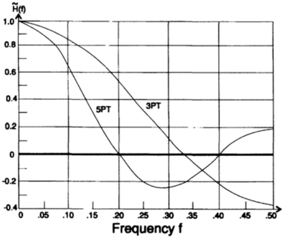  

# Figure 15.I  

I propose to design a simple filter with just two coefficients, and hence I can meet exactly two conditions on the transfer function. When doing theory we use the angular frequency   $\omega$  ,  but in practice we use rotations  $f,$   and the relationship is  

$$
f\!=\!\frac{\omega}{2\pi}\!\!\!\!\!\!\!\left(-\frac{1}{2}\!<\!f\!<\!\frac{1}{2}\right)\!,
$$  

Let the first condition on the digital filter be at  $f{=}1/6$   the transfer function is exactly 1 (this frequency is to get through the filter unaltered), and the second condition at  $\scriptstyle{\mathit{f}}=1/3$   it is to be zero (this frequency is to be stopped completely). My simple filter has the form, with the two coefficients  $a$   and   $b$  ,  

$$
y_{n}\,{=}\,a u_{n\,-\,1}+b u_{n}+a u_{n\,+\,1}\;.
$$  

Substituting in the eigenfunction   $\exp\{2\pi i f n\}$   we will get the transfer function, and using   $n{=}0$   for convenience,  

$$
\begin{array}{r l}{{}}&{{H(f)=b+2a\cos2\pi f\,,}}\\ {{\mathrm{for}\,f\!=\!\frac{1}{6}\,,\quad}}&{{H(\frac{1}{6})=1=b+2a(\frac{1}{2})=b+a\,,}}\\ {{}}&{{{}}}\\ {{\mathrm{for}\,f\!=\!\frac{1}{3}\,,\quad}}&{{H(\frac{1}{3})=0=b+2a(-\frac{1}{2})=b-a\,.}}\end{array}
$$  

The solution is  

$$
\pmb{a}=\pmb{b}=\frac{1}{2}
$$  

and the smoothing filter is simply  

$$
\begin{array}{r}{y_{n}\!=\!(\frac{1}{2})[u_{n-1}+u_{n}+u_{n+1}]\,.}\end{array}
$$  

In words, the output of the filter is the sum of three consecutive inputs divided by 2, and the output is opposite the middle input value. [It is the earlier smoothing by 3’s except for the coefficient 1/2.]  

Now to produce some sample data for the input to the filter. At the frequency  $\mathit{f}\!\!=1/6$   we use a cosine at that frequency taking the values of the cosine at equal spaced values  $\scriptstyle n=0,1,\ldots$  , while the second column of data we use the second frequency  $\mathrm{f}{=}1/3$  , and finally on the third column is the sum of the two other columns and is a signal composed of the two frequencies in equal amounts.  

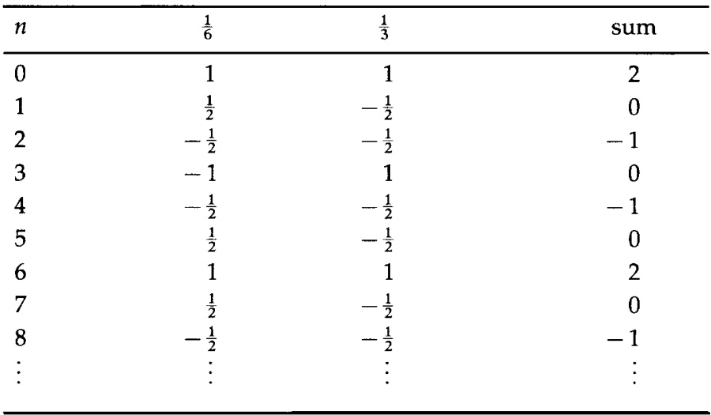  

Let us run the data through the filter. We compute, according to the filter formula, the sum of three consecutive numbers in a column and then divide their sum by 2. Doing this on the first column you will see each time the filter is shifted down one line it reproduces the input function (with a multiplier of 1). Try the filter on the second column and you will find every output is exactly 0, the input function multiplied by its eigenvalue 0. The third column, which is the sum of the first two columns, should pass the first and stop the second frequency, and you get out exactly the first column. You can try the 0 frequency input and you should get exactly 3/2 for every value, if you try  $\scriptstyle{\mathit{f}}=1/4$   you should get the input multiplied by 1/2 (the value of the transfer function at  $\scriptstyle{\mathit{f}}=1/2{\mathit{\rangle}}$  ).  

You have just seen a digital filter in action.  The filter decomposes   the input signal into all its frequencies, multiplies each frequency by its   corresponding eigenvalue (the transfer function), and then adds all the   terms together to give the output.  The simple linear formula of the filter does all this!  

We now return to the problem of designing a filter. What we often want ideally is a transfer function which has a sharp cutoff between the frequencies it passes exactly (with eigenvalues 1), and those which it stops (with eigenvalues 0). As you know, a Fourier series can represent such a discontinuous function, but it will take an infinite number of terms. However, we have only a modest number available if we want a practical filter;   $2k+1$   terms in the smoothing filter gives only   $_{k+1}$   free coefficients, and hence only   $_{k+1}$  arbitrary conditions can be met by the corresponding sum of cosines.  

If we simply expand the desired transfer function into a sum of cosines and then truncate it we will get a least squares approximation to the transfer function. But at a discontinuity the least squares fit is not what you probably think it is.  

To understand what we will see at a discontinuity we must investigate the  Gibbs´ phenomena . We first recall a theorem: If a series of continuous functions converges uniformly in a closed interval then the limit function is continuous. But the limit function we want to approximate is not continuous, it has a jump (discontinuity) between the pass and stop bands of frequencies. No matter how many terms in the series we take, since there cannot be a uniform convergence, we can expect(?) to see a significant overshoot in the neighborhood of the singularity. As we take more terms the size of the overshoot will  not  approach 0.  

Another story. Michelson, of Michelson-Morley fame, built an analog machine to find the coefficients of a Fourier series out to 75 terms. The machine could also, because of the duality of the function and the coefficients, go from the coefficients back to the function. When Michelson did this he observed an overshoot and asked the local mathematicians why it happened. They all said it was his equipment—and yet  

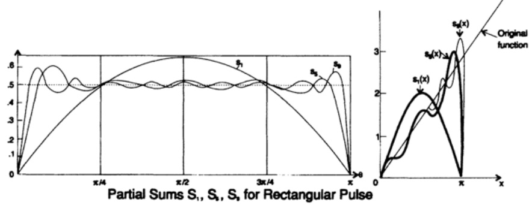  

he was well known as a very careful experimenter. Only Gibbs, of Yale, listened and looked into the matter. The simplest direct approach is to expand a standard discontinuity, say the function  

$$
f(t)=\left\{\begin{array}{r l}{1}&{{\mathrm{for~}}x>0,}\\ {-1}&{{\mathrm{for~}}x<0,}\end{array}\right.
$$  

into a Fourier series of a finite number of terms, rearrange things, and then find the location of the first maximum and finally the corresponding height of the function there. One finds,  Figure 15.II , an overshoot of 0.08949, or  $8.949\%$   overshoot, in the limit as the number of terms in the Fourier series approaches infinity. Many people had the opportunity to discover (really rediscover) the Gibbs’ phenomena, and it was Gibbs who made the effort. It is another example of what I maintain, there are opportunities all around and few people reach for them. As Pasteur said, “Luck favors the prepared mind”. This time the person who was prepared to listen and help a first class scientist in his troubles got the fame.  

I remarked it was rediscovered. Yes. In the 1850s the contradiction in Cauchy’s textbooks: (1) a convergent series of continuous functions converged to a continuous function (it was so stated in his book!), and (2) the Fourier expansion of a discontinuous function (also in his book) flatly contradicted each other. Some people looked into the matter and found they needed the concept of  uniform convergence . Yes, the overshoot of the Gibbs’ phenomena occurs for any series of continuous functions, not just to the Fourier series, and was known to some people, but it had not diffused into common usage. For the general set of orthogonal functions the amount of overshoot depends upon where in the interval the discontinuity occurs, which differs from the Fourier functions where the amount of the overshoot is independent of where the discontinuity occurs.  

We need to remind you of another feature of the Fourier series. If the function exists (for practical purposes) then the coefficients  fall off like   $1/n$  . If the function is continuous,  Figure 15.III  (the two extreme end values must be the same) and the derivative exists then the coefficients fall off like   $1/\upeta^{2}$  ; if the first derivative is continuous and the second derivative exists then they fall off like   $1/n^{3}$  ; if the second derivative is continuous and the third derivative exists then   $1/n^{3}$  , etc. Thus the rate of convergence is directly observable from the function along the real line—which is not true for the Taylor series whose convergence is controlled by singularities which may lie in the complex plane.  

Now we return to our design of a smoothing digital filter using the Fourier series to get the leading terms. We see the least squares fit has trouble at any discontinuity—there is a nasty overshoot in the transfer function for any finite number of terms, no matter how far out we go.  

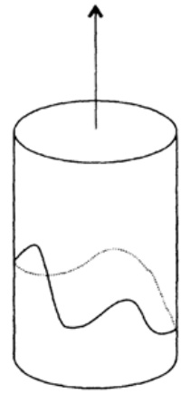  

# Figure 15.III  

To remove this overshoot we first examine Lanczos’ window, also called a “box car”, or a “rectangular” window. Lanczos reasoned if he averaged the output function over an interval of the length of a period of the highest frequency present, then this averaging would greatly reduce the ripples. To see this in detail we take the Fourier series expansion truncated at the   $N\cdot$  -th harmonic, and integrate about a point   $t$   in a symmetric interval of length 1/ N  of the whole interval. Set up the integral for the averaging,  

$$
\frac{\bar{N}}{2\pi}{\int_{x-(\pi/N)}^{x+(\pi/2)}g(s)\mathrm{d}s}\!=\!\frac{N}{2\pi}{\int_{}^{}}\!\!\left[\frac{a_{0}}{2}\!+\!\sum_{1}^{N}\!\{a_{k}\cos k s+b_{k}\sin k s\}\right]\!\mathrm{d}s.
$$  

We now do the integrations  

$$
\mathbf{\omega=}\frac{a_{0}}{2}+\frac{N}{2\pi}\sum_{1}^{N}\left[\frac{a_{k}}{k}\mathrm{sin}\,k s-\frac{b_{k}}{k}\mathrm{cos}\,k s\right]\Bigg|_{x\,-\,(\pi/N)}^{x\,+\,(\pi/N)}
$$  

apply a little trigonometry for the difference of sines and cosines from the two limits  

$$
=\frac{a_{0}}{2}+\sum_{1}^{N}[a_{k}\cos k s+b_{k}\sin k s]\Bigg[\frac{\sin(\pi k/N)}{\pi k/N}\Bigg],
$$  

and you come out with the original coefficients multiplied by the so-called  sigma factors  

$$
\sigma(N,k)=\frac{\bar{\sin}(\pi k/N)}{\pi k/N}.
$$  

An examination of these numbers as a function of   $k$    (  $N$  being fixed and is the number of terms you are keeping in the Fourier series), you will find at  $k{=}0$   the sigma factor is 1, and the sigma factors fall off until at  $k{=}N$   they are 0. Thus they are another example of a window. The effect of Lanczos’ window is to reduce the overshoot to about 0.01189 (by about a factor of 7), and the first minimum to 0.00473 (by about a factor of 10), which is a significant but not complete reduction of Gibbs’ phenomenon.  

But back to my adventures in the matter. I knew, as you do, at the discontinuity the truncated Fourier expansion takes on the midvalue of the two limits, one from each side. Thinking about the finite, discrete case, I reasoned instead of taking all 1 values in the pass band and 0 values in the stop band, I should take 1/ 2 at the transition value. Lo, and behold, the transfer function becomes  

$$
\frac{\sin N x}{2N\sin(x/2)}\cos\frac{x}{2}
$$  

and now has an extra factor (back in the rotational notation)  

and the  $N{+}1$   in the sine term goes to  $N$   as well as the denominator  $N{+}1$   going to  $N$  . Clearly this transfer function is nicer than the Lanczos’ as a low pass filter since it vanishes at the Nyquist frequency, and further dampens all the higher frequencies. I looked around in books on trigonometric series and found it in only one, Zygmund’s two volume work where it was called the  modified   series . The extra “being prepared” did not necessarily pay off this time in a great result, but having found it myself I naturally reasoned using even more modification of the coefficients of the Fourier series (how much and where remained to be found), I might do even better. In short, I saw more clearly what “windows” were, and was slowly led to a closer examination of their possibilities.  

A still third approach to the important Gibbs’ phenomena is via the problem of combining Fourier series. Let  $g(x)$   be (and we are using the neutral variable  $x$   for a good reason)  

$$
g(x)=\sum_{-\infty}^{\infty}c_{k}{\exp\{i k x\}},
$$  

and another function be  

$$
h(x)=\sum_{-\infty}^{\infty}d_{m}\exp\{i m x\}.
$$  

The sum and difference of   $g(x)$   and   $h(x)$   are clearly the corresponding series with the sum or difference of the coefficients.  

The product is another matter. Evidently we will have again a sum of exponentials, and setting   $\scriptstyle n=k+m$  we will have the coefficients as indicated  

$$
g(x)h(x)\!=\!\sum_{n\,=\,-\infty}^{\infty}\!\left\{\sum_{k\,=\,-\infty}^{\infty}\!c_{k}d_{n\,-\,k}\right\}\!\exp\{i n x\}.
$$  

The coefficient of exp {inx},  which is a sum of terms, is called the  convolution  of the original arrays of coefficients.  

In the case where there are only a few nonzero coefficients in the   $c_{k}$   coefficient array, for example, say symmetrically placed about 0, we will have for the coefficient  

$$
\sum_{-k}^{k}c_{k}d_{n-k}
$$  

and this we recognize as the original definition of a digital filter! Thus a filter is the convolution of one array by another, which in turn is merely the multiplication of the corresponding functions! Multiplication on one side is convolution on the other side of the equation.  

As an example of the use of this observation, suppose, as often occurs, there is potentially an infinite array of data, but we can record only a finite number of them (for example, turning on or off a telescope while looking at the stars). This function   $u_{n}$   is being looked at through the rectangular window of all O’s outside a range of   $(2N{+}1)$   1’s—the value 1 where we observe, and the value 0 where we do not observe. When we try to compute the Fourier expansion of the original array from the observed data we must convolve the original coefficients by the coefficients of the window array  

Generally we want a window of unit area, so we need, finally, to divide by   $(2N{+}1)$  . The array is a geometric progression with the starting value of  $\exp\{-i N x\}$  ,  and constant ratio of  ${\bf e x p}\langle i x\rangle$  ,  

$$
\begin{array}{c}{{\displaystyle\frac{{\bf e x p}\{-i N x\}~[1-{\bf e x p}\{i(2N+1)x\}]}{[1-{\bf e x p}\{i x\}]~(2N+1)}}}\\ {{\displaystyle=\frac{\sin\{(N+\frac{1}{2})x\}}{(2N+1)~\sin(\frac{1}{2}x)}.}}\end{array}
$$  

At  $_{x=0}$   this takes on the value 1, and otherwise oscillates rapidly due to the sine function in the numerator, and decays slowly due to the increase of the sine in the denominator (the range in   $x$   is  $(\,\pi,\,\pi)$  . Thus we have the typical diffraction pattern of optics.  

In the continuous case, before sampling, the situation is much the same but the rectangular window we look through has the transform of the general form (ignoring all details)  

$$
{\frac{\sin x}{x}},
$$  

and the convolution of a step function (a discontinuity) with it will, upon inspection, be Gibbs’ phenomena. Figure 15.II . Thus we see Gibbs’ phenomena overshoot in another light.  

Some rather difficult trigonometric manipulation will directly convince you whether we sample the function and then limit the range of observations, or limit the range and then sample, we will end up with the same result; theory will tell you the same thing.  

The simple modification of the discrete Lanczos’ window by changing only the outer two coefficients from 1 to   $1/2$   produced a much better window. Lanczos’ window with its sigma factors modified all the coefficients, but its shape had a corner at the ends, and this means, due to periodicity, there are two discontinuity in the first derivative of the window shape—hence slow convergence. If we reason using weights on the coefficients of the raw Fourier series of the form of  $a$   raised cosine  

$$
w_{k}\!=\!\frac{1+\cos(\pi k/N)}{2},
$$  

then we will have something like Lanczos’ window but now there will be greater smoothness, hence more rapid convergence.  

Writing this out in the exponential form we find the weights on the exponentials are  

$$
{\frac{1}{4}},\;\;{\frac{1}{2}},\;\;{\frac{1}{4}}.
$$  

This is the von Hann window—smoothing in the domain of the data with these weights is equivalent to windowing (multiplying) in the frequency domain. Actually I had rediscovered the von Hann window in the early days of our work in power spectra, and later John Tukey found von Hann had used it long, long before in connection with economics. An examination of what it does to the signal shows it tails off rapidly, but has some side lobes through which other parts of the spectrum “leak in”.  

We were at times dealing with a spectrum which had a strong line in it, and when looking elsewhere in the spectrum through the von Hann window its side lobes might let in a lot of power. The Hamming window was devised to make the maximum side lobe a minimum. The cost is there is much more total leakage in the mean square sense, but a single strong line is kept under control. If you call the von Hann window a “raised cosine” with weights  

$$
\frac{1}{4},\;\;\frac{1}{2},\;\;\frac{1}{4},
$$  

then the Hamming window is a “raised cosine on a platform” with weights  

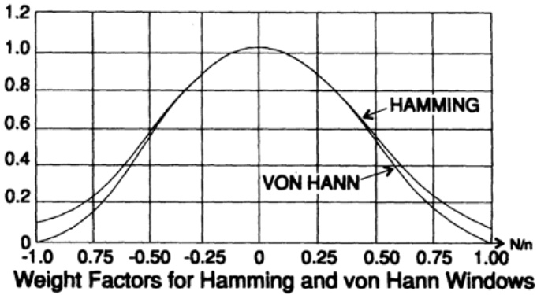  

( Figure 15.IV ). Actually the weights depend on   $N_{i}$  ,  the length of data, but so slightly these constants are regularly used for all cases. The Hamming window has a mysterious, hence popular, aura about it with its peculiar coefficients, but it was designed to do a particular job and is  not  a universal solution to all problems. Most of the time the von Hann window is preferable. There are in the literature possibly 100 various windows, each having some special merit, and none having all the advantages you may want.  

To make you a true insider in this matter I must tell you yet another story. I used to tease John Tukey you are famous only when your name was spelled with a lower case letter such as watt, ampere, volt, fourier (sometimes), and such. When Tukey first wrote up his work on Power Spectra, he phoned me from Princeton and asked if he could use my name on the Hamming window. After some protesting on the matter, I agreed with his request. The book came out with the name “hamming”! There I am!  

It must be your friends, in some sense, who make you famous by quoting and citing you, and it pays, so I claim, to be helpful to others as they try to do their work. They may in time give you credit for the work, which is better than trying to claim it yourself. Cooperation is essential in these days of complex projects; the day of the individual worker is dying fast. Team work is more and more essential, and hence learning to work in a team, indeed possibly seeking out places where you can help others, is a good idea. In any case the fun of working with good people on important problems is more pleasure than the resulting fame. And the choice of important problems means generally management will be willing to supply all the assistance you need.  

In my many years of doing computing at Bell Telephone Laboratories I was very careful never to write up a result which involved any of the physics of the situation lest I get a reputation for “stealing other’s ideas”. Instead I let them write up the results, and if they wanted me to be a co-author, fine! Teamwork implies a very careful consideration for others and their contributions, and they may see their contributions in a different light than you do!  

# 16 Digital Filters—III  

We are now ready to consider the systematic design of nonrecursive filters. The design method is based on the  Figure 16.I , which has 6 parts. On the upper left is a sketch of the ideal filter you wish to have. It can be a low pass, a high pass, a band pass, a band stop, a notch filter, or even a differentiator. For other than differentiator filters you usually want either 0 or 1 as the height in the various intervals, while for the differentiator you want  $i\omega$   since the derivative of the eigenfunction is  

$$
\frac{\mathsf{d}}{\mathsf{d}t}[\mathsf{e x p}\{i\omega t\}]=i\omega\mathsf{e x p}\{i\omega t\}\,,
$$  

hence the desired eigenvalues are the coefficient  iω.  For a differentiator there is likely to be a cutoff at some frequency because, as you can see, differentiation magnifies, multiplies by   $\omega$  ,  and is larger at the high frequencies, which is where the noise usually is,  Figure 16.II . See also  Figure 15.II .  

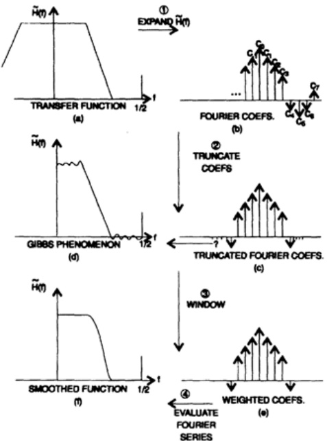  

# Figure 16.I  

The coefficients of the corresponding formal Fourier series are easily computed since the integrands of their expressions are straightforward (using integration by parts when you have a derivative). Suppose we represent the series in the form of the complex exponentials. Then the coefficients of the filter are just the  

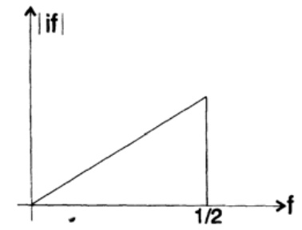  

Figure 16.II  

Fourier coefficients of the corresponding exponential terms. On the upper right of  Figure 16.I  we have a sketch of the coefficients symbolically (they are, of course, complex numbers).  

Next, we must truncate the infinite Fourier series to   $2N{+}1$   terms (meaning use a rectangular window), shown just below in  Figure 16.I  with the corresponding Fourier representation on the left showing Gibbs’ effect.  

Third, we then choose a window to remove the worst of this Gibbs’ effect. The windowed coefficients are shown on the lower right, with the corresponding final digital filter on the lower left. In practice, you should round off the filter coefficients before evaluating the transfer function so their effect will be seen.  

In the method as sketched above, you must choose both the  $N_{i}$  ,  the number of terms to be kept, and the particular window shape, and if what you get does not suit you then you must make new choices. It is a “trial and error” design method.  

J.F.Kaiser has given a design method which finds both the  $N$   and the member of a family of windows to do the job. You have to specify two things beyond the shape: the vertical distance you are willing to tolerate missing the ideal, labeled   $\delta,$  ,  and the transition width between the pass and stop bands, labeled   $\Delta F_{,}$  , Figure 16.III .  

For a band pass filter, with  $f_{p}$   as the band pass and  $f_{s}$   as the band stop frequencies, the sequence of design formulas is:  

$$
\begin{array}{l}{A=-\,20\,\log_{10}\delta,}\\ {{\cal N}\geq(A-7.95)\,/\,28.72\Delta F\quad({\cal N}\,{=}\,\mathrm{an\integer})\,.}\end{array}
$$  

If   $N$   is too big you stop and reconsider your design. Otherwise you go ahead and compute in turn:  

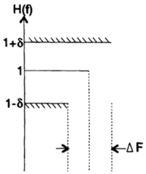  

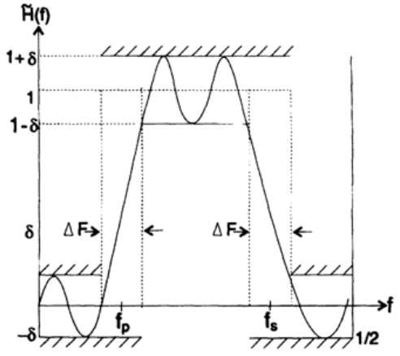  

Figure 16.III  

$$
\alpha=\left\{\begin{array}{l l}{0.1102(A-8.7),}&{50<A,}\\ {0.5842(A-21)^{0.4}+0.07886(A-21),}&{21<A<50,}\\ {0,}&{A<21}\end{array}\right.
$$  

(this is plotted in  Figure 16.IV ). The original Fourier coefficients for a band pass filter are given by:  $c_{0}\!=\!2(f_{s}\!-\!f_{p})$  

$$
c_{k}\!=\!\frac{1}{\pi k}\left[\sin2\pi k f_{s}-\sin2\pi f_{p}\right]\quad(k\!=\!1,2,\ldots,N)\,.
$$  

These coefficients are to be multiplied by the corresponding weights  $w_{k}$   of the window  

$$
w_{k}=\frac{I_{0}\{\alpha\sqrt{1-(k/N)^{2}}\}}{I_{0}(\alpha)},
$$  

where  

$$
I_{0}(x)=1+\sum_{n\mathop{=}1}^{\infty}\left[{\frac{(x/2)^{n}}{n!}}\right]^{2}.
$$  

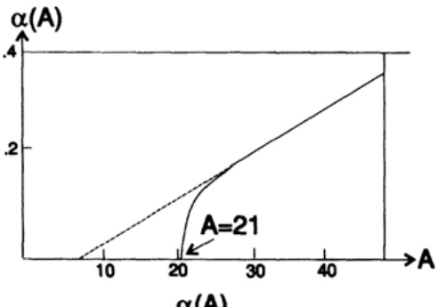  

$I_{O}(x)$   is the pure imaginary Bessel function of order 0. For computing it you will need comparatively few terms as there is an   $n$  ! squared in the denominator and hence the series converges rapidly.  

$I_{O}(x)$   is best computed recursively; for a given  $x$   the successive terms of the series are given by  

$$
u_{n}\!=\!\left[\frac{(x/2)}{n}\right]^{2}\!u_{n-1}.
$$  

For a low pass or a high pass one of the two frequencies  $f_{p}$   or  $p_{s}$   has the limit possible for it. For a band stop filter there are slight changes in the formulas for the coefficients  $c_{k}$  .  

Let us examine Kaiser’s window coefficients, the  $w_{k}$  :  

$$
\begin{array}{r}{\mathrm{{\bf~A}}\mathrm{t}\;k\!=\!0,\quad\boldsymbol{w}_{0}\!=\!I_{0}(\alpha)/I_{0}(\alpha)\!=\!1\,,}\end{array}
$$  

$$
\mathrm{At}\;k\,{=}\,N,\;\;\;w_{N}\,{=}\,\,I_{0}(0)\,/I_{0}(\alpha)\,{=}\,1\,/I_{0}(\alpha)\,.
$$  

As we examine these numbers we see they have, for  $\upalpha{>}0$  , something like the shape of a raised cosine  

$$
{\pmb a}+{\pmb b}\cos X
$$  

and resemble the von Hann and Hamming windows. There is a “platform” when  $A{>}21$  . For  $A{<}21$   then   $\mathrm{a=0}$  , all the   $w_{k}{=}1$   and it is a Lanczos’ type window. As   $A$   increases the platform gradually appears. Thus the Kaiser window has properties like many of the more popular ones, and the particular window you use is determined from your specifications via his window rather than by guess or prejudice.  

How did Kaiser find the formulas? To some extent by trial and error. He first assumed he had a single discontinuity and he ran a large number of cases on a computer to see both the rise time   $\Delta F$   and the ripple height   $\delta.$  .  With a fair amount of thinking, plus a touch of genius, and noting as a function of   $A$  ,  as   $A$  increases we pass from a Lanczos’ window   $(A{<}21)$   to a platform of increasing height,   $1/I_{0}(\upalpha)$  . Ideally he wanted a prolate spheroidal function but he noted they are accurately approximated, for his values, by the  $I_{O}$   $(x)$  . He plotted the results and approximated the functions. I asked him how he got the exponent 0.4. He replied he tried 0.5 and it was too large, and 0.4, being the next natural choice, seemed to fit very well. It is a good example of using what one knows plus the computer as an experimental tool, even in theoretical research, to get very useful results.  

Kaiser’s method will fail you once in a while because there will be more than one edge (indeed, there is the symmetric image of an edge on the negative part of the frequency line) and the ripples from different edges may by chance combine and make the filter ripples go beyond the designated amount. In this case, which seldom arises, you simply repeat the design with a smaller tolerance. The whole program is easily accommodated on a primitive hand held programmable computer like the TI-59, let alone on a modern PC.  

We next turn to the  finite Fourier series . It is a remarkable fact the Fourier functions are orthogonal, not only over a line segment, but for any discrete set of equally spaced points. Hence the theory will go much the same, except there can be only as many coefficients determined in the Fourier series as there are points. In the case of   $2N$   points, the common case, there is one term of the highest frequency only, the cosine term (the sine term would be identically zero at the sample points). The coefficients are determined as sums of the data points multiplied by the appropriate Fourier functions. The resulting representation will, within roundoff, reproduce the original data.  

To compute an expansion it would look like 2 N  terms each with   $2N$   multiplications and additions, hence something like   $(2N)^{2}$   operations of multiplication and addition. But using both: (1) the addition and subtraction of terms with the same multiplier before doing the multiplications, and (2) producing higher frequencies by multiplying lower ones, the Fast Fourier Transform (FFT) has emerged requiring about  $N$   log  $N$  operations. This reduction in computing effort has greatly transformed whole areas of science and engineering—what was once impossible in both time and cost is now routinely done.  

Now for another story from life. You have all heard about the Fast Fourier Transform, and the Tukey- Cooley paper. It is sometimes called the  Tukey-Cooley  transform, or algorithm. Tukey had suggested to me, sort of, the basic ideas of the FFT. I had at that time an IBM Card Programmed Calculator (CPC), and the “butterfly” operation meant it was completely impracticable to do with the equipment I had. Some years later I had an internally programmed IBM 650 and he remarked on it again. All I remembered was it was one of Tukey’s few bad ideas; I completely forgot why it was bad— namely because of the equipment I had at time. So I did not do the FFT, though a book I had already published (1961) shows I knew all the facts necessary, and could have done it easily!  

Moral: when you know something cannot be done, also remember the essential reason why, so later, when the circumstances have changed, you will not say, “It can’t be done”. Think of my error! How much more stupid can anyone be? Fortunately for my ego, it is a common mistake (and I have done it more than once) but due to my goof on the FFT I am very sensitive to it now. I also note when others do it—which is all too often! Please remember the story of how stupid I was and what I missed, and not make that mistake yourself. When you decide something is not possible, don’t say at a later date it is still impossible without first reviewing all the  details  of why you originally were right in saying it couldn’t be done.  

I must now turn to the delicate topic of  power spectra,  which is the sum of the squares of the two coefficients of a given frequency in the real domain, or the square of the absolute value in the complex notation. An examination of it will convince you this quantity does not depend on the origin of the time, but only on the signal itself, contrary to the dependence of the coefficients on the location of the origin. The spectrum has played a very important role in the history of science and engineering. It was the spectral lines which opened the black box of the atom and allowed Bohr to see inside. The newer Quantum Mechanics, starting around 1925, modified things slightly to be sure, but the spectrum was still the key. We also regularly analyse black boxes by examining the spectrum of the input and the spectrum of the output, along with correlations, to get an understanding of the insides—not that there is always a unique insides, but generally we get enough clues to formulate a new theory.  

Let us analyse carefully what we do and its implications, because  what we do to a great extent controls what we can see . There is, usually, in our imaginations at least, a continuous signal. This is usually endless, and we take a sample in time of length   $2L$  . This is the same as multiplying the signal by a Lanczos’ window, a box car if you prefer. This means the original signal is convolved with the corresponding function of the form (sin  $x)/x$   function,  Figure 16.V —the longer the signal the narrower the (sin  $x)/x$   loops are. Each pure spectral line is smeared out into its   $(\sin x)/x$   shape.  

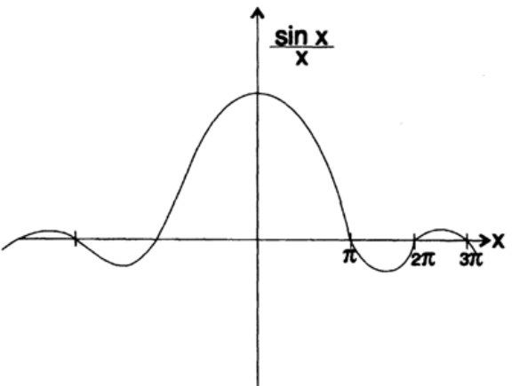  

Next we sample at equal spaces in time, and all the higher frequencies are aliased into lower frequencies. It is an obvious interchanging these two operations, and sampling and then limiting the range, will give the same results—and as I earlier said I once carefully worked out all the algebraic details to convince myself what I thought had to be true from theory was indeed true in practice.  

Then we use the FFT, which is only a cute, accurate, way of getting the coefficients of a finite Fourier series. But when we assume the finite Fourier series representation  we are making the   function periodic — and the period is exactly the sampling interval size times the number of samples we take! This period has generally nothing to do with the periods in the original signal.  We force   all nonharmonic frequencies into harmonic ones —we force a continuous spectrum to be a line spectrum! This forcing is not a local effect, but as you can easily compute, a nonharmonic frequency goes into all the other frequencies, most strongly into the adjacent ones of course, but nontrivially into more remote frequencies.  

I have glossed over the standard statistical trick of removing the mean, either for convenience, or because of calibration reasons. This reduces the amount of the zero frequency in the spectrum to 0, and produces a significant discontinuity in the spectrum. If you later use a window, you merely smear this around to adjacent frequencies. In processing data for Tukey I regularly removed linear trend lines and even trend parabolas from some data on the flight of an airplane or a missile, and then analyzed the remainder. But the spectrum of a sum of two signals is not the sum of the spectra—not by a long shot! When you add two functions the individual frequencies are added  algebraically,  and they may happen to reinforce or cancel each other, and hence give entirely false results! No one I know has any reasonable reply to my objections here—we still do it partly because we do not know what else to do —but the trend line has a big discontinuity at the end (remember we are assuming that the functions are all periodic) and hence its coefficients fall off like   $1/k_{z}$  ,  which is not rapid at all!  

Let us turn to theory. Every spectrum of real noise falls off reasonably rapidly as you go to infinite frequencies, or else it would have infinite energy.  Figure 16.VI . But the sampling process aliases the higher frequencies in lower ones, and the folding as indicated, tends to produce a flat spectrum—remember the frequencies when aliased are algebraically added. Hence we tend to see a flat spectrum for noise, and if it is flat then we call it  white   noise . The signal, usually, is mainly in the lower frequencies. This is true for several reasons, including the reason “over sampling” (sampling more often than is required from the Nyquist theorem), means we can get some averaging to reduce the instrumental errors. Thus the typical spectrum will look as shown in the  Figure 16.VI . Hence the prevalence of low pass filters to remove the  

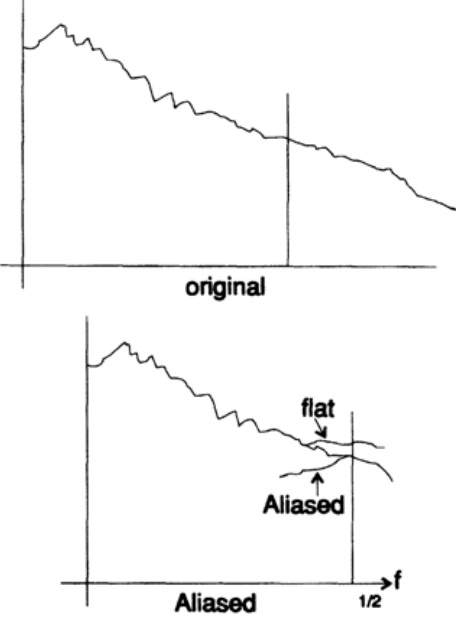  

noise. No linear method can separate the signal from the noise at the same frequencies, but those beyond the signal can be so removed by a low pass filter. Therefore, when we “over sample” we have a chance to remove more of the noise by a low pass filter.  

Remember, there is the implicit understanding we are processing a linear system. The old stock market Fourier analysis which revealed there was only white noise was interpreted to mean there was no way of predicting the future prices of the stocks—and this is correct only if you intend to use simple linear predictors. It says  nothing about the practical use of nonlinear predictors, however. Once again a wide spread misinterpretation of a result because of a lack of understanding of the basics behind the mathematical tool, and only knowing the tool itself. A little knowledge is a dangerous thing—especially if you lack the fundamentals!  

I carefully said in the opening talk on digital filters I  thought  at that time I knew nothing about them. What I did not know was, because I was then ignorant of recursive digital filter design, I had effectively created it when I examined closely the theory of predictor corrector methods of numerically solving ordinary differential equations. The corrector is practically a recursive digital filter!  

While doing the study on how to integrate a system of ordinary differential equation numerically I was unhampered by any preconceived ideas about digital filters, and I soon realized a bounded input, in the words of the filter experts, could produce, if you were integrating, an unbounded output—which they said was  unstable,  but clearly it is just what you must have if you are to integrate; even a constant will produce a linear growth in the output. Indeed, when later I faced integrating trajectories down to the surface of the moon where there is no air, hence no drag, hence no first derivatives explicitly in the equations, and wanted to take advantage of this by using a suitable formula for numerical integration, I found I had to have a quadratic error growth; a small roundoff error in the computation of the acceleration would not be corrected and would lead to a quadratic error in position: an error in the acceleration produces a quadratic growth in position. That is the nature of the problem, unlike on earth where the air drag provides some feedback correction to the wrong value of the acceleration and hence some correction to the error in the position.  

Thus I have to this day the attitude  stability in digital filters  means  “not exponential growth”  from bounded inputs, but allows polynomial growth, and this is not the standard stability criterion derived from classical analog filters, where if it were not bounded you would melt things down —and anyway they had never really thought hard about integration as a filter process.  

We will take up this important topic of recursive filters, which are necessary for integration, in the next chapter.  

# 17 Digital Filters—IV  

We now turn to  recursive filters  which have the form  

$$
y_{n}=\sum_{j\mathop{=}0}^{k}c_{j}u_{n-j}+\sum_{j\mathop{=}1}^{k}d_{j}y_{n-j}.
$$  

From this formula it will be seen we have values on only one side of the current value  $n$  ,  and we use both old and the current signal values,  $u_{n},$   and old values of the outputs,  $y_{n}$  . This is classical, and arises because we are often processing a signal in real time and do not have access to future values of the signal.  

But considering basics, we see if we did have “future values” then a two sided prediction would probably be much more accurate. We would then, in computing the  $y_{n}$   values, face a system of simultaneous linear equations—nothing to be feared in these days of cheap computing. We will set aside this observation, noting only often these days we record the signal on a tape or other media, and later process it in the lab— and therefore we have the future available now. Again, in picture processing, a recursive digital filter which used only data from one side of the point being processed would be foolish since it would not to use some of the available, relevant information.  

The next thing we see is the use of old output as new input means that we have  feedback —and this automatically means questions of  stability . It is a condition we must watch at all times in the design of a recursive filter; it will restrict what we can do. Stability here means the effects of the initial conditions do not dominate the results.  

Being a linear system we see whatever pure frequency we put into the filter when in the steady state,  only that frequency can emerge, though it may be phase shifted. The transients, however, can have other frequencies which arise from the solution of the homogeneous difference equation. The fact is  we are solving a difference   equation with constant coefficients with the  $u_{n}$    terms forming the “forcing   function”— that is exactly what a recursive filter is, and nothing else.  

We therefore assume for the steady state (which ignores the transients)  

$$
u_{n}=A_{I}\exp\{i\omega t\},\ \ \ y_{n}=A_{0}\exp\{i\omega t\}\,,
$$  

(with the  $A\,^{\circ}\!s$   possibly complex to allow for the phase shift), and this leads, on solving for the ratio of  $A_{O}\!A_{I},$  to the transfer   function  

$$
\frac{A_{0}}{A_{I}}\!=\!\frac{\sum_{j=0}^{k}\!c_{j}{\bf e x p}\{-i j\omega\}}{1\!-\!\sum\!d_{j}{\bf e x p}\{-i j\omega\}}.
$$  

This is a  rational function  in the complex variable   $\exp\{i\omega t\}{=}z$   rather than, as before with non-recursive filters, a polynomial in  z . There is a theory of Fourier series representation of a function; there is not as yet a theory of the representation of a function as the ratio of two Fourier series (though I see no reason why there cannot be such a theory). Hence the design methods are at present not systematic (as Kaiser did for the non-  

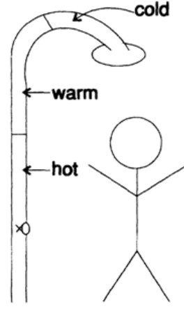  

recursive filter design theory), but rather a collection of trick methods. Thus we have Butterworth, two types of Chebyshev (depending on having the equal ripples) in the pass or the stop band, and elliptic filters (whose name comes from the fact elliptic functions are used) which are equal ripple in both.  

I will only talk about the topic of feedback. To make the problem of feedback graphic I will tell you a story about myself. One time long ago I was host of a series of six, one half hour, TV programs about computers and computing, and it was made mainly in San Francisco. I found myself out there frequently, and I got in the habit of staying always in the same room in the same hotel—it is nice to be familiar with the details of your room when you are tired late at night or when you may have to get up in the middle of the night —hence the desire for the same room.  

Well, the plumber had put nice, large diameter pipes in the shower,  Figure 17.I . As a result in the morning when I started my shower it was too cold, so I turned up the hot water knob, still too cool, so more, still too cool, and more, and then when it was the right temperature I got in. But of course it got hotter and hotter as the water which was admitted earlier finally got up the pipe and I had to get out, and try again to find a suitable adjustment of the knob. The  delay  in the hot water getting to me was the trouble. I found myself, in spite of many experiences, in the same classic hunting situation of instability. You can either view my response as being too strong (I was too violent in my actions), or else the detection of the signal was too much delayed, (I was too hasty in getting into the tub). Same effect in the long run! Instability! I never really got to accept the large delay I had to cope with, hence I daily had a minor trouble first thing in the morning! In this graphic example you see the essence of instability.  

I will not go on to the design of recursive digital filters here, only note I had effectively developed the theory myself in coping with corrector formulas for numerically solving ordinary differential  equations. The form of the corrector in a predictor-corrector method is  

$$
y_{n+1}=\sum_{j=0}^{k}c_{j}y_{n-j}+\sum_{j=0}^{k}d_{j}y_{n-j}^{\prime}.
$$  

We see the  $u_{j}$   of the recursive filter are now the derivatives  ${y_{n}}^{,}$   of the output and come from the differential equation. In the standard nonrecursive filter there no feedback paths—the  $y_{n}$   that are computed do not appear later in the right hand side. In the differential equation formula they appear both in this feedback path and also through the derivative terms they form another, usually nonlinear, feedback path. Hence stability is a more difficult topic for differential equations than it is for recursive filters.  

These recursive filters are often called “infinite impulse response filters” (IIR) because a single disturbance will echo around the feedback loop, which even if the filter is stable will die out only like a geometric progression. Being me, of course I asked myself if  all  recursive filters had to have this property, and soon found a counter example. True, it is not the kind of filter you would normally design, but it showed their claim was superficial. If you will only ask yourself, “Is what I am being told really true?” it is amazing how much you can find is, or borders on, being false, even in a well developed field!  

In  Chapter 26  I will take up the problem of dealing with the expert. Here you see a simple example of what happens all too often. The experts were told something in class when they were students first learning things, and at the time they did not question it. It becomes an accepted fact, which they repeat and never really examine to see if what they are saying is true or not, especially in their current situation.  

Let me now turn to another story. A lady in the Mathematics Department at Bell Telephone Laboratories was square dancing with a physicist one weekend at a party, and on Monday morning in the hallway she casually mentioned to me a problem he had. He was measuring the number of counts in a radioactive experiment at each of, as I remember, 256 energy level. It is called “the spectrum of the process”. His problem was he needed the derivative of the data.  

Well, you know: (a) the number of nuclear counts at a given energy is bound to produce a ragged curve, and (b) differentiating this to get the local slope is going to be a very difficult thing to do. The more I thought about her casual remark the more I felt he needed real guidance—meaning me! I looked him up in the Bell Telephone Laboratories phone book and explained my interest and how I got it. He immediately wanted to come up to my office, but I was obdurate and insisted on meeting in his laboratory. He tried using his office, and I stuck to the lab. Why? Because I wanted to size up his abilities and decide if I thought his problem was worth my time and effort, since it promised to be a tough nut to crack. He passed the lab test with flying colors—he was clearly a very competent experimenter. He was at about the limit of what he could do —a week’s run to get the data and a lot of shielding was around the radio-active source, hence not much we could do to get better data. Furthermore, I was soon convinced, although I knew little about the details, his experiment was important to physics as well as to Bell Telephone Laboratories. So I took on the problem. Moral: To the extent you can choose, then work on problems you think will be important.  

Obviously it was a smoothing problem, and Kaiser was just teaching me the facts, so what better to do than take the experimentalist to Kaiser and get Kaiser to design the appropriate differentiating filter? Trouble immediately! Kaiser had always thought of a signal as a function of time, and the square of the area under the curve as the energy, but here the energy was the independent variable! I had repeated trouble with Kaiser over this point until I bluntly said, “All right, his energy is time and the measurements, the counts, is the voltage”. Only then could Kaiser do it. The curse of the expert with their limited view of what they can do. I remind you Kaiser is a very able man, yet his expertise, as so often happens to the expert, limited his view. Will you in your turn do better? I am hoping such stories as this one will help you avoid that pitfall.  

As I earlier observed, it is usually the signal which is in the lower part of the Nyquist interval of the spectrum and the noise is pretty well across the whole of the Nyquist interval, so we needed to find the cutoff edge between the meaningful physicist’s signal and the flat white noise. How to find it? First, I extracted from the physicist the theoretical model he had in his mind, which was a lot of narrow spectral lines of gaussian shape on top of a broad gaussian shape (I suspected Cauchy shapes, but did not argue with him as the difference would be too small, given the kind of data we had). So we modeled it, and he created some synthetic data from the model. A quick spectral analysis, via an FFT, gave the signal confined to the lowest 1/20 of the Nyquist interval. Second, we processed a run of his experimental data and found the same location for the edge! What luck! (Perhaps the luck should be attributed to the excellence of the experimenter.) For once theory and practice agreed! We would be able to remove about   $95\%$   of the noise.  

Kaiser finally wrote for him a program which would, given the cutoff edge position wherever the experimenter chose to put it, design the corresponding filter. The program: (1) designed the corresponding differentiating filter, (2) wrote the program to compute the smoothed output, and then (3) processed the data through this filter without any interference from the physicist.  

I later caught the physicist adjusting the cutoff edge for different parts of the energy data on the same run, and had to remind him there was such a thing as “degrees of freedom”, and what he was doing was not honest data processing. I had much more trouble, once things were going well, to persuade him to get the most out of his expensive data, he should actually work in the square roots of the counts as they had equal variances. But he finally saw the light and did so. He and Kaiser wrote a classic paper in the area, as it opened the door on a new range of things which could be done.  

My contribution? Mainly, first identifying the problem, next getting the right people together, then monitoring Kaiser to keep him straight on the fact filtering need not have exclusively to do with time signals, and finally, reminding them of what they knew from statistics (or should have known and probably did not).  

It seems to me from my experience this role is increasingly needed as people get to be more highly specialized and narrower and narrower in their knowledge. Someone has to keep the larger view and see to it things are done honestly. I think I came by this role from long a long education in the hands of John Tukey, plus a good basic grounding in the form of the universal tool of Science, namely Mathematics. I will talk in  Chapter 23  about the nature of Mathematics.  

Most signal processing is indeed done on time signals. But most digital filters will probably be designed for small, special purpose studies, not necessarily signals in time. This is where I ask for your future attention. Suppose when you are in charge of things at the top, you are interested in some data which shows past records of relative expenses of manpower to equipment. It is bound to be noisy data, but you would like to understand, in a basic sense, what is going on in the organization—what long term trends are happening- so slowly people hardly sense them as they happen, but which never-the-less are fundamental to understand if you are to manage well. You will need a digital filter to smooth the data to get a glimpse of the trend,   $i f$   it exists. You do not want to find a trend when it does not exist, but if it does you want to know pretty much what it has been, so you can project what it is likely to be in the near future. Indeed, you might want to observe, if the data will support it, any change in the slope of the trend. Some signals, such as the ratio of fire power to tonnage of the corresponding ship, need not involve time at all, but will tell you something about the current state of the Navy. You can, of course, also study the relationship as a function of time.  

I suggest strongly, at the top of your career you will be able to use a lot of low level digital filtering of signals, whether in time or not, so you will be better able to manage things. Hence, I claim, you will probably design many more filters for such odd jobs than you will for radar data reduction and such standard things. It is usually in the new applications of knowledge where you can expect to find the greatest gains.  

Let me supply some warnings against the misuse of intellectual tools, and I will talk  Chapter 27  on topics closer to statistics than I have time for now. Fourier analysis implies linearity of the underlying model. You can use it on slightly nonlinear situations, but often elaborate Fourier analyses have failed because the underlying phenomena was too nonlinear. I have seen millions of dollars go down that drain when it was fairly obvious to the outsider the nonlinearities would vitiate all the linear analysis they could do using the Fourier function approach. When this was pointed out to them, their reply seemed to be they did not know what else to do, so they persisted in doing the wrong thing! I am not exaggerating here.  

How about nonlinear filters? The possibilities are endless, and must, of course, depend on the particular problem you have on hand. I will take up only one, the  running median filter . Given a set of data you  

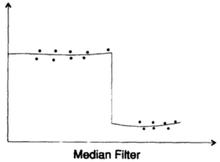  

# Figure 17.II  

compute the running median as the output. Consider how it will work in practice. First, you see it will tend to smooth out any local noise—the median will be near the average, which is the straight line least squares fit used for local smoothing. But at a discontinuity,  Figure 17.II , say we picture a flat level curve and then a drop to another flat curve, what will the filter do? With an odd number of terms in the median filter, you see the output will stay up until you have more than half of the points on the lower level, where upon it will  jump to the lower level. It will follow the discontinuity fairly well, and will not try to smooth it out completely! For some situations that is the kind of filtering you want. Remove the noise locally, but do not lose the sudden changes in the state of the system being studied.  

I repeat, Fourier analysis is linear, and there exist many nonlinear filters, but the theory is not well developed beyond the running median. Kalmann filters are another example of the use of partially nonlinear filters, the nonlinear part being in the “adapting” itself to the signal.  

One final basic observation I made as I tried to learn digital filters. One day in examining a book on Fourier integrals, I found there is a theorem which states the variability of the function times the variability of its transform must exceed a certain constant. I said to myself, “What else is this than the famous uncertainty principle of Quantum Mechanics?” Yes, every linear theory must have an uncertainty principle involving conjugate variables. Once you adopt the linear approach, and QM claims absolute additivity of the eigenstates, then you must find an uncertainty principle. Linear time invariance leads automatically to the eigenfunctions   $\mathbf{e}^{i\omega t}$  . They lead immediately to the Fourier integral, and Fourier integrals have the uncertainty principal. It is as if you put on blue tinted glasses; everywhere you look you must see things with a bluish tint! You are therefore not sure the famous uncertainty principle of QM is really there or not; it may be only the effect of the assumed linearity. More than most people want to believe, what we see depends on how we approach the problem! Too often we see what we want to see, and therefore you need to consciously adopt a scientific attitude of doubting your own beliefs.  

To illustrate this I will repeat the Eddington story of the fishermen. They used a net for fishing, and when they examined the size of the fish they had caught they decided there is a minimum size to the fish in the sea.  

In closing, if you do not, now and then, doubt accepted rules it is unlikely you will be a leader into new areas; if you doubt too much you will be paralyzed and will do nothing. When to doubt, when to examine the basics, when to think for yourself, and when to go on and accept things as they are, is a matter of style, and I can give no simple formula on how to decide. You must learn from your own study of life. Big advances usually come from significant changes in the underlying beliefs of a field. As our state of knowledge advances the balances between aspects of doing research change. Similarly, when you are young then serendipity has probably a long time to pay off, but when you are old it has little time and you should concentrate more on what is at hand.  

# 18 Simulation—I  

A major use of computers these days, after writing and text editing, graphics, program compilation, etc. is simulation .  

A simulation is the answer to the question: “What if…?”  

More than 9 out of 10 experiments are done on computers these days. I have already mentioned my serious worries we are depending on simulation more and more, and are looking at reality less and less, and hence seem to be approaching the old scholastic attitude what is in the textbooks is reality and does not need constant experimental checks. I will not dwell on this point further now.  

We use computers to do simulations because they are:  

1. cheaper, 2. faster, 3. often better, 4. can do what you cannot do in the lab.  

On points 1 and 2, as expensive and slow as programming is, with all its errors and other faults, it is generally much cheaper and faster than getting laboratory equipment to work. Furthermore, in recent years expensive, top quality laboratory equipment has been purchased and then you often find in less than 10 years it must be scrapped as being obsolete. All of the above remarks do not apply when a situation is constantly recurring and the lab testing equipment is in constant use. But let lab equipment lie idle for some time, and suddenly it will not work properly! This is called “shelf life”, but it is some times the “shelf life” of the skills in using it rather than the “shelf life” of the equipment itself! I have seen it all too often in my direct experience. Intellectual shelf life is often more insidious than is physical shelf life.  

On point 3, very often we can get more accurate readings from a simulation than we can get from a direct measurement in the real world. Field measurements, or even laboratory measurements, are often hard to get accurately in dynamic situations. Furthermore, in a simulation we can often run over much wider ranges of the independent variables than we can do with any one lab setup.  

On point 4, perhaps most important of all, a simulation can do what no experiment can do.  

I will illustrate these points with specific stories using simulations I have been involved in so you can understand what simulations can do for you. I will also indicate some of the details so those who have had only a little experience with simulations will have a better feeling for how you go about doing one—it is not feasible to actually carry out a big simulation in class, they often take years to complete.  

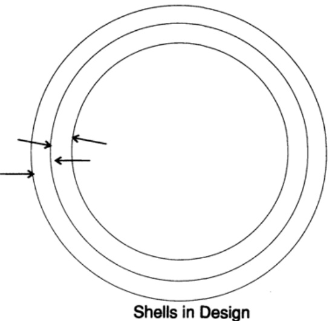  

The first large computation I was involved with was at Los Alamos during WW-II when we were designing the first atomic bomb. There is no possibility of a small scale experiment—either you have a critical mass or you do not.  

Without going into classified details, you will recall one of the two designs was spherically symmetric and was based on implosion,  Figure 18.I . They divided the material and space into many concentric shells. They then wrote the equations for the forces on each shell (both sides of it) as well as the equation of state which gives, among other things, the density of the material from the pressures on it. Next they broke time up into intervals of   $10^{-8}$   seconds (shakes, from a shake of a lamb’s tail, I suppose). Then for each time interval we calculated, using the computers, where each shell would go and what it would do during at that time, subject to the forces on it. There was, of course, a special treatment for the shock wave front from the outer explosive material as it went through the region. But the rules were all, in principle, well known to experts in the corresponding fields. The pressures were such there had to be a lot of guessing things would be much the same outside the realms of past testing, but a little physics theory gave some assurances.  

This already illustrates a main point I want to make. It is  necessary  to have a great deal of special knowledge in the field of application. Indeed, I tend to regard many of the courses you have taken, and will take, as merely supplying the corresponding expert knowledge. I want to emphasize this obvious necessity for expert knowledge—all too often I have seen experts in simulation ignore this elementary fact and think they could safely do simulations on their own.  Only  an expert in the field of application can know if what you have failed to include is vital to the accuracy of the simulation, or if it can safely be ignored.  

Another main point is that in most simulations there has to be a highly repetitive part, done again and again from the same piece of programming, or else you cannot afford to do the initial programming! The same computations were done for each shell and then for each time interval—a great deal of repetition! In many situations, the power of the machine itself so far exceeds our powers to program it is wise to look early and constantly for the repetitive parts of a proposed simulation, and when possible cast the simulation in the corresponding form.  

A very similar simulation to the atomic bomb arises in weather prediction. There the atmosphere is broken up into large blocks of air, and the relevant conditions for cloud cover, albedo, temperature, pressure, moisture, velocity, etc. must be initially assigned to each block,  Figure 18.II . Then using conventional  

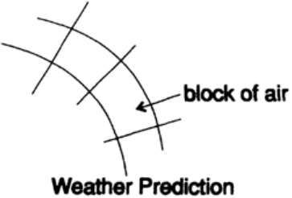  

physics for the atmosphere, we trace where each block goes in a short time interval, along with the relevant changes. It is the same kind of step by step evolution as before.  

However, there is a significant difference between the two problems, the bomb and the weather prediction. For the bomb small differences in what happened along the way did not greatly affect the overall performance, but as you know the weather is quite sensitive to small changes. Indeed, it is claimed whether or not a butterfly flaps its wings in Japan can determine whether or not a storm will hit this country and how severe it will be.  

This is fundamental theme I must dwell on. When the simulation has a great deal of  stability,  meaning resistance to small changes in its overall behavior, then a simulation is quite feasible; but when small changes in some details can produce greatly different outcomes then a simulation is a difficult thing to carry out accurately. Of course, there is long term stability in the weather; the seasons follow their appointed rounds regardless of small details. Thus there is both short term (day to day) instabilities in the weather, and longer term (year to year) stabilities as well. But the ice ages show there are also very long term instabilities in the weather, with apparently even longer stabilities!  

I have met a large number of this last kind of problem. It is often very hard to determine in advance whether one or the other, stability or instability, will dominate a problem, and hence the  possibility or impossibility of getting the desired answers. When you undertake a simulation, look closely at this aspect of the problem  before  you get too involved and then find, after a lot of work, money, and time, you cannot get suitable answers to the problem. Thus there are situations which are easy to simulate, ones which you cannot in a practical sense handle at all, and most of the others which fall between the two extremes. Be prudent in what you promise you can do via simulations!  

When I went to Bell Telephone Laboratories in 19461 soon found myself in the early stages of the design of the earliest NIKE system of guided missiles. I was sent up to MIT to use their RDA #2 differential analyser, given the interconnections of the parts of the analyser, and much advice from others who knew a lot more than I did about how to run the simulations.  

They had a slant launch in the original design, along with variational equations which would give me information to enable me to make sensible adjustments to the various components, such as wing size. I should point out, I suppose, the solution time for one trajectory was about 1/2 hour, and about half way through one trajectory I had to commit myself to the next trial shot. Thus I had lots of time to observe and to think hard as to why things went as they did. After a few days I gradually got a “feeling” for the missile behavior, why it did as it did under the different guidance rules I had to supply. As time went on I gradually realized a vertical launch was best  in all cases;  getting out of the dense lower air and into the thin air above was better than any other strategy—I could well afford the later induced drag when I had to give guidance orders to bend the trajectory over. In doing so, I found I was greatly reducing the size of the wings, and realized, at least fairly well, the equations and constants I had been given, for estimating the changes in the effects due to changes in the structure of the missile, could hardly be accurate over so large a range of perturbations (though they had never told me the source of the equations, I inferred it). So I phoned down for advice and found I was right— I had better come home and get new equations.  

With some delay due to other users wanting their time on the RDA #2, I was soon back and running again, but with a lot more wisdom and experience. Again, I developed a feeling for the behavior of the missile—I got to “feel” the forces on it as various programs of trajectory shaping were tried. Hanging over the output plotters as the solution slowly appeared gave me the time to absorb what was happening. I have often wondered what would have happened if I had had a modern, high speed computer. Would I ever have acquired the feeling for the missile, upon which so much depended in the final design? I often doubt hundreds more trajectories would have taught me as much—I simply do not know. But that is why  I am suspicious, to this day, of getting too many solutions   and not doing enough very careful thinking about what you have seen . Volume output seems to me to be a poor substitute for acquiring an intimate feeling for the situation being simulated.  

The results of these first simulations were we went to a vertical launch (which saved a lot of ground equipment in the form of a circular rail and other complications), made many other parts simpler, and seemed to have shrunk the wings to about 1/3 of the size I was initially given. I had found bigger wings, while giving greater maneuverability in principle, produced in practice so much drag in the early stages of the trajectory the later slower velocity in fact gave less maneuverability in the “end game” of closing in on the target.  

Of course these early simulations used a simple atmosphere of exponential decrease in density as you go up, and other simplifications, which in simulations done years later were all modified. This brings up another belief of mine—doing simple simulations at the early stages lets you get  insights  into the whole system which would be disguised in any full scale simulation.  I strongly advise,   when possible, to start with the simple simulation and evolve it to a more   complete, more accurate, simulation later so the insights can arise early.  Of course, at the end, as you freeze the final design, you must put in all the small effects which could matter in the final performance. But (1) start as simply as you can provided you include all the main effects, (2) get the insights, and then (3) evolve the simulation to the fully detailed one.  

Guided missiles were some of the earliest explorations of supersonic flight, and there was another great unknown in the problem. The data from the only two supersonic wind tunnels we had access to flatly contradicted each other!  

Guided missiles led naturally to space flight where I played a less basic part in the simulations, and more as an outside source of advice and initial planning of the  mission profile,  as it is called.  

Another early simulation I recall was the travelling wave tube design. Again, on primitive relay equipment I had lots of time to mull over things, and I realized I could, as the computation evolved, know what shape to give other than the always assumed constant diameter pipe. To see how this happens, consider the basic design of a travelling wave tube. The idea is you send the input wave along a tightly wound spiral around a hollow pipe, and hence the effective velocity of the electromagnetic wave down the pipe is greatly reduced. We then send down the center of the pipe an electron beam. The beam has initially a greater velocity than the wave has to go along the helix. The interaction of the wave and the beam means the beam will be slowed down—meaning energy goes from the beam to the wave, meaning the wave is amplified! But, of course, there comes a place along the pipe when their velocities are about the same and further interactions will only spoil things. So I got the idea if I gradually expanded the diameter of the pipe then again the beam would be faster than the wave and still more energy would be transferred from the beam to the wave. Indeed, it was possible to compute at each cycle of computation the ideal taper for the signal.  

I also had the nasty idea since I had found the equations were really local linearizations of more complex nonlinear equations, I could, at about every twentieth to fiftieth step, estimate the nonlinear component. I found to their amazement on some designs the  estimated  nonlinear component was larger than the computed linear component—thus vitiating the approximation and stopping the useless computations.  

Why tell the story? Because it illustrates another point I want to make—an  active mind  can contribute to a simulation even when you are dealing with experts in a field where you are a strict amateur. You, with your hands on all the small details, have a chance to see what they have not seen, and to make significant contributions, as well as save machine time! Again, all too often I have seen things missed during the simulation by those running it, and hence were not likely to get to the users of the results.  

One major step you must do, and I want to emphasize this, is to make the effort to master their jargon. Every field seems to have its special jargon, one which tends to obscure what is going on from the outsider-and also, at times, from the insiders! Beware of jargon—learn to recognize it for what it is, a special language to facilitate communication over a restricted area of things or events. But it also blocks thinking outside the original area for which is was designed to cover. Jargon is both a necessity and a curse. You should realize you need to be active intellectually to gain the advantages of the jargon and to avoid the pitfalls, even in your own area of expertise!  

During the long years of cave man evolution apparently people lived in groups of around 25 to 100 in size. People from outside the group were generally not welcome, though we think there was a lot of wife stealing going on. When the long years of cave man living are compared with the few of civilization: (less than ten thousand years) we see we have been mainly selected by evolution to resent outsiders, and one of the ways of doing this is the use of special, jargon, languages. The thieves’ argot, group slang, husband and wife’s private language of words, gestures, and even a lift of an eyebrow, are all examples of this common use of a private language to exclude the outsider. Hence this  instinctive use of jargon  when an outsider comes around should be consciously resisted at all times—we now work in much larger units than those of cave man and we must try continually to overwrite this earlier design feature in us.  

Mathematics is not always the unique language you wish it were. To illustrate this point recall I earlier mentioned some Navy Intercept simulations involving the equivalent of 28 simultaneous first order differential equations. I need to develop a story. Ignoring all but the essential part of the story, consider the problem of solving one differential equation  

$$
y^{\prime}\!=\!f(x,y)\quad{\mathrm{with~}}|y|\leq1,
$$  

Figure 18.III . Keep this equation in mind as I talk about the real problem. I programmed the real problem of 28 simultaneous differential equations to get the solution and then limited certain values to 1, as if it were voltage limiting. Over the objections of the proposer, a friend of mine, I insisted he go through the raw, absolute binary coding of the problem with me, as I explained to him what was going on at each stage. I refused to compute until he did this—so he had no real choice! We got to the limiting stage in the program and he said, “Dick, that is fin limiting, not voltage limiting.” meaning the limited value should be put in at each step and not at the end. It is as good an example as I know of to illustrate the fact both of us understood exactly what the mathematical symbols meant—we both had no doubts—but there was no agreement in our interpretations of them! Had we not caught the error I doubt any real, live experiments involving airplanes would have revealed the decrease in maneuverability which resulted from my interpretation. That is why, to this day, I insist a person with the intimate understanding of what is to be simulated  must  be involved in the detailed programming. If this is not done then you may face similar situations where both the proposer and the programmer know exactly what is meant, but their interpretations can be significantly different, giving rise to quite different results!  

You should not get the idea simulations are always of time dependent functions. One problem I was given to run on the differential analyser we had built out of old M9 gun director parts was to compute the probability distributions of blocking in the central office. Never mind they gave me an infinite system of  

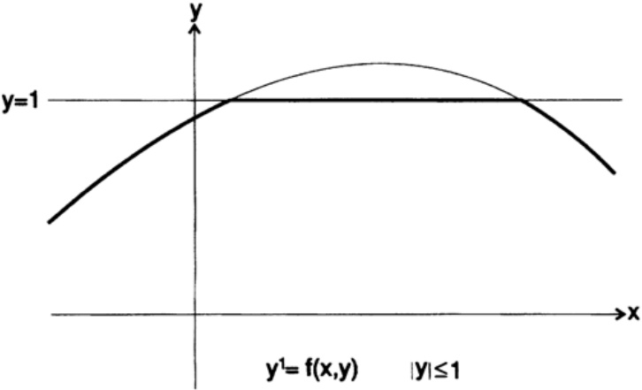  

interconnected linear differential equations, each one giving the probability distribution of that many calls on the central office as a function of the total load. Of course on a finite machine something must be done, and I had only 12 integrators, as I remember. I viewed it as an impedance line, and using the difference of the last two computed probabilities I assumed they were proportional to the difference of the next two, (I used a reasonable constant of proportionality derived from the difference from the two earlier functions) thus the term from the next equation beyond what I was computing was reasonably supplied. The answers were quite popular with the switching department, and made an impression, I believe, on my boss who still had a low opinion of computing machines.  

There were underwater simulations, especially of an acoustic array put down in the Bahamas by a friend of mine where, of course, in winter he often had to go to inspect things and take further measurements. There were numerous simulations of transistor design and behavior. There were simulations of the micro wave “jump-jump” relay stations with their receiver horns, and the overall stability arising from a single blip at one end going through all the separate relay stations. It is perfectly possible while each station recovers promptly from the blip, never-the-less the size of the blip could grow as it crossed the continent. At each relay station there was stability in the sense the pulse died out in time, but there was also the question of the stability in space—did a random pulse grow indefinitely as it crossed the continent? For colorful reasons I named the problem “Space stabilization”. We had to know the circumstances in which this could and could not happen—hence a simulation was necessary because, among other things, the shape of the blip changed as it went across the continent.  

I hope you see almost any situation you can describe by some sort of mathematical description can be simulated in principle. In practice you have to be very careful when simulating an unstable situations— though I will tell you in  Chapter 20  about an extreme case I had to solve because it was important to the Laboratories, and that meant, at least to me, I had to get the solution, no matter what excuses I gave myself it could not be done. There are always answers of some sort f or important problems if you are determined to get them. They may not be perfect, but in desperation something is better than nothing—provided it is reliable!  

Faulty simulations have caused people to abandon good ideas, and these occur all too often! However, one seldom sees them in the literature as they are very, very seldom reported. One famuous faulty simulation which was widely reported (before the errors were noted by others) was a whole world simulation done by the so called “Club of Rome”. It turned out the equations they chose were designed to show a catastrophy no matter how you started or chose most of the coefficients! But it also turned out when others finally got the equations and tried to repeat the computations the comuputations has serious errors! I will turn to this aspect of simulating things in the next chapter as it is a very serious matter— to either report things which make people believe what they want to believe, and are not so, or which you discourage people from pursuing their good ideas.  

# 19 Simulation—II  

We now take up the question of the reliability of a simulation. I can do no better than quote from the Summer Computer Simulation Conference of 1975,  

“Computer based simulation is now in wide spread use to analyse system models and evaluate theoretical solutions to observed problems. Since important decisions must rely on simulation, it is essential that its validity be tested, and that its advocates be able to describe the level of authentic representation which they achieved.”  

It is an unfortunate fact when you raise the question of the reliability of many simulations you are often told about how much man power went into it, how large and fast the computer is, how important the problem is, and such things, which are completely irrelevant to the question that was asked.  

I would put the problem slightly differently:  

Why should anyone believe the simulation is relevant?  

Do not begin any simulation until you have given this question a great deal of thought and found appropriate answers. Often there are all kinds of reasons given as to why you should postpone trying to answer the question, but unless it is answered satisfactorily then all that you do will be a waste of effort, or even worse, either misleading, or even plain erroneous.  The question covers both the   accuracy of the modeling and the accuracy of the computations.  

Let me inject another true story. It happened one evening after a technical meeting in Pasadena, California we all went to dinner together and I happened to sit next to a man who had talked about, and was responsible for, the early space flight simulation reliability. This was at the time when there had been about eight space shots. He said they never launched a flight until they had a more than 99 point something percent reliability, say   $99.44\%$   reliability. Being me I observed there had been something like eight space shots; one live simulation had killed the astronauts on the ground, and we had had one clear failure, so how could the reliability be that high? He claimed all sort of things, but fortunately for me the man on his other side joined in the chase and we forced a reluctant admission from him what he calculated was not the reliability of the flight, but only the reliability of the simulation. He further claimed everyone understood that. Me, “Including the Director who finally approves of the flight?” His refusal to reply, under repeated requests, was a clear admission my point went home, he himself knew the Director did not understand this difference but thought the report was the reliability of the actual shot.  

He later tried to excuse what he had done with things like, what else could he do, but I promptly pointed out a lot of things he could do to connect his simulation with reality much closer than he had. That was a Saturday night, and I am sure by Monday morning he was back to his old habits of identifying the simulation with reality and making little or no independent checks which were well within his grasp. That is what you can expect from simulation experts— they are concerned with the simulation and have little or no regard for reality, or even “observed reality”.  

Consider the extensive business simulations and war gaming which goes on these days. Are all the essentials incorporated correctly into the model, or are we training the people to do the wrong things? How relevant to reality are these gaming models? And many other models?  

We have long had airplane pilot trainers which in many senses give much more useful training than can be given in real life. In the trainer we can subject the pilot to emergency situations we would not dare to do in reality, nor could we ever hope to produce the rich variety the trainer can. Clearly these trainers are very valuable assets. They are comparatively cheap, efficient in the use of the pilot’ s time, and are very flexible. In the current jargon, they are examples of “virtual reality”.  

But as time goes on, and planes of other types are developed, will the people then be as careful as they should be to get  all  the new interactions into the model, or will some small, but vital, inter-actions of the new plane be omitted by oversight, thus preparing the pilot to fail in these situations?  

Here you can see the problem clearly. It is not that simulations are not essential these days, and in the near future, rather it is necessary for the current crop of people, who have had very little experience with reality to realize they need to know enough so the simulations include all essential details. How will you convince yourself you have not made a mistake somewhere in the vast amount of detail? Remember how many computer programs, even after some years of field use, still have serious errors in them! In many situations such errors can mean the difference between life or death for one or more people, let alone the loss of valuable equipment, money, and time.  

The relevant accuracy and reliability of simulations are a serious problem. There is, unfortunately, no silver bullet, no magic incantation you can perform, no panacea for this problem. All you have is yourself.  

Let me now describe my sloppiest simulation. In the summer of 1955 Bell Telephone Laboratories decided to hold an open house so the people living nearby, as well as relatives and friends of employees, could learn a little about what the people who worked there did. I was then in charge of, for that time, a large analog differential analyzer, and I was expected to give demonstrations all day Saturday. Much of what we were doing at that time was trajectories of guided missiles, and I was not about to get into security trouble showing some sanitized versions. So I decided a tennis game, which clearly involves aerodynamics, trajectories, etc. would be an honest demonstration of what we did, and anyway I thought it would be a lot more appealing and interesting to the visiting people.  

Using classical mechanics I set up the equations, incorporated the elastic bounce, set up the machine to play one base line with the human player on the other, along with both the angle of the racket and the hardness with which you hit the ball which were set by two dials conveniently placed. Remember, in those days (1955) there were not the game playing machines in many public places, hence the exhibit was a bit novel to the visitors. I then invited a smart physicist friend, who was also an avid tennis player, to inspect and tune up the constants for bounce (asphalt court) and air drag. When he was satisfied, then behind his back I asked another physicist to give me a similar opinion without letting him alter the constants. Thus I got a reasonable simulation of tennis without “spin” on the ball.  

Had it been other than a public amusement I would have done a lot more. I could have hung a tennis ball on a string in front of variable strength fan and noted carefully the angle at which it hung for different wind velocities, thus getting at the drag, and included those for variously worn tennis balls. I could have dropped the balls and noted the rebound for different heights to test the linearity of the elastic constants. If it had been an important problem I could have filmed some games and tested I could reproduce the shots which had no spin on them. I did not do any of these things! It was not worth the cost. Hence it was my sloppiest simulation.  

The major part of the story, however, is what happened! As the groups came by they were told what was going on by some assistants, and shown the display of the game as it developed on the plotting board outputs. Then we let them play the game against the machine, and I had programmed the simulation so the machine could lose. Watching the entire process from the background, human and machine, I noticed, after a while, not one adult ever got the idea of what was going on enough to play successfully, and almost every child did! Think that over! It speaks volumes about the elasticity of young minds and the rigidity of older minds! It is currently believed most old people cannot run VCRs but children can!  

Remember this fact, older minds have more trouble adjusting to new ideas than do younger minds since you will be showing new ideas, and even making formal presentations to, older people throughout much of your career. That your children could understand what you are showing is of little relevance to whether or not the audience to whom you are running the exhibition can. It was a terrible lesson I had to learn, and I have tried not to make that mistake again. Old people are not very quick to grasp new ideas—it is not they are dumb, stupid, or anything else like that, it is simply older minds are usually slow to adjust to  radically  new ideas.  

I have emphasized the necessity of having the underlying laws of what ever field you are simulating well under control. But there are no such laws of economics! The only law of economics that I believe in is Hamming’s law, “You cannot consume what is not produced”. There is not another single, reliable law in all of economics I know of which is not either a tautology in mathematics, or else it is sometimes false. Hence when you do simulations in economics you have not the reliability you have in the hard sciences.  

Let me inject another story. Some years ago the following happened at U.C.Berkeley. About equal numbers of males and females applied to graduate school, but many more men were accepted than women. There was no reason to assume the men were better prepared on the average than were the women. Hence there was obvious discrimination in terms of the ideal model of fairness. The President of the University demanded to know which departments were guilty. A close examination showed no department was guilty! How could that be? Easy! Various departments have varying numbers of openings for the entering graduate school, and various ratios of men to women applying for them. Those with both many openings and many men applying are the hard sciences, including mathematics, and those with the low ratios of acceptance and many women applying, are the soft ones like literature, history, drama, social sciences, etc. Thus the discrimination, if you can say it occurred, because the men, at a younger age, were made to take mathematics which is the preparation for the hard sciences, and the women could or could not take mathematics as they chose. Those who avoided mathematics, physics, chemistry, engineering, and such, were simply not eligible to apply where the openings were readily available, but had to apply where there was a high probability of rejection. People have trouble adapting to such situations these days!  

Here you see a not widely recognized phenomena, but one which has been extensively examined in many of its appearances by statisticians; the combining of data can create effects not there in detail. You are used to the idea combining data can obscure things, but it can also create effects is less well known. You need to be careful in your future this does not happen to you—you are accused, from amalgamated data, of what you are not guilty. Simpson’s paradox is a famous example where both subsamples can favor A over B and C, but the combined data favors B over A.  

Now you may say in the space flight simulations we combined data and at times made the whole vehicle into a point. Yes, we did, but we knew the laws of mechanics and knew when we could and could not do it. Thus, in midcourse corrections you get the vehicle pointed in exactly the right direction and then fire the retro or other rockets to get the corrections, and during such times you do not allow the people to move around in the vehicle as that can produce rotations and hence spoil the careful directing of the rockets. We thought we knew enough of the background theory, and we had had years of experience in the matter, so the combining of all the details into one point mass still gave reliable simulation results.  

In many proposed areas of simulation there are neither such known experiences nor theory. Thus when I was occasionally asked to do some ecological simulation I quietly asked for the mathematically expressed rules for every possible interaction, for example given the amount of rain what growth of the trees would occur, what exactly were the constants, and also where I could get some real live data to compare some test runs. They soon got the idea and went elsewhere to get someone more willing to run very questionable simulations which would give the results they wanted and could use for their propaganda. I suggest you keep your integrity and do not allow yourself to be used for other people’s propaganda; you need to be wary when agreeing to do a simulation!  

If these soft science situations are hard to simulate with much reliability, think of those in which humans by their knowledge of the simulation can alter their behavior and thus vitiate the simulation. In the insurance business the company is betting you will live a long time and you are betting you will die young. For an annuity the sides are reversed, in case you had not thought about that point. While, in principle, you can fool the insurance companies and commit suicide, it is not common, and the insurance companies are indeed careful about this point.  

In the stock market, if there were any widely known strategy for making lots of money, the very knowledge of it would ruin the strategy! In this case people would alter their behavior to vitiate the predictions you made. Not that some legally permissible strategy could not exist (though I am pretty sure it would have to be a fairly nonlinear theory to do much good above the normal stock market rise) but it would have to be kept very private. The basic trouble is the stock market is crooked. The insiders have knowledge which according to the explicitly stated laws they may not act on, but they do so all the time! If you do not use inside information then you have little chance against those who do, and if you do act on inside information you are acting illegally! It is a bad business either way, and the insiders are resisting all attempts to automate the trading by machine which would eliminate some of the inside deals they now profit on. It is known they do but it is apparently not provable in court! Furthermore, false “inside information” is constantly circulated in the hopes the outsiders will think they are inside and act on it to the profit of the originators of the rumors.  

Thus beware of any simulation of a situation which allows the human to use the output to alter their behavior patterns for their own benefit, since they will do so whenever they can.  

But all is not lost. We have devised  the method of scenarios  to cope with many difficult situations. In this method we do not attempt to predict what will actually happen, we merely give a number of possible projections. This is exactly what Spock did in his baby raising book. From the observations of many children in the past he assumed the future (early) behavior of children would not differ radically from these observations, and he predicted not what your specific child would do but only gave typical patterns with ranges of behavior, on such things as when babies begin to crawl, talk, say “no” to everything, etc. Spock predicted mainly the biological behavior and avoided as much as he could the cultural behavior of the child.  

In some simulations the method of scenarios is the best we can do. Indeed, that is what I am doing in this set of chapters; the future I predict cannot be known in detail, but only in some kinds of scenarios of what is likely to happen, in my opinion. More on this topic in the next chapter.  

I want to return to the problem of deciding how you can make realistic estimates of the reliability of your simulations, or those which are presented to you in the future. First, does the background field support the assumed laws to a high degree? How sure are you some small, but vital, effect is not missing? Is the input data reliable? Is the simulation stable or unstable? What cross checks against known past experience have you available for checking things? Can you produce any internal checks, such as a conservation of mass, or energy or angular momentum? Without redundancy, as you know from the talks on error correcting codes, there can be no check on the reliability. I have not so far mentioned what at first will appear to be a trivial point; do the marks on the paper which describe the problem get into the machine accurately? Programming errors are known to be all too common.  

Let me tell another story which illustrates this point there are things one can do about this problem. One time the chemistry department was considering a contract to examine, for the Federal Government, the chemistry of the upper atmosphere immediately after an atomic bomb explosion. I was asked only to supply advice and guidance. Upon looking into the problem I found there would be in each case which was to be computed somewhere around 100 ordinary differential equations to be solved, depending on the particular chemical reactions they expected.  

I did not think they could get the various sets of these equations into the machine correctly every time, so I said we would first write a program which would go from the punched cards, one card describing each particular reaction with all its relevant constants of interactions, to the equations themselves, thus insuring all the terms were there; no errors in the coefficients not being the same for the same reaction as it appears in different equations, etc. By hindsight it is an obvious thing to do; at the time it was a surprise to them, but it paid off in effort on their part. They had only to select those cards from the file they wanted to include in the particular simulation they were going to run, and the machine automated all the rest, including the spacing of the steps in the integration. My main idea, besides the ease and accuracy, was to keep their minds focused on what they were best able to do—chemistry—and not have them fussing with the machine with which they were not experts. They were, moreover, in charge of the actual computing. I made it easy to do the book-keeping and the mechanics of the computer, but I refused to relieve them of the thinking part.  

In summary, the reliability of a simulation, of which you will see many in your career since it is becoming increasingly common, is of vital importance. It is not something you can take for granted just because a big machine gives out nicely printed sheets, or displays nice, colorful pictures.  You are responsible for your decisions,   and cannot blame them on those who do the simulations, much as you   wish you could. Reliability is a central question with no easy answers.  

Let us return to the relationship of analog to digital computers. The point sometimes arises in these of days of  neural nets . The argument is made the analog machines can compute things which the digital version cannot. We need to look at this point more closely —it is really the same as was made years ago when the analog computers were being displaced by digital computers. In these chapters we now have the relevant knowledge to approach the topic carefully.  

The basic fact is the Nyquist sampling theorem says it takes two samples for the highest frequency present in the signal (for the equally spaced points on the entire real line) to reproduce (within roundoff) the original signal. In practice most signals have a fairly sharp cutoff in the frequency band; with no cutoff there would be infinite energy in the signal!  

In practice we use only a comparatively few samples in the digital solution and hence something like twice the number Nyquist requires is needed. Furthermore, usually we have samples on only one side and this produces another factor of two. Hence, something from seven to ten samples for the highest frequency are needed. And there is still a little aliasing of the higher frequencies into the band which is being treated (but this is seldom where the information in the signal lies). This can be checked both theoretically and experimentally.  

Sometimes the mathematician can accurately estimate the frequency content of the signal (possibly from the answer being computed), but usually you have to go to the designers and get their best estimates. A competent designer should be able to deliver such estimates, and if they cannot then you need to do a lot of exploring of the solutions to estimate this critical number, the sampling rate of the digital solution. The step by step solution of a problem is actually sampling the function, and you can use adaptive methods of step by step solution if you wish. You have much theory and some practice on your side.  

For accuracy the digital machine can carry many digits, while analog machines are rarely better than one part in 10,000 per component, if that much. Thus analog machines cannot give very accurate answers, nor carry out “deep computations”. But often the situation you are simulating has uncertainties of a similar size, and with care you can handle the accuracy problem.  

With the passage of time we have developed wider band width analog computers, but we have used this to speed up the computations rather than use the implied band width of the circuits for accuracy. In any case, the fundamental accuracy of the analog parts limits what you can do with an analog machine. The old mechanical computers, like the RDA #2, took about half an hour per solution; the electrical computers derived from the gun directors, which still had some mechanical parts, took minutes; later all electronic ones took seconds, and now some of them can flash the solution on the screen as fast as you can supply input.  

In spite of their relatively low accuracy analog computers are still valuable at times, especially when you can incorporate a part of the proposed device into the circuits so you do not have to find the proper mathematical description of it. Some of the faster analog computers can react to the change of a parameter, either in the initial conditions or in the equations themselves, and you can see on the screen the effect immediately. Thus you can get a “feel” for the problem easier than for the digital machines which generally take more time per solution and must have a full mathematical description. Analog machines are generally ignored these days, so I feel I need to remind you they have a place in the arsenal of tools in the kit of the scientist and engineer.  

# 20 Simulation—III  

I will continue the general trend of the last chapter, but center on the old expression “garbage in, garbage out”, often abbreviated GIGO. The idea is if you put ill-determined numbers and equations (garbage) in then you can only get ill-determined results (garbage) out. By implication the converse is tacitly assumed, if what goes in is accurate then what comes out must be accurate. I shall show both of these assumptions can be false.  

Because many simulations still involve differential equations we begin by considering the simplest first order differential equations of the form  

$$
y^{\prime}\!=\!f(x,y),
$$  

You recall  a direction field  is simply drawing at each point in the  $x{-}y$   plane a line element with the slope given by the differential equation,  Figure 20.I . For example, the differential equation  

$$
y^{\prime}\!=\!x^{2}+y^{2},\;y(0)\!=\!1,
$$  

has the indicated direction field,  Figure 20.II . On each of the concentric circles  

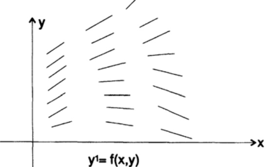  

Figure 20.I  

$$
x^{2}+y^{2}=k,
$$  

the slope is always the same, the slope depending on the value of   $k.$  .  These are called  isoclines .  

Looking at the following picture,  Figure 20.III , the direction field of another differential equation, on the left you see a diverging direction field, and this means small changes in the initial starting values, or small errors in the computing, will soon produce large differences in the values in the middle of the trajectory. But on the right hand side the direction field is converging, meaning large differences in the middle will lead to small differences on the right end. In this single example you see both small errors can become large ones, and large ones can become small ones, and furthermore, small errors can become large and then again  

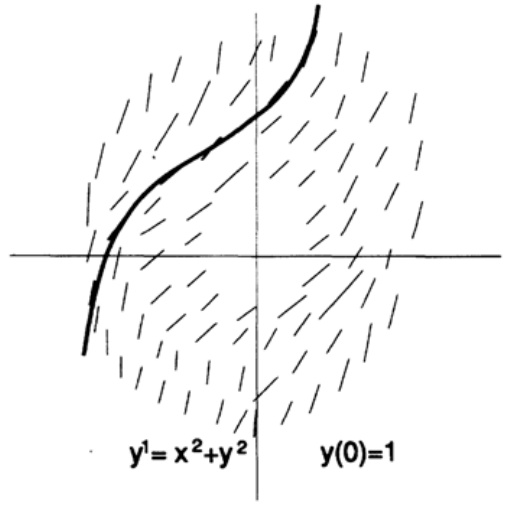  

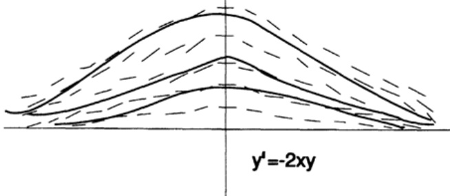  

become small. Hence the accuracy of the solution depends on  where  you are talking about it, not any absolute accuracy over all. The function behind all this is  

$$
y(x)=\exp\{-x^{2}\},
$$  

whose differential equation is, upon differentiating,  

$$
y^{\prime}(x)=-\,2x\,\mathbf{exp}\{-\,x^{2}\}=-\,2x y(x).
$$  

Probably in your mind, you have drawn a “tube” about the “true, exact solution” of the equation, and seen the tube expands first and then contracts. This is fine in two dimensions, but when I have a system of  $n$   such differential equations, 28 in the Navy intercept problem mentioned earlier, then these tubes about the true solutions are not exactly what you might think they were. The four circle figure in two dimensions, leading to the  $n$  -dimensional paradox by ten dimensions,  Chapter 9 , shows how tricky such imagining may become. This is simply another way of looking at what I said in earlier chapter about stable and unstable problems; but this time I am being more specific to the extent I am using differential equations to illustrate matters.  

How do we numerically solve a differential equation? Starting with only one first order ordinarily differential equation of first degree, we imagine the direction field. Our problem is from the initial value, which we are given, we want to get to the next nearby point. If we take the local slope from the differential equation and move a small step forward along the tangent line then we will make a only small error, Figure 20.IV . Using that point we go to the next point, but as you see from the Figure we gradually depart  

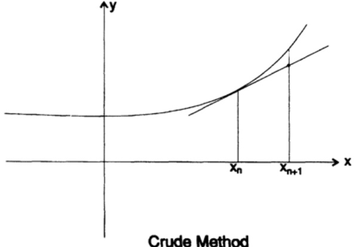  

Figure 20.IV  

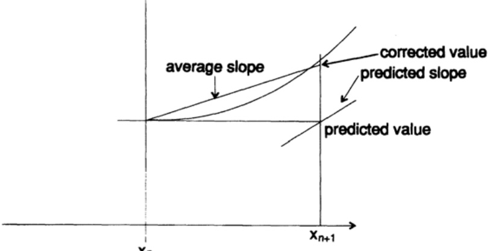  

from the true curve because we are always using “the slope that was”, and not a typical slope in the interval. To avoid this we “predict” a value, use that value to evaluate the slope there, (use the differential equation), and then use the average slope of the both ends to estimate the average slope to use for the interval, Figure 20.V . Then using this average slope we move the step forward again, this time using a “corrector” formula. If the predicted and corrected values are “close” then we assume we are accurate enough, but if they are far apart then we must shorten the step size. If the difference is too small then we should increase the step size. Thus the traditional “predictor-corrector” methods have built into them an automatic mechanism for checking the step-bystep error—but this step-by-step error is, of course,  not the whole accumulated error  by any means! The accumulated error clearly depends on the convergence or divergence of the direction field.  

We used simple straight lines for both predicting and correcting. It is much more economical, and accurate, to use higher degree polynomials, and typically this means about fourth degree polynomials, (Milne, Adams-Bashforth, Hamming, etc). Thus we must use several old values of the function and derivative to predict the  next value, and then using this in the differential equation we get an estimated new slope, and with this slope plus using old values of the function and slope, we correct the value. A moment’s thought and  you  see the corrector is just a recursive digital filter where the input data are the derivatives, and the output values are the positions. Stability and all we discussed there are relevant. As mentioned before, there is the extra feedback through the differential equation’s predicted value which goes into the corrected slope. But both are simply solving a diff erence equation—recursive digital filters are simply this formula and nothing more. They are not just transfer functions as your course in digital filters might have made you think; plainly and simply, you are computing numbers coming from a difference equation. There is a difference however. In the filter you are strictly processing by a linear formula, but because in the differential equation there is the nonlinearity which arises from the evaluation of the derivative terms, it is not exactly the same as a digital filter.  

If you have   $n$   differential equations then you are dealing with a vector with   $n$   components; you predict each component forward, evaluate each of the  $n$   derivatives, correct each predicted value, and finally take the step, or reject it if the error is too large in a sense you think fairly measures the local error. You tend to think about small errors as a “tube” surrounding the actual computed trajectory, but again you need to remember the four circle paradox, in a high dimension the “tubes” are not at all like you wish they were.  

Now let me note a significant difference between the two approaches, numerical analysis and filter theory. The classical methods of numerical analysis, and still about the only one you will find in the accepted texts, use polynomials to approximate functions, but the recursive filter used frequencies as the basis for evaluating the formula! This is a different thing entirely!  

To see this difference suppose we are to build a simulator for humans landing on Mars. The classical formulas will concentrate on the trajectory shape in terms of local polynomials, and the path will have small discontinuities in the acceleration as we move from interval to interval. In the frequency approach we will concentrate on getting the frequencies right and let the actual positions be what happen. Ideally the trajectories are the same; practically they can be quite different.  

Which solution do you want? The more you think about it the more you realize the pilot in the trainer will want to get the “feel” of the landing vehicle, and this seems to mean the frequency response of the simulator should feel right to the pilot. If the position is a bit off, then the feedback control during landing can compensate for this, but if it feels wrong in the actual flight then the pilot is going to be bothered by the new experience which was not in the simulator. It has always seemed to me the simulator should prepare the pilots for the actual experience as best we can (we cannot fake out for long the lower gravity of Mars), so they will feel comfortable when the real event occurs, having experienced it many times in the trainer. Alas, we know far too little of what the pilot “feels” (senses). Does the pilot feel only the Fourier real frequencies, or maybe they also feel the decaying Laplace complex frequencies (or should we use wavelets?). Do different pilots feel the same kinds of things? We need to know more than we apparently now do about this important design criterion.  

The above is the standard conflict between the Mathematician’s and engineer’s approaches. Each has a different aim in solving the differential equations (and in many other problems), and hence they get different results out of their calculations. If you are involved in a simulation then you see there can be highly concealed matters which are important in practice, but which the Mathematicians are unaware of and they will deny the effects matter. But looking at the two trajectories I have crudely drawn,  Figure 20.VI , the top curve is accurate in position but the corners will give a very different “feel” than reality will, and the second curve will be more wrong in position but more right in “feel”. Again, you see why I believe the person with the insight into the problem must get deep inside the solution methods and not accept traditional methods of solution.  

I now turn to another story about the early days of Nike guided missile testing. At this point they were field testing at White Sands what was called “the telephone pole tests”. They were simply firings where the missile was to follow a preassigned trajectory, and at the last moment explode so the whole would not come  

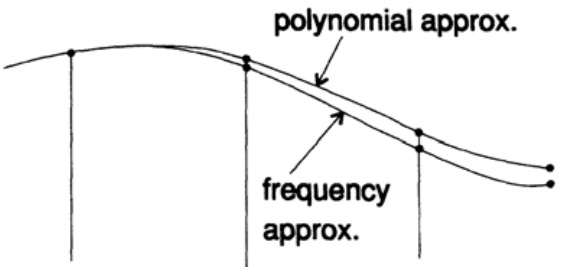  

# Figure 20.VI  

down outside the range and do great damage, rather the parts would more gently fall to the ground in the range and supposedly do less harm. The object of the tests was to get realistic measurements of drag, lift, and other properties as functions of altitude and velocity, for purposes of settling the details of the design as well as for improving the design.  

I found my friend back at the Labs wandering around the halls looking quite unhappy. Why? Because the first two of some six test shots have broken up in mid-flight and no one knew why. The delay meant the data to be gathered to enable us to go to the next stage of design was not available and hence the whole project was in serious trouble. I observed to him if he would give me the differential equations describing the flight I would put a girl on the job of hand calculating the solution (big computers were not readily available in the late 1940s). In about a week they delivered seven first order equations, and the girl was ready to start. But what are the starting conditions just before the trouble arose? (I did not in those days have the computing capacity to do the whole trajectory rapidly.) They did not know! The telemetered data was not clear just before the failure. I was not surprised, and it did not bother me much. So we used the guessed altitude, slope, velocity, angle of attack, etc. one for each of the seven variables of the trajectory; one condition for each equation. Thus I had garbage in. But I had earlier realized the nature of the field trials being simulated was such that small deviations from the proposed trajectory would be corrected automatically by the guidance system! I was dealing with a strongly convergent direction field.  

We found both pitch and yaw were stable but as each one settled down it threw more energy into the other; thus there was not only the traditional stability oscillations in pitch and yaw, but due to the rotation of the missile about its long axis there was a periodic transfer of increasing energy between them. Once the computer curves for even a short length of the trajectory were shown everyone realized immediately they had forgotten the cross connection stability, and they knew how to correct it. Now we had the solution they could then also read the hashed up telemetered data from the trials and check the period of the transfer of energy was just about correct—meaning they had supplied the correct differential equations to be computed. I had little to do except to keep the girl on the desk calculator honest and on the job. My real contribution was: (1) the realization we could simulate what had happened, which is now routine in all accidents but was novel then, and (2) the recognition there was a convergent direction field so the initial conditions need not be known accurately.  

My reason for telling you the story is to show you GIGO need not be right. Another example comes from my earliest Los Alamos experience on bomb simulation. I gradually came to realize behind the computation was fairly inaccurate data for computing  the   equation of state,  which relates pressure to density (and temperature which I will ignore for the moment). Data from high pressure labs, from estimates from earthquakes, from estimates from the density of the cores of stars, and finally from the asymptotic theory of infinite pressures were plotted as a set of points on a very large piece of graph paper,  Figure 20.VII  Then large French curves were used to draw a curve connecting the thinly scattered points. We then read this curve to   $3{\textstyle{\frac{1}{3}}}$  decimal places, meaning we guessed at a 5 or a 0 in the fourth place. We used those numbers to subtabulate a five digit table, and at places in the table to six digit numbers, which were then the official data for the actual computations we ran. I was at that time, as I earlier said, sort of a janitor of computing, and my job was to keep things going to free the physicists to do their job.  

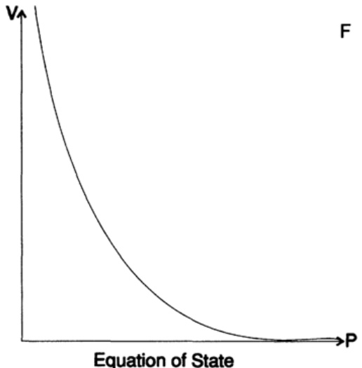  

# Figure 20.VII  

At the end of the war I stayed on at Los Alamos an extra six months, and one of the reasons was I wanted to know how it was such inaccurate data could have led to such accurate predictions for the final design. With, at last, time to think for long periods, I found the answer. In the middle of the computations we were using effectively second differences; the first differences gave the forces on each shell on one side, and the differences from the adjacent shells on the two sides gave the resultant force moving the shell. We had to take thin shells, hence we were differencing numbers which were very close to each other and hence the need for many digits in the numbers. But further examination showed as the “gadget” goes off, any one shell went up the curve and possibly at least partly down again, so any local error in the equation of state was approximately averaged out over its history. What was important to get from the equation of state was the curvature, and as already noted even it had only to be on the average correct. Hence garbage in, but accurate results out never-the-less!  

These examples show what was loosely stated before; if there is feedback in the problem for the numbers used, then they need not necessarily be accurately known. Just as in H.S.Black’s great insight of how to build feedback amplifiers,  Figure 20.VIII , so long as the gain is very high only the one resistor in the feedback loop need be accurately chosen, all the other parts could be of low accuracy. From the Figure 20.VIII  you have the equation  

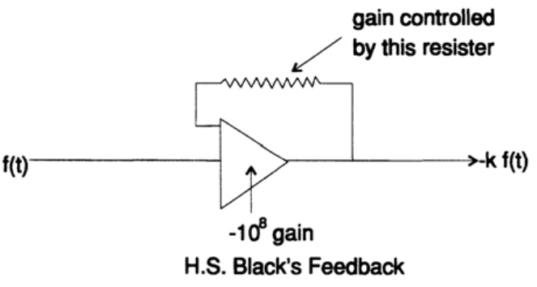  

Figure 20.VIII  

$$
\left[y+\left({\frac{1}{10}}\right)x\right](-10^{9})=(-10^{9})=x
$$  

$$
10^{9}y=[-x-10^{8}x]
$$  

$$
x\!=\!\frac{10y}{1+10^{-8}}
$$  

We see almost all the uncertainty is in the one resistor of size 1/10, and the gain of the amplifier,   $(-10^{-9})$  , need not be accurate. Thus the feedback of H.S.Black allows us to accurately build things out of mostly inaccurate parts.  

You see now why I cannot give you a nice, neat formula for all situations; it must depend on how the particular quantities go through the whole of the computation; the whole computation must be understood as a whole. Do the inaccurate numbers go through a feedback situation where their errors will be compensated for, or are they vitally out in the open with no feedback protection? The word “vitally” because it is vital to the computation, if they are not in some feedback position, to get them accurate.  

Now this fact, once understood, impacts design! Good design protects you from the need for too many highly accurate components in the system. But such design principles are still, to this date, ill-understood and need to be researched extensively. Not that good designers do not understand this intuitively, merely it is not easily incorporated into the design methods you were taught in school. Good minds are still needed in spite of all the computing tools we have developed. But the best mind will be the one who gets the principle into the design methods taught so it will be automatically available for lesser minds!  

I now look at another example, and the principle which enabled me to get a solution to an important problem. I was given the differential equation  

$$
y^{\prime\prime}=\sinh y-k\dot{x^{\prime}}(0.1<k<10),\ \ \ y(0)=0,\ \ \ y(\infty)\sim\mathrm{Ln}\ 2k x.
$$  

You see immediately the condition at infinity is really the right hand side of the differential equation equated to 0,  Figure 20.IX .  

But consider the stability. If the  $y$   at any fairly far out point  $x$   gets a bit too large, then the sinhy is much too large, the second derivative is then very positive, and the curve shoots off to plus infinity. Similarly, if the  $y$   is too small the curve shoots off to minus infinity. And it does not matter which way you go, left to right, or right to left. In the past I had used the obvious trick when facing a divergent direction field of simply integrating in the opposite direction and you get an accurate solution. But in the above problem you  

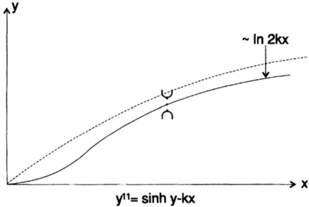  

are, as it were, walking the crest of a sand dune, and once both feet are one side of the crest you are bound to slip down.  

You can probably believe while I could find a decent power series expansion, and an even a better non- power series approximate expansion around the origin, still I would be in trouble as I got fairly well along the solution curve, especially for large  $k.$  . All the analysis I, or my friends, could produce was inadequate. So I went to the proposers and first objected to the condition at infinity, but it turned out the distance was being measured in molecular layers, and (in those days) any realistic transistor would have effectively an infinity number of layers. I objected then to the equation itself; how could it represent reality? They won again, so I had to retreat to my office and think.  

It was an important problem in the design and understanding of the transistors then being developed. I had always claimed if the problem was important and properly posed then I could get some kind of a solution. Therefore, I must find the solution; I had no escape if I were to hold on to my pride.  

It took some days of mulling it over before I realized the very instability was the clue to the method to use. I would track a piece of the solution, using the differential analyzer I had at the time, and if the solution shot up then I was a bit too high in my guess at the corresponding slope, and if it shot down I was a bit too low. Thus piece by piece I walked the crest of the dune, and each time the solution slipped on one side or the other I knew what to do to get back on the track. Yes, having some pride in your ability to deliver what is needed is a great help in getting important results under difficult conditions. It would have been so easy to dismiss the problem as insoluble, wrongly posed, or any other excuse you wanted to tell yourself, but I still believe important problems properly posed can be used to extract some useful knowledge which is needed. A number of space charge problems I have computed showed the same difficult instability in either direction.  

I need to introduce for the next story the idea of a Rorschach test which was popular in my youth. A blob of ink is put on a piece of paper, it is squeezed on a fold, and when it is opened you have a symmetric blot with essentially a random shape. A sequence of these blots is shown to the subject and they are asked to report on what they see. Their answers were used to analyse the “personality” of the person. Obviously what a person reports is a figment of their imagination since the blot is essentially a random shape. It is like watching the clouds in the sky and discussing what the shapes they resemble; it is your imagination and not reality you are discussing, and as such it is, to some extent, revealing things about yourself and not about the clouds. I believe the ink blot method is no longer in use.  

Now to the next story. A psychologist friend at Bell Telephone Laboratories once built a machine with about 12 switches and a red and a green light. You set the switches, pushed a button, and either you got a red or a green light. After the first person tried it twenty times they wrote a theory of how to make the green light come on. The theory was given to the next victim and they had their twenty tries and wrote their theory, and so on endlessly. The stated purpose of the test was to study how theories evolved.  

But my friend, being the kind of person he was, had connected the lights to a random source! One day he observed to me that no person in all the tests (and they were all high class Bell Telephone Laboratories scientists) ever said there was no message. I promptly observed to him not one of them was either a statistician or an information theorist, the two classes of people who are intimately familiar with randomness. A check revealed I was right!  

This is a sad commentary on your education. You are lovingly taught how one theory was displaced by another, but you are seldom taught to replace a nice theory with nothing but randomness! And this is what was needed; the ability to say the theory you just read is no good and there was no definite pattern in the data, only randomness.  

I must dwell on this point. Statisticians regularly ask themselves, “Is what I am seeing really there, or is it merely random noise?” They have tests to try to answer these questions. Their answer is not a yes or no, but only with some confidence a “yes” or “no”. A   $90\%$   confidence limit means typically in ten trys you will make the wrong decision about once,  if all the other hypotheses are correct! . Either you will chose when there is nothing there (Type 1 error) or you will reject when there is something there (Type 2 error). Much more data is needed to get to the  $95\%$   confidence limit, and these days data can often be very expensive to gather. Getting more data is also time consuming so the decision is further delayed—a favorite trick of people in charge who do not want to bear the responsibility of their position—“Get more data”, they say.  

Now I suggest to you quite seriously, many simulations are nothing more than Rorschach tests. I quote a distinguished practioneer of management decision theory, Jay Forrester, “From the behavior of the system, doubts will arise that will call for a review of the original assumptions. From the process of working back and forth between assumptions about the parts and the observed behavior of the whole, we improve our understanding of the structure and dynamics of the system. This book is the result of several cycles of re- examination and revision by the author”.  

How is the outsider to distinguish this from a Rorschach test? Did he merely find what he wanted to find, or did he get at “reality”? Regretably, many, many simulations have a large element of this adjusting things to get what they want to get. It is so easy a path to follow. It is for this reason traditional Science has a large number of safeguards, which these days are often simply ignored.  

Do you think you can do things safely, that you know better? Consider the famous double blind experiments which are usual in medical practice. The doctors first found if the patients thought they were getting the new treatment then they responded with better health, and those who thought they were part of the control group felt they were not getting it and did not improve. The doctors then randomized the treatment and gave some patients a placebo so the patient could not respond and fool the doctors this way. But to their horror, the doctors also found the doctors, knowing who got the treatment and who did not, also found improvement where they expected to and not where they did not. As a last resort, the doctors have widely accepted the double blind experiment—until all the data are in neither the patients nor the doctors know who gets the treatment and who does not. Then the statistician opens the sealed envelop and the analysis is carried out. The doctors wanting to be honest found they could not be! Are you so much better in doing a simulation you can be trusted not to find what you want to find? Self-delusion is a very common trait of humans.  

I started  Chapter 19  with the problem of why anyone should believe in a simulation which has been done. You now see the problem more clearly. It is not easy to answer unless you have taken a lot more precautions than are usually done. Remember also you are probably going to be on the receiving end of many simulations to decide many questions which will arise in your highly technical future; there is no other way than simulations to answer the question “What if…?” In  Chapter 18  I observed decisions must be made and not postponed forever if the organization is not to flounder and drift endlessly—and I am supposing you are going to be among those who must make the choices. Simulation is essential to answer the “What if…?”, but it is full of dangers, and is not to be trusted just because a large machine and much time has been used to get the nicely printed pages, or colorful pictures on the oscilloscope. If you are the one to make the final decision then in a real sense you are responsible. Committee decisions, which tend to diffuse responsibility, are seldom the best in practice—most of the time they represent a compromise which has none of the virtues of any path and they tend to end in mediocrity. Experience has taught me generally a decisive boss is better than a waffling one—you know where you stand and can get on with the work which needs to be done!  

The “What if…?” will arise often in your futures, hence the need for you to master the concepts and possibilities of simulations, and be ready to question the results and to dig into the details when necessary.  

# 21 Fiber Optics  

One of the reasons for taking up the topic of fiber optics is its significant history occurred within my scientific lifetime, and I can therefore give you a report of how the topic looked to me at the time it was occurring. Thus it provides an illustration of the style I adopted when facing a newly developing field of great potential importance. The field of fiber optics is also, of course, important in its own right. Finally, it is a topic you will have to deal with as it further evolves during your lifetime.  

When I first heard of a seminar on the topic of  fiber   optics  at Bell Telephone Laboratories I considered whether I should attend or not—after all one must try to do one’s own work and not spend all one’s time in lectures. First, I reflected optical frequencies were very much higher than the electrical ones in use at time, and hence the fiber optics would have much greater bandwidth—and bandwidth is the effective rate (bits per second) of transmission, and is the name of the game for the telephone company, my employers at the time. Second, I recalled Alexander Graham Bell had once sent a telephone conversation over a light beam— but then he was a bit of a gadgeteer all his life. So it could be done, and had been done long ago. Third, I also knew about the internal reflections as you go from a higher index medium to a lower index medium— you see it in still water when viewed from below where there are angles which totally reflect the light back down into the water,  Figure 21.I . Hence I understood, in a fair way, what an optical fiber would be—they were a novel idea then. I certainly had enough experience in college labs with drawing glass into fibers to understand how easy it would be due to the effects of surface tension to make round fibers of a fairly uniform diameter, and to some extent the corresponding role of surface tension for liquid glass. Hence I took the time to go and learn about this promising new development.  

During the early part of the talk the speaker remarked, “God loved sand, He made so much of it”. I heard, inside myself, we were already having to exploit lower grade copper mines, and could only expect to have an increasing cost for good copper as the years went by, but the material for glass is widely available and is not likely to ever be in short supply.  

Either at the lecture, or soon afterwards I heard the observation, “The telephone wire ducts in Manhattan (NYC) are running out of space and if the city continues to grow, as it has of late, then we will have to lay a lot more ducts and this means digging up streets and sidewalks, but if we use glass fibers with their smaller diameters then we can pull out the copper wires and put the glass fibers in their place”. This told me for that reason alone the Labs would have to do everything they could to develop glass fibers rapidly, that it was going to be an ongoing source of computation problems, and hence I had better keep myself abreast of developments.  

Long before this, once I had decided to stay at the Labs and realized my poverty in the knowledge of practical electronics, I bought a couple of Heathkits and assembled them just for the experience, though the resulting objects were also useful. I knew, therefore, the amount of soldering of wires that went on, and immediately identified a difficult point to watch for—how did they propose to splice these fine, hair sized, Figure 21.I  

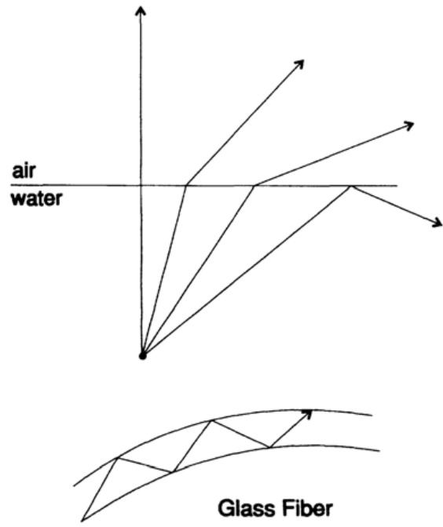  

glass fibers and still have good transmission? You could not simply fuse them together and expect to get decent transmission.  

Why such small diameters as they were proposing? It is obvious once you look at a picture of how a glass fiber works,  Figure 21.II . The thinner the diameter, the more the fiber can bend without letting the light get out. That is one good reason for the smaller and smaller proposed diameters, and it is not the cost of the material nor the extra weight of larger diameter fibers. Also, for many forms of transmission, a smaller diameter fiber will clearly have less distortion in the signal when going a given distance.  

There was another major dividend I soon realized. The fibers are so efficient, meaning they lose so few photons, “tapping” a line will be a difficult feat. Not that it is impossible, only it will be difficult. About the same time I came to realize (due to some computations I was doing with a group in chemistry) that fiber optics were resistant to electromagnetic disturbances—especially atomic bomb explosions in the upper atmosphere or on a battle field, or even lightning strikes. Yes, fibers were bound to get large amounts of support for further research from the Military, as well as from the Labs directly.  

A trouble soon which arose, and I had anticipated it, was the outer sheathing put on the fine hair-sized fibers might alter the local index of refraction ratios and let some of the light escape. Of course putting a mirrored surface on the fiber would solve it. They soon had the idea of putting a lower index glass sleeve around the higher index core, at human sizes where it is easily done, and then  drawing out the resulting shape into the very thin fibers they needed.  

Much later I heard of not one layer, but a smoothly graded change in index of refraction, and recognized this was the same thing as the  strong focusing  which had been developed some years before for cyclotrons. The grading could be done either by chemical or radiation treatments. Rather than have sharp reflections, you can use the gradual bending of the rays back to the center as they get away from the middle of the fiber,  

Figure 21.III  

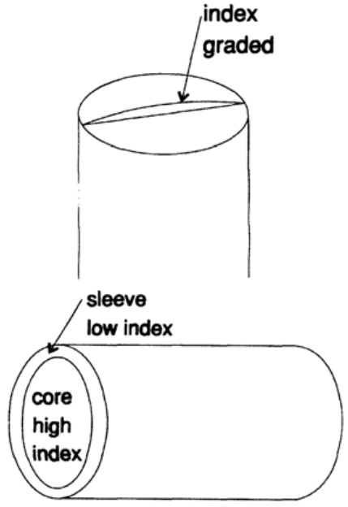  

I did not try to follow all the arguments for the multi-mode vs. the single-mode methods of signaling— and while I did a number of simulations via computers for the two sides of the debate, I sort of backed the single mode on the same grounds that we had backed the binary against any higher base number systems in computers. It is a technical detail anyway, including the details of detectors and emitters, and not a fundamental feature of the optical signaling.  

Along the way I was constantly watching to see how they were going to splice the fibers. With the passage of time there were a number of quite clever ways proposed and tested, and the very number of alternates made me decide  probably  that feature which first attracted my attention would be handled fairly easily—at least the problem would not prove to be fatal in the field where it has to be done by technicians and not in the labs where things can be done by experts under controlled conditions. I well knew the difference by watching various projects (mostly in other companies) come to grief on the miserable fact what can be done reliably in the lab by experts is not always the same as what can be done in the field by technicians who are in a hurry and are often operating under adverse conditions, to say the least.  

As I recall they first field tested fiber optics by connecting a pair of central offices in Atlanta, Georgia. It was a success (the trial required some years to complete). Furthermore, outsiders from the glass business began to make glasses which were remarkably clear at the frequencies we wanted to use—meaning the frequencies at which we had reliable lasers. They said if the ocean waters were as clear as were some of the glasses then you could see to the bottom of the Pacific Ocean!  

I soon noticed in the fiber cables we were: (1) detecting the optical signals, (2) converting to electronic form, (3) amplifying it, and (4) converting back to optical form. It is hard to imagine a worse system design. So it was immediately evident to me the Labs, and many others, would have to work intensively on optical amplification. Watching things from afar, it soon became evident there were several candidates for optical amplifiers, and therefore  probably  one or more would materialize as standard field equipment. One of the virtues of solitons is they can be amplified without changing their shape (which does not degrade as it goes along the fiber) while pulses are regenerated (which effectively reshapes them and appears to be slightly more complex an operation than simple amplification).  

All the practical parts seemed to be coming together remarkably well, and as you know we now use of fiber optics widely. I have told you as best I can, how I approached a new technology, what I looked for, what I watched for, what I ignored, what I kept abreast of, and what I pondered. I had no desire to become an expert in the field; I had my hands full with computers and their rapid development, both hardware and software, as well as the expanding range of applications. Every new field which arises in your future will present you with similar questions, and you will effectively answer by your later actions.  

The present applications of fiber optics are very wide spread. I had long realized as time went on the satellite business was in for trouble. Stationary satellites for communication must be parked above the equator; there is no other place for them. A number of the countries along the equator have, from the earliest days, claimed we were invading their airspace and should be paying for the use of it. So far they have not been able to enforce their claims, as the advanced countries have simply continued to use the space without paying for it. I leave to you the justice of the situation: (1) the blatant ignoring of their claims, (2) whether or not they have a legitimate point, and (3) if because they are unable to use it now everyone else must wait until they can—if ever! It is not a trivial question of international relations, and there is some merit on all sides.  

The satellites are now parked at about every  $4^{\circ}$   or so, and while we could park them closer, say   $2^{\circ}$  , we will have to use much more accurate (larger diameter?) dishes on earth to beam signals up to them without one signal slopping into the adjacent satellites. To a fair extent we can widen the bandwidth of the signaling and thus for a time extend the amount of traffic they can carry, but there are limits due to the atmosphere the signals must traverse. On the other hand, fiber optics can be laid down on earth with any density you wish; cables of fibers can be easily made and the total possible bandwidth boggles the mind. The use of satellites means  broadcasting  the signal—cables give a degree of  privacy  and the ability to make the user pay rather than get a free ride. Both satellites and cables have their advantages and disadvantages. At present satellites are frequently being used for what are essentially private communications and not broadcast situations. Time will probably readjust the matter so each is used in their best way.  

Where are we now? We have already seen transoceanic cables with fibers instead of coaxial wave guides at a great deal less cost and a great deal more bandwidth. We are at the moment (1993) haggling over whether to use the most recently developed  soliton  signaling system or the classical pulse system of communicating across the Pacific ocean to Japan. It is, I think, a matter of engineering development—in the long run I believe solitons will be the dominant method, and not pulses. I advise you to watch to see if there is a significant change in the technology—certainly if for the transmission of information via solitons wins out over the current pulse signaling method then this should produce basically new methods of signal analysis in the future, and you had best keep abreast of it if it happens, or else you, like so many other people, will be left behind.  

I read that in the Navy, as well as in the obvious Air Force and commercial aviation applications, the decreased weight means great savings which can be used for other things. On a tour of the carrier Enterprise some 14 years ago, being even then well aware of the trend to optical fibers, I looked especially at the duct wiring and decided fibers will replace all those wires  in so far as they are   information handling  wires. For the distribution of  power  it is another matter entirely. But then, will centralized power distribution remain the main method, or will, due to battle conditions, a decentralized power system aboard a ship become the preferred method? It would better blend in with the obviously redundant fiber optic systems which will undoubtedly be installed as a matter of safety practice. And battle ships are not very different from World Trade type skyscraper office buildings!  

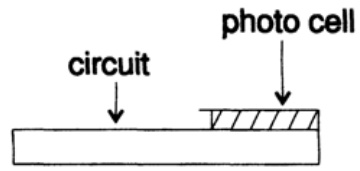  

Figure 21.IV  

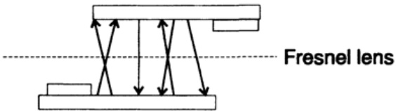  

# Figure 21.V  

We now have fiber optic cables which are sufficiently armored trucks can run over them safely, fibers so light missiles are fired with an unreeling fiber attached throughout the flight—and this means two way communication, both to direct the missile to the target and to get back what the missile can see as it flies.  

Being in computers, I naturally asked myself how this could and would impact the design of computers. You probably know we now (1993) often interconnect the larger units of a computer with fiber optics. It seems only a matter of time before major parts of internal wiring will go optical. Cannot one make, in time, “mother boards” by which the integrated circuit chips are interconnected, using fiber optics? It does not seem to be unreasonable in this day of the material sciences. How soon will fiber optic techniques get down to the chips? After all, the bandwidth of optics means, inferentially, higher pulse rates! Can we not in time make optical chips, and have a general light source falling on a photocell on the chip (like some hand held calculators) to power the chip and avoid all the wiring of power distribution to the chips?  Figure 21.IV .  

Can we replace chip wiring with light beams? Light beams can pass through one another without interference (provided the intensity is not too high) which is more than you can do with wires,  Figure 21.V .  

This brings up switching. Can crossbar switches be made to be optical and not electronic? Would not the Bell Telephone Laboratories and others have to work on it intensively? If they succeed then will not it be true switching, which has traditionally been one of the most expensive parts of a computer, will become perhaps  one of the cheapest? At first memory was the expensive part of computers, but with magnetic cores, and now with electronic storage at fantastically cheap prices, the design and use of computers has significantly changed. If a major drop in switching costs came about, how would  you  design a computer? Would the von Neumann basic design survive at all? What would be the appropriate computer designs with this new cost structure? You can try, as I indicated above, to keep reasonably abreast by actively anticipating the way things and ideas might go, and then seeing what actually happens. Your anticipation means you are far, far better prepared to absorb the new things when they arise than if you sit passively by and merely follow progress. “Luck favors the prepared mind.”  

That is the reason for this talk—to show you how someone tried to anticipate and be prepared for rapid changes in technologies which would impact their research and work. You cannot lead everywhere in this highly technological society, but you need not be left behind by every new development—as many people are in practice.  

I have said again and again in this book, my duty as a professor is to increase the probability you will be a significant contributor to our society, and I can think of no better way than establishing in you the habit of anticipating things and leading rather than passively following. It seems to me I must, to accomplish my duty to you and to the institution, move as many of you as I can from a passive to a more active, anticipating role.  

In today’s chapter you see I claim to have made no significant contribution, but at least I was prepared to help others who were more deeply involved by supplying the right kinds of computing rather than slightly misconceived computations which are so often done. I believe I often supplied that kind of service at Bell Telephone Laboratories during the 30 years I spent there before my retirement In the fiber optics area I have told you some of the details of what I did and how I did them.  

Let me now turn to predictions of the immediate future. It is fairly clear in time “drop lines” from the street to the house (they may actually be buried but are probably still called “drop lines”!) will be fiber optics. Once a fiber optic wire is installed then potentially you have available almost all the information you could possibly want, including TV and radio, and possibly newspaper articles selected according to your interest profile (you pay the printing bill which occurs in your own house). There would be no need for separate information channels most of the time. At your end of the fiber there are one or more digital filters. Which channel you want, the phone, radio or TV can be selected by you much as you do now, and the channel is determined by the numbers put into the digital filter—thus the same filter can be multipurpose if you wish. You will need one filter for each channel you wish to use at the same time (though it is possible a single time sharing filter would be available) and each filter would be of the same standard design. Alternately, the filters may come with the particular equipment you buy.  

But will this happen? It is necessary to examine political, economic, and social conditions before saying what is technologically possible will in fact happen. Is it likely the government will want to have so much information distribution in the hands of a single company? Would the present cable companies be willing to share with the telephone company and possibly lose some profit thereby, and certainly come under more government regulation? Indeed, do we as a society want it to happen?  

One of the recurring themes in this book is frequently what is technologically feasible, and is even economically better, is restrained by legal, social, and economic conditions. Just because it can be done economically does not mean it should be done. If you do not get a firm grasp on these aspects then as a practicing seer of what is going to happen in your area of specialization you will make a lot of false predictions you will have to explain as best you can when they turn out to be wrong.  

# 22 Computer Aided Instruction—CAI  

Because computers were early installed in many Universities it was natural the question of  Computer Aided Instruction  (CAI) would arise and be explored in some depth. Before we get to the modern claims it is wise to get some perspective on the matter.  

There is a story from ancient Greek times of a Mathematician telling a ruler there were royal roads for him to walk on, and royal messengers to carry his mail, but there was no royal road to geometry. Similarly, you will recognize money and coaching will do only a little for you if you want to run a four minute mile. There is no easy way for you to do it. The four minute mile is much the same for everyone.  

There is a long history of people wanting an easy path to learning. Aldous Huxley, in his book  Brave New World  discusses the idea of learning while sleeping via a microphone under your pillow telling you things while you sleep, and he exposes the severe limitations of it. During my years at the Bell Telephone Laboratories the  Dianetic  movement arose and promised it could “clear” your brain of all its errors and then you would be able to reason perfectly. There are still Dianetic Institutes, but the consensus is against them— particularly as the people produced by them seem not to have dominated any sector of human activities, let alone all sectors. Another organization promises to reveal the secrets of the ancients (who were, some how, so much smarter than we are now). We have endless ads for speed reading, speed learning, etc, all of which promise, in one way or another, to greatly improve your mind without the hard labor most of us have to put in if we want to succeed. The test of all the previous proposals is not one of them has, as yet, produced a significant number of exceptional people (that we know of at present). As Fermi said about the Extra Terrestrial Intelligence and UFO people, “Where are they, and why have we not met them?”  

Hence all of past history with its many, many claims of easy learning speaks eloquently against the current rash of promises, but it cannot, of course, prove some new gimmick will not succeed. You need to take a large grain of salt with every such proposal— but there could be new things the past did not know, and new tools like the cheap computers now available which were not available then, which could make the difference. Regularly I read or hear I am supposed to believe the new gimmick, typically these days the computer, will make a significant difference in spite of all past promises which have apparently failed miserably. Beware of the power of wishful thinking on your part—you would like it to be true so you assume it is true!  

There is another important factor, known as  the Hawthorne effect,  it is necessary to explain. At the Hawthorne plant of Western Electric, long, long ago, some psychologists were trying to improve productivity by various changes in the environment. They painted the walls an attractive color, and productivity rose. They made the lighting softer and productivity rose. Each change caused productivity to rise. One of the men got a bit suspicious and sneaked a change back to the original state and productivity rose! Why? It appears when you show you care then the person on the other end responds more favorably than if you appear not to care. The workers all thought the changes were being made for their benefit and they responded accordingly.  

In the field of education, if you tell the students you are using a new method of teaching then they respond by better performance, and so, incidentally, does the professor. A new method may, or may not, be better, indeed it may be worse, but the Hawthorne effect, which is not small in the educational area, is likely to indicate here is a new, important, improved teaching method. It hardly matters what the new method is, its trial will produce improvements   $i f$  the students perceive it as being done for their benefit. Thus the Hawthorne effect vitiates most educational experimentation. You will recall my earlier discussion, Chapter 20 , of the necessity of “double blind” experiments in medicine—it is the same in all situations where the respondee senses special treatment and special care are being given. Those who later measure the effects must also be kept in ignorance of who did or did not get the special treatment! It is a fact of life in all such experimentation, but it is usually ignored. Hence you should never believe the results of carelessly done experiments when they involve humans. The prestige of the experimenter, the elaborateness of the equipment, the cleverness of the data reduction, and especially your desire to believe, should not be allowed to sway you. Again, this does not mean there is nothing there, only you need to be very, very careful before acting on such experiments.  

The Hawthorne effect strongly suggests the proper teaching method will always to be in a state of experimental change, and it hardly matters just what is done, all that matters is  both  the professor and the students believe in the change.  

Let me turn to some of the past history of the use of computers to greatly assist in learning. I recall in 1960 while I was at Stanford on a sabbatical, there was a “grader program”. Any problem the professor wanted to assign to the class in a programming course required the professor to give a correct running program to solve it, the names of the input variables, the ranges in which the input numbers could occur, and also a limit for the roundoff of the output numbers to be acceptable. When the students felt their program was ready for submission, they called the grader, gave their identification, and the machine generated some random admissible input, ran both their and the professor’s program, and compared the results. Each output number was, “Right or wrong”. Such a grader can easily incorporate the time of compiling and the time of running, which are mere numbers, and still be required to make no judgment on style.  

The method is flexible, easily adapted to changes in the course and in the specific exercises assigned from year to year. The program keeps a record in a private data base of the professor, and on demand from him gives the raw facts, leaving any evaluation to the professor. Of course class averages, variances, distribution of grades, etc, can all be supplied to the professor from his data base, if wanted.  

When I visited Stanford a couple of years later I asked about the grader program. I found it was not in use. Why? Because, so they said, the first professor who had got it going left and a change had been made in the monitor system would require a few changes in the program! Diligent watching and asking shows this is very typical on many campuses. The machine is programmed to greatly assist, apparently, the professor, but the program is soon forgotten.  

Let me turn to the project PLATO done by a friend of mine at the University of Illinois. I regularly met him at various meetings, and once on a long airplane ride, and every time he told me how wonderful PLATO was. For example, once he said at the same time Plato had a pupil from Scotland, one from Canada, and one from Kentucky. I said I knew the telephone company could do that, and what he was saying was totally irrelevant to whether or not PLATO was doing a better job than humans did. He never, to my knowledge, produced any serious evidence PLATO did improve teaching in a significant fashion— above what you would expect from the Hawthorne effect.  

One claim made was the student was advanced about   $10\%$   along the education path over those who did not use the system. When I inquired as to whether this meant it was the same   $10\%$   shift all through the educational system, or whether he meant   $10\%$   on each course, compound interest as it were, he did not know! What had he done about the Hawthorne effect? Nothing! So I do not know what was or was not accomplished after spending the millions and millions of dollars of Federal money.  

Once when I was the chief editor of the ACM Publications a  programmed book  on computing was submitted for publication. A programmed book regularly asks questions of the reader, and then, depending on the response, the reader is sent to one of several branch points (pages). In principle the errors are caught and explained again, and correct answers send the reader on to new material. Sounds good! Each student goes at their own pace. But consider, there can be no back tracking to find something you read a few pages ago and are now a bit fuzzy about where you came from or how you got here. There can be no organized browsing through the text. It really is not a book, though from the outside it looks like one. Another terrible fact is carefully watching the students to see what happens in practice has shown a good student often picks what they know is the wrong answer simply out of either boredom or amusement to see what the book will say. Hence it does not always work out as it was thought it would; the better students do not necessarily progress significantly faster than the poorer ones!  

I did not want to reject programmed books on my own opinion, so I went to the Bell Telephone Laboratories’ psychology department and found the local expert. Among other things he said was there was to be a large conference on programmed books the following week, and why did not I go? So I did. On the opening day we sat next to each other. He nudged me and said, “Notice no one will ever produce any concrete evidence, they will only make claims programmed texts are better”. He was exactly right—no speaker had anything to offer in the form of hard, experimental evidence, only their opinions. I rejected the book, and on hindsight I think I did the right thing. We now have computer discs which claim to do the same thing, but I have little reason to suspect the disc format makes a significant difference, though they could backtrack through the path you used to get there.  

I have just given some of the negative side of CAI. Now to the positive side. I have little doubt in teaching dull arithmetic, say the addition and multiplication tables, a machine can do a better job than a teacher, once you incorporate the simplest program to note the errors and generate more examples covering that point, such as multiplying by 7, until the point is mastered. For such rote learning I doubt any of you would differ from my opinion. Unfortunately, in the future we can expect corporations and other large organizations will have removed much of the need for just such rote learning (computers can often do it better and cheaper) and employment will usually require judgment on your part.  

We now turn to airplane pilot training in the current trainers. They again do a better job, by far, than can any real life experience, and generally the pilots have fairly little other human interactive training during the course. Flying, to a fair extent, I point out, is a  conditioned response  is being trained into the human. It is not much thinking, though at times thinking is necessary, it is more training to react rapidly and correctly, both mentally and physically, to unforeseen emergencies.  

It seems to me for this sort of training, where there is a conditioned response to be learned, machines can do a very good job. It happens as a child I learned fencing. In a duel there is no time for local thinking; you must make a rapid conditioned response. There is indeed a large overall planning of a duel, but moment to moment it must be a response which does not involve the delay of thinking.  

When I first came to the Naval Postgraduate School in 1976 there was a nice dean of the extension division concerned with education. In some hot discussions on education we differed. One day I came into his office and said I was teaching a weight lifting class (which he knew I was not). I went on to say graduation was lifting 250 pounds, and I had found many students got discouraged and dropped out, some repeated the course, and a very few graduated. I went on to say thinking this over last night I decided the problem could be easily cured by simply cutting the weights in half—the student in order to graduate would lift 125 pounds, set them down, and then lift the other 125 pounds, thus lifting the 250 pounds.  

I waited a moment while he smiled (as you probably have) and I then observed when I found a simpler proof for a theorem in Mathematics and used it class, was I or was I not cutting the weights in half? What is your answer? Is there not an element of truth in the observation the easier we make the learning for the student the more we are cutting the weights in half? Do not jump to the conclusion I am saying poor chapters should be given because then the students must work harder. But a lot of evidence on what enabled people to make big contributions points to the conclusion a famous prof was a terrible lecturer and the students had to work hard to learn it for themselves! I again suggest a rule:  

What you learn from others you can use to follow; What you learn for yourself you can use to lead.  

To get closer to the problem, to what extent is it proper to compare physical muscles with “mental muscles”? Probably they are not exactly equivalent, but how far is it a reasonable analogy? I leave it to you to think over.  

Another argument I had with this same dean was his belief the students should be allowed to take the extension courses which were under his wing at their own pace; I argued the speed in learning was a significant matter to organizations—rapid learners were much more valuable than were slow learners (other things being the same); it was part of our job to increase the speed of learning and mark for society those who were the better ones. Again, this is opinion, but surely you do not want very slow learners to be in charge of you. Speed in learning new things is not everything, to be sure, but it seems to me it is an important element.  

The fundamental trouble in assessing the value of CAI is we are not prepared to say what the educated person is, nor how we now accomplish it (if we do!). We can say what we do, but that is not the same as what we should be doing. Hence I can only give more anecdotes.  

Consider the claims graphics well done would be of great assistance to learning basic concepts. Sounds good, but consider the story I told you about my friend Kaiser, and how having learned filter theory in terms of time and voltage, he could not cope, in spite of directions, with the independent variable being energy. Again, Kaiser is a very smart person, but his education had restricted his view of the use of what he had learned. The better we inculcate the basic idea with the pictures drawn by the professor, the more we prevent the student from later extending the ideas to completely new areas not thought of by the professor (and put into the graphic display).  

Let me tell you another story about  the transfer of training,  as it is called—the use of ideas from one place to another. During the very early part of WWII I was teaching a calculus course at an engineering school in Louisville. The students were having trouble in a course in thermodynamics taught by the dean of engineering, who was an ex-submarine commander and who scared the students. With the dean’s permission I visited a class to see what was happening. He put on the board, at one point,  

$$
\int\!\!{\frac{\mathbf{d}\theta}{\theta}}
$$  

and asked what it was, and no student knew. The very next hour in my class across the hall I wrote  

$$
\int_{x}\!\!\!{\frac{\mathrm{d}x}{x}}
$$  

and they all knew immediately it was log  $x$   plus a constant When I wrote  

$$
\int\!\!{\frac{\mathbf{d}\theta}{\theta}}
$$  

they again knew. “Why,” said I, “did you not respond with that in the dean’s class last hour?” The fact is, what they knew in one class at one hour with one professor did not  transfer  to the another hour in a room across the hall with another professor. Sounds strange, but that is what is known as the “transfer of training”—the ability to use the same ideas in a new situation. Transfer of training was a large part of my contribution to Bell Telephone Laboratories -I did it quite often, though of course I do not know how many chances I missed!  

Let me turn to the calculus course I have often taught at the Naval Postgraduate School, though I had formed this opinion years before. Students are remarkably able to memorize their way through many math classes, and many do so. But when I get to analytic integration (I give the students a function and ask for its indefinite integral) there is no way they can memorize their way through the course the way I teach it. They must learn to recognize  

$$
\int\!\!{\frac{\mathrm{d}x}{x}}\!=\!\log x+C
$$  

in an almost infinite number of disguises. For the first time in their career they are forced to learn to recognize  forms  independent of the particular representation—which is a basic feature of Mathematics and general intelligence. To take analytic integration out of the course, or transfer it to routines in computers, is to defeat the purpose of a stage of learning something that is essential, in my opinion, unless something of equivalent difficulty is put in. The students must master abstract pattern recognition if they are to progress and use Mathematics later in their careers.  

A very similar error was made years ago when I was a student at the University of Chicago. The Education Department ran an Elementary School for research purposes. They had found students learn to read by syllables not by letters, and so they decided to skip teaching the alphabet and get on to the real reading. Which they did. Things went on quite well until late high school when it was found not knowing the alphabet thoroughly the students could not effectively use dictionaries, phone books, etc. At their age then it was practically impossible to make them so overlearn the alphabet they could use such information sources easily. Thus I am wary of proposed changes until the consequences have been followed out carefully through long term predictions of all necessary needs for the material they are now going to omit.  

In summary, as best I can, clearly in low level conditioned response situations, typically associated with training,  I believe computers can greatly add in the learning process, but at the other end, high level thinking,  education,  I am very skeptical. Skeptical, mainly because we ourselves do not understand either what we want to do, nor what we are presently doing! We simply do not know what we mean by “the educated person”, let alone what it will mean in the year 2020. Without that knowledge, how am I to judge the success of any proposal which is tried? Between low level training and high level education there is a large area to be explored and exploited by organizations outside the universities as well as inside. I will discuss at great length in  Chapter 26  the point rarely do the experts in a field make the significant steps forward; great progress generally comes from the outside. The role of CAI in organizations with large  training programs will increase in the future as progress constantly obsoletes old tools and introduces new ones into the organization that are generally more complex technically to use.  

Consider the programs on computers which are supposed to teach such things as business management, or, even more seriously, war games. The machines can take care of the sea of minor details in the simulation, indeed should buffer the player from them, and expect good, high level decisions. There may be some elements of low level training which must be included, as well as the higher level thinking. We must ask to what extent it is training and to what extent it is education. Of course, as mentioned in the three chapters on simulation, we also need to ask if the simulation is relevant to the future for which the training is being given. Will the presence of the gaming programs, if at all widespread, perhaps vitiate the training? You can be sure, however, even if the proposers cannot answer these questions, they will still produce and advertise the corresponding programs. You may be a victim of being trained for the wrong situations!  

A few hundred years ago the standard higher education was learning to read, write, and speak Latin, along with a smattering of Greek and a knowledge of the Classics. This was the basic education with which Englishmen, for example, went out and created an empire. Our present education has very, very little in common with the classical one. I suggest strongly the future education will have as little to do with the present education as the present education has with the classical education. Tinkering with small changes in our present educational system will not meet the problem we face in preparing the students for the year 2020 when lap top computers are universally available along with immense storage capacity for information and ability to process the data. Without a vision of what kind of education will be appropriate at that time how are we to evaluate proposed CAI projects? Just because something can be done, especially using computers, does not mean it should be done. We must create a vision of what the educated person will be in the future society, and only then can we confidently approach the problems which arise in CAI.  

# 23 Mathematics  

As you live your life your attention is generally on the foreground things, and the background is usually taken for granted. We take for granted, most of the time, air, water, and many other things such as language and Mathematics. When you have worked in an organization for a long time its structure, its methods, its “ethos” if you wish, are usually taken for granted.  

It is worth while, now and then, to examine these background things which have never held your close attention before, since great steps forward often arise from such actions, and seldom otherwise. It is for this reason we will examine Mathematics, though a similar examination of language would also prove fruitful. We have been using Mathematics without ever discussing what it is—most of you have never really thought about it, you just did the Mathematics—but Mathematics plays a central role in science and engineering.  

Perhaps the favorite definition of Mathematics given by Mathematicians is:  

“Mathematics is what is done by Mathematicians, and Mathematicians are those who do Mathematics”.  

Coming from a Mathematician its circularity is a source of humor, but it is also a clear admission they do not think Mathematics can be defined adequately. There is a famous book,  What is Mathematics,  and in it the authors exhibit Mathematics but do not attempt to define it.  

Once at a cocktail party a Bell Telephone Laboratories Mathematics department head said three times to a young lady,  

Mathematics is nothing but clear thinking.  

I doubt she agreed, but she finally changed the subject; it made an impression on me. You might also say  

Mathematics is the language of clear thinking.  

This is not to say Mathematics is perfect—not at all—but nothing better seems to be available. You have only to look at the legal system and the income tax people, and their use of the natural language to express what they mean, to see how inadequate the English language is for clear thinking. This simple statement, “I am lying.” contradicts itself!  

There are many natural languages on the face of the earth, but there is  essentially  only one language of Mathematics. True, the Romans wrote VII, the Arabic notation is 7 (of course the 7 is in the Latin form and not the Arabic) and the binary notation is 111, but they are all the same idea behind the surface notation. A7 is a7 is a7, and in every notation it is a prime number. The number 7 is not to be confused with its representation.  

Most people who have given the matter serious thought have agreed if we are ever in communication with a civilization around some distant sun, then they will have essentially the same Mathematics as we do. Remember the hypothesis is we are in communication with them, which seems to imply they have developed to the state where they have mastered the equivalent of Maxwell’s equations. I should note some philosophers have doubted even their communication system, let alone any details of it, would resemble ours in any way at all. But people who have their heads in the clouds all the time can imagine anything at all and are very seldom close to correct (witness some of the speculation the surface of the moon would have meters of dust into which the space vehicle would sink and suffocate the people).  

The words “essentially equivalent” are necessary because, for example, their Euclidean geometry may include  orientation  and thus for the aliens two triangles may be congruent or anticongruent,  Figure 23.I . Similarly, Ptolemy in his  Almagest  on astronomy used the sin   $x$   where we would use   $2\mathrm{sin}(x/2)$  , but essentially the idea is the same.  

Over the many years there has developed five main schools of what Mathematics is, and not one has proved to be satisfactory.  

The oldest, and probably the one most Mathematicians adhere to when they do not think carefully about it, is the  Platonic school . Plato (427–347 B.C.) claimed the idea of a  chair  was more real than any particular chair. Physical chairs are subject to wear, tear, decay, and being lost; the ideal chair is immutable, eternal, so he said. Hence, he claimed, the world of ideas is more real than the physical world. The theorems of Mathematics, and all other such results, belong in this world of ideas (so Plato claimed) along with the numbers such as 7, and they have no existence in the physical world. You never saw, heard, touched, tasted, or smelled the abstract number 7. Yes, you have seen 7 horses, 7 cows, 7 chairs, but not the number 7 itself —a pure 7 uncontaminated by any particular realization. In an image Plato used, we see reality only as the shadows it casts on a wall. The true reality is never visible, only the shadows of truth come to our senses. It is our minds which transcend this limitation and reach the ideas which are the true reality, according to Plato.  

Thus Platonic Mathematicians will say they “discovered” a result, not they “created” it. I “discovered” error correcting codes, rather than “created” them, if I am a Platonist. The results were always there waiting to be discovered, they were always possible.  

The trouble with Platonism is it fails to be very believable, and certainly cannot account for how Mathematics evolves, as distinct from expanding and elaborating; the basic ideas and definitions of Mathematics have gradually changed over the centuries, and this  does not fit well with the idea of the immutable Platonic ideas. Euler’s (1707–1793) idea of continuity is quite differet from the one you were taught. You can, of course, claim the changes arise from our “seeing the ideas more clearly” with the passage of time. But when one considers non-Euclidean geometry, which arose from tampering with only the parallel postulate, and then think of the many other potential geometries which must exist in this Platonic space-every possible Mathematical idea and all the possible logical consequences from them must all exist in Plato’s realm of ideas for all eternity! They were all there when the Big Bang happened!  

A second major school of Mathematicians is the  formalists . To them Mathematics is a formal game of starting with some strings of abstract symbols, and making permitted formal transformations on the strings much as you do when doing algebra. For them all of Mathematics is a mechanical game  where no interpretation of the   meaning of the symbols is permitted  lest you make an all too human error. This school has Hilbert as its main protagonist. This approach to Mathematics is popular with the Artificial Intelligence people since that is what machines do  par excellence!  

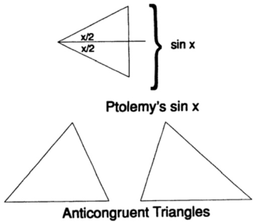  

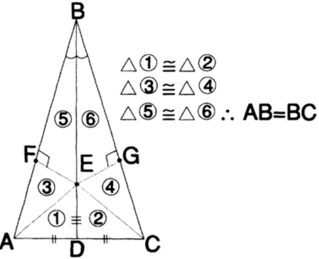  

# Figure 23.II  

There was, probably, by the late Middle Ages (though I have never found just when it was first discovered) a well known proof, using classical Euclidean geometry, every triangle is isosceles. You start with a triangle ABC.  Figure 23.II . You then bisect the angle at B and also make the perpendicular bisector of the opposite side at  the point D. These two lines meet at the point E. Working around the point E you establish small triangles whose corresponding sides or angles are equal, and finally prove the two sides of the bisected angle are the same size! Obviously the proof of the theorem is wrong, but it follows the style used by classical Euclidean geometers so there is clearly something basically wrong. (Notice only by using meta Mathematical reasoning did we decide Mathematical reasoning this time came to a wrong conclusion!)  

To show where the false reasoning of this result arose (and also other possible false results) Hilbert examined, what Euclid had omitted to talk about, both  betweeness  and  intersections.  Thus Hilbert could show the indicated intersection of the two bisectors met outside the triangle, not inside as the drawing indicated. In doing this he added many more postulates than Euclid had originally given!  

I was a graduate student in Mathematics when this fact came to my attention. I read up on it a bit, and then thought a great deal. There are, I am told, some 467 theorems in Euclid, but not one of these theorems turned out to be false after Hilbert’s added his postulates! Yet, every theorem which needed one of these new postulates could not have been rigorously “proved” by Euclid! Every theorem which followed, and rested on such a theorem, was also not “proved” by Euclid. Yet the results in the improved system were still the same as those Euclid regarded as being true. How could this be? How could it be Euclid, though he had not actually proved the bulk of his theorems, never made a mistake? Luck? Hardly!  

It soon became evident to me one of the reasons no theorem was false was that Hilbert “knew” the Euclidean theorems were “correct”, and he had picked his added postulates so this would be true. But then I soon realized Euclid had been in the same position; Euclid knew the “truth” of the Pythagorean theorem, and many other theorems, and had to find a system of postulates which would let him get the results he knew in advance. Euclid did not lay down postulates and make deductions as it is commonly taught; he felt his way back from “known” results to the postulates he needed!  

To paraphrase one of Hilbert’s claims,  “When rigor enters, meaning   departs.”  The formalists claim there is no “meaning” in Mathematics—but if so why should society support Mathematics and Mathematicians? Why is it Mathematics has proved to be so useful? If there is no meaning in any place in all of Mathematics then why is it postulates and definitions are altered in time? The formalists simply cannot explain why Mathematics is in fact more than an idle game with no more meaning than the moves of chess.  

Closely related to the formalists is the  logical school  who have tried to reduce all of Mathematics to a branch of logic. They, like every other school, have not been able to carry out their program— and for them it is more painful than for the others since they are supposed to be logicians! The famous Whitehead and Russell attempt, in three huge volumes, has generally been abandoned though large parts of their work has been retained. To use a famous quote from Russell:  

“Pure Mathematics consists entirely of assertions to the effect that, if such and such a proposition is true of  anything,  then such and such another proposition is true of that thing. It is essential not to discuss whether the first proposition is really true, and not to mention what the thing is, of which it is supposed to be true.”  

Here you see a blend of the logical and formalist schools, and the sterility of their views. The logicians failed to convince people their approach was other than an idle exercise in logic. Indeed, I will strongly suggest what is usually called the foundations of Mathematics is only the penthouse. A simple illustration of this is for years I have been saying if you come into my office and show me Cauchy’s theorem is false, meaning it cannot derived from the usual assumptions, then I will certainly be interested, but in the long run I will tell you to go back and get new assumptions—I  know  Cauchy’s theorem is “true”. Thus, for me at least, Mathematics does not exclusively follow from the assumptions, but rather very often the assumptions follow from the theorems we “believe are true”. I tend, as do many others, to group the formalists and logicians together.  

Clearly, Mathematics is not the laying down of postulates and then making rigorous deduction from them the formalists pretend. Indeed, almost every graduate student in Mathematics has the experience they have to “patch up” the proofs of earlier great Mathematicians; and yet somehow the theorems do not change much, though obviously the great Mathematician had not really “proved” the theorem which was being patched up. It is true (though seldom mentioned) definitions in Mathematics tend to “slide” and alter a bit with the passage of time, so previous proofs no longer apply to the same statement of a theorem now we understand the words slightly differently.  

The fourth school is the  intuitionists,  who boldly face this dilemma and ignore rigor. If you want absolute rigor, then, since we have had a rising standard of rigor, presumably no presently proved theorem is really “proved”, rather the future will have to patch up our results, meaning we will not have “proved” anything! I suppose, if you want my position, I am partly an intuitionist. The above example about Cauchy’s theorem illustrates my attitude Mathematics shall do what I want it to do. Contrary to Hermite (1822–1901) who said, “We are not the master but the servant of Mathematics”, I tend to believe (some of the time) we are the master. The postulates of Mathematics were not on the stone tablets Moses brought down from Mount Sinai; they are human made and hence subject to human changes as we please. Neither my view given above nor Hermite’s is exactly correct; the truth is a blend of them, we are both the master and the servant of Mathematics.  

The nature of our language tends to force us into “yes-no”, something is or is not, you either have a proof or you do not. But once we admit there is a changing standard of rigor we have to accept some proofs are more convincing than other proofs. If you view proofs on a scale much like probability, running from 0 to 1, then all proofs lie in the range and very likely never reach the upper limit of 1, certainty.  

The last major school is the  constructivists . They insist you give explicit methods of constructing everything you talk about, and not proceed as the formalists do who say if a set of postulates is not proved to be inconsistent then the objects the postulates define “exist”. The constructivist’s approach can get you into a lot of trouble. There is no really rigorous basis for Mathematics for any of the other four schools, but the constructivists are too strict for many of our tastes since they exclude too much that we find valuable in practice. Computer scientists, excluding the AI people, tend to belong to the constructivist school,  if  they think about the matter at all.  

Indeed, some numerical analysists tend to believe the “real number system” is the bit patterns in the computer—they are the true reality, so they say, and the Mathematician’s imagined number system is exactly that, “imagined”. Most users of Mathematics simply use it as a tool, and give little or no attention to their basic philosophy.  

There is a group of people in software who believes we should “prove programs are correct” much as we prove theorems in Mathematics are correct. The two fallacies they commit are:  

(1) we do not actually “prove” theorems!  

(2) many important programming problems cannot be defined sharply enough so a proof can be given, rather the program which emerges defines the problem!  

This does not mean there is nothing of value to their approach of proving programs are correct, only, as so often happens, their claims are much inflated.  

Most Mathematicans belong to the Platonic school when they are doing Mathematics from day to day, but when pressed for a clear discussion of what they are doing they usually take refuge in the formalist school and claim Mathematics is an idle game with essentially no meaning to the symbols (not that they believe this, but it is a nice defensible position to adopt). They pretend they believe in the above quotation from Russell.  

As you know from your courses in Mathematics, what you are actually doing, when viewed at the philosophical level, is almost never mentioned. The professors are too busy doing the details of Mathematics to ever discuss what they are actually doing—a typical technician’s behavior!  

However, as you all know, Mathematics is remarkably useful in this world, and we have been using it without much thought. Hence we need more discussion on this background material you have used without benefit of thought.  

The ancient Greeks believed Mathematics was “truth”. There was little or no doubt on this matter in their minds. What is more sure than   $1{+}1{=}2?$   But recall when we discussed error correcting codes we said   $1{+}1{=}0$  . This multiple use of the same symbols (you can claim the 1’s in the two statements are not the same things if you wish) contradicts logical usage. It was probably when the first non Euclidean geometries arose Mathematicians came face to face with this matter that there could be different systems of Mathematics. They use the same words, it is true, such as points, lines, and planes, but apparently the  meanings  to be attached to the words differ. This is not new to you; when you came to the topic of  forces  in mechanics and to the addition of forces then you had to recognize scalar addition was not appropriate for vector addition. And the word “work” in physics is not the same as we generally mean in real life.  

It would appear the Mathematics you choose to use must come from the field of application; Mathematics is not universal and “true”. How, then, are we to pick the right Mathematics for various applications? What meanings do the symbols of Mathematics have in themselves? Careful analysis suggests the “meaning” of a symbol only arises from how it is used and not from the definitions as Euclid, and you, thought when he defined points, lines and planes. We now realize his definitions are both circular and do not uniquely define anything; the meaning must come from the relationships between the symbols. It is just as in the interpretive language I sketched out in  Chapter 4 , the meaning of the instruction was contained in the subroutine it called —how the symbols were processed—and not in the name itself! In themselves the marks are just strings of bits in the machine and can have no meaning except by how they are used.  

The Mathematician Dodson (Lewis Carroll), who wrote  Alice in   Wonderland  and  Through the Looking Glass,  specialized in logic, and these two books are extensive displays of how meaning resides in the use. Thus Humpty Dumpty asserted when he used a word it meant what he wanted it to mean, neither more nor less; Alice felt words had meanings independent of their use, and should not be used arbitrarily.  

By now it should become clear the symbols mean what we choose them to mean. You are all familiar with different natural languages where different words (labels) are apparently assigned to the same idea. Coming back to Plato; what is a chair? Is it always the same idea, or does it depend on context? At a picnic a rock can be a chair, but you do not  expect  the use of a rock in someone’s living room as a chair. You also realize any dictionary must be circular; the first word you look up must be defined in terms of other words— there can be no first definition which does not use words.  

You may, therefore, wonder how a child learns a language. It is one thing to learn a second language once you know a first language, but to learn the first language is another matter—there is no first place to appeal for meaning. You can do a bit with gestures for nouns and verbs, but apparently many words are not so indicatable. When I point to a horse and say the word “horse”, am I indicating the name of the particular horse, the general name of horses, of quadrupeds, of mammals, of living things, or the color of the horse? How is the other person to know which meaning is meant in a particular situation? Indeed, how does a child learn to distinguish between the specific, concrete horse, and the more abstract class of horses?  

Apparently, as I said above, meaning arises from the use made of the word, and is not otherwise defined. Some years back a famous dictionary came out and admitted they could not prescribe usage, they could only say how words were used; they had to be “descriptive” and not “prescriptive”. That there is apparently no absolute, proper meaning for every word made many people quite angry. For example, both the New Yorker book reviewer and the fictional detective Nero Wolfe were very irate over the dictionary.  

We now see all this “truth” which is supposed to reside in Mathematics is a mirage. It is all arbitrary, human conventions.  

But we then face the  unreasonable effectiveness of Mathematics . Having claimed there was neither “truth” nor “meaning” in the Mathematical symbols, I am now stuck with explaining the simple fact Mathematics is used and is an increasingly central part of our society, especially in science and engineering. We have passed from absolute certain truth in Mathematics to the state where we see there is no meaning at all in the symbols—but we still use them! We put the meaning into the symbols as we convert the assumptions of the problem into Mathematical symbols, and again when we interpret the results. Hence we can use the same formula in many different situations—Mathematics is sort of a universal mental tool for clear thinking. A fundamental paradox of life, well stated by Einstein, is  it   appears the world is logically constructed . This is the most amazing thing there is—the world can be understood logically and Mathematically. I would warn you, however, recent developments in basic physics casts some doubt on his remark, and this is discussed in the next chapter.  

Supposing for the moment the above remark of Einstein is true, then the problem of applying Mathematics is simply to recognize an analogy between the formal Mathematical structure and the corresponding part of “reality”. For example, for the error correcting codes I had to see for symbols of the code, if I were to use 0 and 1 for the basic symbols, and use a 1 for the position of an error (the error was simply a string of 0’s with one 1 where the error occurred), then I could “add” the strings if and only if I chose   $1{+}1{=}0$   as my basic arithmetic. Two successive errors in the same position is the same as no error. I had to see an analogy between parts of the problem and a Mathematical structure which at the start I barely understood.  

Thus part of the effectiveness of Mathematics arises from the recognition of the analogy, and only in so far as the analogy is extensive and accurate can we use Mathematics to predict what will happen in the real world from the manipulation of the symbols at our desks.  

You have been taught a large number of these identifications between Mathematical models and pieces of reality. But I doubt these will cover all future developments. Rather, as we want, more and more, to do new things which are now possible due to technical advancements of one kind or another,  including understanding ourselves better,  we will need many other Mathematical models.  

I suggest, with absolutely no proof, in the past we have found the easy applications of Mathematics, the situations where there is a close correspondence between the Mathematical structure and the part being modeled, and in the future you will have to be satisfied with poorer analogies between the two parts. We will, in time, I believe, want Mathematical models in which the whole is not the sum of the parts, but the whole may be much more due to the “synergism” between the parts. You are all familiar with the fact the organization you are in is often more than the total of the individuals—there is morale, means of control, habits, customs, past history, etc. which are indefinably separate from the particular individuals in the organization. But if Mathematics is clear thinking, as I said at the start of this chapter, then Mathematics will have to come to the rescue for these kinds of problems in the future. Or to put it differently, whatever clear thinking you do, especially if you use symbols, then that is Mathematics!  

I want to close with even more disturbing thoughts. It is not evident, though many people, from the early Greeks on, implicitly act as if it were true, that all things, whatsoever they may be, can be put into words— you could talk about anything, the gods, truth, beauty, and justice. But if you consider what happens in a music concert, then it is obvious what is transmitted to the audience cannot be put into words—if it could then the composer and musicians would probably have used words. All the music critics to the contrary, what music communicates cannot (apparently) be put into words. Similarly, but to a lesser extent, for painting. Poetry is a curious field where words are used, but the true content of the poem is not in the words!  

Similarly, the three things of Classic Greece,  truth, beauty and   justice,  though you all think you know what they mean, cannot (apparently) be put into words. From the time of Hammurabi (1955–1913 B.C.) the attempt to put justice into words has produced the  law,  and often the law is not your conception of justice. There is the famous question in the Bible, “What is truth?” And who but a beauty judge would dare to judge “beauty”?  

Thus I have gone beyond the limitations of Godel’s theorem, which loosely states if you have a reasonably rich system of discrete symbols (the theorem does not refer to Mathematics in spite of the way it is usually presented) then there will be statements whose truth or falsity cannot be proved within the system. It follows if you add new assumptions to settle these theorems, there will be new theorems which you cannot settle within the new enlarged system.  This indicates a clear limitation on what discrete   symbol systems can do.  

Language at first glance is just a discrete symbol system. When you look more closely, Godel’s theorem supposed a set of definite symbols with unchanging meaning (though some may be context sensitive), but as you all know words have multiple meanings, and degrees of meaning. For example the word “tall” in a tall building, a tall person, or a tall tale, has not exactly the same meaning each time it occurs. Indeed, a tone of voice, a lift of an eyebrow, the wink of an eye, or even a smile, can change the meaning of what is being said. Thus language as we actually use it does not fit into the hypotheses of Godel’s theorem, and indeed it just might be the reason language has such peculiar features is in life it is necessary to escape the limitations of Godel’s theorem. We know so little about the evolution of language and the forces which selected one version over another in the survival of the fittest language, that we simply cannot do more than guess at this stage of knowledge of languages and the circumstances in which language developed and evolved.  

The standard computers can presently handle discrete symbols (though what some neural networks handle may be another matter), and hence, apparently, there may be many things they cannot handle. As noted in  Chapter 19 , if you assume neural nets have a finite usable bandwidth then the sampling theorem gives you the equivalence of bandwidth and sampling rate.  

I think in the past we have done the easy problems, and in the future we will more and more face problems which are left over and require new ways of thinking and new approaches. The problems will not go away— hence you will be expected to cope with them—and I am suggesting at times  you may have to invent new Mathematics  to handle them. Your future should be exciting for you if you will respond to the challenges in correspondingly new ways. Obviously there is more for the future to discover than we have discovered in all the past!  

# 24 Quantum   Mechanics  

Most physicists currently believe they have the basic description of the universe [though they currently admit   $90\%$   to  $99\%$   of the universe is in the form of “dark matter” of which they know nothing except it has gravitational attraction]. You should realize in all of science there are only descriptions of  how  things happen and nothing about  why  they happen. Newton gave us the formula for how gravity worked, and he made no hypotheses as to what gravity really was, nor through what medium it worked, let alone why it worked. Indeed, he did not believe in “action at a distance”.  

The reasons for discussing quantum mechanics, QM, are: (1) it is basic physics, (2) it has many intellectual repercussions, and (3) it provides a number of models for how to do things.  

At the end of the 1800s and early 1900s physics was faced with a number of troubles. Among them were: (1) classical physics dealt with continuously varying things, and clearly the spectra of atoms came in discrete lines, (2) electric charges, when moving, other than in a straight line, should radiate energy, hence then the current picture of the atom with the electron going around the center should radiate energy rapidly and collapse into the nucleus, but obviously it was stable, (3) the black body radiation measured in the laboratories had one shape, but the theories fitted one end or the other and each gave infinite energy for the opposite end, and (4) many other troubles often centered around the discrete-continuous contradictions.  

Max Planck (1858–1949) fitted the black body radiation experimental data with an empirical curve, and it fitted so well he “knew” it was “the right formula”. He set out to derive it, but had troubles. Finally he used a standard method of breaking up the energy into finite sizes, and then going to the limit. In the calculus course we do the same sort of thing; the integral is approximated by a finite number of small rectangles, these rectangles are summed, and then the limit taken as the largest width approaches zero. Fortunately for Planck, the formula fitted  only  so long as he avoided the limit, and no matter how he took the limit the formula disappeared. He finally, being a very good, honest physicist, decided he had to stop short of the limit, and that is what defines Planck’s constant!  

The result was presented at a meeting (Dec. 1900) and later published, but was fairly well ignored. Even Planck had little faith in it, until Einstein showed how the finite pieces of energy, called  quanta,  would also explain the photoelectric effect. This got quantum mechanics going. But it still drifted, even though Bohr devised a model of the atom in which the electrons were confined to definite orbits and emitted energy only when they changed orbits. This model came from the spectral line theory which had been built up based on arithmetical formulas with no known physical basis.  

Before going on, let me discuss how this piece of history has affected my behavior in science. Clearly Planck was led to create the theory because the approximating curve fitted so well, and had the proper form. I reasoned, therefore, if I were to help anyone do a similar thing I had better represent things in terms of functions they believed would be proper for their field rather than in the standard polynomials. I therefore abandoned the standard polynomial approach to approximation, which numerical analysts and statisticians among others use most of the time, for the harder approach of finding which class of functions I should use. I generally find the class of functions to use by asking the person with the problem, and then use the facts they feel are relevant—all in the hopes I will thereby, someday, produce a significant insight on their part. Well, I never helped find so large a contribution as QM, but often by fitting the problem to their beliefs I did produce, on their part, smaller pieces of insight.  

In 1925 the new QM was started by two people, Heisenberg and Schrödinger. Heisenberg adopted the position he would refer only to measurable quantities, the spectral lines for example, and was led to the matrix mechanics. Schrödinger adopted a wave type approach based on the earlier work of de Broglie and found a corresponding theory. Both Mathematical structures, as you know, admit discrete eigenvalues, to be identified with the discrete energy levels of the spectral lines. It was quickly shown by Schrödinger, Eckart, and others the two theories, though looking very much different were, in many senses, equivalent to each other.  

Moral: there need not be a unique form of a theory to account for a body of observations, instead two rather different looking theories can agree on all the predicted details. You cannot go from a body of data to a unique theory! I noted this in the last chapter.  

Another story will illustrate this point clearly. Some years ago when I took over a Ph.D. thesis from another professor I soon found they were using random input signals and measuring the corresponding outputs. I also found it was “well known”—meaning it was known, but almost never mentioned—quite different internal structures of the black boxes they were studying could give exactly the same outputs, given the same inputs of course. There was no way, using the types of measurements they were using, to distinguish between the two quite different structures. Again, you cannot get a unique theory from a set of data.  

The new QM dates from about 1925 and has had great success. It supposes energy, and many other things in physics, come in discrete chunks, but the chunks are so small we, who are relatively large objects with respect to the chunks, simply can not perceive them other than with delicate experiments or in peculiar situations.  

The situation was, therefore, classical Newtonian mechanics, which had been very well verified in so many ways and had even successfully predicted the positions of unknown planets, was being replaced by two theories, relativity at high speeds, large masses, and high energies, and QM at small sizes. Both theories were at first found to be nonintuitive, but as time passed they came to be accepted widely, the special theory of relativity being the more so. You may recall in Newton’s time gravity (action at a distance) was not felt to be reasonable.  

Newton had inferred light was particulate in nature, though he also had his “fits” of the parts. Initially light was thought to be made of particles which travelled in straight lines, but Young’s wave picture of light, which is the one you have probably been taught in optics courses, came to dominate the particle model. We now have to face the fact light apparently comes in quanta, and the quanta appear to be  both particles and waves. Almost every professor when teaching QM is forced, one way or the other, to say, “I cannot explain this duality, you will get used to it!”  

Again I stop and remark to you the obvious lessons to learn from this wave-particle duality. With almost 70 years, and no decent explanation of the duality, one has to ask, “Is it possible this is one of those things we cannot think?” Or possibly it is only it cannot be put into words. There are smells you can not smell, wave lengths of light you cannot see, sounds you cannot hear, all based on the limits of your sense organs, so why do you object to the observation given the wiring of the brain you have then there can be thoughts you cannot think? QM offer a possible example. In almost 70 years and all the clever people who have taught QM, no one has found a widely accepted explanation of the fundamental fact of QM, the wave-particle duality. You simply have to get used to it, so they claim.  

This in turn shows while they were developing the theory they were groping around not really “knowing” what they were doing. When they found an effect in the symbols they could interpret in the real world they would then claim a step forward. Well along in the process of creating QM Born observed from the wave function, in the Schrödinger theory, the square of the amplitude is to be interpreted as a probability of observing something. Similarly for the matrix mechanics of Heisenberg. Complex numbers dominated the whole theory from the beginning, hence the need to take the square of the absolute value to get a real probability. Dirac observed a photon only interfered with itself, hence the probability was to be assigned to the individual photons, hence in QM probability is  not  an average property of set of all photons (or electrons from the Davisson-Germer experiment) as many probability books define probability.  

Heisenberg derived the uncertainty principle that conjugate variables, meaning Fourier transforms, obeyed a condition which the product of the uncertainties of the two had to exceed a fixed number, involving Planck’s constant. I earlier commented,  Chapter 17 , this is a theorem in Fourier transforms—any linear theory must have a corresponding uncertainty principle, but among physicists it is still widely regarded as a physical effect from Nature rather than a Mathematical effect of the model.  

That the probability of events was all the theory supplied made many people wonder if below this level of these parts of Nature there might still be a perfectly definite structure, and we were seeing only the statistical mechanics of it (but see Dirac’s observation above). Von Neumann in his classic work on QM proved there were no  hidden variables,  meaning there was no lower structure and Nature was essentially probabilistic—a point Einstein never would accept. But the proof was found to be fallacious, new proofs found, and in their turn found to be fallacious—the current situation being a toss up as to what you want to believe.  

Man is not a rational animal, he is a rationalizing animal.  

Hence you will find that often what you believe is what you want to believe rather than being the result of careful thinking.  

This probabilistic basis of QM, with nothing definite below it, attracted the attention of many philosophers, and the general subject of  free will  was bandied about by them. The classical statement against free will is the remark, “You being what you are, the situation being what it is, can you do other than as you do?” There is apparently no way the question can be settled experimentally, so the arguments go on. Personally, and it is only my belief, I can see no connection between the two—Nature basically may be probabilistic does not mean we are able to affect it in anyway, hence we cannot “choose”—that is if you accept the forces of official physics are all there is. Back in ancient Greek days, Democritus (about 460 B.C.) said, “All is atoms and void”. This still the basic position of most physicists—they believe they know everything there is (in the sense there are no unknown forces they have not detected).  

It is a religious question to a great extent—you can believe as you wish in this matter. If we have no free will, then the wide spread belief in punishment by God (or gods) for our deeds seems a bit unfair—we must do as we do if you accept the deterministic approach! On the other hand, if it is sensible to believe in justice from our God (or gods) then some sort of free will ought to be around. (Calvinists to the contrary.) And, of course, “infinite mercy” implies being forgiven for everything you ever do; see the Amida Buddha sect in Japan around the year 1000 A.D. for the extreme of such beliefs.  

I do not believe it is reasonable to argue such questions based on QM. I doubt, between you and me, the physicists know every thing. In my old age I have come to the belief there are such things as self- awareness, self-consciousness, which cannot be ignored as they are ignored in the “atoms and void” theories. But how such things, if they exist (and in what senses they do exist) can interact with the real world of atoms is not a bit clear to me. The psychophysical parallelism theory (the psychical and physical worlds go on independent parallel tracks with no interconnections but they always agree perfectly) I was taught in an early psychology course, seemed to me, even at then, to be utterly foolish. So I have nothing to offer you in these matters, except not to depend on QM for much support for your beliefs.  

But worse things were to come in QM. Alain Aspect, in Paris, has done some experiments which are bothersome to say the least. Two particles with opposite  spins  are sent in opposite directions. The polarization of them is not known, but it is believed when one is measured then the other will be found in exactly  the opposite polarization. It is also a basic belief of QM it is only the act of measurement which puts the wave function into some definite state; before measurement you have only the probability distribution. Thus the orientation of one measuring device at one end of the experiment will immediately—and we apparently mean  immediately —affect what is measured at the other, remote end of the experiment—some 12 meters or so away! And this may at first seem to contradict both the special and general theories of relativity! I said “seem” because the theories predict you can do no useful signaling at faster than the velocity of light. One can swing a bright light beam, as from a light house, so rapidly a point far out goes faster than the velocity of light; but you cannot signal faster according to the two theories. The Aspect experiments apparently force you to accept non-local effects—what happens at one place is affected by remote things and the effect which is transmitted does not, in any real sense, pass through the local areas in between but gets there  immediately . But apparently you cannot use the effect for useful signaling.  

Others have done similar experiments showing the same kind of effect. There are, apparently,  non-local effects  in QM. Two systems which were once “entangled”, as they say, can forever interactthere is no such thing as an isolated object, much as we talk about using them in classical experiments. Einstein could not accept non-local effects, nor can many other people. But the experiments have been around for more than a decade and many hypotheses have been devised to get around the conclusion of non-local effects, but few of them have gotten much acceptance among physicists.  

Einstein did not like the idea of non-local effects, and he produced the famous Einstein-Podolsky-Rosen paper, (EPR), which showed there were restraints on what we could observe if there were non-local effects. Bell sharpened this up into the famous “Bell inequalities” on the relationships of apparently independent probability measurements, and this result in now widely accepted. Non-local effects seem to mean something can happen instantaneously without requiring time to get from cause to effect—similar to the states of polarization of the two particles of the Aspect experiments.  

So once more QM has flatly contradicted our beliefs and instincts which are, of course, based on the human scale and not on the microscopic scale of atoms. QM is stranger than we ever believed, and seems to get stranger the longer we study it.  

It is important to notice, while I have indicated maybe we can never understand QM in the classical sense of “understand”, we have never-the-less created a formal Mathematical structure which we can use very effectively. Thus, as we go into the future and perhaps meet many more things we cannot “understand”, still we may be able to create formal Mathematical structures which will enable us to cope with the fields. Unsatisfactory? Yes! But it is amazing how you get used to QM after you work with it long enough. It is much the same story as your handling complex numbers—all the professor’s words about complex arithmetic, being equivalent to ordered pairs of real numbers with a peculiar rule for multiplication, meant little to you; your faith in the “reality” of complex numbers came from using them for a long time and seeing they often gave reasonable, useful predictions. Faith in Newton’s gravitation (action at a distance) came the same way.  

I do not pretend to know in any detail what the future will reveal, but I believe since at every stage of advance we tend to attack the easier problems the future will include more and more things our brains, being wired as they are, cannot “understand” in the classical sense of understand. Still the future is not hopeless. I suspect we will need many different Mathematical models to help us, and I do not think this is only a prejudice of a Mathematician. Thus the future should be full of interesting opportunities for those who have the intellectual courage to think hard and use Mathematical models as a basis for “understanding” Nature. Creating and using new, and different kinds of Mathematics seems to me, to be one of the things you can expect to have to do if you are to get the “understanding” you would like to have. The Mathematics of the past was designed to fit the obvious situations, and as just mentioned we have tended to examine them first. As we explore new areas we can expect to need new kinds of Mathematics—and even to merely follow the frontier you will have to learn them as they arise!  

I have put the word “understand” in quotes because I do not even pretend to know what I mean by it. We all know what we mean by “understand” until we try to say explicitly just what it means—and then it sort of fades away! St. Augustine (died 604 A.D.) observed he knew what “time” was until you asked him about it, and then he did not know! I leave it to you in the future to try to explain (better than I can) what  you  mean by the word “understand”.  

This brings me to another theme of this book; progress is making us face ourselves in many ways, and computers are very central in this process. Not only do they ask us questions never asked before, but they also give us new ways of answering them. Not just in giving numerical answers, but in providing a tool to create models, simulations if you prefer, to help us cope with the future. We are not at the end of the Computer Revolution, we are at the start, or possibly near the middle, of it.  

I must make caveats if I am to be honest in these matters. It is traditional, and almost always assumed in Quantum Mechanics, the probability distribution belongs to the particle. Long ago Lande’ suggested in the two slit experiment the probability distribution belonged to the apparatus, not the photon, or the electron. This makes much of the mysticism, including Feynman’s assertion the wave particle duality is fundamentally a paradox, seem to disappear. Lande’ has been almost uniformly ignored, but experiments now planned, or already done, may revive his opinion. We are currently successfully confining single atoms for long periods so we think we know what we have, we are able to “tag” a single atom by putting it in an excited state and recognize it later, and hence the old statistics which assumed particles were indistinguishable is coming under scrutiny. Long ago Davisson and Germer showed electrons also reveal an interference pattern, and there is not a fundamental difference between photons and electrons in this matter. We are now able to do the two slit experiment with some of the lighter atoms, with, of course, much finer interference patterns. There is a proposal to “tag” an atom in the two slit experiment, and set things up so in going through a slit a photon will be emitted, and hence we will know which path the atom took through the apparatus. Such experiments make the uncertainty principle a subject for experimental verification rather than just a theoretical claim. Modern technology is making possible many such experimental refinements, hence, broadly speaking, what was once pure theory becomes subject to experimental verification. It seems to me as a result we will probably have to revise a lot of our beliefs, though it seems likely much of QM will remain.  

I can only speculate a result of this deeper experimental probing of our theories will, in the long run, produce fundamentally new things to be adapted for human use, though the experiments themselves involve only the tiniest of particles. Certainly, past history suggest this, so you cannot afford to remain totally ignorant of this exciting frontier of human knowledge.  

# 25 Creativity  

Creativity, originality, novelty, and such words are regarded as “good things”, and we often fail to distinguish between them— indeed we find them hard to define. Surely we do not need three words with exactly the same meaning, hence we should try to differentiate somewhat between them as we try to define them. The importance of definitions has been stressed before, and we will use this occasion to illustrate an approach to defining things, not that we will succeed perfectly or even well.  

It should be remarked in primitive societies creativity, originality, and novelty are not appreciated, rather doing as one’s ancestors did is the proper thing to do. This is also true in many large organizations today; the elders are sure they know how the future should be handled and the younger members of the tribe when they do things differently are not appreciated.  

Long ago a friend of mine in computing once remarked he would like to do something original with a computer, something no one else had ever done. I promptly replied, “Take a random 10 decimal digit number and multiply it by another random 10 digit number and it will almost certainly be something no one else has ever done”. There are, using back of the envelop computing about   $(81/2){\times}10^{18}$   such products, and with only around   $3{\times}10^{16}$   nanoseconds in a year you can estimate the odds of it being an original product. Naturally he was not pleased with the suggestion, but he would have gladly settled for computing the largest known prime number up to that time! Why the difference? Why would one number go into a record book, at least temporarily, and not the other? For one thing, records require either a great deal of effort to accomplish or else a remarkable coincidence, and the random multiplication had neither so far as the average person can see. Evidently “not done before” is hardly enough to make anything important or original. “Originality” seems to be more than not having been done before.  

The Art world, especially painting, has had a great deal of trouble with the distinction between  creativity and  originality  for most of this century. Modern artists, and Museum Directors, offer to the public things which are certainly novel and new, but which many of the potential paying public often does not like. For many people the shock value of various forms of art has finally worn off, and the average person no longer responds to the current “modern art”. After all, I could paint a picture and it would be new and novel, but I would hardly consider it as a “creative work of Art”—whatever that means.  

Evidently we want the word “creative” to include the concept of  value —but value to whom? A new theorem in some branch of mathematics may be a creative act, but the number of people who can appreciate it may be very few indeed, so we must be careful not to insist the created thing be widely appreciated. We also have the fact many of the current highly valued works of Art were not appreciated during the artist’s lifetime—indeed the phenomenon is so common as to be discouraging. By a kind of inverted logic it does allow many people to believe because they are unappreciated therefore they must be a great artist!  

I hope the above has disentangled some of the confusion between creativity, novelty, and originality, but I am not able to say just what this word “creativity”, which we value so much in our society, actually means. In women’s fashions it seems to mean “different”, but not “too different”!  

I must continue for now using your intuitive feelings as to what the creative act is and how to recognize it. In 1838 Thomas Dick published a book in which what is now called “continental drift” was clearly mentioned, and in the early 1900s Wegener published a book devoted to the topic of continental drift but it was only after WWII continental drift was accepted in official circles. So Art is not the only field in which creativity is not recognized when it happens—Science has its failings too. One can also cite Mendel (1822– 1884) and his experiments with peas, which were ignored until three people in 1900 simultaneously rediscovered genetics, and then still later found Mendel’s paper! In genetics Mendel now generally gets the public credit, but with continental drift it is often credited to the post WW-II creators.  

In a discussion about creativity some one observed to me if he took parts of three extensively developed fields and combined them simply then it would be a large creative act, the degree of creativity does not depend on how hard the actual act is to do—so far as it appears to later generations. I once applied the well known method of least squares to a problem in magnetics. The other person wrote it up, with me as joint author, and sent it to me for my signature (for release for publication). I went to a shrewd physicist friend and said I could not publish a paper which merely applied least squares. He observed to me his most requested reprint was for a paper in solid state physics which applied standard circuit analysis to the problem; and since the paper awaiting my signature was new in the area I should sign and let it be published.  

Creativity seems, among other things, to be “usefully” putting together things which were not perceived to be related before, and it may be the  initial psychological  distance between the things which counts most. How difficult was it for me to discard  $L_{2}$   and use   $L_{1}$   when considering the distance between two strings of bits? All that can be said was it had apparently not been done before and doing so advanced the field significantly (at the same time maximum likelihood occurred in Shannon’s Information Theory papers, and it is equivalent to  $L_{1}$  ).  

It appears to be the “set of the mind” at the creative moment enables creativity to be done. Can we do anything to increase creativity? There are training courses, and books, as well as “brain storming sessions” which are supposed to do this. Taking the “brain storming sessions” first, while they were very fashionable at one time, they have generally been found to be not much good when formally done, when a brain storming session is carefully scheduled. But we all have had the experience of “tossing an idea around” with a friend, or a few friends (but not a large group, generally) from which insight, creativity, or whatever you care to call it, arises and we make progress. As for the many other approaches to creativity, again the record does not show any one approach has been so successful as to produce a great number of dominant figures in Science or any other field.  

It should be evident, from the fact I am using a whole chapter on the topic, I think creativity in an individual can probably be improved. Indeed, it has been a topic in much of the course, though I have often called it “style”. I believe the future will have even greater need for new, creative, ideas than had the past, hence I must do what I can to increase the probability you will form your own effective style and have “great ideas”. But except for discussing the topic, making you aware of it, and indicating what we think we know about it, I have no real suggestions (I can put into concrete words) on how to make you, magically, more creative in your careers. The topic is too important to ignore, even if I do not understand the creative act very well. Better I should try to do it, a person you know who has experienced it many times, than you get it from some people who themselves have never done a significant creative act. I often suspect creativity is like sex; a young lad can read all the books you have on the topic, but without direct experience he will have little chance of understanding what sex is—but even with experience he may still not understand what is going on! So we must continue, even if we are not at all sure we know what we are talking about.  

Introspection, and an examination of history and of reports of those who have done great work, all seem to show typically the pattern of creativity is as follows. There is first the recognition of the problem in some dim sense. This is followed by a longer or shorter period of refinement of the problem. Do not be too hasty at this stage, as you are likely to put the problem in the conventional form and find only the conventional solution. This stage, more over, requires your  emotional involvement,  your commitment to finding a solution since without a deep emotional involvement you are not likely to find a really fundamental, novel solution.  

A long gestation period of intense thinking about the problem may result in a solution, or else the temporary abandonment of the problem. This temporary abandonment is a common feature of many great creative acts. The monomaniacal pursuit often does not work; the temporary dropping of the idea sometimes seems to be essential to let the subconscious find a new approach.  

Then comes the moment of “insight”, creativity, or what ever you want to call it—you see the solution. Of course it often happens that you are wrong; a closer examination of the problem shows the solution is faulty, but might be saved by some suitable revision. But maybe the problem needs to be altered to fit the solution! That has happened! More usually it is back to the drawing board, as they say, more mulling things over.  

The false starts and false solutions often sharpen the next approach you try. You now know how not to do it! You have a smaller number of approaches left to explore. You have a better idea of what will not work and possibly why it will not work.  

When stuck I often ask myself, “If I had a solution, what would it look like?” This tends to sharpen up the approach, and may reveal new ways of looking at the problem you had subconsciously ignored but you now see should not be excluded. What must the solution involve? Are there conservation laws which must apply? Is there some symmetry? How does each assumption enter into the solution, and is each one really necessary? Have you recognized all the relevant factors?  

Out of it all, sometimes, comes the solution. So far as anyone understands the process it arises from the subconscious, it is suddenly there! There is often a lot of further work to be done on the idea, the logical cleaning up, the organizing so others can see it, the public presentation to others which may require new ways of looking at the problem and your solution, not just your idiosyncratic way which gave you the first solution. This revision of the solution often brings clarity to you in the long run!  

If the solution does come from the subconscious, what can we do to manage our subconscious? My method, and it is implied above, is to saturate the subconscious with the problem, try to not think seriously about anything else for hours, days, or even weeks, and thus the subconscious which, so far as we know, depends heavily upon live experiences to form its dreams, etc. is then left with only the problem to mull over. We simply deprive it of all else as best we can! Hence, one day, we have the solution, either as we awake, or it pops into our mind without any preparation on our part, or as we pick up the problem again there the solution is! In a way, I am repeating Pasteur, “Luck favors the prepared mind”. You prepare your mind for success “by thinking on it constantly” (Newton), and occasionally you are lucky.  

Probably the most important tool in creativity is the use of an  analogy . Something seems like something else which we knew in the past. Wide acquaintance with various fields of knowledge is thus a help— provided  you have the knowledge filed away so it is available when needed, rather than to be found only when led directly to it. This flexible access to pieces of knowledge seems to come from looking at knowledge  while you are acquiring it  from many different angles, turning over any new idea to see its many sides before filing it away. This implies effort on your part not to take the easy, immediately useful “memorizing the material” path, but prepare your mind for the future. It is for this reason I have urged you in many of the chapters to get down to the fundamentals of a field, since it implies you must examine things many ways before you can decide what is fundamental and what is frills. In fact, for one person they may be in one order, and for another in the opposite order. What is fundamental partly depends on the individual and their mental makeup. It is obvious you need many “hooks” on the knowledge if you are to use it in new situations.  

We reason mainly by analogy. But it is curious a valuable analogy need not be close—it need only be suggestive of what to do next. A dream by Kekule about snakes biting their own tails suggested to him, when he awoke, the ring structure of carbon compounds! Many a poor analogy has proved useful in the hands of experts. This implies the analogy you use is only partial and you need to be able to abandon it when it is pressed too far; analogies are seldom so perfect that every detail in one situation exactly matches those of the other. We find the analogies when something reminds us of something else—is it only a matter of the “hooks” we have in our minds?  

Over the years of watching and working with John Tukey I found many times he recalled the relevant information and I did not, until he pointed it out to me. Clearly his information retrieval system had many more “hooks” than mine did. At least more useful ones! How could this be? Probably because he was more in the habit than I was of turning over new information again and again so his “hooks” for retrieval were more numerous and significantly better than mine were. Hence wishing I could similarly do what he did, I started to mull over new ideas, trying to make significant “hooks” to relevant information so when later I went fishing for an idea I had a better chance of finding an analogy. I can only advise you to do what I tried to do —when you learn something new think of other applications of it—ones which have not arisen in your past but which might in your future. How easy to say, but how hard to do! Yet, what else can I say about how to organize your mind so useful things will be recalled readily at the right time?  

Many books are written these days on the topic of creativity; we often talk about it, and we even have whole conferences devoted to it, yet we can say so little! There is much talk about having the right surrounding atmosphere—as if that mattered much! I have seen the creative act done under the most trying circumstances. Indeed, I often suspect, as I will later discuss more fully, what the individual regards as ideal conditions for creativity is not what is needed, but rather the constant impinging of reality is often a great help.  

In the past I have deliberately managed myself in this matter by promising a result by a given date, and then, like a cornered rat, having at the last minute to find something! I have been surprised at how often this simple trick of managing myself has worked for me. Of course it depends on having a great deal of pride and self-confidence. Without self-confidence you are not likely to create great, new things. There is a thin line between having enough self-confidence and being over-confident. I suppose the difference is whether you succeed or fail; when you win you are strong willed, and when you lose you are stubborn!  

Back to the topic of whether we can teach creativity or not. From the above you should get the idea I believe it can be taught. It cannot be done with simple tricks and easy methods; what must be done is  you must change yourself  to be more creative. As I have thought about it in the past I realize how often I have tried to change myself so I was more as I wished I were and less as I had been. (Often I did not succeed!) Changing oneself is not easy, as anyone who has gone on a diet to lose weight can testify; but that you can indeed change yourself is also evident from the few who do succeed in dieting, quitting smoking, and other changes in habits. We are, in a very real sense, the sum total of our habits, and nothing more; hence by changing our habits, once we understand which ones we should change and in what directions and understand our limitations in changing ourselves, then we are on the path along which we want to go.  

In planning to change yourself clearly the old Greek saying applies, “Know thyself.” and do not try heroic reformations which are almost certain to fail. Practice on small ones until you gradually build up your ability to change yourself in the larger things. You must learn to walk before you run in this matter of being creative, but I believe it can be done. Furthermore, if you are to succeed (to the extent you secretly wish to) you must become creative in the face of the rapidly changing technology which will dominate your career. Society will not stand still for you, it will evolve more and more rapidly as technology plays an increasing role at all levels of the organization. My job is to make you one of the leaders in this changing world, not a follower, and I am trying my best to alter you, especially in getting you  to take   charge of yourself  and not to depend on others, such as me, to help. The many small stories I have told you about myself are partly to convince you that you can be creative when your turn comes for guiding our society to its possible future. The stories have also been included to show you some possible models of how to do things.  

I have not yet discussed the delicate topic of dropping a problem. If you cannot drop a wrong problem then the first time you meet one you will be stuck with it for the rest of your career. Einstein was tremendously creative in his early years, but once he began, in mid-life, the search for a unified theory then he spent the rest of his life on it and had about nothing to show for all the effort. I have seen this many times while watching how Science is done. It is most likely to happen to the very creative people; their previous successes convince them they can solve any problem; but there are other reasons besides over-confidence why, in many fields, sterility sets in with advancing age. Managing a creative career is not an easy task, or else it would often be done. In mathematics, theoretical physics and astrophysics, age seems to be a handicap (all characterized by high, raw creativity) while in music composition, literature, and statesmanship, age and experience seem to be an asset. As valued by Bell Telephone Laboratories in the late 1970s, the first 15 years of my career included all they listed, and for my second 15 years they listed nothing I was very closely associated with! Yes, in my areas the really great things are generally done while the person is young, much as in athletics, and in old age you can turn to coaching (teaching) as I have done. Of course I do not know your field of expertise to say what effect age will have, but I suspect really great things will be realized fairly young, though it may take years to get them into practice. My advice is if you want to do significant things, now is the time to start thinking (if you have not already done so) and not wait until it is the proper moment—which may never arrive!  

In closing I want to remind you yet again of Pasteur’s remark, “Luck favors the prepared mind”. Yes it is a matter of luck just what you do, it is much less luck you will do something if you prepare yourself to succeed. “Creativity” is just another name for the great successes which make a difference in history.  

As remarked in an earlier chapter, as our knowledge grows exponentially we cope with the growth mainly by specialization. It is increasingly true:  

An expert is one who knows everything about nothing; A generalist knows nothing about everything.  

In an argument between a specialist and a generalist the expert usually wins by simply: (1) using unintelligible jargon, and (2) citing their specialist results which are often completely irrelevant to the discussion. The expert is, therefore, a potent factor to be reckoned with in our society. Since experts are both necessary, and also at times do great harm in blocking significant progress, they need to be examined closely. All too often the expert misunderstands the problem at hand, but the generalist cannot carry though their side to completion. The person who thinks they understand the problem and does not is usually more of a curse (blockage) than the person who knows they do not understand the problem.  

Kuhn, in his book  Scientific Revolutions  examined the structure of scientific progress and introduced the concept of  paradigm  (pattern, example) as a description of the normal state of Science. He observed most of the time any particular science has an accepted set of assumptions, often not mentioned or discussed, whose results are taught to the students, and which the students in turn accept without being aware of how extensive these assumptions are. There is also an accepted set of problems and methods of attacking them. The workers in the field proceed in this fashion, extending and elaborating the field endlessly, and simply ignoring any contradictions which may come up.  

Occasionally, usually because of the contradictions most of the people in the field choose to ignore or simply forget, there will arise a sudden change in the paradigm, and as a result a new pattern of beliefs comes into dominance, along with the ability to ask new kinds of questions and get new kinds of answers to older problems. These changes in the dominant paradigm of a science usually represent the great steps forward. For example, both special relativity and QM represent such changes in the field of physics.  

At first the change is resisted by the establishment, which has so much of their past effort invested in the old approach, but usually, so Kuhn and others like to believe, the new triumphs over the old. I suppose if you allow enough time, then that is right, but the number of years may be more than the initiator’s lifetime! For example, I earlier mentioned that  continental drift  was discussed by Thomas Dick in 1838, and later in a book by Alfred Wegener written in the early 1900s. As children both my wife and I (independently, as we did not know each other at that time) read Wegener’s book and noted yes, the shapes of Africa and South America fit very well, but we were not convinced until Wegener also observed along certain corresponding parts of the two coasts the sequence of rock formations agreed in detail! Never mind it was obvious to even the untrained eye of a child, the experts would have no part of it, and it was ridiculed regularly by the experts in geology.  

There is another source for continental drift, namely the distribution of forms of life over the aeons of history. The mutually common forms of life found in widely separated places necessitated the creation of “land bridges” which were supposed to have risen and sunk again—and the number of these, plus their various placements, seemed unbelievable to me as a child, particularly as there were no observations of their traces in the depths of the oceans to justify them. The biologists studying the past, in trying to account for what they saw, had also postulated both a Pangaea and Gonwanaland as successive arrangements of the continents, not apparently caring for the “land bridges” which seemed necessary otherwise, yet the geologists still resisted. The concept of continental drift was accepted by the oceanographers only after WW- II when by studying the ocean bottom they found, by magnetic methods, the actual cracks and the spreading of the land on the ocean floor.  

Of course geologists now claim they had always sort of believed in it (the textbooks they used to the contrary) and it was only necessary to exhibit the actual mechanism in detail before they would accept the continental drift theory, which is now “the truth”. This is the typical pattern of a change in the paradigm of a field. It is resisted for a shorter or longer time (and I do not know how many theories were permanently lost —how could I?) before being accepted as being right, and those concerned then saying they had not actively opposed the change. You have probably heard many past examples such as the aviation expert saying, just before the Wright brothers flew, heavier than air flying was impossible, the old claim if you went too fast in an automobile or train that you would lose your breath and die, faster than sound flight (supersonic flight) was impossible, etc. The record of the experts saying something is impossible just before it is done is amazing. One of my favorite ones was you cannot lift water more than 33 feet. But when the patent office rejected a patent which claimed his method could, the man demonstrated it by lifting water to the roof of their building, which was much more than 33 ft. How? He used,  Figure 26.I , a method of standing waves which they had not thought- about. When a low pressure of the standing wave appeared at the bottom then water was admitted into the column, and when a high pressure appeared at the top water exited due to the valves which were installed. All the Patent Office experts knew was the text books said it could not be done, and they never looked to see on what basis this was stated.  

All impossibility proofs must rest on a number of assumptions which may or may not apply in the particular situation.  

Experts in looking at something new always bring their expertise with them as well as their particular way of looking at things. Whatever does not fit into their frame of reference is dismissed, not seen, or forced to fit into their beliefs. Thus really new ideas seldom arise from the experts in the field. You can not blame them too much since it is more economical to try the old, successful ways before trying to find new ways of looking and thinking.  

All things which are proved to be impossible must obviously rest on some assumptions, and when one or more of these assumptions are not true then the impossibility proof fails—but the expert seldom remembers to carefully inspect the assumptions before making their “impossible” statements. There is an old statement which covers this aspect of the expert. It goes as follows:  

“If an expert says something can be done he is probably correct, but if he says it is impossible then consider getting another opinion.”  

Kuhn, and the historians of Science, have concentrated on the large changes in the paradigms of Science; it seems to me much the same applies to smaller changes. For example, working for Bell Telephone  

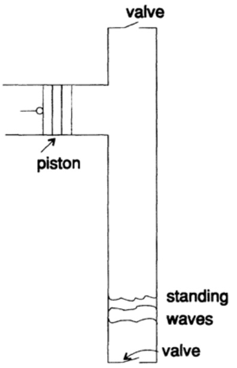  

# Figure 26.I  

Laboratories it was fairly natural I should meet the frequency approach to numerical analysis, and hence apply it to the numerical methods I used on the various problems I was asked to solve. Using the kinds of functions the clients are familiar with means insight can arise from the solution details which suggest other things to do than what they had originally thought. I found the frequency approach very useful, but some of my close friends, not at Bell Telephone Laboratories, regularly twitted me about the frequency approach every time they met me for all the years we have been meeting at various places. They simply kept the polynomial approach, though under questioning they could give no real reason for doing so-simply that was the way things had been done, hence was the right way to do things.  

It is not just for the pleasure of poking fun at the experts I bring this up. There are at least four other reasons for doing so.  

First,  as you go on you will have to deal with experts many times, and you should understand their characteristics.  

Second,  in time many of you will be experts, and I am hoping to at least modify the behavior of some of you so that you will, in your turn, not be such a block on progress as many experts have been in the past.  

Third,  it appears to me the rate of progress, the rate of innovation and change of the dominant paradigm, is increasing, and hence you will have to endure more changes than I did.  

Fourth,  if only I knew the right things to say to you then when a paradigm change occurs fewer of you would be left behind in your careers than usually happens to the experts.  

In discussing the expert let me introduce another aspect which has barely been mentioned so far. It appears most of the great innovations come from  outside  the field, and not from the insiders. I cited above continental drift. Consider archaeology. A central problem is the dating of the remains found. In the past this was done by elaborate, unreliable stratigraphy, by estimating the time needed to bury the material where it was found. Now carbon dating is used as the main tool. Where did it come from? Physics! None of the archaeology experts would have ever thought of it. So far as I can make out, the first automatic telephone came from an undertaker who thought he was not getting fair treatment from the telephone company and designed a machine which would be fair. Similar examples occur in most fields of work, but the text books seldom, if ever, discuss this aspect. At the time of Einstein’s famous “five papers in one year” he was working in the Swiss patent office! He had not been able to find an official position within the circle of University physics. In fairness to the system, in a few years he was recognized and offered various prestigious positions, ending up in Berlin. The Nazis later drove him out of Berlin to the Institute of Advanced Study, Princeton.  

Thus the expert faces the following dilemma. Outside the field there are a large number of genuine crackpots with their crazy ideas, but among them  may  also be the crackpot with the new, innovative idea which is going to triumph. What is a rational strategy for the expert to adopt? Most decide they will ignore, as best they can, all crackpots, thus ensuring they will not be part of the new paradigm, if and when it comes.  

Those experts who do look for the possible innovative crackpot are likely to spend their lives in the futile pursuit of the elusive, rare crackpot with the right idea, the only idea which really matters in the long run. Obviously the strategy for you to adopt depends on how much you are willing to be merely one of those who served to advance things, vs. the desire to be one of the few who in the long run really matter. I cannot tell you which you should choose that is your choice. But I do say you should be conscious of making the choice as you pursue your career. Do not just drift along; think of what you want to be and how to get there. Do not automatically reject every crazy idea, the moment you hear of it, especially when it comes from outside the official circle of the insiders—it may be the great new approach which will change the paradigm of the field! But also you cannot afford to pursue every “crackpot” idea you hear about. I have been talking about paradigms of Science, but so far as I know the same applies to most fields of human thought, though I have not investigated them closely. And it probably happens for about the same reasons; the insiders are too sure of themselves, have too much invested in the accepted approaches, and are plain mentally lazy. Think of the history of modern technology you know!  

I have covered the two main problems of dealing with the experts. They are: (1) the expert is certain they are right, and (2) they do not consider the basis for their beliefs and the extent to which they apply to new situations. I told you about the FFT and why it is not the Tukey-Hamming algorithm. That was not the only time I made such a mistake, forgetting there had been a technological change which invalidated my earlier reasoning, as well as the many other cases where I have observed it happen. To my embarrassment I told the story in order to get the point vividly across to you. I made the mistake; how are you going to avoid it when your turn comes? No one ever told me about the problem, while I have told you about it, so maybe you will not be as foolish as I have been at times.  

With the rapid increase in the use of technology this type of error is going to occur more often, so far as I can see. The experts live in their closed world of theory, certain they are right and are intolerant of other opinions. In some respects the expert is the curse of our society with their assurance they know everything, and without the decent humility to consider they might be wrong. Where the question looms so important I suggested to you long ago to use in an argument, “What would you accept as evidence you are wrong?” Ask yourself regularly, “Why do I believe whatever I do”. Especially in the areas where you are so sure you know; the area of the paradigms of your field.  

The opposition of the expert is often not as direct as indicated above. Consider my experience at Bell Telephone Laboratories during the earliest years of the coming of digital computers. My immediate bosses all had succeeded in the mathematical areas by using analytical methods, and during their heyday computing had been relegated to some high school graduate girls with desk calculators. The bosses  knew  the right way to do mathematics. It was useless to argue their basic assumptions with them\`\`—they might even have denied they held them—since they, based on their own experiences knew they were right! They saw, every one of them, the computer as being inferior, beneath the consideration of a real mathematician, and in  

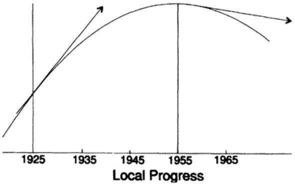  

the final analysis possibly in direct competition with them—this later giving rise to fear and hatred. It was not a discussible topic with them. I had to do computing in spite of all their (usually unstated) opposition, in spite of all the times they said they had done something I could not do with the machines I had available at the time, and in spite of all my polite replies I was not concerned with direct competition, rather I was solely interested in doing what they could not do, I was concerned with what the team of man and machine could do together. I hesitate to guess the number of times I gave that reply to a not direct but a covert attack on computers in the early days. And this in a highly enlightened place like Bell Telephone Laboratories.  

The second point I want to make is many of you, in your turn, will become experts, and I am hoping to modify in you the worst aspects of the know-it-all expert. About all I can do is to beg you to watch and see for yourself how often the above descriptions occur in your career, and hope thereby you will not be the drag on progress the expert so often is. In my own case, I vowed when I rose to near the top I would be careful, and as a result I have refused to take part in any decision processes involving current choices of computers. I will give my opinion when asked, but I do not want to be the kind of drag on the next generation I had to put up with from the past generation. Modesty? No, pride!  

To put the situation in the form of a picture we draw a line in   $n$  -dimensional space to represent, symbolically, the path of progress in time,  Figure 26.II , which is drawn, of course, in 2-dimensions. At the start of the picture, say 1935 and earlier, the direction was as indicated by the tangent arrow, and those who sensed what to do and how to do it (then) were the successful people, and were, therefore, my bosses. Then computers came in and at the later date the curve is now pointed in another direction, almost perpendicular to the past one. It is asking a lot of them to admit the very methods they earlier used to succeed are not appropriate present! But it is true, if this picture is at all like reality (remember it is in  $n$  -dimensional space). If my claim progress has not stopped miraculously at present, but rather there is probably an accelerating rate of progress, then it will be even more true when you are in charge that:  

What you did to become successful is likely to be counterproductive when applied at a later date.  

Please remember this when you have risen to the top and are in charge; do as I have tried to do and let the next generation have a cleaner chance at success than you were granted by your management while you were rising to the top. I observed to you some lectures ago, a friend behind my back remarked he doubted Hamming understood error correcting codes—and I admitted probably he was right! I do believe in what I am telling you; the old expert is all too often wrong and a block to progress. Consider the case of Einstein, who gave QM such a start with his photoelectric paper, and was in his turn a plain drag on QM when he so  aggressively opposed the theory of QM as it developed. Physicists are polite about this point as they hate to admit their tin god Einstein could be so definitely wrong; they excuse him this way and that, but under pressure they have to admit once again the person who opened up the field did not understand what he had done, and is best ignored at a later date!  

There is the final, and overwhelming, reason for telling you these things. I have observed again and again most experts are left behind as their field progresses and new paradigms come in. Taking only the history of computing as I observed it, I have told you in  Chapter 4  of the great opposition of the programmers to: (1) symbolic languages (what you call machine language but is not absolute binary coding), (2) higher level software, and (3) FORTRAN when it first came in. What happened to many of them? Most of them gradually dropped out of the field and disappeared! They could not keep up.  

A very good friend of mine was a great analog enthusiast and it was from him I learned a lot about analog computers when I acquired the management of the one at Bell Telephone Laboratories. When digital methods came in, he constantly emphasized the advantages, at that time, of the analog computers. Well, he was gradually squeezed out by his own behavior and fell back on other skills he had. But when I retired early to go to teaching, as I had long planned to do (since I felt old research people mainly get in the way of the young), he also retired. But I left with pleasant memories of Bell Telephone Laboratories and later, in talking with him, I found his memories are not so pleasant!  

If you do not keep up in your field that is almost certainly what will happen to you. While living in California I have met and talked with a number of ex-Navy officers of the rank Captain, and the stories they tell often reveal a degree of distaste in their careers. How could it be otherwise? If you are passed over for an important (to you) promotion in an organization, then it will tend to affect all the relevant memories of a great career and taint them darker. It is this social, as well as the economic, consequence I care about and why I am preaching this lesson—you must keep up or else things will overtake you and may spoil the memories of your career.  

I have used isolated stories many times in these Lectures. They are illustrative of situations, and I know many other stories which would illustrate the same points. I began to formulate many of these “theories” long ago, and as time went on experience illustrated their truth many times over, though some turned out to be false and had to be abandoned. These are not absolute truths, they are summaries of many observations which tend to “prove” the points made. Of course, you can say I looked for confirmations, but being a scientist I tried also to look for falsifications and in the face of counter evidence had to abandon some theories. When you think over many of the stories, they often have an element of “truth” based more on human traits than anything else. We are all human, but that does not prevent us from trying to modify our instincts which were evolved over the long span of history. Civilization is merely a thin veneer we have put on top of our anciently derived instincts, but the veneer is what makes it possible for modern society to operate. Being civilized means, among other things, stopping your immediate response to a situation, and thinking whether it is or is not the appropriate thing to do. I am merely trying to make you more self-aware so you will be more “civilized” in your responses and hence probably, but not certainly, more successful in attaining the things you want.  

In summary, I began by warning you about dealing with experts; but towards the end I am warning you about yourself when in your turn you are the expert. Please do not make the same foolish mistakes I did!  

# 27 Unreliable Data  

It has been my experience, as well as many others who have looked, data is generally much less accurate than it is advertised to be. This is not a trivial point—we depend on initial data for many decisions, as well as for the input data for simulations which result in decisions. Since the errors are of so many kinds, and I have no coherent theory to explain them all, I have therefore to resort to isolated examples and generalities from them.  

Let me start with  life testing .   A good example is my experience with the life testing of the vacuum tubes which were to go into the first voice carrying submarine cable with the hoped for life time of 20 years. (After 22 years we simply removed the cable from service since it was then too expensive to operate— which gives a good measure of technical progress these days.) The tubes for the cable first became available something like 18 months before the cable was to go down. I had a moderate computer facility, including a special IBM 101  statistical sorter,  and I made it available to the people who were processing the data, as well as helping them do the more technical aspects of the computing. I was not, however, in any way involved in the direct work of the project. Nevertheless, one day one of the higher ups in the project showed me the test equipment in the attic. Being me, after a time I asked, “Why do you believe the test equipment is as reliable as what is being tested?” The answer I got convinced me he had not really thought about it, but seeing pursuit of the point was fruitless, I let it drop. But I did not forget the question!  

Life testing is increasingly important and increasingly difficult as we want more and more reliable components for larger and larger entire systems. One basic principle is  accelerated life testing,  meaning mainly if I raise the temperature   $17^{\circ}$   Centigrade then most, but not all, chemical reactions double their rate. There is also the idea if I increase the working voltage I will find some of the weaknesses sooner. Finally, for testing some integrated circuits, increasing the frequency of the clock pulses will find some weaknesses sooner. The truth is, all three combined are hardly a firm foundation to work from, but in reply to this criticism the experts say, “What else can we do, given the limitations of time and money?” More and more, the time gap between the scientific creation and the engineering development is so small there is no time to gain real life testing experience with the new device before it is put into the field for widespread use.  If   you want to be certain then you are apt to be   obsolete.  

Of course there are other tests for other things besides those mentioned above. So far as I have seen the basis of life testing is shakey; but there is nothing else available. I had long ago argued at Bell Telephone Laboratories we should form a life testing department whose job is to  prepare for the testing of the next device   which is going to be invented,  and not just test after the need arises. I got nowhere, though I made a few, fairly weak, suggestions about how to start. There was not time in the area of life testing to do basic research—they were under too much pressure to get the needed results tomorrow. As the saying goes,  

“There is never time to do the job right, but there is always time to fix it later.”  

# especially in computer software!  

The question I leave with you is still, “How do you propose to test a device, or a whole piece of equipment, which is to be highly reliable, when all you have is less reliable test equipment, and with very limited time to test, and yet the device is to have a very long lifetime in the field?” That is a problem which will probably haunt you in your future, so you might as well begin to think about it now and watch for clues for rational behavior on your part when your time comes and you are on the receiving end of some life tests.  

Let me turn now to some simpler aspects of measurements. For example, a friend of mine at Bell Telephone Laboratories, who was a very good statistician, felt some data he was analyzing was not accurate. Arguments with the department head they should be measured again got exactly nowhere since the department head was sure his people were reliable and furthermore the instruments had brass labels on them saying they were that accurate. Well, my friend came in one Monday morning and said he had left his brief case on the railroad train going home the previous Friday and had lost everything. There was nothing else the department head could do but call for remeasurements, whereupon my friend produced the original records and showed how far off they were! It did not make him popular, but did expose the inaccuracy of the measurements which were going to play a vital role at a later stage.  

The same statistician friend was once making a study for an outside company on the patterns of phone calling of their headquarters. The data was being recorded by exactly the same central office equipment which was placing the calls and writing the bills for making the calls. One day he chanced to notice one call was to a nonexistent central office! So he looked more closely, and found a very large percentage of the calls were being connected for some minutes to nonexistent central offices! The data was being recorded by the same machine which was placing the calls, but there was bad data anyway. You cannot even trust a machine to gather data about itself correctly!  

My brother, who worked for many years at the Los Angles Air Pollution, once said to me they had found it necessary to take apart, reassemble, and recalibrate  every  new instrument they bought! Otherwise they would have endless trouble with accuracy, and never mind the claims made by the seller!  

I once did a large inventory study for Western Electric. The raw data they supplied was for 18 months of inventory records on something like 100 different items in inventory. I asked the natural question of why I should believe the data was consistent—for example, could not the records show a withdrawal when there was nothing in inventory? They claimed they had thought of that and had in fact gone through the data and added a few pseudo transactions so such things would not occur. Like a fool I believed them, and only late in the project did I realize there were still residual inconsistencies in the data, and hence I had first to find them, then eliminate them, and then run the data all over again. From that experience I learned  never  to process any data until I had first examined it carefully for errors. There have been complaints that I would take too long, but almost always I found errors and when I showed the errors to them they had to admit I was wise in taking the precautions I did. No matter how sacred the data and urgent the answer, I have learned to pretest it for consistency and outliers at a minimum.  

I once became involved as an instigator and latter as an advisor to a large AT&T personnel study using a UNIVAC in NYC which was rented for the job. The data was to come from many different places, so I thought it would be wise to have a pilot study run first to make sure the various sources understood what was going to happen and just how to prepare the IBM cards with the relevant data. This we did. But when the main study came in some of the sources did not punch the cards as they had been instructed. It took only a little thought on my part to realize of course the pilot study being small in size went to their local key punch specialty group, but the main study had to be done by the central group. Unfortunately for me they had not understood the purpose of the pilot study! Once more I was not as smart as I thought I was; I did not appreciate the inner workings of a large organization.  

But how about basic scientific data? In an NBS publication on the 10 fundamental constants of physics, the velocity of light, Avagadro’s number, the charge on the electron, etc, there were two sets of data with their errors. I promptly noted if the second set of data were taken as being right (and the point of the table was how much the accuracy had improved in the 24 years between compilations), then the average amount the new values fell outside the old errors was 5.267 as far, the last column which was added by me, Figure 27.I . Now you would suppose the values of the physical constants had been carefully computed, yet how wrong they were! The next compilation of physical constants showed an average error almost half as large, chapter.  Figure 27.II . One can only wonder what another 20 or so of years will reveal about the last cited accuracy! Care to bet?  

This is not unusual. I very recently saw a table of measurements of Hubble’s constant (the slope of the line connecting the red shift with distance) which is fundamental to most of modern cosmology. Most of the values fell outside of the given errors announced for most of the other values.  

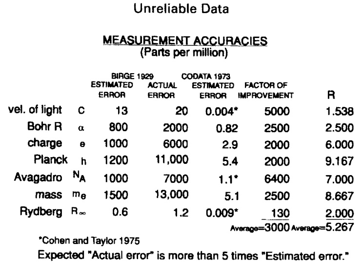  

# Figure 27.l  

By direct statistical measurement, therefore, the best physical constants in the tables are not any where near as accurate as they claim to be. How can this be? Carelessness and optimism are two major factors. Long meditation also suggests the present experimental techniques you are taught are also at fault and contribute to the errors in the claimed accuracies. Consider how you, in fact as opposed to theory, do an experiment. You assemble the equipment and turn it on, and of course the equipment does not function properly. So you spend some time, often weeks, getting it to run properly. Now you are ready to gather data, but first you  fine tune  the equipment. How? By adjusting it so you get consistent runs! In simple words,  you adjust for low variance;  what else can you do? But it is this low variance data you turn over to the statistician and is used to estimate the variability. You do not supply the correct data from the correct adjustments—you do not know how to do that—you supply the low variance data, and you get from the statistician the high reliability you want to claim! That is common laboratory practice! No wonder the data is seldom as accurate as claimed.  

# Figure 27.II  

I offer you Hamming’s rule:  

$90\%$   of the time the next independent measurement will fall outside the previous   $90\%$   confidence limits!  

This rule is in fact a bit of an exaggeration, but stated that way it is a memorable rule to recall—most published measurement accuracies are not anywhere near as good as claimed. It is based on a lifetime of experience and represents later disappointments with claimed accuracies. I have never applied for a grant to make a properly massive study, but I have little doubts as to the outcome of such a study.  

Another curious phenomenon you may meet is in fitting data to a model there are errors in both the data and the model. For example, a normal distribution may be assumed, but the tails may in fact be larger or smaller than the model predicts, and possibly no negative values can occur although the normal distribution allows them. Thus there are two sources of error. As your ability to make more accurate measurements increases the error due to the model becomes an increasing part of the error.  

I recall an experience I had while I was on the Board of Directors of a computer company. We were going to a new family of computers and had prepared very careful estimates of costs of all aspects of the new models. Then a salesman estimated if the selling price were so much then he could get orders for 10, if another price 15, and another 20 sales. His guesses, and I do not say they were wrong, were combined with the careful engineering data to make the decision on what price to charge for the new model! Much of the reliability of the engineering guesses was transferred to the sum, and the uncertainty of the salesman’s guesses was ignored. That is not uncommon in big organizations. Careful estimates are combined with wild guesses, and the reliability of the whole is taken to be the reliability of the engineering part. You may justly ask why bother with making the accurate engineering estimates when they are to be combined with other inaccurate guesses; but that is wide spread practice in many fields!  

I have talked first about Science and Engineering so when I get to economic data you will not sneer at them too much. A book I have read several times is Morgenstern’s  On the Accuracy of Economic Measurements,  Princeton Press, 2nd ed. He was a highly respected Economist.  

My favorite example from his book is the official figures on the gold flow from one country to another, as reported by both sides. The figures can differ at times by more than two to one! If they cannot get the gold flow right what data do you suppose is right? I can see how electrical gear shipped to a third world  

country might get labeled as medical gear because of different import duties, but gold is gold, and is not easily called anything else. Morgenstern points out at one time DuPont Chemical held about   $23\%$   of the General Motors stock. How do you suppose this appeared when the Gross National Product (GNP) figure was computed? Of course it was counted twice!  

As an example I found for myself, there was a time, not too long ago, when the tax rules for reporting inventory holdings were changed, and as a result many companies changed their methods of inventory reporting to take advantage of the new reporting rules, meaning they now could show smaller inventory and hence get less tax. I watched in vain in the Wall Street Journal to see if this point was ever mentioned. No, it never was that I saw! Yet the inventory holdings are one of the main indices which are used to estimate the expectations of the manufacturers, whether we are headed up or down in the economy. The argument goes when manufacturers think sales will go down they decrease inventory, and when they expect sales to go up they increase inventory so they will not miss some sales. That the legal rules had changed for reporting inventory and was part of what was behind the measurements was never mentioned, so far as I could see.  

This is a problem in all time series. The definition of what is being measured is constantly changing. For perhaps the best example, consider poverty. We are constantly upgrading the level of poverty, hence it is a losing game trying to remove it—they will simply change the definition until there are enough of people below the poverty level to continue the projects they manage! What is now called “poverty” is in many respects better than what the Kings of England had not too long ago!  

In a Navy a Yeoman is not the same Yeoman over the years, and a ship is not a ship, etc, hence any time series you study to find the trends of the Navy will have this extra factor to confound you in your interpretations. Not that you should not try to understand the situation using past data (and while doing it apply some sophisticated signal processing  Chapters 14 –17) but there are still troubles awaiting you due to changing definitions which may never have been spelled out in any official records! Definitions have a habit of changing over time without any formal statement of this fact.  

The forms of the various economic indices you see published regularly, including unemployment (which does not distinguish between the unemployed and the unemployable but should be in my opinion), were made up, usually, long ago. Our society has in recent years changed rapidly from a manufacturing to a service society, but neither Washington, D.C. nor the economic indicators have realized this to any reasonable extent. Their reluctance to change the definitions of the economic indicators is based on the claim a change, as indicated in the above paragraph, makes the past noncomparable to the present— better to have an irrelevant indicator   than an inconsistent one,  so they claim. Most of our institutions (and people) are slow to react to changes such as the shift to service from manufacturing, and even slower to ask themselves how what they were doing yesterday should be altered to fit tomorrow. Institutions and people prefer to go along smoothly, and hence lag far behind, than to make the effort to be reasonably abreast of the times.  Institutions like people, tend to move only when forced to.  

If you add to the above the simple facts most economic data is gathered for other purposes and is only incidentally available for the economic study made, and there are often strong reasons for falsifying the initial data which is reported, then you see why economic data is bad.  

As another source for inaccuracy mentioned by Morgenstern, consider discounts to favored customers is a common practice, and these are jealously guarded secrets. Now it happens in times of depression the company will grant larger discounts, and decrease them when things are improving, but the Government figures of costs must be based on the listed sales prices since the discounts are unknowable. Thus economic down times and up times are systematically biased in different directions in the data gathered.  

What can the Government Economists use for their basic data other than much of this inaccurate, systematically biased data? Yes, they may to a lesser or greater extent be aware of the biases, but they have no way of knowing how much the data is in error. So it should not surprise you many economic predictions are seriously wrong. There is little else they can do, hence you should not put too much faith in their predictions.  

In my experience most Economists are simply unwilling to discuss the basic inaccuracy in the economic data they use, and hence I have little faith in them as Scientists. But who said Economic Science is a Science? Only the Economists!  

If Scientific and Engineering data are not at all as accurate as they are said to be, by factors of 5 or more at times, and economic data can be worse, how do you suppose Social Science data fares? I have no comparable study of the whole field, but my little, limited experience does suggests it is not very good. Again, there may be nothing better available, but that does not mean what data is available is safe to use.  

It should be clear I have given a good deal of attention to this matter of the accuracy of data during most of my career. Due to the attitudes of the experts I do not expect anything more than a slow improvement in the long future.  

If the data is usually bad, and you find that you have to gather some data, what can you do to do a better job? First, recognize what I have repeatedly said to you, the human animal was not designed to be reliable; it cannot count accurately, it can do little or nothing repetitive with great accuracy. As an example, consider the game of bowling. All the bowler needs to do is throw the ball down the lane reliably every time. How seldom does the greatest expert roll a perfect game! Drill teams, precision flying, and such things are admired as they require the utmost in careful training and execution, and when examined closely leave a lot to be improved.  

Second, you cannot gather a really large amount of data accurately. It is a known fact which is constantly ignored. It is always a matter of limited resources and limited time. The management will usually want a  $100\%$   survey when a small one, consisting a good deal less, say  $1\%$   or even  $1/10\%$  , will yield more accurate results! It is known, I say, but ignored. The telephone companies, in order to distribute the income to the various companies involved in a single long distance phone call, used to take a very small, carefully selected sample, and on the basis of this sample they distributed the money among the partners. The same is now done by the airlines. It took them a long while before they listened, but they finally came to realize the truth of:  Small samples carefully taken are   better than large samples poorly done . Better, both in lower cost and in greater accuracy.  

Third, much social data is obtained via questionnaires. But it a well documented fact the way the questions are phrased, the way they are ordered in sequence, the people who ask them or come along and wait for them to be filled out, all have serious effects on the answers. Of course, in a simple black and white situation this does not apply, but when you make a survey then generally the situation is murky or else you would not have to make it. I regret I did not keep a survey by the American Mathematical Society it once made of its members. I was so indignant at the questions, which were framed to get exactly the answers they wanted, I sent it back with that accusation. How few mathematicians faced with questions, carefully led up to in each case, such as: is there enough financial support for mathematics, enough for publications, enough for graduate scholarships, etc, would say there was more than enough money available? The Mathematical Society of course used the results to claim there was a need for more support for Mathematics in all directions.  

I recently filled out a long, important questionnaire (important in the consequence management actions which might follow). I filled it out as honestly as I could, but realized I was not a typical respondent. Further thought suggested the class of people being surveyed was not homogeneous at all, but rather was a collection of quite different subclasses, and hence any computed averages will apply to no group. It is much like the famous remark, the average American family has 2 and a fraction children, but of course no family has a fractional child! Averages are meaningful for homogeneous groups (homogeneous with respect to the actions that may later be taken) but for diverse groups averages are often meaningless. As earlier remarked, the average adult has one breast and one testicle, but that does not represent the average person in our society.  

If the range of responses is highly skewed we have recently admitted publicly the median is often preferable to the average (mean) as an indicator. Thus they often now publish the median income and median price of houses, and not the average amounts.  

Fourth, there is another aspect I urge you to pay attention to. I have said repeatedly the presence of a high ranking officer of an organization will change what is happening in the organization at that place and at that time, so while you are still low enough to have a chance please observe for yourself how questionnaires are filled in. I had a clear demonstration of this effect when I was on the Board of Directors of a computer company. I saw underlings did what they thought would please me, but in fact angered me a good deal, though I could say nothing to them about it. Those under you will often do what they think you want, and often it is not at all what you want! I suggest, among other things, you will find when headquarters, in your organization, sends out a questionnaire, then those who think they will rate high will more often than not promptly fill them out, and those who do not feel so will tend to delay, until there is a dead line and then some low level person will fill them out from hunches without making the measurements which were to be taken—it is too late to do it right, so send in what you can! What these “made up” reports do the reliability of the whole is anyone’s guess. It may make the results too high, too low, or even not change the results much. But it is from such surveys the top management must make their decisions—and if the data is bad it is likely the decisions will be bad.  

A favorite pastime of mine, when I read or hear about some data, is to ask myself how people could have gathered it—how their conclusions could be justified? For example, years ago when I was remarking on this point at a dinner party, a lovely widow said she could not see why data could not be gathered on any topic. After some moments of thought I replied, “How would you measure the amount of adultery per year on the Monterey Peninsula?” Well, how would you? Would you trust a questionnaire? Would you try to follow people? It seems difficult, and perhaps impossible, to make any reasonably accurate estimate of the amount of adultery per year. There are many other things like this which seem to be very hard to measure, and this is especially true in social relationships.  

There is a clever proposed method whose effectiveness I do not know in practice. Suppose you want to measure the amount of murder which escapes detection. You interview people and tell them to toss a coin without anyone but themselves seeing the outcome, and then if it is heads they should claim they have committed a murder, while if tails they should tell the truth. In the arrangement there is no way anyone except themselves can know the outcome of the toss, hence no way they can be accused of murder if they say so. From a large sample the slight excess of murders above one half gives the measure you want. But that supposes the people asked, and given protection, will in fact respond accurately. Variations on this method have been discussed widely, but a serious study to find the effectiveness is still missing, so far as I know.  

In closing, you may have heard of the famous election where the newspapers announced the victory for President to one man when in fact the other won by a land slide. There is also the famous Literary Digest poll which was conducted via the telephone, and was amazingly wrong afterwards—so far wrong the Literary Digest folded soon after—some people say because of this faulty poll. It has been claimed at that time the ownership of a telephone was correlated with wealth and wealth with a political party—hence the error.  

Surveys are not a job for an amateur to design, administer and evaluate. You need expert advice on questionnaires (not just a run-of-the-mill statistician) when you get involved with a questionnaires, but there seems little hope questionnaires can be avoided. More and more we want not mere facts about hard material things, but we want social and other attitudes surveyed—and this is indeed very treacherous ground.  

In summary, as you rise in your organization you will need more and more of this kind of information than was needed in the past since we are becoming more socially oriented and subject to law suits for trivial things. You will be forced, again and again, to make surveys of personal attitudes of people, and it is for these reasons I have spent so much time on the topic of unreliable data. You need reliable data to make reliable decisions, but you will seldom have it with any reliability!  

# 28 Systems Engineering  

Parables are often more effective than is a straight statement, so let me begin with a parable. A man was examining the construction of a cathedral. He asked a stone mason what he was doing chipping the stones, and the mason replied, “I am making stones”. He asked a stone carver what he was doing, “I am carving a gargoyle”. And so it went, each person said in detail what they were doing. Finally he came to an old woman who was sweeping the ground. She said, “I am helping build a cathedral”.  

If, on the average campus, you asked a sample of professors what they were going to do the next class hour, you would hear they were going to: “teach partial fractions”, “show how to find the moments of a normal distribution”, “explain Young’s modulus and how to measure it” ,  etc. I doubt you would often hear a professor say, “I am going to educate the students and prepare them for their future careers”.  

You may claim in both cases the larger aim was so well understood there was no need to mention it, but I doubt you really believe it. Most of the time each person is immersed in the details of one special part of the whole and does not think of how what they are doing relates to the larger picture. It is characteristic of most people they keep a myopic view of their work and seldom, if ever, connect it with the larger aims they will admit, when pressed hard, are the true goals of the system. This myopic view is the chief characteristic of a bureaucrat. To rise to the top you should have the larger view—at least when you get there.  

Systems engineering is the attempt to keep  at all times  the larger goals in mind and to translate local actions into global results.  But   there is no single larger picture . For example, when I first had a computer under my complete control I thought the goal was to get the maximum number of arithmetic operations done by the machine each day. It took only a little while before I grasped the idea it was the amount of important computing,  not the raw volume, that mattered. Later I realized it was not the computing for the Mathematics department, where I was located, but the computing for the research division which was important. Indeed, I soon realized to get the most value out of the new machines it would be necessary to get the scientists themselves to use the machine directly so they would come to understand the possibilities computers offered for their work and thus produce less actual number crunching, but presumably more of the computing done would be valuable to Bell Telephone Laboratories. Still later I saw I should pay attention to all the needs of the Laboratories, and not just the Research Department. Then there was AT&T, and outside AT&T the Country, the scientific and engineering communities, and indeed the whole world to be considered. Thus I had obligations to myself, to the department, to the division, to the company, to the parent company, to the country, to the world of scientists and engineers, and to everyone. There was no sharp boundary I could draw and simply ignore everything outside.  

The obligations in each case were of: (1) immediate importance, (2) longer range importance, and (3) very long term importance. I also realized under (2) and (3) one of my functions in the research department was not so much to solve the existing problems as to develop the methods for solving problems, to expand the range of what could be done, and to educate others in what I had found so they could continue, extend, and improve my earlier efforts.  

In systems engineering it is easy to say the right words, and many people have learned to say them when asked about systems engineering, but as in many sports such as tennis, golf, and swimming it is hard to do the necessary things as a whole. Hence systems engineers are to be judged not by what they say but by what they produce. There are many people who can talk a good game but are not able to play one.  

The first rule of systems engineering is:  

If you optimize the components you will probably ruin the system performance.  

This is a very difficult point to get across. It seems so reasonable if you make an isolated component better then the whole system will be better—but this is not true, rather the system performance will probably degrade! As a simple example, I was running a differential analyzer and was so successful in solving important problems there was need for both a bigger one and second one. Therefore we ordered a second one which was to be connected with the first so the two could be either operated separately or together. They built a second model and wanted to make improvements, which I agreed to  only  if it would not interfere with the operation of the whole machine. Came the day of acceptance on the shop floor before dismantling and moving it to our location. I started to test it with the aid of a reluctant friend who claimed I was wasting time. The first test and it failed miserably! The test was the classic one of solve the differential equation  

$$
y^{\prime\prime}+y\!=\!0,\ \ \ y(0)\!=\!1,\ \ \ y^{\prime}(0)\!=\!0,
$$  

whose solution is, of course,  $\scriptstyle{y=c o s t}$  . You then plot  $y(t)$   against  $y\,\acute{(t)}$   and you should get a circle. How well it closes on itself, loop after loop, is a measure of the accuracy.  

So we tried the test with other components, and the same result. My friend had to admit there was something seriously wrong, so we called in the people who constructed it and pointed out the flaw—which was so simple to exhibit they had to admit there was something wrong. They tinkered and tinkered while we watched, and finally my friend and I went to lunch together. When we came back they had located the trouble. They had indeed improved the amplifiers a great deal, but now currents through the inadequate grounding was causing back circuit leakage! They had merely to put in a much heavier copper grounding and all was well. As I said, the improvement of a component in such a machine, even where each component is apparently self-standing, still ruined the system performance! It is a trivial example, but it illustrates the point of the rule. Usually the effect of the component improvement is less dramatic and clear cut, but equally detrimental to the performance of the whole system.  

You probably still do not believe the statement so let me apply this rule to you. Most of you try to pass your individual courses by cramming at the end of the term, which is to a great extent counter-productive, as you well know, to the total education you need. You look at your problem as passing the courses one at a time, or a term at a time, but you know in your hearts what matters is what you emerge with at the end, and what happens at each stage is not as important. During my last two undergraduate college years when I was the University of Chicago, the rule was at the end you had to pass a single exam based on 9 courses in your major field, and another exam based on 6 in your minor field, and these were mainly what mattered, not what grades you got along the way. I, for the first time, came to understand what the system approach to education means. While taking any one course, it was not a matter of passing it, pleasing the professor, or anything like that, it was learning it so at a later date, maybe two years later, I would still know the things which should be in the course.  

Cramming is clearly a waste of time. You really know it is, but the behavior of most of you is a flat denial of this truth. So, as I said above, words mean little in judging a systems engineering job, it is what is produced that matters. The professors believe, as do those who are paying the bill for your education, and probably some of you also, what is being taught will probably be very useful in your later careers, but you continue to optimize the components of the system to the detriment of the whole! Systems engineering is a hard trade to follow; it is so easy to get lost in the details! Easy to say; hard to do. This example should show you the reality of my remark many people know the words but few can actually put them into practice when the time comes for action in the real world. Most of you cannot!  

As another example of the effects of optimizing the components of a system, consider the teaching of the lower level Mathematics courses in college. Over the years we have optimized both the calculus course and linear algebra, and we have stripped out anything not immediately relevant to each course. As a result the teaching of Mathematics, viewed as a whole, has large gaps. We barely mention: (1) the important method of Mathematical induction, (2) after a brief mention in algebra in connection with quadratic equations we ignore, almost in holy dread, any mention of complex numbers until the fatal day, late in the linear algebra course, when complex eigenvalues and eigenfunctions arise and the poor student is faced with two new, difficult concepts at once and is naturally baffled, (3) the important, useful method of undetermined coefficients is briefly mentioned, (4) impossibility proofs are almost totally ignored, (5) discrete Mathematics is ignored, (6) little or no effort goes into trying to convert what to many of the students are just “chicken tracks on paper” into meaningful concepts which are applicable to the real world; and so it goes, large parts of any reasonable Mathematical education are omitted in the urge to optimize the individual courses. Usually the inner structure of the calculus and the central role of the limit is glossed over as not essential.  

All the proposed reformations of the standard calculus course I have examined, and there are many, never begin by asking, “What is the total Mathematical education and what therefore should be in the calculus course?” They merely try to include computers, or some such idea, without examining the system of total Mathematical education which the course should be a part of. The systems approach to education is not flourishing, rather the enthusiasts of various aspects try to mold things to fit their local enthusiasms. The question, as in so many situations, “What is the total problem in which this part is to fit?” is simply regarded as too big, and hence the sub-optimization of the courses goes on. Few people who set out to reform any system try first to find out the total system problem, but rather attack the first symptom they see. And, of course, what emerges is what ever it is, and is not what is needed.  

I recently tried to think about the history of systems engineering—and just because a system is built it does not follow the builder had the system rather than the components in mind. The earliest system I recall reading about in its details is the Venetian arsenal in its heyday around 1200–1400. They had a production line and as a new ship came down the line, the ropes, masts, sails, and finally the trained crew, were right there when needed and the ship sailed away! At regular intervals another ship came out of the arsenal. It was an early “just in time” production line which included the people properly trained as well the equipment built.  

The early railroads were surely systems, but it is not clear to me the first builders did not try to get each part optimized and really did not think, until after the whole was going, there was a system to consider— how the parts would intermesh to attain a decent operating system.  

I suspect it was the telephone company which first had to really face the problems of systems engineering. If decent service was to be supplied then all the parts had to interconnect, and work at a very high reliability per part. From the first the company provided a service, not just equipment. That is a big difference. If you merely construct something and leave it to others to keep it running it is one thing; if you are also going to operate it as a service then it is another thing entirely! Others had clearly faced small systems as a whole, but the telephone system was larger and more complex than anything up to that point. They also found, perhaps for the first time, in expanding there is not an economy of scale but a diseconomy; each new customer must be connected with  all  the previous customers, and each new one is therefore a larger expense,  hence  the system must be very shrewdly designed.  

I do not pretend to understand how I, with a classical pure Mathematics education, was converted to being a systems engineer, but I was. I suppose it started quietly with my college education, but it really got started at Los Alamos where it was obvious to all of us we were constructing a design for which every component had to be properly coordinated if the whole was to do what it had to do—including fit into the bomb bay of the current airplane. And to do the job rapidly before the enemy, who was known to be working on it too, reached success.  

The Nike guided missile systems, the computer systems I ran, and many other aspects of the work at Bell Telephone Laboratories all taught me the facts of systems engineering—not abstractly, but in hard lessons daily illustrated by idiots who did not understand the whole as a whole, but only the components. I have already observed I did not immediately grasp the systems approach as I was running the computers, but at least I gradually realized the computers were but a part of a research—development organization, vital to be sure, but it was their value to the system which mattered in the long run, how well the computers helped reach the organization’s goals, as well as society’s goals, and not how comfortable it was for the staff operating the computers.  

That brings up another point, which is now well recognized in software for computers but it applies to hardware too. Things change so fast part of the system design problem is the system will be constantly upgraded in ways you do not now know in any detail! Flexibility must be part of modern design of things and processes. Flexibility built into the design means not only you will be better able to handle the changes which will come after installation, but it also contributes to your own work as the small changes which inevitably arise both in the later stages of design and in the field installation of the system. I had not realized how numerous these field changes were until the early Nike field test at Kwajalain Island. We were installing it and still there was a constant stream of field changes going out to them!  

Thus rule 2:  

Part of systems engineering design is to prepare for changes so they can be gracefully made and still not degrade the other parts.  

Returning to your education, our real problem is not to prepare you for our past, or even the present, but to prepare you for your future. It is for this reason I have stressed the importance of what currently is believed to be the fundamentals of various fields, and have deliberately neglected the current details which will probably have a short lifetime. I cited earlier the half-life time of engineering details as being 15 years— half of the details you learn now will probably be useless to you in 15 years.  

Rule 3:  

The closer you meet specifications the worse the performance will be when overloaded.  

The truth of this is obvious when building a bridge to carry a certain load; the slicker the design to meet the prescribed load the sooner the collapse of the bridge when the load is exceeded. One sees this also in a telephone central office; when you design the system to carry the maximum load then with a slight overload of traffic performance degrades immediately. Hence good design generally includes the graceful decay of performance when the specifications are exceeded.  

In preparation for writing this chapter I reread once more an unpublished set of essays on:  One Man’s Systems Engineering,  by H.R.Westerman (1975), then of Bell Telephone Laboratories. They are the only deeply philosophical discussion I know of the “what, how, and why” of systems engineering. While I will make small differences at various points from what he says I am in fundamental agreement with him. I can only summarize, all too briefly, what he says in 10 essays whose titles are:  

1. One Man’s Systems Engineering. 2. What is Systems Engineering? 3. On the Objective. 4. What Does a Systems Engineer Do? 5. The Framework of Systems Engineering. 6. Organization and Systems Engineering. 7. Objectives and Policy Makers. 8. On the Methodology of Systems Engineering. 9. Evaluation and (Un)Common Sense. 10. Envoy.  

The list shows clearly his breadth of vision, which arose from many years on both military projects and telephone systems problems.  

He believes more in the group which attacks systems engineering problems than in the individual problems attacked, whereas I, from my limited experience in computing where I had no one near by to talk to about the proper use of computers, had to do it single handed. Of course his problems were far more difficult than mine.  

He believes specialists brought together to make a team are the basis of systems engineering, and between jobs they must go back to their specialties to maintain their expertise. Using the group too often to fight fires is detrimental in the long run since then the individuals do not keep their skills honed up in their areas.  

We both agree a systems engineering job is never done. One reason is the presence of the solution changes the environment and produces new problems to be met. For example, while running the computing center in the early days I came to the belief small problems were relatively more important than large ones; regular dependable service  was a desirable thing. So I instituted a 1 hour period in each morning and each afternoon during which only 3 minute (or less) problems were to be run (mainly program testing) and if you ran over 5 minutes you got off the machines no matter how much you had claimed you were practically finished. Well, people with 10 minute problems broke them up into three small pieces with different people for each piece and ran them under the rules-thus increasing the load in the input/output facilities. My solution’s very presence alters the system’s response. The optimal strategy for the individual was clearly opposed to the optimal strategy for the whole of the laboratories, and it is one of the functions of the systems engineer to block most of the local optimization of the individuals of the system and reach for the global optimization for the system.  

A second reason the systems engineers design is never completed is the solution offered to the original problem usually produces both deeper insight and dissatisfaction s in the engineers themselves. Furthermore, while the design phase continually goes from proposed solution to evaluation and back again and again, there comes a time when this process of redefinement must stop and the real problem coped with—thus giving what they realize is, in the long run, a suboptimal solution.  

Westerman believes, as I do, while the client has some knowledge of his symptoms, he may not understand the real causes of them, and it is foolish to try to cure the symptoms only. Thus while the systems engineers must listen to the client they should also try to extract from the client a deeper understanding of the phenomena. Therefore, part of the job of a systems engineer is to define, in a deeper sense, what the problem is and to pass from the symptoms to the causes.  

Just as there is no definite system within which the solution is to be found, and the boundaries of the problem are elastic and tend to expand with each round of solution, so too there is often no final solution, yet each cycle of input and solution is worth the effort. A solution which does not prepare for the next round with some increased insight is hardly a solution at all.  

I suppose the heart of systems engineering is the  acceptance  here is neither a definite fixed problem nor a final solution, rather evolution is the natural state of affairs. This is, of course, not what you learn in school where you are given definite problems which have definite solutions.  

How, then, can the schools adapt to this situation and teach systems engineering, which because of the elaboration of our society, becomes ever more important? The idea of a laboratory approach to systems engineering is attractive until you examine the consequences. The systems engineering described above depends heavily on the standard school teaching of definite techniques for solving definite problems. The new element is the  formulation  of a definite problem from the background of indefiniteness which is the basis of our society. We cannot elide the traditional training, and the schools have not the time, nor the resources, except in unusual cases, to take on the new topic, systems engineering. I suppose the best that can be done is regular references to how the class room solutions we teach differ from the reality of systems engineering.  

Westerman believes, apparently, the art of systems engineering must be learned in a team composed of some old hands and some new ones. He recognizes the old hands have to be gradually removed and new people brought into the team. I have no answer for how to teach my “lone wolf” experiences except what I have done so far, by stories of what happened to me in given situations. Usually the actual circumstances are so complex it takes a long, long time to get across the outside policies, organization habits, characteristics of personnel that will run the final system, operating conditions in the field, tradition, etc. which surround, and to a great extent circumscribe, the solution to be offered to the systems problem. The solution is usually a great compromise between conflicting goals, and the student seldom appreciates the importance of the intangible parts of the boundary which shape the form of the answer. Thus real systems engineering problems are almost impossible to exhibit in proper realistic detail; instead toy situations and stories must be used which, while eliminating much detail, do not distort things too much.  

If you will look back on these chapters you will find a great deal of just this-the stories were often about systems engineering situations which were greatly simplified. I suppose I am a dedicated systems engineer and it is inevitable I will always lean in that direction. But let me say again, systems engineering must be built on a solid ground of classical simplification to definite problems with definite solutions. I doubt it can be taught  ab initio .  

Let me close with the observation I have seen many, many solutions offered which solved the wrong problem correctly. In a sense systems engineering is trying to solve the right problem, perhaps a little wrongly, but with the realization the solution is only temporary and later on during the next round of design these accepted faults can be caught  provided  insight has been obtained. I said it before, but let me say it again, a solution which does not provide greater insight than you had when you began is a poor solution indeed, but it may be all that you can do given the time constraints of the situation. The deeper, long term understanding of the nature of the problem must be the goal of the system engineer, whereas the client always wants prompt relief from the symptoms of his current problem. Again, a conflict leading to a meta systems engineering approach!  

As an example of the deepening of our understanding of a system and its problems, consider the Nike guided missile project. At first it was to build a missile which would shoot down a single target. This accomplished, we began to think of a battery of Nike missiles and how to coordinate the individual missiles when under attack by a fleet of enemy airplanes. Then came the day when we began to think about what targets to defend, which cities to defend and which not to. We began to realize the answer is all targets should be equally expensive to the enemy—there should be no under-defended or over-defended target, each should be defended in proportion to the damage that could be done by the enemy. Thus we began to see the Nike missile is merely a device to make the enemy pay a price for the damage he can inflict, with no “cheap” targets available. How different this view is from the one with which we began! It illustrates the point each solution should bring further understanding of the problem; the first symptoms they tell you will not last long once you begin to succeed; the goal will be constantly changing as your and the customer’s understanding deepen.  

Systems engineering is indeed a fascinating profession, but one which it hard to practice. There is a great need for real systems engineers, as well as perhaps a greater need to get rid of those who merely talk a good story but cannot play the game effectively.  

# 29 You Get What   You Measure  

You may think the title means if you measure accurately you will get an accurate measurement, and if not then not; but it refers to a much more subtle thing—the way you choose to measure things controls to a large extent what happens. I repeat the story Eddington told about the fishermen who went fishing with a net. They examined the size of the fish they caught and concluded there was a minimum size to the fish in the sea. The instrument you use clearly affects what you see.  

The current popular example of this effect is the use of the bottom line of the profit and loss statement every quarter to estimate how well a company is doing, which produces a company interested mainly in short term profits and has little regard to long term profits.  

If in a rating system every one starts out at  $95\%$   then there is clearly little a person can do to raise their rating but much which will lower the rating; hence the obvious strategy of the personnel is to play things safe, and thus eventually rise to the top. At the higher levels, much as you might want to promote for risk taking, the class of people from whom you may select them is mainly conservative!  

The rating system in its earlier stages may tend to remove exactly those you want at a later stage.  

Were you to start with a rating system in which the average person rates around  $50\%$   then it would be more balanced; and if you wanted to emphasize risk taking then you might start at the initial rating of   $20\%$   or less, thus encouraging people to try to increase their ratings by taking chances since there would be so little to lose if they failed and so much to gain if they succeeded. For risk taking in an organization you must encourage a reasonable degree of risk taking at the early stages, together with promotion, so finally some risk takers can emerge at the top.  

Of the things you can choose to measure some are hard, firm measurements, such as height and weight, while some are soft such as social attitudes. There is always a tendency to grab the hard, firm measurement, though it may be quite irrelevant as compared to the soft one which in the long run may be much more relevant to your goals.  Accuracy  of measurement tends to get confused with  relevance  of measurement, much more than most people believe. That a measurement is accurate, reproducible, and easy to make does not mean it should be done, instead a much poorer one which is more closely related to your goals may be much preferable. For example, in school it is easy to measure training and hard to measure education, and hence you tend to see on final exams an emphasis on the training part and a great neglect of the education part.  

Let me turn to another effect of a measurement system, and illustrate it by the definition and use of IQs. What is done is a plausible list of questions, plausible from past experience, is made, and then tried out on a small sample of people. Those questions which show an internal correlation with others are kept and those which do not correlate well are dropped. Next, the revised test is calibrated by using it on a much larger sample.  

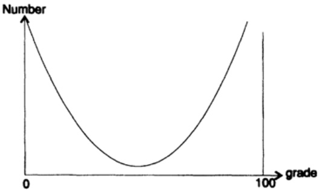  

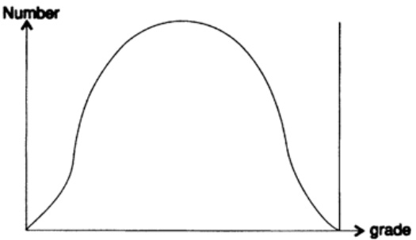  

# Figure 29.II  

How? Simply by taking the accumulated scores (the number of people’s scores which are below the given amount) and plotting these revised numbers on probability paper—meaning the cumulative probabilities of a normal distribution are the horizontal lines. Next the points where the cumulative actual scores fall at given percentage points are related, via a calibration table, to the corresponding points on the cumulative normal probability curve. As a result it is observed intelligence has a normal distribution in the population! Of course it has, it was made to be that way! Furthermore, they have defined intelligence to be what is measured by the calibrated exam, and if that is the definition of intelligence then of course intelligence is normally distributed. But if you think maybe intelligence is not exactly what the calibrated exam measures, then you are entitled to doubt intelligence is normally distributed in the population. Again, you get what was measured, and the normal distribution announced is an artifact of the method of measurement and hardly relates to reality.  

In giving a final exam in a course, say in the calculus, I can get almost any distribution of grades I want. If I could make up an exam which was uniformly hard, then each student would tend either to get all the answers right or all wrong. Hence I will get a distribution of grades which peaks up at both ends, Figure 29.I . If, on the contrary, I asked a few easy questions, many moderately hard, and a few very hard ones, I would get the typical normal distribution; a few at each end and most of the grades in the middle, Figure 29.II . It should be obvious if I know the class then I can get almost any distribution I want. Usually, at the final exam time I am most worried about the pass-fail dividing point, and design the exam so I will have little doubt as to how to act, as well as have the hard evidence in case of a complaint.  

Still another aspect of a rating system is its  dynamic range . Suppose you are given a scale of 1 to 10, with 5 being the average. Most people will give ratings of 4, 5, and 6, and seldom venture, if ever, to the extremes of 1 and 9. If you give a 6 to what you like, but I use the entire dynamic range and assign a 2 to what I do not like, then the effect of the two of us is while we may differ equally  in our opinion, the sum of the ratings will be  $6{+}2{=}8$  , and the average will be 4—the effect of my opinion more than wipes out yours! In using a rating scheme you should try to use the entire dynamic range, and if you do you will have a much larger effect on the final average—provided it is done, as most such cases are, by blind averaging of the ratings assigned. Remember Coding Theory says the entropy (the average surprise) is maximum when the distribution is uniform. You have the most information when all the grades are used equally, as you may recall from  Chapter 13  on Information Theory.  

If you regard giving grades in a course as a  communication channel  then, as just noted, the equally frequency use of  all  the grades will communicate the maximum amount of information—whilst the typical use in Graduate Schools of mainly the two highest grades, A and B, greatly reduces the amount of information sent. I understand the Naval Academy uses rank in class, and in some sense this is the only defense against “grade inflation” and the failure to use the whole dynamic range of the scale uniformly, thus communicating the maximum amount of information, given a fixed alphabet for grades. The main fault with using rank as the grade is by chance there may be all very good people in a particular class, but some one of them will have to be at the bottom!  

There is also the matter of how you initially attract people to the field. It is easy to see in psychology the people who enter the field are mixed up in their heads more than the average professor and average student in a college—it is not so much the courses do this, though I suspect they help to mix the student up further, but the initial selection does it. Similarly, the hard and soft sciences have their attractions and repulsions based on  initially perceived features  of the fields, and not necessarily on the actual features of the field. Thus people tend to go into the fields which will favor their peculiarities, as they sense them, and then once in the field these features are often further strengthened. Result—poorly balanced, but highly specialized, people— which may often be necessary to succeed in the present situation.  

In Mathematics, and in Computer Science, a similar effect of initial selection happens. In the earlier stages of Mathematics up through the Calculus, as well as in Computer Science, grades are closely related to the ability to carry out a lot of details with high reliability. But later, especially in Mathematics, the qualities needed to succeed change and it becomes more proving theorems, patterns of reasoning, and the ability to conjecture new results, new theorems, and new definitions which matter. Still later it is the ability to see the whole of a field as a whole, and not as a lot of fragments. But the grading process has earlier, to a great extent, removed many of those you might want, and indeed are needed at the later stage! It is very similar in Computer Science where the ability to cope with the mass of programming details favors one kind of mind, one which is often negatively correlated with seeing the bigger picture.  

The personnel employment department also has an effect on who is recruited into the system. If there is recruiting for research then the typical member of the personnel department in a big organization is not likely to want the right people. Good researchers, because the criterion is they have originality in Science and Engineering, also means typically they are original in other aspects of their behavior and dress— meaning they do not appeal to the typical recruiter from the personnel department. Hence, as at Bell Telephone Laboratories, usually the research people go out to do the hiring for the research area, and the personnel department shudders! This is not a trivial point, the recruiting of one generation determines the organization’s next generation.  

There is also the vicious feature of promotion in most systems. At the higher levels the current members choose the next generation—and they  tend strongly  to select people like themselves— people with whom they will feel comfortable. The Board of Directors of a company has a strong control of the officers and next Board members who are put up for election (the results of which is often more or less automatic). You tend to get inbreeding—but also you tend to get an organization personality. Hence the all too common method of promotion by self-selection at the higher levels of an organization has both good and bad features. This is still on the topic you get what you measure as there is a definite matter of evaluation, and the criteria used, though unconscious, are still there.  

In the distant past to combat this inbreeding most Mathematics Departments (a topic I am more familiar with than for other Departments) had a general rule they did not employ their own graduates. The rule is not now widely applied so far as I can see—quite the contrary, there seem to be a tendency to hire their own graduates over outsiders. There have been several occasions when Economics Departments were so inbred the top management of the University had to step in and do the hiring over the professor's dead bodies as it were, in order to gain a reasonable balance in the University of differing opinions. The same has happened in Psychology Departments, Law, and no doubt in others.  

As just mentioned, a rating system which allows those who are in to select the next generation has both good and bad features, and needs to be watched closely for too much inbreeding. Some inbreeding means a common point of view and more harmonious operation from day to day, but also it will probably not have great innovations in the future. I suspect in the future, where I believe change will be the normal state of things, this will become a more serious matter than it has been in the past—and it has definitely been a problem in the past!  

I trust you realize I am not trying to be too censorious about things, rather I am trying to illustrate the topic of this chapter— you get what you measure. This is seldom thought about by people setting up a rating, measuring, or other schemes of recording things, and yet in the long run it has enormous effects on the entire system—usually in directions in which they never thought about at all!  

Although measuring is clearly bad when done poorly, there is no escape from making measurements, rating things, people, etc. Only one person can be the head of an organization at one time, and in the selection there has to be a reduction to an simple scale of rating so a comparison can be made. Never mind humans are at least as complex as vectors, and probably even more complex than matrices or tensors of numbers; the complex human, plus the effect of the environment they operate in, must somehow be reduced to a simple measure which makes an ordered array of choices. This may be done internally in the mind, without benefit of conscious thinking, but it must be done whether you believe in rating people or not-there is no escape in any society in which there are differences in rank, power to manage, or what ever other feature you wish. Even on a program of entertainment, there has to be a first and a last performer—all cannot be equally placed. You may hate to rate people, as I do, but it must be done regularly in our society, and in any society which is not exactly equal at all points this must happen very often. You may as well realize this and learn to do the job more effectively than most people do—they simply make a choice and go on, rather than give the whole process a good deal of careful thought, as well as watching others doing it and learning from them.  

By now you see, I hope, how the various scales of measurement effect what happens. They are fundamental yet they normally receive very little attention. To strengthen what I have been saying, I will simply tell you more examples of how the measurement scale affects the system.  

Earthquakes are almost always measured in the Richter scale, which effectively uses the log of the estimated amount of energy in the earthquake. I am not saying this is the wrong measuring scale, but its effect is you have few really large earthquakes, 7 and 8, and lots of small ones, 1 and 2. Think about it. I do not know the distribution on Mother Nature’s scale, but I doubt She uses the Richter scale. Linear transformations, as from feet to meters, are not serious, but nonlinear scale transformations are another matter. Most of the time we measure stimuli applied to humans on a log scale, but for weight and height we use linear scales. Linear ones allow additivity easily, but for nonlinear scales you do not have this. For example, in measuring the size of a herd you are apt to count the number of animals in the herd. Thus you have additivity—adding two herds together gives the proper amount of the combined herd. If you have a herd of 3 and add 3 that is one thing, but if you have a herd of 1000 and add 3 it is quite another thing— hence the additivity of the number in the herd is not always the proper measure to use. In this case the  percentage change  might be more informative.  

How, then, do you decide which scale to use in measuring things? I have no easy answer. Indeed, I have the awful observation while one scale of measurement is suitable for one kind of conclusion in a field, another scale of measurement may be more appropriate for some other kind of decision in exactly the same field! But how seldom is this recognized and used! Of course you may observe sometimes we quietly make a transformation when we apply a given formula, but which scale of measurement to use is a difficult thing to decide in any particular case. Much depends on the field and the existing theories, as well as the new theories you hope to find! All of which is not much help to you in any particular situation.  

There is another matter I mentioned in an earlier chapter, and must now come back to. It is the rapidity with which the people respond to changes in a rating system. I told you how there was a constant battle between me and the users of the computer, me trying to optimize the performance for the system  as a whole, and they trying to optimize  their own use . Any change in the rating system you think will improve the system performance as a whole is apt to not work out well unless you have thought through the response of the individuals to the change—they will certainly change their behavior. You have only to think of your own optimization of your careers, of how changes in the rating system in the past have altered some of your plans and strategies.  

Some systems of measurement clearly have bad features, but tradition, and other niceties, keep them going. For example the state of readiness of a branch of the military. In the Navy ships are inspected on a regular routine, one feature after another, and the skipper gets the ship and crew ready for each one, pretty much neglecting the others until they come up. The skipper scores high, to be sure. But when we face simulating war games, what is the true readiness of the fleet? Surely not what the reports say—as you can easily imagine. But what do we have to use? Of course we must use the reported figures—we would not be believed if we used other data! So we train people in war games to use an idealized fleet and not the real one! It is the same in business games; we train the executives to win in the simulated game, and not in the real world. I leave it to you to think about what you will do when you are in charge and want to know the true readiness of your organization. Will random inspections solve everything? No! But they would improve things a bit.  

All organizations have this problem. You are now at the lower levels in your organization and you can see for yourself how things are reported and how the reports differ from reality—it will still be the same unless you, when you are in charge, change things drastically. The Air Force uses what are supposed to be random inspections, but as a retired Navy Captain friend of mine once observed to me, every base commander has a radar and knows what is in the air and if he is surprised by an inspection team then he must be a fool. But he has less time to prepare than for scheduled inspections, so presumably the inspection reports are closer to reality than when inspections only occur at times known far in advance. Yes, inspections are measurements, and you get what you measure. It is often only a little different in other organizations—the news of a coming measurement (inspection) gets out on the grape vine of gossip, and the receivee, while pretending to be surprised, has often prepared that very morning for it.  

Another thing which is obvious, but seems necessary to mention; the popularity of a form of measurement has little relationship to its accuracy or relevance to the organization.  

Still another thing to mention is all up and down the organization each person is bending things so they themselves will look good—so they think! About the only thing which saves top management is the various lower levels can each only bend things a bit, and often the various levels have different goals and hence the many bending of the truth tend to partially annul each other due to the weak law of large numbers. If the whole organization is working together to fool the top, there is little the top can do about it. When I was on a Board of Directors I was so conscious of this I frequently came either a day early or else stayed a day late, and simply wandered around asking questions, looking, and asking myself if things were as reported. For example, once when inventory was very high, due to the change in the line of computers we were producing which forced us to have parts of both lines on hand at the same time, I walked along, suddenly turned towards the supply crib, and simply walked in. I then eyed things to decide if, in my own mind, there was any great discrepancy or were the reported amounts reasonably accurate.  

Again were the computing machines we were supposed to be shipping actually on the loading dock, or were they mythical—as has happened in many a company? Nosing around I found at the end of each quarter the machines to be shipped were really shipped, but often by the process of scavenging the later machines on the production line, and hence the next few weeks were spent in getting the scavenged machines back to proper state. I never could stop that bad habit of the employees, though I was on the Board of Directors! If you will but look around in your organization you will find lots of strange things which really should not happen, but are regarded as customary practice by the personnel.  

Another strange thing that happens is what at one level is regarded as one thing, is differently regarded at a higher level. For example, it often happens the  evaluations of capability  of the organization at one level are interpreted as probabilities at a higher level! Why does this happen? Simply because the lower level cannot deliver what the higher one wants and hence delivers what it can do, and the higher level willfully, because it wants its numbers, chooses to alter the meaning of the reports.  

I have already discussed the matter of life tests—what can be done and what is needed are not the same at all! At the moment we do not know how to deliver what is needed; reliability for years of operation at a high level of confidence for parts which were first delivered to us yesterday. That problem will not go away, but a lot can be done to design into things the needed reliability. One of my first problems at Bell Telephone Laboratories was the design of a series of concentric rings of copper and ceramic such that for the choice of the radii, as temperatures changed, the ceramic would always be in compression and never in tension where it has little strength. The design has a degree of reliability built into it! Too little has been done in this direction in my opinion, but as I remarked before, when they said there was no time to do it, “There is never time to do the job right, but there is always time to fix things later”.  

There are rating systems that have built into them a degree of human judgment—and that sounds good. But let me tell you a story which made a big impression on me. I had produced a computing machine method of evaluating the phase shifts from the measured gains at various frequencies in a signal which replaced a human, hand method. I am not claiming it was better, only the hand method could not do the new job when we passed from voice to TV band widths. A smart man said to me one day, “Before, when humans did things, we could not make further improvements because of the random human variations; now that you have removed the random element we can hope to learn things which were not apparent before”. Methods of rating that do not have human judgment have some advantages—but do not conclude I am against putting in an element of human judgment. Most formal methods are necessarily finite, and the complexity of reality is almost infinite, hence human judgment, wisely applied, is often a good thing— though, as just noted, in a way it stands in the path of further progress with its subjective aspects.  

From all of this please do not conclude measurement cannot be done—it can clearly can—but the question of the relevance and effects of a form of measurement should be thought through as best you can before  you go a head with some new measurement in your organization. The inevitable changes that will come in the future, and the increasing power of computers to automatically monitor things, means many new measuring systems will come into use— ones you yourself may have to design, organize, and install. So let me tell you yet another story of the effect of measurement.  

In computing, the programming effort is often measured by the number of lines of code—what easier measure is there? From the coder’s point of view there is absolutely no reason to try to clean up a piece of code; quite the contrary, to get a higher rating on the productivity scale there is every reason to leave the excess instructions in there—indeed include a few “bells and whistles” if possible. That measure of software productivity, which is widely used, is one of the reasons why we have such bloated software systems these days. It is a counter incentive to the production the clean, compact, reliable coding we all want. Again, the measure used influences the result in ways which are detrimental to the whole system! It also establishes habits which at a later time are hard to remove.  

When your turn comes to install a measuring system, or even comment on one someone else is using, try to think your way through to all the hidden consequences which will happen to the organization. Of course, in principle, measurement is a good thing, but it can often cause more harm than good. I hope the message came through to you loud and clear:  

You get what you measure.  

# 30 You and Your   Research  

I have given a talk with this title many times, and it turns out from discussions after the talk I could have just as well have called it “You and Your Engineering Career”, or even “You and Your Career”. But I left the word “Research” in the title because that is what I have most studied.  

From the previous chapters you have an adequate background for how I made the study, and I need not mention again the names of the famous people I have studied closely. The earlier chapters are, in a sense, just a great expansion, with much more detail, of the original talk. This chapter is, in a sense, a summary of the previous 29 chapters.  

Why do I believe this talk is important? It is important because as far as I know each of you has but one life to lead, and it seems to me it is better to do significant things than to just get along through life to its end. Certainly near the end it is nice to look back at a life of accomplishments rather than a life where you have merely survived and amused yourself. Thus in a real sense I am preaching the message: (1) it is worth trying to accomplish the goals you set yourself, and (2) it is worth setting yourself high goals.  

Again, to be convincing to you I will talk mainly about my own experience, but there are equivalent stories I could use involving others. I want to get you to the state where you will say to yourself, “Yes, I would like to do first class work. If Hamming could, then why not me?” Our society frowns on those who say this too loudly, but I only ask you say it to yourself! What you consider first class work is up to you; you must pick your goals, but make them high!  

I will start psychologically rather than logically. The major objection cited by people against striving to do great things is the belief it is all a matter of luck. I have repeatedly cited Pasteur’s remark, “Luck favors the prepared mind”. It both admits there is an element of luck, and yet claims to a great extent it is up to you. You prepare yourself to succeed, or not, as you choose, from moment to moment, by the way you live your life.  

As an example related to the “luck” aspect, when I first came to Bell Telephone Laboratories I shared an office with Claude Shannon. At about the same time he created  Information Theory  and I created  Coding Theory . They were “in the air” you can say, and you are right. Yet, why did we do it and the others who were also there not do it? Luck? Some, perhaps, but also because we were what we were and the others were what they were. The differences were we were more prepared to find, work on, and create the corresponding theories.  

If it were mainly luck then great things should not tend to be done repeatedly by the same people. Shannon did lot of important things besides  Information Theory—his  Master’s Thesis was applying  Boolean Algebra  to switching circuits! Einstein did many great things, not just one or two. For example when he was around 12–14 years old he asked himself what light would look like if he went at the velocity of light. He would, apparently, see a local peak, yet the corresponding mathematical equations would not support a stationary extreme! An obvious contradiction! Is it surprising he later discovered  Special Relativity  which was in the air and many people were working on it at that time? He had prepared himself long ago, by that early question, to understand better than the others what was going on and how to approach it.  

Newton observed if others would think as hard as he did then they would be able to do the same things. Edison said genius was  $99\%$   perspiration and   $1\%$   inspiration. It is hard work, applied for long years, which leads to the creative act, and it is rarely just handed to you without any serious effort on your part. Yes, sometimes it just happens, and then it is pure luck. It seems to me to be folly for you to depend solely on luck for the outcome of this one life you have to lead.  

One of the characteristics you see is great people when young were generally active—though Newton did not seem exceptional until after well into undergraduate days at Cambridge. Einstein was not a great student, and many other great people were not at the top of their class.  

Brains are nice to have, but many people who seem not to have great IQs have done great things. At Bell Telephone Laboratories Bill Pfann walked into my office one day with a problem in  zone   melting . He did not seem to me, then, to know much mathematics, to be articulate, or to have a lot of clever brains, but I had already learned brains come in many forms and flavors, and to beware of ignoring any chance I got to work with a good man. I first did a little analytical work on his equations, and soon realized what he needed was computing. I checked up on him by asking around in his department, and I found they had a low opinion of him and his idea for zone melting. But that is not the first time a person has not been appreciated locally, and I was not about to lose my chance of working with a great idea—which is what zone melting seemed to me, though not to his own department! There is an old saying; “A prophet is without honor in his own country”. Mohammed fled from his own city to a nearby one and there got his first real recognition!  

So I helped Bill Pfann, taught him how to use the computer, how to get numerical solutions to his problems, and let him have all the machine time he needed. It turned out zone melting was just what we needed to purify materials for transistors, for example, and has proved to be essential in many areas of work. He ended up with all the prizes in the field, much more articulate as his confidence grew, and the other day I found his old lab is now a part of a National Monument! Ability comes in many forms, and on the surface the variety is great; below the surface there are many common elements.  

Having disposed of the psychological objections of luck and the lack of high IQ type brains, let us go on to how to do great things. Among the important properties to have is the belief you can do important things. If you do not work on important problems how can you expect to do important work? Yet, direct observation, and direct questioning of people, shows most scientists spend most of their time working on things they believe are not important nor are they likely to lead to important things.  

As an example, after I had been eating for some years with the Physics table at the Bell Telephone Laboratories restaurant, fame, promotion, and hiring by other companies ruined the average quality of the people so I shifted to the Chemistry table in another corner of the restaurant. I began by asking what the important problems were in chemistry, then later what important problems they were working on, and finally one day said, “If what you are working on is not important and not likely to lead to important things, then why are you working on it?” After that I was not welcome and had to shift to eating with the Engineers! That was in the spring, and in the fall one of the chemists stopped me in the hall and said, “What you said caused me to think for the whole summer about what the important problems are in my field, and while I have not changed my research it was well worth the effort”. I thanked him and went on—and noticed in a few months he was made head of the group. About 10 years ago I saw he became a member of the National Academy of Engineering. No other person at the table did I ever hear of, and no other person was capable of responding to the question I had asked, “Why are you not working on and thinking about the important problems in your area?” If you do not work on important problems then it is obvious you have little chance of doing important things.  

Confidence in yourself, then, is an essential property. Or if you want to you can call it “courage”. Shannon had courage. Who else but a man with almost infinite courage would ever think of averaging over all random codes and expect the average code would be good? He knew what he was doing was important and pursued it intensely. Courage, or confidence, is a property to develop in yourself. Look at your successes, and pay less attention to failures than you are usually advised to do in the expression, “Learn from your mistakes”. While playing chess Shannon would often advance his queen boldly into the fray and say, “I ain’t scaird of nothing”. I learned to repeat it to myself when stuck, and at times it has enabled me to go on to a success. I deliberately copied a part of the style of a great scientist. The courage to continue is essential since great research often has long periods with no success and many discouragements.  

The desire for excellence is an essential feature for doing great work. Without such a goal you will tend to wander like a drunken sailor. The sailor takes one step in one direction and the next in some independent direction. As a result the steps tend to cancel each other, and the expected distance from the starting point is proportional to the square root of the number of steps taken. With a vision of excellence, and with the goal of doing significant work, there is tendency for the steps to go in the same direction and thus go a distance proportional to the number of steps taken, which in a lifetime is a large number indeed. As noted before, chapter 1 , the difference between having a vision and not having a vision, is almost everything, and doing excellent work provides a goal which is steady in this world of constant change.  

Age is a factor physicists and mathematicians worry about. It is easily observed the greatest work of a theoretical physicist, mathematician, or astrophysicist, is generally done very early. They may continue to do good work all their lives, but what society ends up valuing most is almost always their earliest great work. The exceptions are very, very few indeed. But in literature, music composition, and politics, age seems to be an asset. The best compositions of a composer are usually the late ones, as judged by popular opinion.  

One reason for this is fame in Science is a curse to quality productivity, though it tends to supply all the tools and freedom you want to do great things. Another reason is most famous people, sooner or later, tend to think they can only work on important problems—hence they fail to plant the little acorns which grow into the mighty oak trees. I have seen it many times, from Brattain of transistor fame and a Nobel Prize to Shannon and his  Information Theory . Not that you should merely work on random things—but on small things which seem to you to have the possibility of future growth. In my opinion the Institute for Advanced Study at Princeton, N.J has ruined more great scientists than any other place has created—considering what they did before ore and what they did after going there. A few, like von Neumann, escaped the closed atmosphere of the place with all its physical comforts and prestige, and continued to contribute to the advancement of Science, but most remained there and continued to work on the same problems which got them there but which were generally no longer of great importance to society.  

Thus what you consider to be good working conditions may not be good for you! There are many illustrations of this point. For example, working with one’s door closed lets you get more work done per year than if you had an open door, but I have observed repeatedly later those with the closed doors, while working just as hard as others, seem to work on slightly the wrong problems, while those who have let their door stay open get less work done but tend to work on the right problems! I cannot prove the cause and effect relationship, I only observed the correlation. I suspect the open mind leads to the open door, and the open door tends to lead to the open mind; they reinforce each other.  

A similar story from my own experience. In the early days of programming computers in absolute binary the usual approach was usually through an “acre of programmers”. It was soon evident to me Bell Telephone Laboratories would never give me an acre of programmers. What to do? I could go to a West Coast airframe manufacturer and get a job and have the proverbial acre, but Bell Telephone Laboratories had a fascinating collection of great people from whom I could learn a lot, and the airframe manufacturers had relatively fewer such people. After quite a few weeks of wondering what to do I finally said to myself, “Hamming, you believe machines can do symbol manipulation, why not get them to do the details of the programming?” Thus I was led directly to a frontier of Computer Science by simply inverting the problem. What had seemed to be a defect now became an asset and pushed me in the right direction! Grace Hopper had a number of similar stories from Computer Science, and there are many other stories with the same moral: when stuck often inverting the problem, and realizing the new formulation is better, represents a significant step forward. I am not asserting all blockages can be so rearranged, but I am asserting many more than you might at first suspect can be so changed from a more or less routine response to a great one.  

This is related to another aspect of changing the problem. I was once solving on a digital computer the first really large simulation of a system of simultaneous differential equations which at that time were the natural problem for an analog computer—but they had not been able to do it and I was doing it on an IBM 701. The method of integration was an adaptation of the classical Milne’s method, and was ugly to say the least. I suddenly realized of course, being a military problem, I would have to file a report on how it was done, and every analog installation would go over it trying to object to what was actually being proved as against just getting the answers— I was showing convincingly on some large problems the digital computer could beat the analog computer on its own home ground. Realizing this, I realized the method of solution should be cleaned up, so I developed a new method of integration which had a nice theory, changed the method on the machine with a change of comparatively few instructions, and then computed the rest of the trajectories using the new formula. I published the new method and for some years it was in wide use and known as “Hamming’s method”. I do not recommend the method now further progress has been made and the computers are different. To repeat the point I am making, I changed the problem from just getting answers to the realization I was demonstrating clearly for the first time the superiority of digital computers over the current analog computers, thus making a significant contribution to the science behind the activity of computing answers.  

All these stories show the conditions you tend to want are seldom the best ones for you—the interaction with harsh reality tends to push you into significant discoveries which otherwise you would never have thought about while doing pure research in a vacuum of your private interests.  

Now to the matter of  drive . Looking around you can easily observe great people have a great deal of drive to do things. I had worked with John Tukey for some years before I found he was essentially my age, so I went to our mutual boss and asked him, “How can anyone my age know as much as John Tukey does?” He leaned back, grinned, and said, “You would be surprised how much you would know if you had worked as hard as he has for as many years”. There was nothing for me to do but slink out of his office, which I did. I thought about the remark for some weeks and decided, while I could never work as hard as John did, I could do a lot better than I had been doing.  

In a sense my boss was saying intellectual investment is like compound interest, the more you do the more you learn how to do, so the more you can do, etc. I do not know what compound interest rate to assign, but it must be well over   $6\%$  —one extra hour per day over a lifetime will much more than double the total output. The steady application of a bit more effort has a great total accumulation.  

But be careful—the race is not to the one who works hardest! You need to work on the right problem at the right time and in the right way—what I have been calling “style”. At the urging of others, for some years I set aside Friday afternoons for “great thoughts”. Of course I would answer the telephone, sign a letter, and such trivia, but essentially, once lunch started, I would only think great thoughts—what was the nature of computing, how would it affect the development of science, what was the natural role of computers in Bell Telephone Laboratories, what effect will computers have on AT&T, on Science generally? I found it was well worth the   $10\%$   of my time to do this careful examination of where computing was heading so I would know where we were going and hence could go in the right direction. I was not the drunken sailor staggering around and canceling many of my steps by random other steps, but could progress in a more or less straight line. I could also keep a sharp eye on the important problems and see that my major effort went to them.  

I strongly recommend this taking the time,  on a regular basis,  to ask the larger questions and not stay immersed in the sea of detail where almost every one stays almost all of the time. These chapters have regularly stressed the bigger picture, and if you are to be leader into the future, rather than to be a follower of others, I am now saying it seems to me to be necessary for you to look at the bigger picture on a regular, frequent basis for many years.  

There is another trait of great people I must talk about—and it took me a long time to realize it. Great people can tolerate  ambiguity,  they can both believe and disbelieve at the same time. You must be able to believe your organization and field of research is the best there is, but also there is much room for improvement! You can sort of see why this is a  necessary  trait If you believe too much you will not likely see the chances for significant improvements, you will see believe enough you will be filled with doubts and get very little chances for only the   $2\%$  ,   $5\%$  , and   $10\%$   improvements; if you do not done. I have not the faintest idea of how to teach the tolerance of ambiguity, both belief and disbelief at the same time, but great people do it all the time.  

Most great people also have 10 to 20 problems they regard as basic and of great importance, and which they currently do not know how to solve. They keep them in their mind, hoping to get a clue as to how to solve them. When a clue does appear they generally drop other things and get to work immediately on the important problem. Therefore they tend to come in first, and the others who come in later are soon forgotten. I must warn you however, the importance of the result is not the measure of the importance of the problem. The three problems in Physics, antigravity, teleportation, and time travel are seldom worked on because we have so few clues as to how to start—a problem is important partly because there is a possible attack on it, and not because of its inherent importance.  

There have been a number of times in the book when I came close to the point of saying it is not so much what you do as how you do it. I just told you about the changing of the problem of solving a given set of differential equations on an analog machine to doing on a digital computer, changing progamming from an acre of programmers to letting the machine do much of the mechanical part, and there are many similar stories. Doing the job with “style” is important. As the old song says, “It ain’t what you do if s the way that you do it”. Look over what you have done, and recast it in a proper form—I do not mean give it false importance, nor propagandize for it, nor pretend it is not what it is, but I do say by presenting it in its basic, fundamental form, it may have a larger range of application than was first thought possible.  

Again, you should do your job in such a fashion others can build on top of it. Do not in the process try to make yourself indispensable; if you do then you cannot be promoted because you will be the only one who can do what you are now doing! I have seen a number of times where this clinging to the exclusive rights to the idea has in the long run done much harm to the individual and to the organization. If you are to get recognition then others must use your results, adopt, adapt, extend, and elaborate them, and in the process give you credit for it. I have long held the attitude of telling every one freely of my ideas, and in my long career I have had only one important idea “stolen” by another person. I have found people are remarkably honest if you are in your turn.  

It is a poor workman who blames his tools. I have always tried to adopt the philosophy I will do the best I can in the given circumstances, and after it is all over maybe I will try to see things are better next time. This school is not perfect, but for each class I try to do as well as I can and not spend my effort trying to reform every small blemish in the system. I did change Bell Telephone Laboratories significantly, but did not spend much effort on trivial details—I let others do that if they wanted to—but I got on with the main task as I saw it. Do you want to be a reformer of the trivia of your old organization or a creator of the new organization? Pick your choice, but be clear which path you are going down.  

I must come to the topic of “selling” new ideas. You must master three things to do this ( Chapter 5 ):  

1. giving formal presentations, 2. producing written reports, 3. master the art of informal presentations as they happen to occur.  

All three are essential—you must learn to sell your ideas, not by propaganda, but by force of clear presentation. I am sorry to have to point this out; many scientists and others think good ideas will win out automatically and need not be carefully presented. They are wrong; many a good idea has had to be rediscovered because it was not well presented the first time, years before! New ideas are automatically resisted by the establishment, and to some extent justly. The organization cannot be in a continual state of ferment and change; but it should respond to significant changes.  

Change does not mean progress, but progress requires change.  

To master the presentation of ideas, while books on the topic may be partly useful, I strongly suggest you adopt the habit of privately critiquing all presentations you attend and also asking the opinions of others. Try to find those parts which you think are effective and which also can be adapted to your style. And this includes the gentle art of telling jokes at times. Certainly a good after dinner speech requires three well told jokes, one at the beginning, one in the middle to wake them up again, and the best one at the end so they will remember at least one thing you said!  

You are likely to be saying to yourself you have not the freedom to work on what you believe you should when you want to. I did not either for many years—I had to establish the reputation  on my   own time  that I could do important work, and only then was I given the time to do it. You do not hire a plumber to learn plumbing while trying to fix your trouble, you expect he is already an expert. Similarly, only when you developed your abilities will you generally get the freedom to practice your expertise, whatever you choose to make it, including the expertise of “universality” as I did. I have already discussed the gentle art of educating your bosses, so will not go into it again. It is part of the job of those who are going to rise to the top. Along the way you will generally have superiors who are less able than you are, so do not complain since how else could it be if you are going to end up at the top and they are not?  

Finally, I must address the topic of: is the effort required for excellent worth it? I believe it is—the chief gain is in the effort to change yourself, in the struggle with yourself, and it is less in the winning than you might expect. Yes, it is nice to end up where you wanted to be, but the person you are when you get there is far more important. I believe a life in which you do not try to extend yourself regularly is not worth living—but it is up to you to pick the goals you believe are worth striving for. As Socrates (470?-399) said,  

“The unexamined life is not worth living.”  

In summary; as I claimed at the start, the essence of the book is “style”, and there is no real content in the form of the topics like coding theory, filter theory, or simulation that were used for examples. I repeat, the content of these chapters is “style” of thinking, which I have tried to exhibit in many forms. It is your problem to pick out those parts you can adapt to your life as you plan it to be. A plan for the future, I believe, is essential for success, otherwise you will drift like the drunken sailor through life and accomplish much less than you could otherwise have done.  

In a sense, this has been a course a revivalist preacher might have given—repent you idle ways and in the future strive for greatness  as   you see it . I claim it is generally easier to succeed than it at first seems! It seems to me at almost all times there is a halo of opportunities about everyone from which to select. It is your life you have to live and I am only one of many possible guides you have for selecting and creating the style of the one life you have to live. Most of the things I have been saying were not said to me; I had to discover them for myself. I have now told you in some detail how to succeed, hence you have no excuse for not doing better than I did. Good Luck!  

# Index  

ADA language, 49 a different product, 16 aggregation of data, 223 Aitken, H., 3 alphabet training, 266 anticongruent triangles, 271 APL language, 48 Aristotle, 2, 17 ASCII code, 116 Aspect, A., 288 atomic bomb, 214  

Babbage, 29, 41, 67back of the envelop calculations, 4, 20 Backus John, 42 Baker, W.O., 163 Bell A.G., 249 Bell Telephone Laboratories, ix block codes, 115 brain storming, 295 BTL analog computer, 28, 137 BTL Model V computer, 138 Buddha, 288  

can machines think?, 69, 90, 93 channel encoding, 114 checkers, 75, 81 chess, 73, 88 classical education, 267 Clippinger, Dick, 40 Club of Rome, 222 computer advantages, 11, 59 constructivists, 275 continental drift, 294, 304  

data bases, 62 decoding tree, 111  

Democritus, 36, 72, 287 Dick, Thomas, 294, 304 Dirac, P.A.M., 287 direction field, 234 distance function, 108, 143 Dodson (Lewis Carroll), 277 drunken sailor, 10  

Eckert, 40 Eddington, 161 EDSAC, 41 education vs. training, 3 Einstein A., 45, 276, 307, 350 eigenvalue, 174 ENIAC, 31, 40 entropy, 151 errors in codes, 132 expert systems, 68  

feedback, 204 Fermi, E., 260 fifth generation computers, 50 Ford, Henry Sr., 9 formalists, 272 FORTRAN, 42 four circle paradox, 107 Fourier series, 175 frequency vs. polynomials, 238 fundamentals, 7  

Galileo, G., 17 gamma function, 101 garbage in garbage out, 233 Gibbs’ inequality, 152 Gibbs’ phenomena, 183 Gilbert, E.N., 133 GPS language, 68  

Godel’s theorem, 280 growth of knowledge, 21 Gulliver’s travels, 57  

Hamming code, 143 Hamming window, 189 Hawthorne effect, 260 Hermite, H., 275 Hilbert, 272, 273 history, 9 Hollerith, H., 30 how a filter works, 181 Hopper, Grace, 354 Huffman codes, 125 Huskey, H., 40 Huxley, A., 259  

IBM 650, 41, 45, 46, 59 information, 149 information system, 114 IQ’s, 338 interpreter, 45–6 interconnection costs, 15 ISBN, 134 isoceles triangle proof, 272  

jargon, 219  

Kaiser, J.P., 164–5, 206 Kaiser filter design, 195 Kane, Jack, 60 Kraft inequality, 119 Kuhn, T., 303  

Lady Levelace (Ada), 67 Lande’, 290 language, 48 learn from experience, 75 learn to learn, viii life testing, 313 limiting the solution, 221 LISP, 44 logical school of mathematics, 274 Los Alamos, 30, 34, 50, 58, 214, 240 Lull, Raymond, 57  

Mathews, Max, 82 mathematical programs, 80, 84, 87 Mauchly, 40  

McMillan’s theorem, 117, 120 median filters, 209 medicine, 85 Mendel, G., 295 Metropolis, N.C., 31, 40 micromanagement, 18 Morgenstern, 319 Morse code, 115 music, 82  

NBS publication, 316 neural nets, 52 Newton, I., 4 NIKE missle, 212, 239, 335 Nyquist frequency, 166  

Originality, 293  

parable of the old lady and the Cathedral, 325 Pasteur, vii, 138, 297, 301, 350 Pfann, Bill, 351 Pierce, J.R., 82 Planck, Max, 284 Plato, 2, 262 Platonic mathematics, 271 proper teaching, 261 psychological novelty, 89 public speaking, 55, 358  

RAND, 67 RDA, #2 MIT, 28, 212, 231 redundancy, 139 relevance of a simulation, 223 robots, 15 Rorschach test, 244 Russell, 274  

St. Augustine, 290 sampling rate stories, 168 Samuel, Art, 75, 81 Schickert, 28 Schroedinger, 285 SDS 910 computer, 61 self consciousness, 72 Shannon, C.E., 114, 149, 350 shower story, 205 Slagle, 87 SOAP language, 40 Socrates, 2, 12, 359  

solitons, 254 source encoding, 114 space shot reliability, 224 special purpose chips, 24 stabililty of solution, 234 Stibitz, G., 30 Stirling’s formula, 100 stock market, 228 Stonehenge, 27 student’s future, viii strong focusing, 252 style, 1, 3  

tennis simulation, 225 three dimensional tic-tac-toe, 73 top down programming, 46 total reflection, 250 transfer function, 174 transfer of training traveling wave tube, 219 Tukey, John, 164, 190, 298, 355 Tukey-Cooley algorithm, 198 Turing, Alan, 45–7 Turing test, 71  

UFO, 260 uncertainty principle, 10, 210 uniquely decodable, 6 UNIVAC, 32, 59, 316  

vision and future, 10 variable length codes, 115 vitalism, 71 volume of a sphere, 104 von Hann window, 189 von Neumann, 31, 45, 287  

weather, 216 Wegener A., 304 Westerman, H.R., 331 weight lifing story weighted sum codes, 134 Wilkes, M., 31, 41  

Zuse, C., 31  